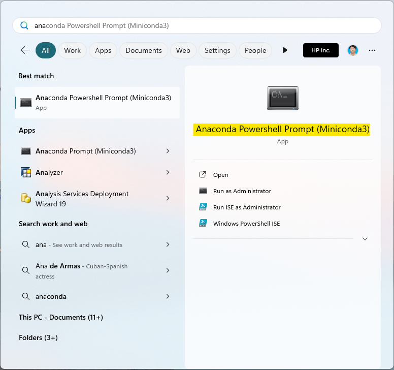
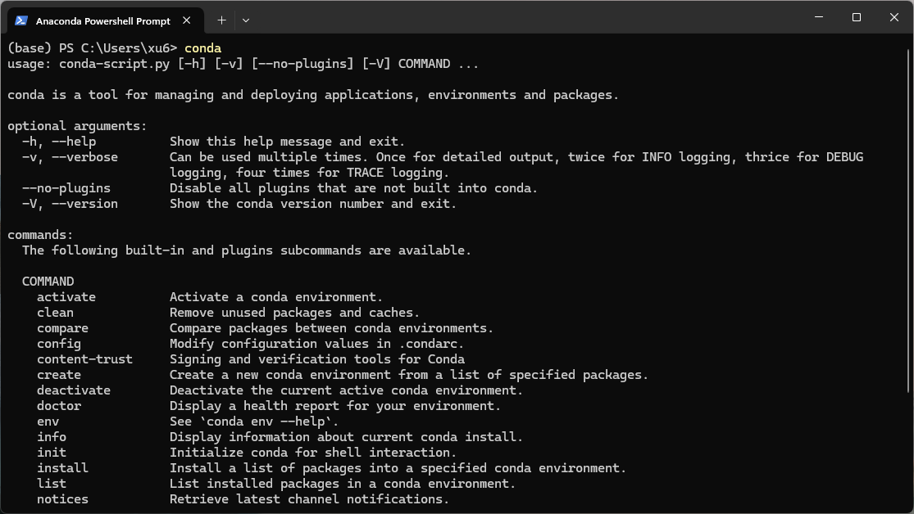
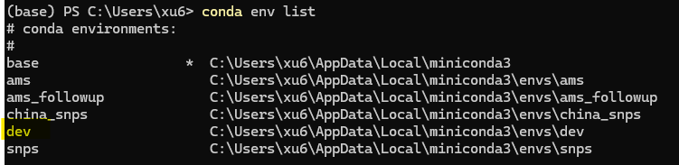
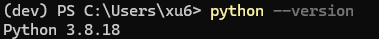
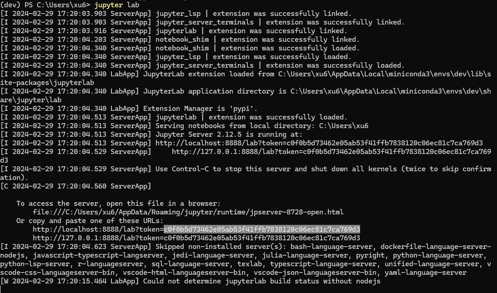
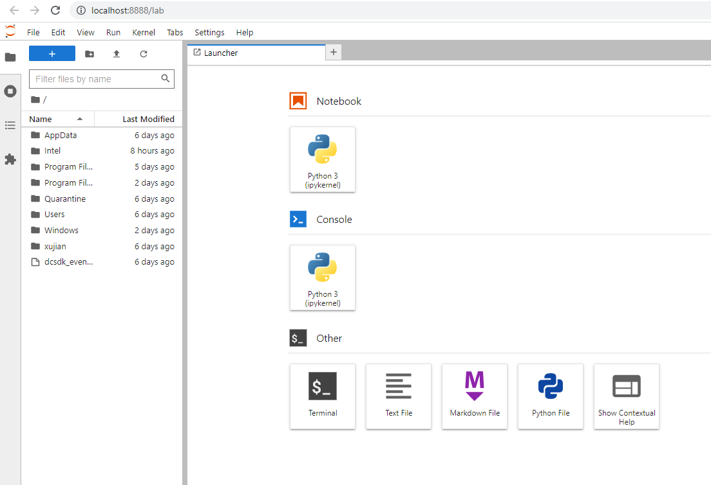
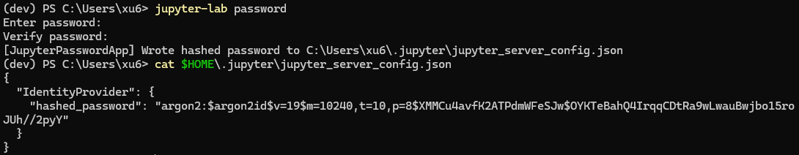

Here is the guide to install machine learning development environment in your laptop.  We will install the following software.

- Conda
- Python Virtual Environment
- JupyterLab

## Install Conda

[Conda](https://docs.conda.io/projects/conda/en/latest/) is an open source package management system and environment management system. Here are installation steps.

1. Open https://conda.io/en/latest/miniconda.html. 

2. choose [Miniconda3 Windows 64-bit](https://repo.anaconda.com/miniconda/Miniconda3-py38_4.11.0-Windows-x86_64.exe) to download. Let's choose the version of Python 3.8.

3. install as the default options.

4. type "Git Bash" in Windows Start and open "Anaconda PowerShell Prompt (Miniconda3)".

   

5. type `conda` and you will see the command usage description as below.

   

6. (optional) If you want to enable Conda in PowerShell, run the following command. 

   ~~~
   conda init powershell
   ~~~

## Install Python Virtual Environment

Virtual environments are a common and effective technique used in Python development. Each environment can use different versions of package dependencies and Python. It can avoid the library conflicts among your projects. Here are installation steps.

1. open "Anaconda PowerShell Prompt (Miniconda3)".

2. create the python virtual environment called dev. We suggest to create a virtual environment for each project.

   ~~~powershell
   #create python virtual environment 
   conda create -y -n dev python=3.8
   # check environment list
   conda env list   # you will see dev in the output       
   ~~~

   

3. active the environment.

   ~~~shell
   # active the virtual environment
   conda activate dev
   ~~~

   

   If  "(dev)" is found, it tells us that the virtual environment is active.  If you install any packages, they only are installed in the the virtual environment, not the default python environment. So **make sure it is active before you run any python code each time **. 

4. check python version.

   ~~~shell
   python --version
   ~~~

   

## Install Python Libraries

~~~powershell
conda activate dev
pip install numpy   	# 多维数组
pip install pandas		# 数据处理
pip install tqdm  		# 进度条
pip install joblib 		# 并行处理
pip install matplotlib	# 图形绘制
pip install seaborn 	# 图形绘制
pip install scipy		# 科学计算
pip install scikit-image	#图像处理
~~~

## Install JupyterLab

[JupyterLab](https://jupyterlab.readthedocs.io/en/stable/)  is the latest web-based interactive development environment for notebooks, code, and data. Here is an introduction. 

### Installation Steps

1. open "Anaconda PowerShell Prompt (Miniconda3)" and activate the virtual environment if it is not active.

   ~~~powershell
   conda activate dev
   ~~~

2. install JupyterLab

   ~~~powershell
   pip install jupyterlab
   ~~~

3. Start JupyterLab. 

   ~~~powershell
   jupyter lab
   ~~~
   

> The JupyterLab website is accessed via token which is highlighted in the picture above. 

4. After a while, it will open a local web site in your browser as below. You can start to write your notebook now.

### Start JupyterLab 

If you close JupyterLab or restart your computer, you can start JupyterLab in "Anaconda PowerShell Prompt (Miniconda3)".

~~~powershell
conda activate dev  #activate the virutal environment
cd c:\
jupyter lab
~~~

### Config JupyterLab

It's an optional step. We can add some configurations on JupyterLab.  

#### Password

If you want to login JupyterLab via password instead of token,  you can run the following commands.

~~~powershell
jupyter-lab password
cat $HOME\.jupyter\jupyter_server_config.json
~~~

#### Others 

we can add other configurations via the commands.  

~~~PowerShell
@"
c.ServerApp.allow_remote_access = True
c.ServerApp.ip = '0.0.0.0'
c.ServerApp.open_browser = True    
c.ServerApp.port = 8888
"@ | Out-File -Append $HOME\.jupyter\jupyter_lab_config.py -Encoding utf8

cat $HOME\.jupyter\jupyter_lab_config.py
~~~

if you want to generate a default config file before you run the preceding command, you can run the following command.

~~~powershell
jupyter-lab --generate-config 
~~~

