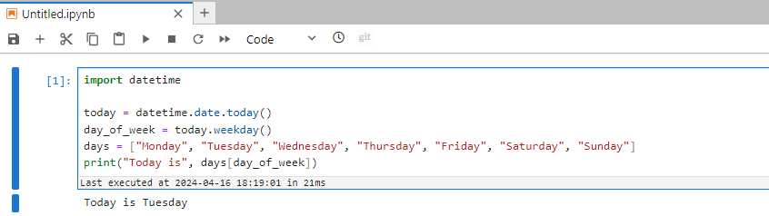

Here is the guide to install python machine learning development environment in your laptop.  You will install the following software.

- Conda
- Python Virtual Environment
- JupyterLab

## Install Conda

[Conda](https://docs.conda.io/projects/conda/en/latest/) is an open source package management system and environment management system. Here are installation steps.

1. Open [Latest Miniconda installer links by Python version — Anaconda documentation](https://docs.anaconda.com/free/miniconda/miniconda-other-installer-links/)

2. Choose Python 3.10 to download as below.

   

3. install as the default options.

4. Open "**Anaconda PowerShell Prompt (Miniconda3)**" in Windows Start .

   

5. type `conda` and you will see the command usage description as below.

   

6. (Optional) Run the following code to initialize Conda for the PowerShell environment. 

   ~~~powershell
   conda init powershell
   ~~~

   Close "Anaconda PowerShell Prompt (Miniconda3)" and open PowerShell. Conda is activated now.

   

## Install Python Virtual Environment

Virtual environments are a common and effective technique used in Python development. Each environment can use different versions of package dependencies and Python. It can avoid the library conflicts among your projects. Here are installation steps.

1. open "**Anaconda PowerShell Prompt (Miniconda3)**".

2. create the python virtual environment called dev. We suggest to create a virtual environment for each project.

   ~~~powershell
   #create python virtual environment 
   conda create -y -n dev python=3.10
   # check environment list
   conda env list   # you will see dev in the output       
   ~~~

   

3. active the environment.

   ~~~shell
   # active the virtual environment
   conda activate dev
   ~~~

   

   If  "(dev)" is found, it tells us that the virtual environment is active.  If you install any packages, they only are installed in the the virtual environment, not the default python environment. So **make sure it is active before you run any python code each time **. 

4. check python version.

   ~~~shell
   python --version
   ~~~

   

## Install Python Libraries

The libraries are used commonly.

~~~powershell
conda activate dev
pip install numpy               # Multidimensional arrays  
pip install pandas              # Data processing  
pip install tqdm                # Progress bar  
pip install joblib              # Parallel processing  
pip install matplotlib          # Graph plotting  
pip install seaborn             # Graph plotting  
pip install scipy               # Scientific computing  
pip install scikit-image        # Image processing
~~~

## Install JupyterLab

[JupyterLab](https://jupyterlab.readthedocs.io/en/stable/)  is the latest web-based interactive development environment for notebooks, code, and data. 

### Install Steps

1. open "**Anaconda PowerShell Prompt (Miniconda3)**" and activate the virtual environment.

   ~~~powershell
   conda activate dev
   ~~~

2. install JupyterLab

   ~~~powershell
   pip install jupyterlab
   ~~~

3. Start JupyterLab. 

   ~~~powershell
   jupyter lab
   ~~~
   
   
    
   
    > The JupyterLab website is accessed via token which is highlighted in the picture above. 
   
4. After a while, it will open a web site in your browser as below. You can start to write your notebook .

5. Create and run you first notebook. 
   - Click "Python 3(ipykernel)" to create a new notebook .

      

	- Copy the code below and paste it into the first cell in the notebook:

     ~~~python
      import datetime  
     
      today = datetime.date.today()  
      day_of_week = today.weekday()  
      days = ["Monday", "Tuesday", "Wednesday", "Thursday", "Friday", "Saturday", "Sunday"]  
      print("Today is", days[day_of_week]) 
     ~~~

	- Click Run button in the toolbar or Press "Ctrl+Enter" to run the cell.

      

 Congratulations, you have installed JupyterLab and run your first notebook successfully.

### Config JupyterLab

It's **optional** . To enhance its functionality, you can add some configurations and install some extensions. .  

#### Use Password

If you want to login JupyterLab via password instead of token,  you can run the following commands.

~~~powershell
jupyter-lab password
cat $HOME\.jupyter\jupyter_server_config.json
~~~

#### Other Configurations 

You can add other configurations via the commands.  

~~~PowerShell
@"
c.ServerApp.allow_remote_access = True
c.ServerApp.ip = '0.0.0.0'
c.ServerApp.open_browser = True    
c.ServerApp.port = 8888
"@ | Out-File -Append $HOME\.jupyter\jupyter_lab_config.py -Encoding utf8

cat $HOME\.jupyter\jupyter_lab_config.py
~~~

if you want to generate a default config file before you run the preceding command, you can run the following command.

~~~powershell
jupyter-lab --generate-config 
~~~

#### Extensions

~~~shell
pip list | Select-String "jupyterlab"
pip install jupyterlab-recents          # View and access recently opened directories and files under the File menu  
pip install jupyterlab-execute-time     # Execution time for each cell  
pip install jupyterlab_git              # Functionality integrated with the Git version control system  
pip install jupyterlab_pygments         # Adds support for code syntax highlighting  
#pip install jupyterlab-unfold          # File directory tree, but it is slow, so it is disabled  
~~~

after install extensions, stop JupyterLab and start it again.

## Start JupyterLab 

If you close JupyterLab or restart your computer, you can start JupyterLab in "Anaconda PowerShell Prompt (Miniconda3)" or "PowerShell".

~~~powershell
conda activate dev  #activate the virutal environment
jupyter lab
~~~

## Stop JupyterLab 

Press Ctrl+C  in "Anaconda PowerShell Prompt (Miniconda3)" or "PowerShell".   Or close them directly.

## History

- 2024-4-16  upgrade python from 3.8 to 3.10
- 2024-2-24:  add extensions 
- 2024-1-15:  remove git bash and use power shell
- 2023-12-01:  initial build
