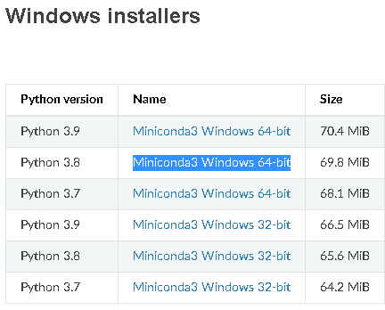

Here is the guide to install machine learning development environment in your laptop.  We will install the following softwares.

- Git
- Conda
- Python Virtual Environment
- JupyterLab

## Install Git

[Git](https://git-scm.com/) is a free and open source distributed version control system designed to handle everything from small to very large projects with speed and efficiency. Here are installation steps.

1. open https://git-scm.com/download/win, choose **[64-bit Git for Windows Setup](https://github.com/git-for-windows/git/releases/download/v2.35.1.windows.2/Git-2.35.1.2-64-bit.exe)** to download. 

   

2. execute the install file. make sure "Git Bash Here" is checked, then install as default.

3. type `Git Bash` in Windows start menu.

   

4. open "Git Bash".  It will open a command window as below.

   

> There are 2 purposes to install Git Bash.
>
> - Maintain your codes in [HP GitHub](https://github.azc.ext.hp.com/) via Git.  In addition, there are many open sources libraries in [GitHub](https://github.com/), we can use Git to clone them to local. If you prefer using UI, you can install [GitHub Desktop](https://desktop.github.com/).
> - Keep the same development environment as server. Though most of python libraries works well in Windows, Linux servers are still the top choice for deploying ML programs. Git Bash can simulate the Linux shell environment very well, so The same commands can run successfully both in local and server.

## Install Conda

[Conda](https://docs.conda.io/projects/conda/en/latest/) is an open source package management system and environment management system. Here are installation steps.

1. Open https://conda.io/en/latest/miniconda.html. 

2. choose [Miniconda3 Windows 64-bit](https://repo.anaconda.com/miniconda/Miniconda3-py38_4.11.0-Windows-x86_64.exe) to download. Let's choose the version of Python 3.8.

3. install as the default options .

4. open "Git Bash".

5. run the following script in "Git Bash". The script will enable Conda for the current user.

   ~~~shell
   echo ". ~/AppData/Local/Miniconda3/etc/profile.d/conda.sh" >> ~/.bashrc
   or 
   echo ". /c/ProgramData/iniconda3/etc/profile.d/conda.sh" >> ~/.bashrc
   ~~~

6. close and reopen "Git Bash". 

7. type `conda` and you will see the command usage description as below.

   

   

## Install Python Virtual Environment

Virtual environments are a common and effective technique used in Python development. Each environment can use different versions of package dependencies and Python. It can avoid the library conflicts among your projects. Here are installation steps.

1. open "Git Bash".

2. create the python virtual environment called dev. We suggest to create a virtual environment for each project.

   ~~~shell
   #create python virtual environment 
   conda create -y -n dev python=3.8
   # check environment list
   conda env list          
   ~~~

3. active the environment.

   ~~~shell
   # active the virtual environment
   conda activate dev
   ~~~

   

   If  "(dev)" is found, it tells us that the virtual environment is active.  If you install any packages, they only are installed in the the virtual environment, not the default python environment. So **make sure it is active before you run any python code each time **. 

4. check python version.

   ~~~shell
   python --version
   ~~~

   

## Install JupyterLab

[JupyterLab](https://jupyterlab.readthedocs.io/en/stable/)  is the latest web-based interactive development environment for notebooks, code, and data. Here is an introduction. 

https://youtu.be/A5YyoCKxEOU

<iframe width="696" height="392" src="https://www.youtube.com/embed/A5YyoCKxEOU" title="YouTube video player" frameborder="0" allow="accelerometer; autoplay; clipboard-write; encrypted-media; gyroscope; picture-in-picture" allowfullscreen></iframe>

### Installation Steps

1. open "Git Bash" and activate the virtual environment if it is not active.

   ~~~shell
   conda activate dev
   ~~~

2. install JupyterLab

   ~~~shell
   pip install jupyterlab
   ~~~

3. Start JupyterLab

   ~~~shell
   cd /c     # locate the root folder of c disk
   jupyter lab
   ~~~

   

   > If you want to stop JupyterLab, don't close Git Bash window directly, instead, you should press `CTRL+C` to stop it.  
   >
   > If you close  Git Bash window directly,  sometimes, JupyterLab can't be closed. You will see the following error message when you reopen Git Bash.
   >
   > 
   >
   > You can run the following script to solve it in Windows Command Prompt.
   >
   > ~~~shell
   > taskkill /F /IM jupyter-lab.exe
   > ~~~
   >
   > 

   After a while, it will open a local web site in your browser as below. You can start to write your notebook now.

   

### Config JupyterLab

Here is the summary script to start JupyterLab. You always need to run it via Git Bash when you stop JupyterLab or restart your computer. 

~~~shell
conda activate dev
jupyter-lab --generate-config
cat << EOF >> ~/.jupyter/jupyter_lab_config.py
c.ServerApp.allow_remote_access = True
c.ServerApp.ip = '0.0.0.0'
c.ServerApp.open_browser = True  
c.ServerApp.port = 8888

EOF

~~~

### 

### Run JupyterLab

~~~
conda activate dev
cd /c   
jupyter lab
~~~

## Install Python Libraries

~~~
c.ServerApp.allow_remote_access = True
~~~

