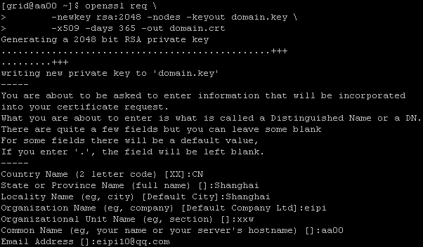
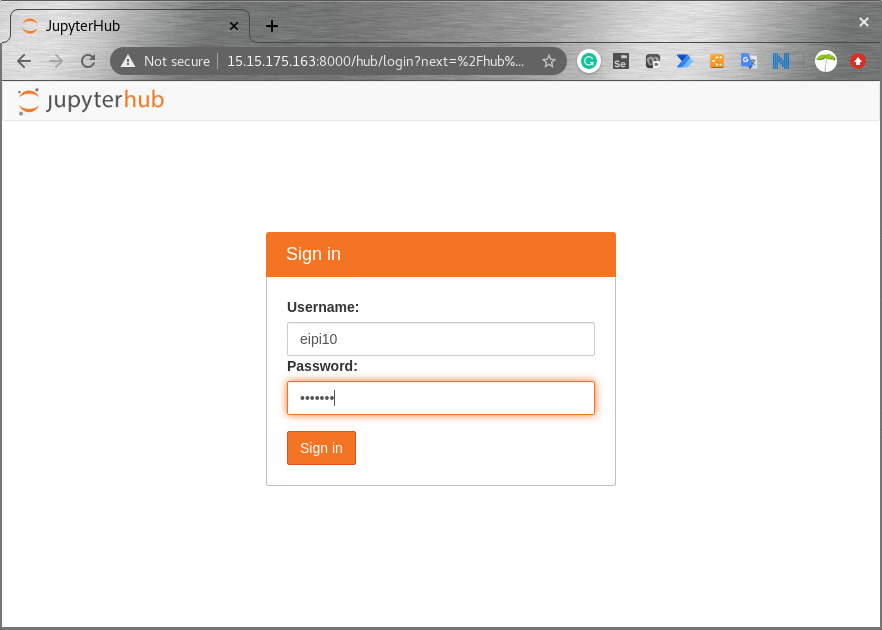

## Installation

### Local - Single User

1. 安装软件

    ~~~shell
    sudo yum install nodejs npm
    python3 -m pip install jupyterhub
    sudo npm install -g configurable-http-proxy
    python3 -m pip install jupyterlab notebook
    ~~~

    Test

    ~~~shell
    jupyterhub -h
    configurable-http-proxy -h
    ~~~

2. 进行配置

    ~~~shell
    mkdir jupyter-hub
    cd jupyter-hub
    server_ip=http://15.15.175.163
    port=8000
           
    rm -rf jupyterhub_config.py
    jupyterhub --generate-config       
    echo c.JupyterHub.bind_url = \'$server_ip:$port\' >> jupyterhub_config.py
    tail jupyterhub_config.py
    ~~~

    > 需要注意的是，采用非ssl方式，在第4步登录的地方，会失败，不知道啥原因。

    如果需要配置ssl，可以执行如下代码：

    ~~~shell
    mkdir -p jupyter-hub
    cd jupyter-hub
    server_ip=https://15.15.175.163
    port=8000
    ssl_key=domain.key
    ssl_cert=domain.crt
    
    openssl req \
           -newkey rsa:2048 -nodes -keyout $ssl_key \
           -x509 -days 365 -out $ssl_cert
           
    rm -rf jupyterhub_config.py
    jupyterhub --generate-config       
    echo c.JupyterHub.bind_url = \'$server_ip:$port\' >> jupyterhub_config.py
    echo c.JupyterHub.ssl_key = \'$ssl_key\' >> jupyterhub_config.py
    echo c.JupyterHub.ssl_cert = \'$ssl_cert\' >> jupyterhub_config.py
    tail jupyterhub_config.py       
    ~~~

    

    

    也可以使用自己从其他地方申请的免费证书。比如下面是阿里云里面申请的。需要注意的是，这种

    ~~~shell
    cd jupyter-hub
    
    server_ip=https://15.15.175.163
    port=8000
    ssl_key=7793767_eipi10.cn.key
    ssl_cert=7793767_eipi10.cn_public.crt
    
    rm -rf jupyterhub_config.py
    jupyterhub --generate-config       
    echo c.JupyterHub.bind_url = \'$server_ip:$port\' >> jupyterhub_config.py
    echo c.JupyterHub.ssl_key = \'$ssl_key\' >> jupyterhub_config.py
    echo c.JupyterHub.ssl_cert = \'$ssl_cert\' >> jupyterhub_config.py
    tail jupyterhub_config.py       
    ~~~

3. Start the Hub server

    ~~~
    jupyterhub 
    ~~~

4.  打开https://server_ip:8000。使用当前linux的用户登录。

    

### Docker

### Kubernetes

## 常用插件

### jupyterlab-kite

代码补全服务

~~~shell
pip install jupyter-kite
jupyter labextension install @kiteco/jupyterlab-kite
~~~

### jupyterlab-spreadsheet

查看多工作表的excel表格

~~~shell
jupyter labextension install jupyterlab-spreadsheet
~~~

### jupyterlab-execute-time

记录每个单元cell的执行开始以及运行耗时：	

~~~shell
jupyter labextension install jupyterlab-execute-time jupyterlab-spreadsheet
~~~

> 好像不支持当前的jupyterlab版本

