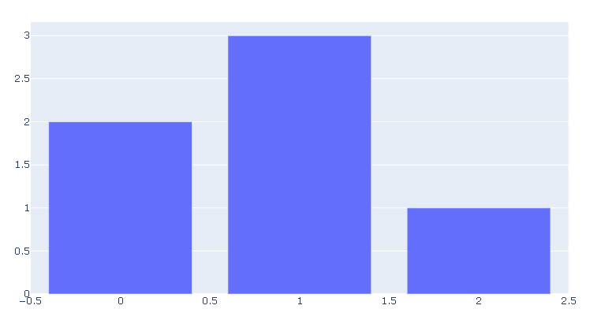

# [Getting Started with Plotly in Python](https://plotly.com/python/getting-started/)

### Overview

Plotly是一个非常著名且强大的开源数据可视化框架，它通过构建基于浏览器显示的web形式的可交互图表来展示信息，可创建多达数十种精美的图表和地图

### Installation

~~~shell
pip install plotly==4.14.3
pip install ipywidgets>=7.5 
pip install -U kaleido
pip install plotly-geo==1.0.0
~~~

### 

#### Jupyter Notebook Support

~~~python
!pip install ipywidgets>=7.5
~~~

~~~python
import plotly.graph_objects as go
fig = go.Figure(data=go.Bar(y=[2, 3, 1]))
fig.show()
~~~

### Static Image Export

plotly.py支持[静态图片输出](https://plotly.com/python/static-image-export/)。kaleido是默认的包。

~~~shell
 pip install -U kaleido
 pip install plotly-geo==1.0.0
~~~

Some plotly.py features rely on fairly large geographic shape files. The county choropleth figure factory is one such example. These shape files are distributed as a separate `plotly-geo` package. 