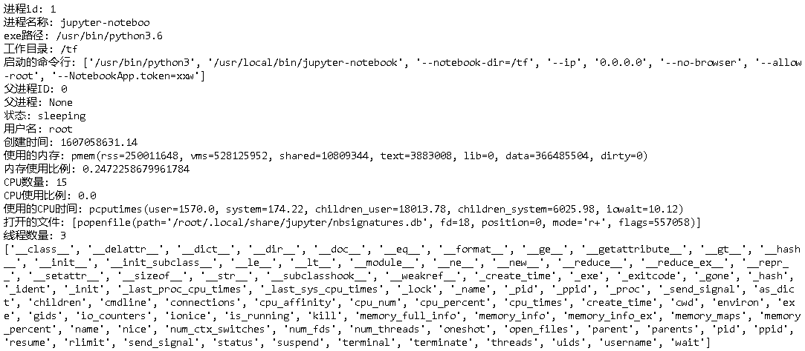

## 技巧

## 获得jupyter notebook的列表

~~~python
#!/usr/bin/env python3

import json
import os
import os.path
import posixpath
import subprocess
import pandas as pd
import psutil
import requests
from IPython.display import display

def show_notebooks_table(host, port):
    """Show table with info about running jupyter notebooks.

    Args:
        host: host of the jupyter server.
        port: port of the jupyter server.

    Returns:
        DataFrame with rows corresponding to running notebooks and following columns:
            * index: notebook kernel id.
            * path: path to notebook file.
            * pid: pid of the notebook process.
            * memory: notebook memory consumption in percentage.
    """
    pd.set_option('display.max_colwidth', 300)
    
    notebooks = get_running_notebooks(host, port)
    prefix = long_substr([notebook['path'] for notebook in notebooks])
    df = pd.DataFrame(notebooks)
    df = df.set_index('kernel_id')
    df.index.name = prefix
    df.path = df.path.apply(lambda x: x[len(prefix):])
    df['pid'] = df.apply(lambda row: get_process_id(row.name), axis=1)
    # same notebook can be run in multiple processes
    df = expand_column(df, 'pid')
    df['memory'] = df.pid.apply(memory_usage_psutil)
    df['cpu'] = df.pid.apply(cpu_usage_psutil)
    df['num_threads'] = df.pid.apply(num_threads_psutil)    
    df = df.sort_values('memory', ascending=False)
    df.index = range(1, len(df)+1)
    return df

def get_running_notebooks(host, port, password='xxw'):
    """
    Get kernel ids and paths of the running notebooks.

    Args:
        host: host at which the notebook server is listening. E.g. 'localhost'.
        port: port at which the notebook server is listening. E.g. 8888.
            
    Returns:
        list of dicts {kernel_id: notebook kernel id, path: path to notebook file}.
    """
        
    BASE_URL = 'http://{0}:{1}/'.format(host, port)
        
    # Get the cookie data
    s = requests.Session()
    url = BASE_URL + 'login?next=%2F'
    resp = s.get(url)
    xsrf_cookie = resp.cookies['_xsrf']

    # Login with the password
    params = {'_xsrf': xsrf_cookie, 'password': password}
    res = s.post(url, data=params)

    # Find which kernel corresponds to which notebook
    # by querying the notebook server api for sessions
    url = posixpath.join(BASE_URL, 'api', 'sessions')
    ret = s.get(url)
    #print('Status code:', ret.status_code)

    # Get the notebook list
    res = json.loads(ret.text)
    notebooks = [{'kernel_id': notebook['kernel']['id'],
                  'path': notebook['notebook']['path']} for notebook in res]
    return notebooks

def get_process_id(name):
    """Return process ids found by (partial) name or regex.

    Source: https://stackoverflow.com/a/44712205/304209.
    >>> get_process_id('kthreadd')
    [2]
    >>> get_process_id('watchdog')
    [10, 11, 16, 21, 26, 31, 36, 41, 46, 51, 56, 61]  # ymmv
    >>> get_process_id('non-existent process')
    []
    """
    child = subprocess.Popen(['pgrep', '-f', name], stdout=subprocess.PIPE, shell=False)
    response = child.communicate()[0]
    return [int(pid) for pid in response.split()]

def memory_usage_psutil(pid=None):
    """Get memory usage percentage by current process or by process specified by id, like in top.

    Source: https://stackoverflow.com/a/30014612/304209.

    Args:
        pid: pid of the process to analyze. If None, analyze the current process.

    Returns:
        memory usage of the process, in percentage like in top, values in [0, 100].
    """
    if pid is None:
        pid = os.getpid()
    process = psutil.Process(pid)
    return round(process.memory_percent(),3)

def cpu_usage_psutil(pid=None):
    """Get cpu usage percentage by current process or by process specified by id, like in top.

    Source: https://stackoverflow.com/a/30014612/304209.

    Args:
        pid: pid of the process to analyze. If None, analyze the current process.

    Returns:
        cpu usage of the process, in percentage like in top, values in [0, 100].
    """
    if pid is None:
        pid = os.getpid()
    process = psutil.Process(pid)
    return round(process.cpu_percent(),3)

def num_threads_psutil(pid=None):
    """Get num_threads by current process or by process specified by id, like in top.

    Source: https://stackoverflow.com/a/30014612/304209.

    Args:
        pid: pid of the process to analyze. If None, analyze the current process.

    Returns:
        num_threads of the process
    """
    if pid is None:
        pid = os.getpid()
    process = psutil.Process(pid)
    return process.num_threads()

def long_substr(strings):
    """Find longest common substring in a list of strings.

    Source: https://stackoverflow.com/a/2894073/304209.

    Args:
        strings: list of strings.

    Returns:
        longest substring which is found in all of the strings.
    """
    substr = ''
    if len(strings) > 1 and len(strings[0]) > 0:
        for i in range(len(strings[0])):
            for j in range(len(strings[0])-i+1):
                if j > len(substr) and all(strings[0][i:i+j] in x for x in strings):
                    substr = strings[0][i:i+j]
    return substr

def expand_column(dataframe, column):
    """Transform iterable column values into multiple rows.

    Source: https://stackoverflow.com/a/27266225/304209.

    Args:
        dataframe: DataFrame to process.
        column: name of the column to expand.

    Returns:
        copy of the DataFrame with the following updates:
            * for rows where column contains only 1 value, keep them as is.
            * for rows where column contains a list of values, transform them
                into multiple rows, each of which contains one value from the list in column.
    """
    tmp_df = dataframe.apply(
        lambda row: pd.Series(row[column]), axis=1).stack().reset_index(level=1, drop=True)
    tmp_df.name = column
    return dataframe.drop(column, axis=1).join(tmp_df)

df = show_notebooks_table('15.15.166.35', 18888)
display(df)
~~~

### 获取进程信息

~~~python
import psutil

pids = psutil.pids() 
p = psutil.Process(pids[0])

print('进程id:', p.pid)
print('进程名称:', p.name())   # 
print('exe路径:', p.exe())
print('工作目录:', p.cwd())
print('启动的命令行:', p.cmdline())
print('父进程ID:', p.ppid())
print('父进程:', p.parent())
print('状态:', p.status())
print('用户名:', p.username())
print('创建时间:', p.create_time())
print('使用的内存:', p.memory_info())
print('内存使用比例:', p.memory_percent())
print('CPU数量:', p.cpu_num())
print('CPU使用比例:', p.cpu_percent())
print('使用的CPU时间:', p.cpu_times())
print('打开的文件:', p.open_files())
print('线程数量:', p.num_threads())

print(dir(p))
~~~

内存：

- `rss`是驻留集大小，它是进程使用的实际物理内存
- `vms`是虚拟内存大小，它是进程使用的虚拟内存

### 几种数据结构

dict, list和tuple是python中非常常用的数据结构。

~~~ python
a = {'a1':3, 'a2':4}
b = (3, 4)
c = [3, 4]

print(type(a), a)
print(type(b), b)
print(type(c), c)
~~~

### 参数传递

参见[python函数的4种参数类型](https://blog.csdn.net/lijing742180/article/details/94169446)

有四种方式。

#### 位置实参

按照参数位置，依次传递参数，这是最普通的方式。

~~~python
def add(a, b):
    print(a + b)

add(3, 9)
~~~

#### 关键字实参

按关键字传递传递参数，顺序不需要按照函数定义的顺序。

~~~python
def add(a, b):
    print(a + b)

add(b=3, a=9)
~~~

#### 缺省参数

~~~python
def add(a, b=3):
    print(a + b)

add(9)
~~~

#### 多值参数

当参数个数不确定时，可以使用多值参数，它包括两种类型：

- 元组（tuple）参数： `*args`
- 字典（dict）参数：`**kwargs`

多个参数放置顺序是：**位置实参，缺省参数， 元组参数，字典参数。**一般来说在一个函数中 元组参数，字典参数不会同时出现。

##### 元组参数

~~~python
def add(a, b=3, *args):
    print('='*50)
    print('a', type(a), a)
    print('b', type(a), b)
    print('args', type(args), args)  
        

add(1, 11, 12, 13)

lst = [11, 12, 13]
add(1, *lst)        	# 注意11被分给了b，这种情况下缺省参数失去了意义
add(1, *lst, 14, 15)  	# 有些混乱，避免这样来调用

#add(1, b=4, *lst)  # 会报错： add() got multiple values for argument 'b'
~~~

##### 字典参数

~~~python
def add(a, b=3, **kwargs):
    print('='*50)
    print('a', type(a), a)
    print('b', type(a), b)
    print('kwargs', type(kwargs), kwargs)  

add(1, c=21, d=22, e=23)
add(1, 4, **dct)
add(1, b=4, **dct)
add(1, **dct)

# 下面几种情况有些混乱，避免这样来调用
add(1, **dct, b=4)
add(1, **dct, f=4)
add(1, f=4, **dct)
add(1, f=4, **dct, b=4, g=4)
~~~

### 类和函数注释规范

参见：

- [Python类和方法注释规范](https://blog.csdn.net/lly1122334/article/details/80733908 )

- [Google 开源项目: Python 风格指南](http://zh-google-styleguide.readthedocs.io/en/latest/google-python-styleguide/python_style_rules/#comments)

  

  

### Python项目示范目录结构

参见

- [structuring-your-project](https://docs.python-guide.org/writing/structure/#structuring-your-project)
- [Python Application Layouts: A Reference](https://realpython.com/python-application-layouts/)

~~~
project
├── .gitignore
├── LICENSE
├── README.md
├── requirements.txt
├── setup.cfg
├── setup.py
│
├── data
│   └── input.csv
│   └── output.xlsx
│ 
├── docs
│   └── hello.md
│   └── index.md
│
├── package
│   └── __init__.py
│   └── core.py
│   └── helpers.py
│
└── tests
    ├── conftest.py
    ├── test_init.py
    └── test_something.py
~~~

### Flask

flask repository包括以下内容.

- quickstart
- tutorial
- restfu

### 安装pip

有的时候需要重新安装pip。

~~~shell
curl https://bootstrap.pypa.io/get-pip.py -o get-pip.py
sudo python get-pip.py --no-wheel
~~~

### 从源代码安装Python

首先从https://www.python.org/downloads/选择一个版本下载

~~~shell
wget https://www.python.org/ftp/python/3.6.12/Python-3.6.12.tgz
tar zvxf Python-3.6.12.tgz
cd Python-3.6.12
./configure
make
sudo make install
~~~

> 默认情况下，centos仅仅安装了python2，可以使用上面的方式安装python3，这样对于环境的影响更小。