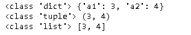
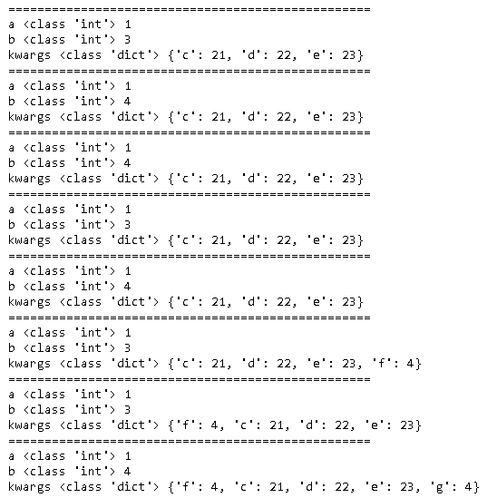
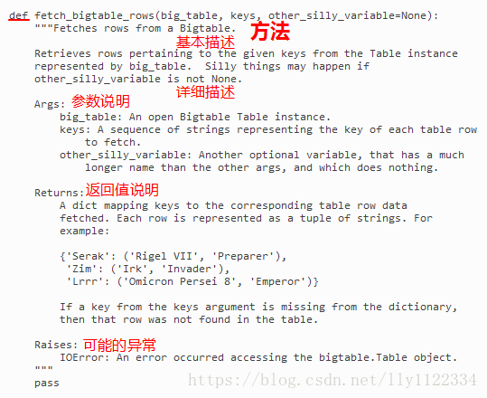

## 技巧

### 几种数据结构

dict, list和tuple是python中非常常用的数据结构。

~~~ python
a = {'a1':3, 'a2':4}
b = (3, 4)
c = [3, 4]

print(type(a), a)
print(type(b), b)
print(type(c), c)
~~~

### 参数传递

参见[python函数的4种参数类型](https://blog.csdn.net/lijing742180/article/details/94169446)

有四种方式。

#### 位置实参

按照参数位置，依次传递参数，这是最普通的方式。

~~~python
def add(a, b):
    print(a + b)

add(3, 9)
~~~

#### 关键字实参

按关键字传递传递参数，顺序不需要按照函数定义的顺序。

~~~python
def add(a, b):
    print(a + b)

add(b=3, a=9)
~~~

#### 缺省参数

~~~python
def add(a, b=3):
    print(a + b)

add(9)
~~~

#### 多值参数

当参数个数不确定时，可以使用多值参数，它包括两种类型：

- 元组（tuple）参数： `*args`
- 字典（dict）参数：`**kwargs`

多个参数放置顺序是：**位置实参，缺省参数， 元组参数，字典参数。**一般来说在一个函数中 元组参数，字典参数不会同时出现。

##### 元组参数

~~~python
def add(a, b=3, *args):
    print('='*50)
    print('a', type(a), a)
    print('b', type(a), b)
    print('args', type(args), args)  
        

add(1, 11, 12, 13)

lst = [11, 12, 13]
add(1, *lst)        	# 注意11被分给了b，这种情况下缺省参数失去了意义
add(1, *lst, 14, 15)  	# 有些混乱，避免这样来调用

#add(1, b=4, *lst)  # 会报错： add() got multiple values for argument 'b'
~~~

##### 字典参数

~~~python
def add(a, b=3, **kwargs):
    print('='*50)
    print('a', type(a), a)
    print('b', type(a), b)
    print('kwargs', type(kwargs), kwargs)  

add(1, c=21, d=22, e=23)
add(1, 4, **dct)
add(1, b=4, **dct)
add(1, **dct)

# 下面几种情况有些混乱，避免这样来调用
add(1, **dct, b=4)
add(1, **dct, f=4)
add(1, f=4, **dct)
add(1, f=4, **dct, b=4, g=4)
~~~

### 类和函数注释规范

参见：

- [Python类和方法注释规范](https://blog.csdn.net/lly1122334/article/details/80733908 )

- [Google 开源项目: Python 风格指南](http://zh-google-styleguide.readthedocs.io/en/latest/google-python-styleguide/python_style_rules/#comments)

  

  

### Python项目示范目录结构

参见

- [structuring-your-project](https://docs.python-guide.org/writing/structure/#structuring-your-project)
- [Python Application Layouts: A Reference](https://realpython.com/python-application-layouts/)

~~~
project
├── .gitignore
├── LICENSE
├── README.md
├── requirements.txt
├── setup.cfg
├── setup.py
│
├── data
│   └── input.csv
│   └── output.xlsx
│ 
├── docs
│   └── hello.md
│   └── index.md
│
├── package
│   └── __init__.py
│   └── core.py
│   └── helpers.py
│
└── tests
    ├── conftest.py
    ├── test_init.py
    └── test_something.py
~~~

### Flask

flask repository包括以下内容.

- quickstart
- tutorial
- restfu

### 安装pip

有的时候需要重新安装pip。

~~~shell
curl https://bootstrap.pypa.io/get-pip.py -o get-pip.py
sudo python get-pip.py --no-wheel
~~~

### 从源代码安装Python

首先从https://www.python.org/downloads/选择一个版本下载

~~~shell
tar zvxf Python-3.6.10.tgz
cd Python-3.6.10
./configure
make
sudo make install
~~~

> 默认情况下，centos仅仅安装了python2，可以使用上面的方式安装python3，这样对于环境的影响更小。