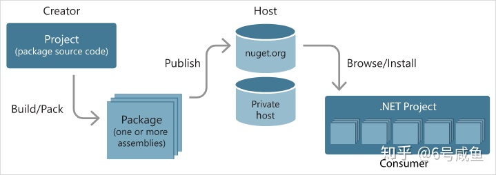

## Skills

### [NuGet](https://zhuanlan.zhihu.com/p/36207092)

它就是一个包（package）管理平台，确切的说是 .net平台的包管理工具，它提供了一系列客户端用于生成，上传和使用包（package），以及一个用于存储所有包的中心库即NuGet Gallery，如果有需要也可以搭建自己的私有NuGet库。如果你了解python，那么它类似pip。

NuGet包的本质是一个以nupkg为后缀的zip压缩文件*（你可以将后缀改为.zip后解压查看里面的内容）*，其中包含了编译后的Dll文件以及其他相关文件。下图显示nuget包从创建，上传到被使用的流程。

