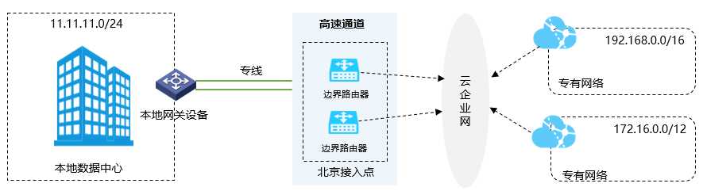
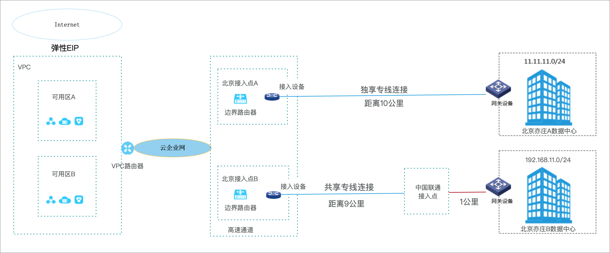
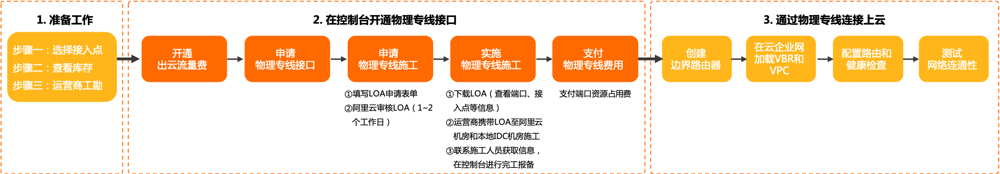
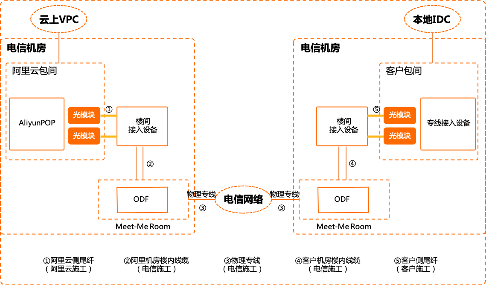
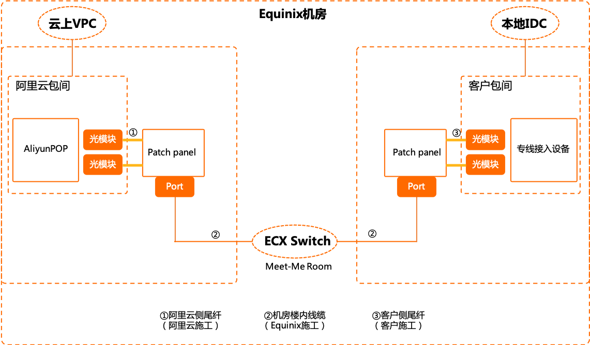
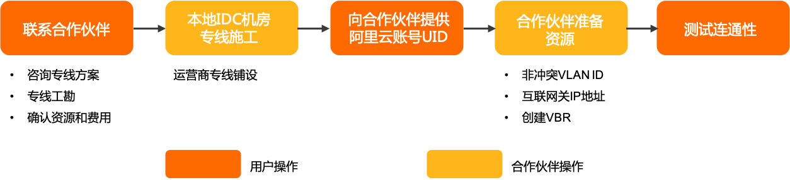

## 什么是高速通道（Express Connect）？

阿里云高速通道（Express Connect）可在本地数据中心和云上专有网络间建立高速、稳定、安全的私网通信。高速通道的专线连接绕过您网络路径中的Internet服务提供商，可避免网络质量不稳定问题，同时可免去数据在传输过程中被窃取的风险。

将边界路由器和要访问的阿里云专有网络加入同一个云企业网后，本地数据中心便可访问阿里云专有网络内的全部资源，包括云服务器、容器、负载均衡和云数据库等。

高速通道由以下部分组成：

- 物理专线连接：通过高速通道建立的一个您本地IDC机房与阿里云接入点的专用网络连接。您可以通过以下两种方式建立物理专线连接：

  - 自主申请物理专线接口

    企业自主拉通本地数据中心到阿里云接入点的专线，该方式独占一个物理端口。您可以通过高速通道控制台自主申请物理专线连接。详细操作请参见[创建独享专线连接](https://www.alibabacloud.com/help/zh/doc-detail/91261.htm#task-r3h-qfx-dfb)。

  - 合作伙伴共享接入

    合作伙伴的接入点已经与阿里云的接入点完成了对接，您只需联系阿里云的合作伙伴，合作伙伴会完成本地IDC机房到合作伙伴接入点的专线部署。该方式，运营商和阿里云之间的连接是多租户共享的。详细操作请参见[共享合作伙伴专线连接](https://www.alibabacloud.com/help/zh/doc-detail/146571.htm#task-2359306)。

- 边界路由器：是本地IDC的CPE设备和阿里云接入点连接的一个路由器，作为数据从本地数据中心到阿里云机房之间的桥梁。

## 基本概念

| 术语                                      | 说明                                                         |
| ----------------------------------------- | ------------------------------------------------------------ |
| 高速通道（Express Connect）               | 阿里云高速通道（Express  Connect）帮助您在专有网络（VPC）与本地数据中心之间建立私网通信通道，提高网络拓扑的灵活性和跨网络通信的质量和安全性。 |
| 专有网络（Virtual Private  Cloud, VPC）   | 专有网络是您在阿里云创建的自定义私有网络，不同的专有网络之间彻底逻辑隔离。您可以在自己创建的专有网络内创建和管理云产品实例，例如云服务器、云数据库和负载均衡等。 |
| 边界路由器（Virtual Border  Router, VBR） | 边界路由器（Virtual Border  Router, VBR）是本地CPE（Customer-premises  equipment）设备和VPC之间的一个路由器，作为数据从VPC到本地数据中心之间的桥梁。 |
| 路由器（VRouter）                         | 路由器是VPC网络的枢纽，它可以连接VPC内的各个交换机，同时也是连接VPC与其他网络的网关设备。 |
| 云企业网（Cloud  Enterprise Network）     | 帮助您在VPC间，VPC与本地数据中心间搭建私网通信通道，通过自动路由分发及学习，提高网络的快速收敛和跨网络通信的质量和安全性，实现全网资源的互通，帮助您打造一张具有企业级规模和通信能力的互联网络。 [使用云企业网，云上VPC之间的路由无需手动配置，大大降低了网络运维难度，详情请参见什么是云企业网。](https://www.alibabacloud.com/help/zh/doc-detail/59870.htm#concept-jjt-3lz-sdb) |
| 物理专线接口                              | 租用的专线接入到阿里云接入点的物理接口。                     |
| 接入点（Access Point）                    | 物理专线接入阿里云的地理位置，在每个接入点有两台接入设备。每个地域下有一到多个接入点，本地数据中心可以从任意一接入点与VPC互连。 |
| BGP（Border Gateway  Protocol）           | 边界网关协议是一种路由协议，用于在不同的网关，Internet或自治系统之间传输数据和信息。 |
| ECMP链路聚合                              | 多条专线接入同一个接入设备，并绑定到一个VBR，通过ECMP来实现专线带宽扩容。 |
| 独享物理专线                              | 一种专线上云方式，企业自主拉通本地数据中心到阿里云接入点的专线，该方式独占一个物理端口。 |
| 共享运营商预连接专线                      | 一种专线上云方式，部分合规运营商和阿里云专线接入点做好专线预连接，本地数据中心通过合规运营商拉通物理专线，直接接入运营商网络，运营商为用户分配上云连接，运营商和阿里云之间的连接是多租户共享的。 |

## 独享专线（dedicated physical connection）

### 流程

### 施工流程

不同的组网拓扑的物理专线施工过程不同。以下是常用的两种组网拓扑的物理专线施工示例，实际场景的物理专线施工请咨询运营商。

- 本地IDC机房和阿里接入点机房不在同一个机房园区时，物理专线施工过程如下图所示。
- 本地IDC机房和阿里接入点机房在同一个机房园内，物理专线施工过程如下图所示。

## 共享专线（hosted connection over an Express Connect circuit）

部分合作伙伴和阿里云专线接入点之间已经预先建立连接，您本地数据中心IDC（Internet Data Center）可以直接接入合并伙伴的POP接入点，由合作伙伴为您分配上云连接。

### 流程

## 边界路由器（Virtual Border Router）

阿里云基于软件自定义网络SDN（Software Defined Network）架构下的三层Overlay技术和交换机虚拟化技术，将物理专线的接入端口隔离起来，并抽象成边界路由器VBR（Virtual border router）。

VBR是CPE（Customer-premises equipment）设备和专有网络VPC（Virtual Private Cloud）之间的一个路由器，作为数据从VPC到本地数据中心IDC（Internet Data Center）的转发桥梁。

VBR有一张路由表，通过在该路由表中配置路由条目，可以对VBR中的流量转发进行管理。VBR提供以下功能：

- 作为VPC和本地IDC的中间路由器，交换数据包。
- 决定物理专线端口模式：三层路由接口或基于VLAN的三层子接口。
- 在三层子接口模式下，可以识别或附加VLAN（Virtual Local Area Network）标签。
- 支持添加边界网关协议BGP（Border Gateway Protocol）动态路由。

### 边界路由协议BGP（Border Gateway Protocol）

边界路由协议BGP（Border Gateway Protocol）是一种基于TCP协议的动态路由协议，可以应用于不同自治域间交换路由信息和网络可达信息。在物理专线接入过程中，您可以使用BGP实现本地IDC（Internet Data Center）与边界路由器VBR（Virtual Border Router）之间的内网互连，帮助您更高效、灵活且可靠地搭建混合云。