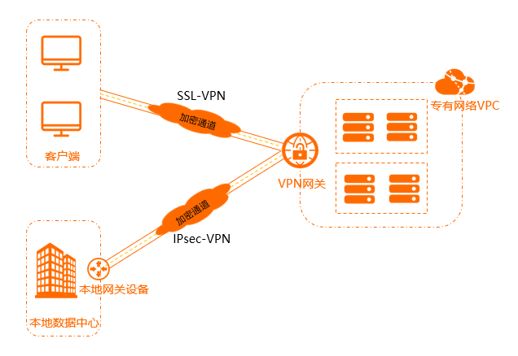

# VPN网关（Gateway）

VPN网关是一款基于互联网的网络连接服务，通过加密通道的方式实现企业本地数据中心、企业办公网络或互联网终端与阿里云专有网络VPC（Virtual Private Cloud）之间安全可靠的连接。

VPN网关提供IPsec-VPN连接和SSL-VPN连接：

- IPsec-VPN

  IPsec-VPN是一种基于路由的网络连接技术，不仅可以让您更方便地配置和维护VPN策略，而且还为您提供了灵活的流量路由方式。

  您可以使用IPsec-VPN建立本地数据中心与VPC之间或不同的VPC之间的连接。IPsec-VPN支持IKEv1和IKEv2协议，只要支持这两种协议的本地网关设备均可以和阿里云VPN网关互连。

  更多信息，请参见[IPsec-VPN入门概述](https://www.alibabacloud.com/help/zh/doc-detail/65279.htm#task-d52-4lz-wdb)。

- SSL-VPN

  SSL-VPN是一种基于OpenVPN架构的网络连接技术。部署完成后，您仅需要在客户端中加载证书并发起连接，便可通过SSL-VPN功能从客户端远程访问VPC中部署的应用和服务。

  更多信息，请参见[SSL-VPN入门概述](https://www.alibabacloud.com/help/zh/doc-detail/65282.htm#concept-f5d-bvz-wdb)。

## IPsec-VPN

