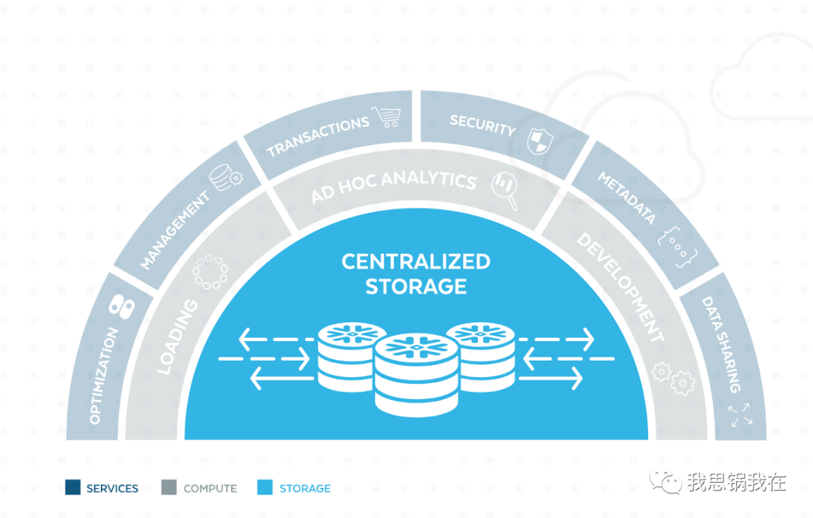

## My Account

https://zwa09388.snowflakecomputing.com/console#/internal/worksheet

microsheen@gmail.com

user: microsheen

password: QAZ...02

## tutorial

https://s3.amazonaws.com/snowflake-workshop-lab/Snowflake_free_trial_LabGuide.pdf

## Snowflake(SNOW.US)超越的不是AWS，而是SAAS

“Salesforce(CRM.US)成为比Siebel更伟大的公司，因为他们彻底改变了CRM。ServiceNow(NOW.US)成为比BMC更伟大的公司，因为他们彻底改变了ITSM(IT服务管理)。而Snowflake将彻底改变数仓，以我们从未想过的方式。”

这段话来自Snowflake现任CEO Frank Slootman在2019年6月年度用户大会上的开场。

的确，除了Salesforce的Benioff外，可能没人比Slootman更懂SaaS了。

在2011到2017年执掌ServiceNow期间，他不仅带领公司在2012年成功登陆纳斯达克，成为继Salesforce后第二家上市的SaaS公司，还把年营收从上市前的9000万美金提升至2017年的19亿美金，实现20倍增长。

2017年功成身退后，突然在2019年5月宣布加入一家提供云数据仓库的SaaS公司Snowflake(SNOW.US)。而如今看到Snowflake在上市前后的疯狂表现，这一切似乎又在情理之中。

不过，在接受Block & Files采访被问及加入Snowflake的原因时，Slootman回答道：

“It was a very high bar after ServiceNow. I also did not like SaaS that much as a business model, felt it not equitable for customers.(离开ServiceNow后，对职业选择的门槛就变得非常高了。并且，我不喜欢SaaS这个模式，对客户不平等)”

是这段话真正激发了我对Snowflake及Slootman本人的兴趣，因为从侧面说明了这不是一家典型SaaS模式的公司，否则他也绝不会加入。

进而，我试图从以下三个方面展开讨论：

Snowflake如何解决了SaaS模式的“不平等”问题?

到底是什么在支撑Snowflake这样独特的商业模式?

Snowflake将带领新一代SaaS走向怎样的未来?

打破降本增效的“黑箱”

打开Slootman的LinkedIn主页，已经能看到三段完整而成功的IPO经历，分别是：

2003年加入专业数据存储设备厂商Data Domain任CEO，带领公司于2007年登陆纳斯达克，并于2009年以21亿美金高价卖给EMC，两年后离开;

2011年加入ServiceNow任CEO，带领公司于2012年登陆纽交所，直到2017年离任;

2019年加入Snowflake任CEO，今年9月登陆纳斯达克，当前市值超过650亿美金。

仔细观察这三家公司，如果说Salesforce的CRM产品是为客户创收的，那么无论Snowflake的数据仓库还是ServiceNow的IT运维，其本质无一例外，都是为客户省钱的。

所以，Slootman从始至终坚持在他最擅长的方向上——为客户降本增效。

传统IT库房一旦出现问题，管理人员很难从成千上万的设备中寻找根源，运维人员靠人力去排查和维护设备，会浪费大量的时间和劳动。且IT信息在传统管理模式中，很容易形成信息孤岛，团队内部无法对历史信息进行规范和总结，也就无法固化成解决方案和体系。

打开ServiceNow招股书的第一页——“Transform IT”，核心逻辑是分拆了ITSM(IT服务管理)和ITOM(IT运营管理)两块业务。

细化来讲，就是通过ITOM对IT设备的状态进行实时监控，并基于ITSM系统化记录事件、解决问题并自动化日常任务。通过帮助IT部门创建、编排和规范整个工作流，提升员工工作效率，减少人为错误可能，最终提高IT资源的可见性和利用率。

然而“降本提效”，从来都是当企业发展到一定规模后才会考虑的事情。

何况对客户而言，即便按SaaS模式，这样的系统级软件通常需要按固定年费提前支付。尤其对于成本节省型产品，由于无法量化往后的使用程度或深度，客户更加难以衡量投入产出比，所以仍会造成一定使用门槛。

这便是Slootman所指的“不平等”问题——收费被前置，效果却被后置；使用过程不透明，成本无法量化。

作为Slootman执掌的第三家公司Snowflake，不仅将“降本增效”做到极致，并且试图改变上述的“黑箱”问题。

在上市之际，公司邀请知名研究机构Forrester发布了一篇衡量核心产品Cloud Data Platform经济效益的报告《The Total Economic Impact of Snowflake’s Cloud Data Platform》。

在调研了来自软件、金融、快消等行业的四家大型客户后，以三年为周期，竟然得到以下完全量化的指标，包括：

通过帮助客户提升产品上市的效率、减少对数据库等基础设施的投入，总共创造约2150万美金的经济价值;

同时，客户在此过程中内部投入以及支付给Snowflake的总成本为110万美金;

因此，三年内客户的投入回报即ROI达到612%。

**(来自：Forrester)**

在2019年用户大会上，Slootman还提到，一位客户曾清晰地告诉他在同等数据库投入之上能做比以往多15倍的工作，这时他意识到“这是革命性的时刻——当经济效益发生根本性变化的时候，客户将彻底改变对新技术的态度。”

反映到商业模式上，Snowflake的客户不再提前支付一笔固定年费，平台将完全根据客户在使用过程中实际消耗的计算和存储用量进行结算——实现成本可测。

其次，基于对单位资源消耗的真实统计，客户才能与传统模式下各个环节的投入进行对比，最终获得跟报告里一样精准的ROI——实现回报可测。

而这种更为真实的“按需付费”模式的背后，是一套全新的产品设计和技术架构。

在云上再建“云”

2017年5月经济学人发表了一篇引起各方热议的文章《The world's most valuable resource is no longer oil, but data》(世界上最有价值的资源不再是石油，而是数据)。无论观点正确与否，三年后把这条建议真正执行落地的恐怕非巴菲特莫属了。

哪怕数据不是石油，也早已成为驱动各行各业从设计、生产到业务决策的动力源。在信息化时代，所有的应用程序和软件都建立在一种用来存储数据的架构上——数据库(Database)。

在Snowflake上市之际，经济学人的新文章《Steam engine in the cloud》(云上“蒸汽机”)把数据库形象地比作“一种停车场”。

我在此基础上进一步延伸，尽可能用大白话揭开这个让客户彻底改观的“新技术”的奥秘。

首先，如果把“车”比作需要存储的文件或信息，传统磁盘存储的方式就像正常停车一样，哪里有空位就停在上面，无论车辆型号和尺寸大小。但是磁盘价格高昂且容量有限。

那么，为了节省空间，人们想到将车拆成各个零部件——车座放在一起，轮胎放在一起，同样奥迪放在一起，奔驰放在一起。以此类推，把各类部件分门别类地存放在特定区域。

这样每个区域都有自己的特征，零部件之间都有系统性的关联，这种存储方式叫“关系型”存储，这样的停车场便是“关系型数据库”。这个领域当今被Oracle等少数公司所主导。

关系型数据量的激增始于金融，大量的数据读写被用来记录相关联的交易，并被及时和准确保存，不同数据库之间也需要建立某种关系便于交叉计算。但此时数据格式比较单一，以数字、文本等结构化信息为主。

这种数据处理形式被称作OLTP(On-Line Transactional Processing，在线交易处理)，主要消耗的是大量的存储(Storage)资源。

**(来自：WordPress，一个典型的关系型数据库图谱)**

然而，随着数据用途的多样化，数据格式也更加复杂，包括图片、声音或视频等非结构化类型。

就好像我们停完车，以前用笔把车位编号记在纸上，现在直接拍张照片或录段周围环境的视频放在手机里。等我们回到停车场，将相册中的视频导入某个应用，便马上得到导航路线。

这时便需要一种能同时保存结构化和非结构化数据的新型存储架构，便是我们熟知的“数仓(Data warehouse)”。

这个概念由上世纪70年代后期Teradata公司提出，核心目的就是为了支持日益激增的商业智能分析(BI analysis)，以及如今复杂的大数据和机器学习等运算。

这种数据处理形式就是我们常听到的OLAP(On-Line Analytical Processing，在线分析处理)，主要消耗的是计算(Compute)资源即CPU甚至GPU。

传统数仓仍部署在本地的硬盘内，并且存储的空间远高于计算空间，且比例是固定的。这好比在一个固定的停车场里，存储就是里面车位的数量，计算则是车辆进出的道闸系统。

在数字化的时代，对数据分析的请求开始远超过对存储的需求，导致对数仓的需求激增。但是，对存储和计算的需求并不是同比例增加的，即同一个数据库可能从一分钟被调用数次瞬间增加到数百次，那计算速度就可能成了分析的瓶颈。

好比我们经常在高峰时段停车时，看到道闸出入两边都排着长队的情形——司机缴费和升降道闸杆都消耗了太多时间。

就在这时，Snowflake做了两个最关键的改变：

第一、 将数仓上云。

“上云”比较容易理解：一个停车场放不下，联合周边多个停车场分工合作，比如一个停车场专门存轮胎，另一个专门存座椅，相邻的停车场甚至可以存放相似属性或品牌的部件，减少搬运时间。

另外，在当今AWS、微软的Azure和谷歌的GCP三大公有云厂商割据之时，大型企业更希望分散风险，不仅采用混合云部署，也希望将数据和应用放在多个平台上。这便出现了一个中立的第三方供应商的机会。

而当第三方供应商能够在云上对线下及云端、关系型和非关系型数据库进行统一管理后，以往由于被保存在不同地方而造成的数据孤岛问题便消失了。BI分析师或数据科学家能随时随地调取任何格式的数据，甚至未被加工过的原始数据。

这样包罗万象的“云数仓”拥有一个更形象的名字——数湖(Data lake)。并且Snowflake通过创建了一个统一入口，让用户能够按照以往访问关系型数据库的语言，对背后所有的数据库进行访问，几乎不改变原有使用习惯。

**(数湖：收集→导入→混合→变形→发布→分发)**

第二、 使存算分离。

依托三大公有云厂商，“云数仓”的架构让客户能够以低成本、高效率随时扩容和缩容。

回到停车场这个例子，当汽车需要离开停车场时，Snowflake能够精确计算各个零部件被搬运、组装以及道闸等候等每一个环节的时间。

存储成本已经比较透明，但搬运、组装到等闸都需要经过不同形式的运算，成本不可同日而语，用户则可以根据自身预算选择多快时间能离开停车场。

所以，通过对存储和计算解耦，用户的成本得以量化且可控。

在计费模式上，存储的价格跟其他公有云并无差异，但是计算的价格则被分成了八个等级，以便客户根据需求单独对存储或计算扩容。而在需求下降时，平台还自动为客户缩容。

**(来自：Snowflake)**

当几乎所有SaaS公司都在想如何让客户多花钱的时候，Snowflake反其道而行，在考虑如何帮助客户多省钱。

以往使用公有云时，到底消耗了多少存储和多少计算资源，任何厂商都不会向客户透露。但在Snowflake这里，存储是存储，计算是计算，服务是服务，构成了其产品的三层架构。

**(来自：Snowflake)**

只有当消费被后置，使用过程被彻底解耦时，SaaS真正实现了“按需付费”。

换句话说，Snowflake在公有云厂商即IaaS上再建了一个高扩展且集中管理的数据仓库——在云上再建“云”。

Hhhypergrowth在一篇对Snowflake深度分析的文章中，一针见血地指出公司的产品及商业特征：

“They are a cloud-native data platform that acts as a cloud-within-a-cloud...and so are capable of near limitless scale(他们是一个云原生的数据平台，是云设施上的“云”，因此可以几乎无上限地扩张)。”

SaaS 3.0已来?

从Salesforce到ServiceNow，作为开启“软件吞噬一切”时代的先锋，他们用颠覆性的商业模式和产品架构像传统软件厂商开了第一枪，瞄准的是企业最核心的信息化设施。

进入二十一世纪，是以Atlassian、Zoom和Slack等为首的2.0厂商，他们携带云原生的天然基因，借助移动互联网带来的网络效应，自下而上地渗透到企业的一切工作场景，极大地提升了员工工作和管理效率。

而Snowflake似乎在从多个角度，宣告着一个对传统厂商更具破坏力和对客户更加友好的“3.0时代”的到来。

第一，软件将定义一切基础设施(Infrastructure)服务。

从上个时代的软件定义网络(SDN)、软件定义无线电(SDR)到软件定义存储和计算，甚至软件定义汽车，新一代虚拟化技术的力量将在这个“云上”时代被进一步放大。

看完Snowflake招股书后，我第一时间想到的是四年前上市的Twilio。

如我在API鼻祖Twilio的逆袭与野望里所说，Twilio从Day 1就把自己定义为“AWS for telecom(电信行业的AWS)”——致力解决通信行业诸多黑箱问题，包括合同预付制和冗杂的配置要求等等，同样希望把客户的使用门槛降至最低。

所以，你会发现两家公司之间的诸多共性，包括：

通过对底层设施的整合实现高度灵活和中立：Twilio在整合的是美国三大运营商，Snowflake整合的是三大公有云厂商;

通过技术解耦软硬件真正实现“按需付费”：Twilio按短信条数或通话量，Snowflake按消耗的存储或或计算资源;

通过降低使用门槛快速赢取大客户：早年Uber与WhatsApp对于Twilio，以及Cisco与Capital One对于Snowflake的营收至关重要。

而数据库仅作为基础设施的一个门类，这个市场里还有专门为机器学习和自动学习等大规模数据处理而生的Databricks(年初完成F轮融资，估值62亿美金)，以及托管文档型数据库公司MongoDB(当前市值156亿美金)等等。

当年Oracle一家独大的格局正以肉眼可见的速度被瓦解，我们也将看到软硬件在一切基础设施中逐渐被解耦。硬件的更新迭代速度必然会进一步放缓或者变得不那么重要，成本进而更加透明和标准。

**(来自：经济学人、Gartner)**

那么，未来当“上云”百分百成为企业数字化首选的时候，恐怕也正是背后供应商核心竞争力真正消退之时。

不过现在，IaaS的发展与竞争远没有到终点。

其次，开放能力和网络效应将是新一代SaaS的标签。

Snowflake的Marketplace——基于数据库内容提供二次开发及共享的交易平台，之于公司的价值，可能如当初App Exchange对于Salesforce一样，既令人兴奋又略感模糊。

**(来自：Snowflake)**

兴奋在于这体现了最关键的核心竞争力，因为中立和灵活性是所有第三方平台都会具备的特点，但是内容的分享和交易带来的传播性，让平台有机会建立自下而上的网络效应。

本以为只有像Zoom、Slack这样被个人频繁使用的工具型SaaS才具备这个特点，但Snowflake抓住了这个世纪快速成长的一个群体——BI分析师和数据分析师，随后快速扩展到数据科学家(Data scientist)、AI及机器学习工程师等。

如今核心IT人员对企业信息化采购决策的影响力愈发提升，卫生事件更加速了这个趋势。

其次，Marketplace催生了一个新职业：数据中介(Data broker)。已经有中介在平台上的数据库进行快速分析，为数据内容和计算资源付费后，获得例如关于卫生事件增长趋势的分析报告。这些报告随后被他们卖给有需求的客户从而获利。

不过，市场对这块业务的前景也有诸多质疑。

因为自2005年Salesforce推出App Exchange即PaaS平台级业务后，直到2019年也就是十四年后，平台业务才以57%的同比增速超过Service Cloud，成为仅次于核心CRM业务的第二大营收来源。

没有庞大的用户规模、合作伙伴及ISV，数据价值无从说起。对于Snowflake，无论商业分析师、数据工程师还是数据中介，这个群体的基数与认知都有待进一步发展。

但毋庸置疑，无论Snowflake、Twilio还是Zoom、Slack在内的新一代云原生的SaaS公司，将更加注重自身与其他云原生应用的集成与开放能力，犹如一条鲶鱼一样尽可能渗透到工作场景的各个角落。

最后，新一代SaaS将可能真正提供“按需付费”。

其实已经有越来越多的SaaS公司开始提供基于用量(usage-based)的计费方式了。除了Twilio、Snowflake，还有今年市值翻了将近六倍的Fastly。

Fastly撬动的是传统CDN(内容交付网络)厂商的蛋糕，其边缘云平台帮助TikTok、Pinterest、Twitter等大型平台向全球用户更快传送视频、图片等相关流媒体数据，极大降低加载时间，提升用户体验。

**(来自：雪球，Fastly成为卫生事件期间涨幅最快的SaaS公司)**

其商业模式便是按用量收费，同时为开发者开放丰富的开发工具和组件，让客户的应用能快速部署到边缘云上。

因此，未来一旦这些提供基础设施的厂商实现了按用量收费的标准后，在上面的SaaS厂商是否有可能也按照用户的实际用量计费呢?

因为SaaS产品最主要的成本便是服务器等基础设施产生的费用，一旦成本结构更加清晰后，原本按照客户规模和使用人数的月费或年费模式一定能做到更精细化的设计。

在一级市场中，我也看到有不少新一代的SaaS公司先收取较低的订阅服务费，再根据平台上处理的订单量或项目数额外收费，因为这会消耗大量计算资源，来保证大规模和并发运算的稳定性。

回归“第一性原理”

八年，对于一家企业服务公司来说并不长，但却创造了软件行业史上最大规模IPO。

Snowflake的历史进程，既是云原生技术体系逐步商业化落地的过程，更是以Slootman为代表的几位商业奇才和技术天才长达20年孜孜不倦的探索和追逐。最后给定市场和产品，释放商业价值的过程，一切看似意外，实则顺理成章。

印象深刻的是Slootman在一次采访中说道：

“I have no playbooks, I am entirely situational and operate on so-called first principles.(我没有剧本，完全见机行事并遵循第一性原理。)”

身份管理SaaS上市公司Okta的CEO曾在推特上总结了选择Snowflake的原因：价格更便宜;扩展更弹性;分享更容易。

**回归第一性原理，这三点不正是作为新一代企业服务公司应该提供的核心价值吗?**

放眼未来，我相信在Slootman的带领下，Snowflake将很可能实现比十几年前ServiceNow更快的增长。

但更让我兴奋和期待的是——

这是否真的将开启SaaS的下一个黄金十年?