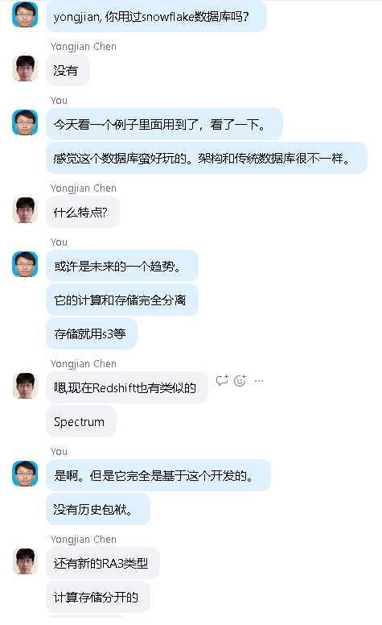

yongjian, 你用过snowflake数据库吗？
Yongjian Chen 01/13 5:46 PM
没有
You 01/13 5:47 PM
今天看一个例子里面用到了，看了一下。
感觉这个数据库蛮好玩的。架构和传统数据库很不一样。
Yongjian Chen 01/13 5:49 PM
什么特点?
You 01/13 5:49 PM
或许是未来的一个趋势。
它的计算和存储完全分离
存储就用s3等
Yongjian Chen 01/13 5:51 PM
嗯,现在Redshift也有类似的
Spectrum
You 01/13 5:51 PM
是啊。但是它完全是基于这个开发的。
没有历史包袱。
Yongjian Chen 01/13 5:51 PM
还有新的RA3类型
计算存储分开的
不固定存储
没有历史包袱是不错
其实本来就应该这样
BigData数仓很多不用数据库
You 01/13 5:52 PM
RA3是啥
Yongjian Chen 01/13 5:52 PM
就是数据+查询引擎
You 01/13 5:52 PM
是啊。 
Yongjian Chen 01/13 5:52 PM
RA3是一个型号,
内存大,不本地存储
You 01/13 5:52 PM
哦 。
Yongjian Chen 01/13 5:53 PM
我们其实用了EMR,就没必要用Redshift
Redshift好在比较稳定,还有数据备份之类的
有Db的特性
权限管理什么的比较全面
You 01/13 5:54 PM
是啊， EMR有资源限制吗？
可以按需使用吗?
Yongjian Chen 01/13 5:54 PM
自己管理数据,一个不小心文件删除了咋办..
EMR可以扩展啊.
EMR有master,core node, task node
You 01/13 5:54 PM
看了snowflake的例子，删除也可以恢复数据
把表删除了，数据还能恢复
Yongjian Chen 01/13 5:54 PM
嗯,S3也可以版本控制
就是麻烦一些
You 01/13 5:55 PM
是啊。snowflake把这些都集成好了
你根本不知道底层数据怎么放的。
Yongjian Chen 01/13 5:55 PM
EMR可以用Presto,也可以用Spark, Hive
还是snowflake好
EMR就是啥都能干
不过就是要自己维护的东西多
类似于Linux
vs Windows的差别
You 01/13 5:56 PM
是啊。我觉得是一种思路把。snowflake号称做到完全按需收费。
Yongjian Chen 01/13 5:56 PM
挺好的
看看AWS有么有
You 01/13 5:57 PM
看了一篇文章，把snowflake抬得很高。
Yongjian Chen 01/13 5:57 PM
https://aws.amazon.com/solutionspace/financial-services/solutions/snowflake-data-warehouse/
You 01/13 5:57 PM
https://finance.sina.com.cn/stock/hkstock/hkstocknews/2020-10-19/doc-iiznctkc6315346.shtml
Yongjian Chen 01/13 5:59 PM
好像这个公司股票涨的很好
SNOW.US
You 01/13 5:59 PM
是啊。最近好像很火
Yongjian Chen 01/13 5:59 PM
很强大
You 01/13 6:00 PM
感觉redshift新版本的东西，是跟snowflake学的。
Yongjian Chen 01/13 6:00 PM
嗯
You 01/13 6:01 PM
之前听很多人说数据中台，一直不懂啥意思。
现在理解，至少要做到snowflake这样才行。
根本上还是能够减低运维成本。
Yongjian Chen 01/13 6:03 PM
数据中台..阿里说要拆
感觉类似一个大数仓
管理起来比较累
大数据湖
You 01/13 6:03 PM
snowflake这种类似平台应该在其中必不可少。
Yongjian Chen 01/13 6:03 PM
数据湖+查询引擎
You 01/13 6:04 PM
因为hp以前用的是EDW，那种集中式的。时间证明，是基本失败的。
Yongjian Chen 01/13 6:04 PM
snowflake感觉像一个查询引擎. 
那种数仓性能是个大问题吧
You 01/13 6:05 PM
是啊。不知道，里面是否可以嵌入spark等类似代码
如果可以的化，就厉害了
Yongjian Chen 01/13 6:05 PM
嗯. 感觉支持的格式挺多的
You 01/13 6:05 PM
我试用了一下，几千万数据，还蛮快的
Yongjian Chen 01/13 6:06 PM
一看这个我觉得跟查询引擎差不多
You 01/13 6:06 PM
而且关键是，它没有并发问题
从它宣传上看，多个用户来，性能可以稳定。
Yongjian Chen 01/13 6:06 PM
嗯,Redshift不行.不过它有并发扩展
也不是无限对吧
You 01/13 6:07 PM
不清除。
不清楚阿