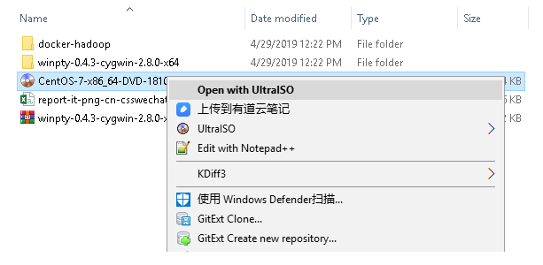
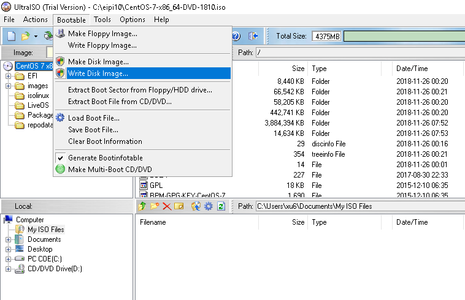
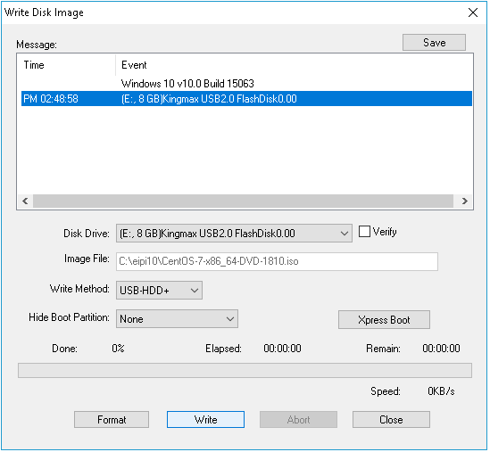
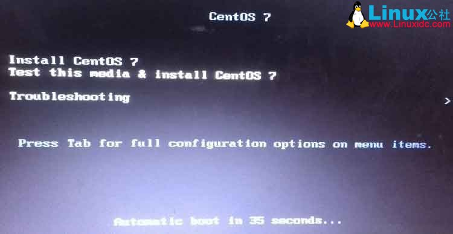
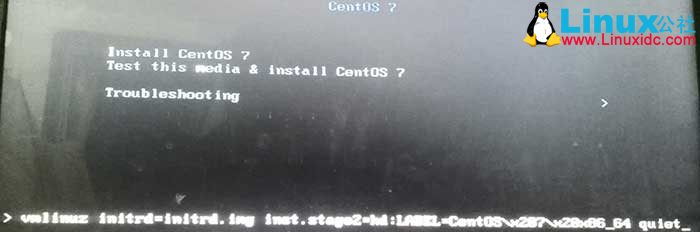
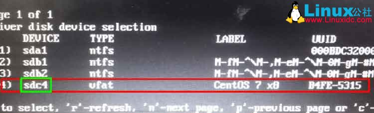

# U盘安装CentOS7

## 下载DVD镜像文件

http://isoredirect.centos.org/centos/7/isos/x86_64/CentOS-7-x86_64-DVD-1810.iso

## 刻录镜像到U盘

1. 安装最新的UltralISO。

   https://www.ultraiso.com/download.html

2. 把下载的镜像文件用UltralISO打开。

   

3. 在UltraISO中，选择菜单`Bootable > Write Disk Image`
   
   
4. 弹出窗口上，在Message中选择要刻录的U盘，然后点击`Write`按钮开始刻录。

   

​         

## U盘安装Centos7

1. 开机选择U盘启动，将会看到如下界面。

    

3.   选择第一项，然后按TAB键。在屏幕底部会出现一行命令。

    

    > 如果选择Install Centos7，直接回车并安装，经常发生找不到安装盘的情况，为了避免这种情况，需要获取U盘的设备名称。

4. 将底部命令修改为

    ~~~shell
    > vmlinuz initrd=initrd.img linux dd quiet
    ~~~
    改好之后回车，然后就会列出设备列表了，在这个列表里面，找到U盘。下图中sdc4是U盘所对应设备名称。
    

5. 再次通过U盘重新启动电脑，进行到第2步， 然后根据上面获取到的U盘设备名称， 将命令修改为：

   ~~~
   > vmlinuz initrd=initrd.img inst.stage2=hd:/dev/sdc4 quiet  
   ~~~

   然后回车。

6. 如果没有任何报错的话，将会进入到选择语言的界面，接下来就可以正常安装了。如果犯错，请返回第3步，继续定位U盘的设备名称。

## 参考

- [U盘安装CentOS7最正确姿势](https://blog.csdn.net/Bruce_You/article/details/75332090)