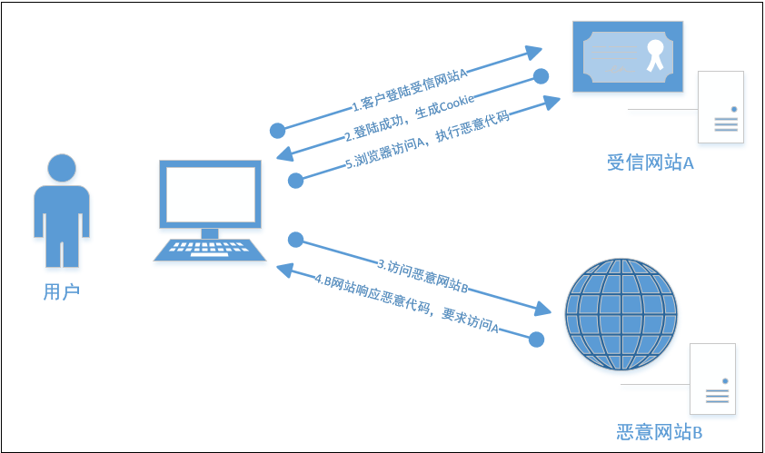

CORS（Cross-Origin Resource Sharing 跨源资源共享），当一个请求url的协议、域名、端口三者之间任意一与当前页面地址不同即为跨域。

## CORS的安全隐患

跨域请求和Ajax技术都会极大地提高页面的体验，但同时也会带来安全的隐患，其中最主要的隐患来自于CSRF（Cross-site request forgery）跨站请求伪造。

## CORS验证机制

出于安全原因，浏览器限制从脚本中发起的跨域HTTP请求。默认的安全限制为同源策略， 即JavaScript或Cookie只能访问同域下的内容。W3C推荐了一种跨域的访问验证的机制，即CORS（Cross-Origin Resource Sharing 跨源资源共享）。
这种机制让Web应用服务器能支持跨站访问控制，使跨站数据传输更加安全，减轻跨域HTTP请求的风险。

CORS验证机制需要客户端和服务端协同处理。目前主流浏览器都已基本提供对跨域资源共享的支持，移动端浏览器也几乎全部支持。

## 客户端处理机制

基于上述的CSRF的风险，各主流的浏览器都会对动态的跨域请求进行特殊的验证处理。验证处理分为简单请求验证处理和预先请求验证处理。

### 简单请求

1. 请求方法是以下三种方法之一：

    - HEAD
    - GET
    - POST

2. HTTP的头信息不超出以下几种字段：

    - Accept
    - Accept-Language
    - Content-Language
    - Last-Event-ID
    - Content-Type：只限于三个值`application/x-www-form-urlencoded`、`multipart/form-data`、`text/plain`

同时满足上面两个条件，就属于简单请求。简单请求时，

- 浏览器会直接发送跨域请求，并在请求头中携带Origin 的header，表明这是一个跨域的请求。
- 服务器端接到请求后，会根据自己的跨域规则，通过Access-Control-Allow-Origin和Access-Control-Allow-Methods响应头，来返回验证结果。如果验证成功，则会直接返回访问的资源内容。

### 预先请求

