下面摘录了一些资料中关于OAuth的内容。

## [理解OAuth 2.0](https://www.ruanyifeng.com/blog/2014/05/oauth_2_0.html)

[OAuth](http://en.wikipedia.org/wiki/OAuth)是一个关于授权（authorization）的开放网络标准，在全世界得到广泛应用，目前的版本是2.0版。

### 一、应用场景

为了理解OAuth的适用场合，让我举一个假设的例子。

有一个"云冲印"的网站，可以将用户储存在Google的照片，冲印出来。用户为了使用该服务，必须让"云冲印"读取自己储存在Google上的照片。

传统方法是，用户将自己的Google用户名和密码，告诉"云冲印"，后者就可以读取用户的照片了。这样的做法有以下几个严重的缺点。

（1）"云冲印"为了后续的服务，会保存用户的密码，这样很不安全。

（2）Google不得不部署密码登录，而我们知道，单纯的密码登录并不安全。

（3）"云冲印"拥有了获取用户储存在Google所有资料的权力，用户没法限制"云冲印"获得授权的范围和有效期。

（4）用户只有修改密码，才能收回赋予"云冲印"的权力。但是这样做，会使得其他所有获得用户授权的第三方应用程序全部失效。

（5）只要有一个第三方应用程序被破解，就会导致用户密码泄漏，以及所有被密码保护的数据泄漏。

### 二、名词定义

在详细讲解OAuth 2.0之前，需要了解几个专用名词。它们对读懂后面的讲解，尤其是几张图，至关重要。

> （1） **Third-party application**：第三方应用程序，本文中又称"客户端"（client），即上一节例子中的"云冲印"。
>
> （2）**HTTP service**：HTTP服务提供商，本文中简称"服务提供商"，即上一节例子中的Google。
>
> （3）**Resource Owner**：资源所有者，本文中又称"用户"（user）。
>
> （4）**User Agent**：用户代理，本文中就是指浏览器。
>
> （5）**Authorization server**：认证服务器，即服务提供商专门用来处理认证的服务器。
>
> （6）**Resource server**：资源服务器，即服务提供商存放用户生成的资源的服务器。它与认证服务器，可以是同一台服务器，也可以是不同的服务器。

知道了上面这些名词，就不难理解，OAuth的作用就是让"客户端"安全可控地获取"用户"的授权，与"服务商提供商"进行互动。

### 三、OAuth的思路

OAuth在"客户端"与"服务提供商"之间，设置了一个授权层（authorization layer）。"客户端"不能直接登录"服务提供商"，只能登录授权层，以此将用户与客户端区分开来。"客户端"登录授权层所用的令牌（token），与用户的密码不同。用户可以在登录的时候，指定授权层令牌的权限范围和有效期。

"客户端"登录授权层以后，"服务提供商"根据令牌的权限范围和有效期，向"客户端"开放用户储存的资料。

### 四、运行流程

OAuth 2.0的运行流程如下图，摘自RFC 6749。

> （A）用户打开客户端以后，客户端要求用户给予授权。
>
> （B）用户同意给予客户端授权。
>
> （C）客户端使用上一步获得的授权，向认证服务器申请令牌。
>
> （D）认证服务器对客户端进行认证以后，确认无误，同意发放令牌。
>
> （E）客户端使用令牌，向资源服务器申请获取资源。
>
> （F）资源服务器确认令牌无误，同意向客户端开放资源。

不难看出来，上面六个步骤之中，B是关键，即用户怎样才能给于客户端授权。有了这个授权以后，客户端就可以获取令牌，进而凭令牌获取资源。

### 五、客户端的授权模式

客户端必须得到用户的授权（authorization grant），才能获得令牌（access token）。OAuth 2.0定义了四种授权方式。

- 授权码模式（authorization code）
- 简化模式（implicit）
- 密码模式（resource owner password credentials）
- 客户端模式（client credentials）

## OAuth2.0 步骤图解

https://learnku.com/articles/20031

步骤图
1. 我们这里有一份用户的数据

   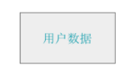

2. 用户的数据我们保存在资源服务器 (Resource server) 里

   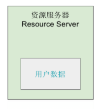

3. 这时候有个 第三方应用程序（Third-party application）想要请求资源服务器要用户数据

   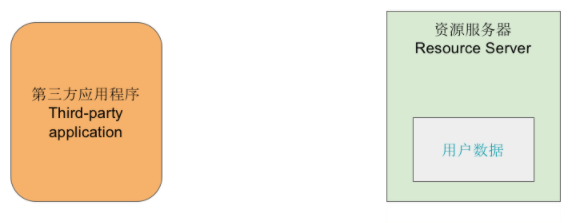

4. 为了让用户数据和第三方程序程序良好的交互，资源服务器准备了一个 API 接口

   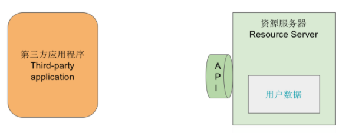

5. 第三方应用程序向资源服务器请求用户的数据

   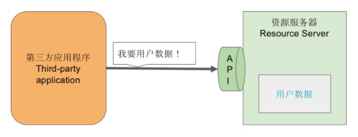

6. 资源服务器表示好的给你了

   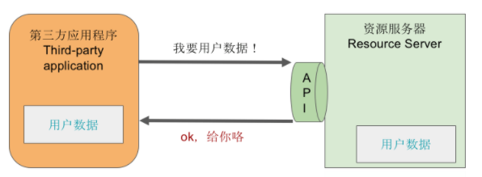

7. 但如果这个第三方应用程序是恶意的第三方呢？那么就会有以下的场景出现

   

8. 所以我们需要一个机制来保护 API 接口，不能随随便便毫无安全可言的把用户的数据送出去

   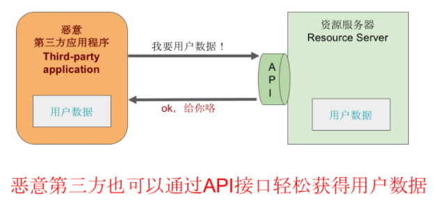

9. 这个最佳实践就事先在第三方程序里保存一个令牌 access_token

   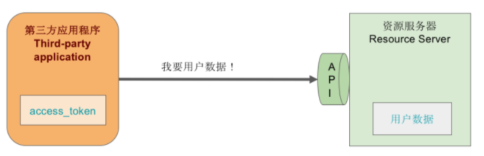

10. 第三方应用程序在向资源服务器请求用户数据的时候会出示这个 access_token

    

11. 然后资源服务器取出授权码并且验证是否有授权

    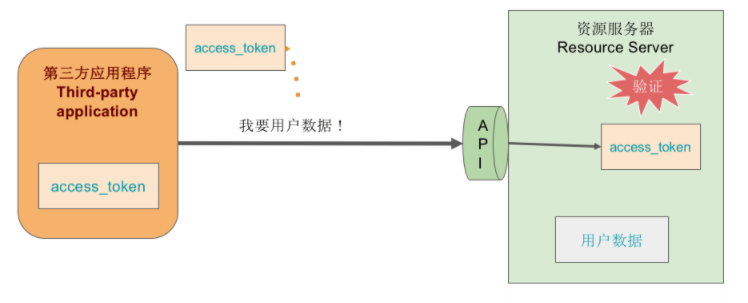

12. 授权通过，资源服务器才会把用户数据传递给第三方应用程序

    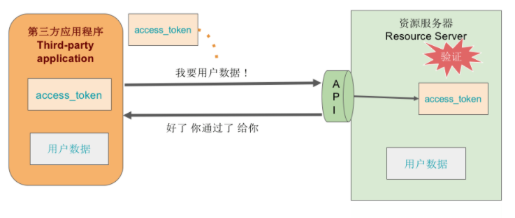

13. 但这种方案需要事先给第三方 access_token

    

14. 所以我们需要一个东西用来发行这个 access_token，这时候认证服务器 （Authorization server）登场了

    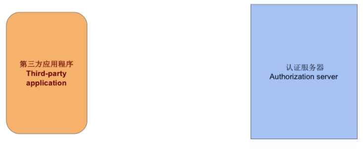

15. 认证服务器负责生成并且发行 access_token 给第三方应用程序

    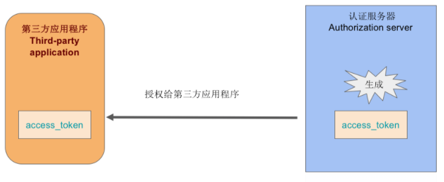

16. 接下来我们看一下目前的登场的人物有

    - 第三方应用程序
    - 资源服务器
    - 认证服务器
    - access_token
    - 用户数据

    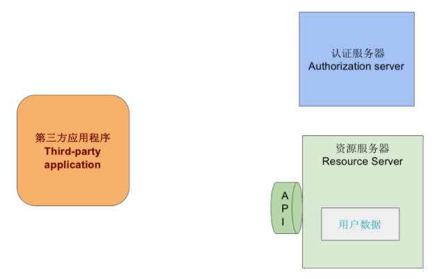

    > 资源服务器和认证服务器有时候是同一台服务器

17. 接下来我们来走一下流程 认证服务器生成 access_token

    

18. 认证服务器发行 access_token 授权给第三方应用程序

    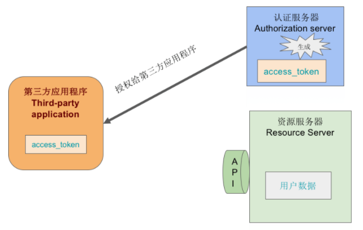

19. 第三方应用程序拿着 access_token 去找资源服务器要用户数据

    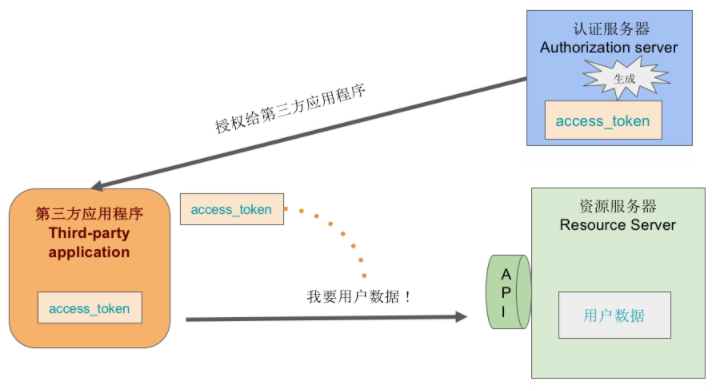

20. 资源服务器取出来 access_token 并验证

    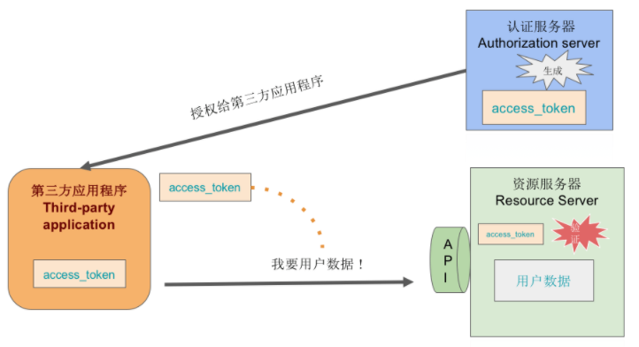

21. 验证通过 用户数据送出

    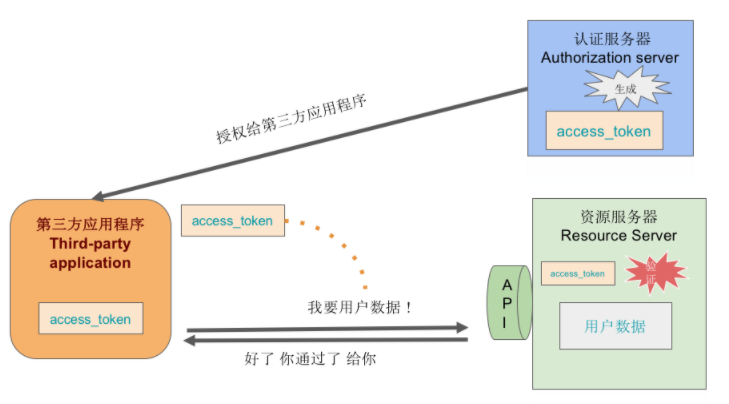

22. 问题点来了
    到上面为止有个很大的问题就是，认证服务器生成 access_token 竟然没人管！那岂不是随便发行了，这不行，于是我们的用户 （Resource Owner：资源所有者）出现了！

    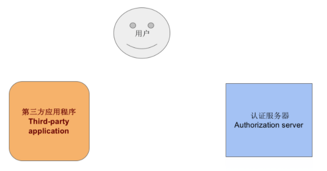

23. 解决

    认证服务器在发行 access_token 之前要先通过用户的同意

24. 于是接下来就是

    - 第三方应用程序向认证服务器要 access_token

      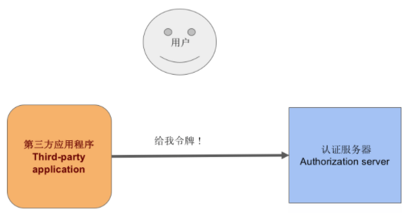

    - 认证服务器生成之前先问问用户能不能授权啊

      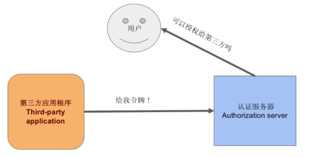

    - 用户说好的可以给

      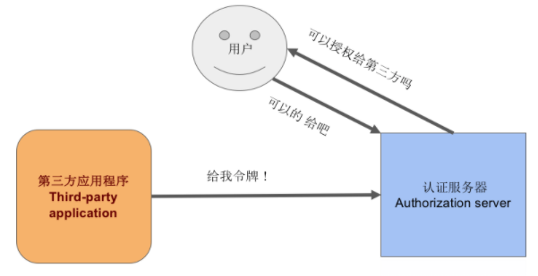

    - 认证服务器生成 access_token 并且发行给第三方应用程序

      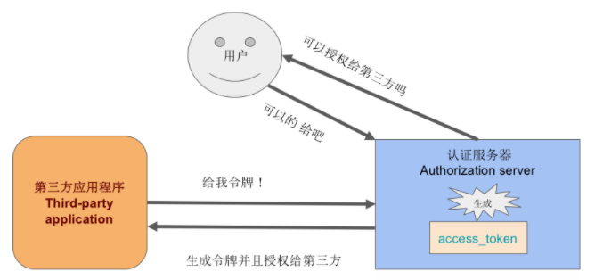

25. oAuth2.0
    第三方应有程序和这个认证服务器之间围绕着 access_token 进行请求和响应的等等就是 oAuth2.0

    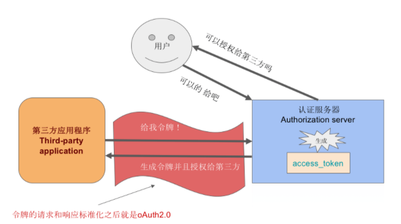

