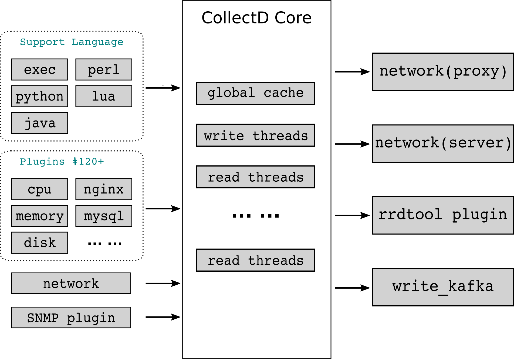

[collectd](https://collectd.org/) 是一个后台监控程序，用来采集其所运行系统上的系统信息，并提供各种存储方式来存储为不同值的格式，例如 RRD 文件形式、文本格式、MongoDB 等等。

Collectd 完全由 C 语言编写，故性能很高，可移植性好，它允许运行在系统没有脚本语言支持或者 cron daemon 的系统上，比如嵌入式系统；同时，它包含优化以及处理成百上千种数据集的新特性，目前包含了几十种插件。

主要特点如下

1. C语言、插件、多线程(读写线程池)，支持 Python、Shell、Perl 等脚本语言；
2. 数据采集插件包括了 OS(CPU、Memory、Network、Disk等)、通用组件(Nginx、MySQL、PostgreSQL、Redis、HAProxy等)；
3. 写入插件支持 RRDTool、Kafka、MongoDB、Redis、Riemann、Sensu、TSDB等；
4. 支持级联方式，数据发送采用 UDP 报文；

## 安装

~~~shell
sudo yum install collectd -y
sudo systemctl enable collectd
sudo systemctl start collectd
~~~

## 运行

### 输出日志到文件

~~~shell
cat << EOF > collectd-file.conf
Interval                30
MaxReadInterval        180

LoadPlugin syslog
LoadPlugin cpu
LoadPlugin interface
LoadPlugin load
LoadPlugin memory

LoadPlugin logfile
<Plugin logfile>
       LogLevel info
       File "/var/log/collectd.json.log"
       Timestamp true
       PrintSeverity true
</Plugin>
LoadPlugin write_log
<Plugin write_log>
  Format JSON
</Plugin>
EOF

sudo cp collectd-file.conf  /etc/collectd.d
chmod 644 /etc/collectd.d/collectd-file.conf
sudo chown root:root /etc/collectd.d/collectd-file.conf
cat /etc/collectd.d/collectd-file.conf
ll /etc/collectd.d/collectd-file.conf

sudo systemctl restart collectd
# sudo rm -rf /var/log/collectd.json.log
~~~

**配置日志文件每日自动滚动（日志滚动）**

logrotate 是一个 linux 系统日志的管理工具。可以对单个日志文件或者某个目录下的文件按时间 / 大小进行切割，压缩操作；指定日志保存数量；还可以在切割之后运行自定义命令。

logrotate 是基于 crontab 运行的，所以这个时间点是由 crontab 控制的，下面命令可以查询 crontab 的配置文件 。 

~~~
sudo cat /etc/anacrontab
~~~

显示如下：

~~~
#period in days   delay in minutes   job-identifier   command
1       5       cron.daily              nice run-parts /etc/cron.daily
7       25      cron.weekly             nice run-parts /etc/cron.weekly
@monthly 45     cron.monthly            nice run-parts /etc/cron.monthly
~~~

系统会按照计划的频率运行 logrotate，通常是每天。在大多数的 Linux 发行版本上，计划每天运行的脚本位于 /etc/cron.daily/logrotate。

确保日志的大小在可控的范围。

~~~shell
cat << EOF > collectd
/var/log/collectd.json.log
{
    missingok
    notifempty
    daily
    rotate 5
    create 0644 root root
}
EOF

sudo mv collectd /etc/logrotate.d/
chmod 644 /etc/logrotate.d/collectd
sudo chown root:root /etc/logrotate.d/collectd
cat /etc/logrotate.d/collectd
ll /etc/logrotate.d/collectd
~~~

手动执行

~~~
ll /var/log/collectd.json.log
logrotate --force --verbose /etc/logrotate.d/collectd
~~~

## 参考

- [Collectd 简介](https://jin-yang.github.io/post/collectd-introduce.html)