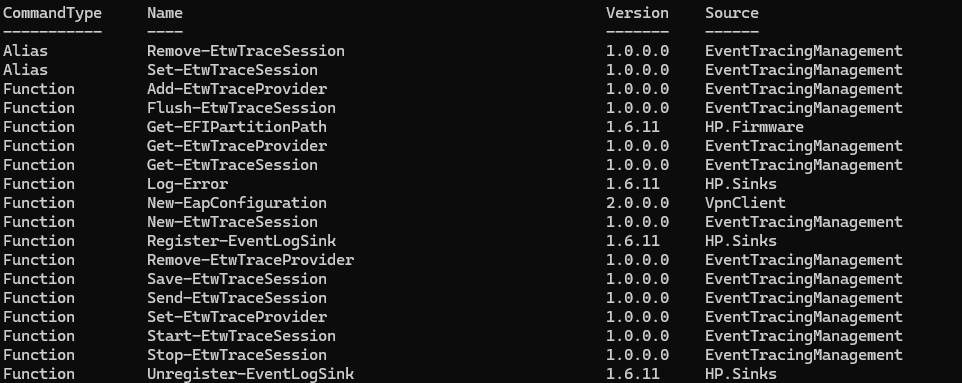

PowerShell 是一种命令行 shell 和脚本语言一体化工具。 它被设计为任务引擎，使用 cmdlet 来包装用户需要执行的任务。 在 PowerShell 中，可以在本地或远程计算机上运行命令。 可以执行管理用户和自动执行工作流等任务。

PowerShell 由命令行 shell 和脚本语言两部分组成。 它最初是一种框架，用于在 Windows 中自动执行管理任务。 PowerShell 现已发展为一种跨平台工具，用于执行多种任务。

## Skills

### Enable Running Scripts

~~~powershell
Set-ExecutionPolicy -ExecutionPolicy RemoteSigned
~~~

### 验证PowerShell安装情况

~~~powershell
$PSVersionTable
~~~

~~~powershell
$PSVersionTable.PSVersion
~~~

### 使用 Get-Command 查找命令

~~~powershell
Get-Command -Noun e*
~~~

~~~powershell
Get-Command -Verb Get -Noun e*
~~~

### 创建文件

~~~powershell
new-item helloworld.ps1
~~~

