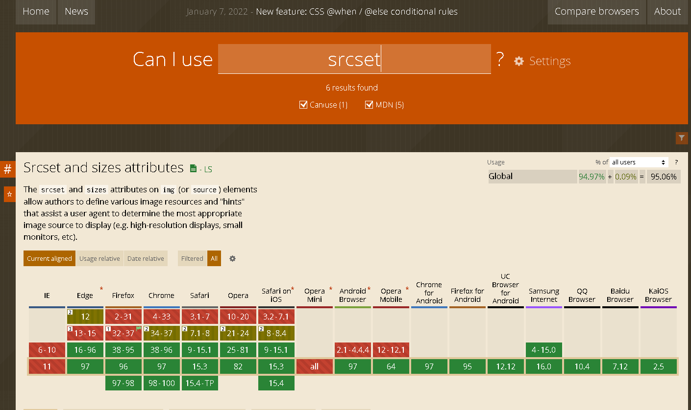
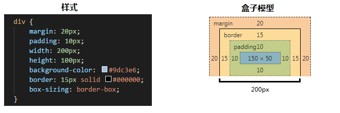
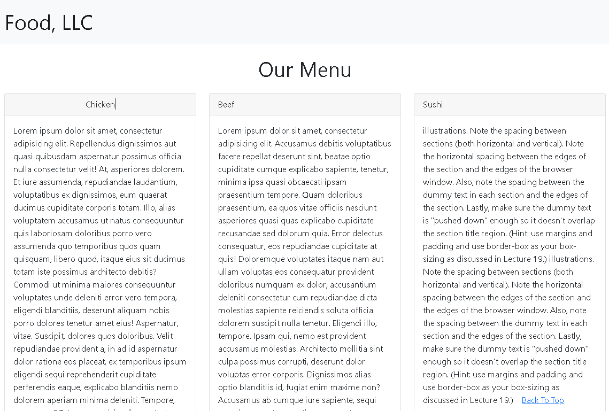

# Week 1

## Installation

1. git

2. nodejs

3. browser sync

   ~~~
   cd /c/xujian/eipi10/web_study/fullstack-course4
   browser-sync start --server --directory --files "**/*"
   ~~~
   
   **Browsersync**能让浏览器实时、快速响应您的文件更改（html、js、css、sass、less等）并自动刷新页面。有了它，您不用在多个浏览器、多个设备间来回切换，频繁的刷新页面。 更神奇的是您在一个浏览器中滚动页面、点击等行为也会同步到其他浏览器和设备中，这一切还可以通过可视化界面来控制。
   
   详见[Browsersync 命令行用法](https://browsersync.bootcss.com/docs/command-line)。上面代码中**（表示任意目录）匹配。

## Web Development Tool

### https://clearlydecoded.com/

本课程老师的blog。


### https://jsfiddle.net/


### https://codepen.io/


### https://css-tricks.com/

css很多技巧


### https://caniuse.com/ciu/index

查询web的功能被浏览器哪个版本支持。




### https://www.w3schools.com/browsers/

浏览器的使用统计。

| 2021      | [Chrome](https://www.w3schools.com/browsers/browsers_chrome.asp) | [Edge](https://www.w3schools.com/browsers/browsers_explorer.asp) | [Firefox](https://www.w3schools.com/browsers/browsers_firefox.asp) | [Safari](https://www.w3schools.com/browsers/browsers_safari.asp) | [Opera](https://www.w3schools.com/browsers/browsers_opera.asp) |
| :-------- | -----------------------------------------------------------: | -----------------------------------------------------------: | -----------------------------------------------------------: | -----------------------------------------------------------: | -----------------------------------------------------------: |
| December  |                                                       81.0 % |                                                        6.6 % |                                                        5.5 % |                                                        3.7 % |                                                        2.3 % |
| November  |                                                       80.0 % |                                                        6.8 % |                                                        5.8 % |                                                        3.9 % |                                                        2.4 % |
| October   |                                                       80.3 % |                                                        6.7 % |                                                        5.7 % |                                                        3.9 % |                                                        2.3 % |
| September |                                                       80.9 % |                                                        6.5 % |                                                        5.6 % |                                                        3.6 % |                                                        2.2 % |
| August    |                                                       81.4 % |                                                        6.1 % |                                                        5.6 % |                                                        3.3 % |                                                        2.1 % |
| July      |                                                       81.6 % |                                                        6.0 % |                                                        5.6 % |                                                        3.3 % |                                                        2.2 % |
| June      |                                                       81.7 % |                                                        5.9 % |                                                        5.6 % |                                                        3.4 % |                                                        2.2 % |
| May       |                                                       81.2 % |                                                        5.8 % |                                                        5.8 % |                                                        3.5 % |                                                        2.4 % |
| April     |                                                       80.7 % |                                                        5.6 % |                                                        6.1 % |                                                        3.7 % |                                                        2.4 % |
| March     |                                                       80.8 % |                                                        5.5 % |                                                        6.3 % |                                                        3.7 % |                                                        2.3 % |
| February  |                                                       80.6 % |                                                        5.4 % |                                                        6.6 % |                                                        3.9 % |                                                        2.3 % |
| January   |                                                       80.3 % |                                                        5.3 % |                                                        6.7 % |                                                        3.8 % |                                                        2.3 % |

### https://validator.w3.org/

验证网站是否符合w3c的规范。会给出Warning和Error。


### http://html5test.com/

测试浏览器对于html5的支持。


### https://placeholder.com/

在做页面时，页面上的一些图片需要找临时图片来占位。[Placeholder](https://link.jianshu.com/?t=http://placehold.it/) 提供好用的占位图服务。

只需将图片的地址按如下格式设置

```javascript
http://via.placeholder.com/宽x高/背景色/字的颜色?text=占位文字
```

其中：

- 高，背景色，字的颜色和占位文字都是可选的。
- 高的默认值等于宽
- 背景色，字的颜色的值为16进制的颜色值，不带`#` 
- 占位文字不支持中文，只支持数字，字母和大多数符号。空格用 `+` 号。

示例如下

```javascript
http://via.placeholder.com/200x100
```


更多使用方法参见：https://cloud.tencent.com/developer/article/1194540

### https://www.ajaxload.info/

可以在这个网站，生成正在加载的各种图形。可惜现在网站出现问题，无法访问了。


类似的网站有：

- http://ajaxloadingimages.net/
- https://icons8.com/cssload

## HTML Basics

### What's HTML


### HTML History

**HTML**全称 HyperText Markup Language，即**超文本标记语言**。它是由Web的发明者 蒂姆·伯纳斯·李（Tim Berners-Lee）和同事 Daniel W. Connolly 于1990年创立的一种标记语言，它是标准通用化标记语言SGML 的应用。

两大HTML标准化组织：

- WHATWG: 全称Web Hypertext Application Technology Working Group （网页超文本应用技术工作小组）。

- W3C：全称World Wide Web Consortium，被称作万维网联盟。


参见

- [我的HTML总结之HTML发展史](https://cloud.tencent.com/developer/article/1090585)
- [HTML 编年史](https://github.com/NARUTOne/blog-note/issues/16)
- [WHATWG 击败 W3C，赢得 HTML 和 DOM 的控制权](https://www.infoq.cn/article/bsvfxt96doh-sbzphbwj)
- [HTML 发展史，web界的王子复仇记](https://zhuanlan.zhihu.com/p/188639690)

### Block Element vs. Inline Element

block和inline这两个概念是简略的说法，完整确切的说应该是 block-level elements (块级元素) 和 inline elements (内联元素)。block元素通常被现实为独立的一块，会单独换一行；inline元素则前后不会产生换行，一系列inline元素都在一行内显示，直到该行排满。

`<div>`是一个Block Element （html5中称之为flow content），`<span>`一个inline element（html5中称之为phrasing content）。

- 常见的块级元素有 DIV, FORM, TABLE, P, PRE, H1~H6, DL, OL, UL 等。
- 常见的内联元素有 SPAN, A, STRONG, EM, LABEL, INPUT, SELECT, TEXTAREA, IMG, BR 等

html5中定义了多种content类型。详见https://www.w3.org/TR/2011/WD-html5-20110525/content-models.html#kinds-of-content


下面是一个例子。

http://localhost:3000/examples/Lecture09/links-internal.html

~~~
<!doctype html>
<html>
<head>
  <meta charset="utf-8">
  <title>Internal Links</title>
</head>
<body>
  <h1>Internal Links</h1>
  <section>
    We can link to a file in the same directory as this HTML file like this:
    <a href="same-directory.html" title="same dir link">Linking to a file in the same directory</a>

    <a href="same-directory.html" title="same dir link">
      <div> DIV Linking to a file in the same directory</div>
    </a>
  </section>
</body>
</html>
~~~


可以看到`<a>`默认是Inline Element，但在其中间插入一个Block Element `<div>`，于是第二个link就换行了

下面是另外一个例子，Block Element不能放在inline element中。

~~~
<!doctype html>
<html lang="">
<head>
  <meta charset="utf-8">
  <title>div and span elements</title>
</head>
<body>
  <div>*** DIV 1: Some content here ***</div>
  <div>*** DIV 2: Following right after div 1 ***</div>
  <span>*** SPAN 1: Following right after div 2 ***</span>
  <div>
    *** DIV 3: Following right after span 1 
    <span>*** SPAN 2: INSIDE div 3 ***</span>
    Continue content of div 3 ***
  </div>
  <div>
    *** DIV 3: Following right after span 1 
    <span>*** SPAN 2: INSIDE div 3 ***<div>some content</div></span>
    Continue content of div 3 ***
  </div>  
</body>
</html>
~~~

把上述内容，在https://validator.w3.org/nu/#textarea中进行验证，可以得到如下提示。


#### display属性

通过队display属性的修改，可以改变block和inline的显示。

##### display:block

- block元素会独占一行，多个block元素会各自新起一行。默认情况下，block元素宽度自动填满其父元素宽度。
- block元素可以设置width,height属性。块级元素即使设置了宽度,仍然是独占一行。
- block元素可以设置margin和padding属性。

##### display:inline

- inline元素不会独占一行，多个相邻的行内元素会排列在同一行里，直到一行排列不下，才会新换一行，其宽度随元素的内容而变化。
- inline元素设置width,height属性无效。
- inline元素的margin和padding属性，水平方向的padding-left, padding-right, margin-left, margin-right都产生边距效果；
- 但竖直方向的padding-top, padding-bottom, margin-top, margin-bottom不会产生边距效果

##### display:inline-block

简单来说就是将对象呈现为inline对象，但是对象的内容作为block对象呈现。之后的内联对象会被排列在同一行内。
比如我们可以给一个link（a元素）inline-block属性值，使其既具有block的宽度高度特性


## HTML5 Tags

### Heading Element


在html5中，增加了header, nav, section, article, aside, footer等富含semantic的Heading Element。

- `<header>`：网页的标头，通常放置网站标题。
- `<nav>`：网页的选单、导览。
- `<main>`：网页的主要内容。
- `<aside>`：网页的侧栏、附加内容。
- `<article>`：一篇文章内容。
- `<section>`：自订的区块，例如数篇摘要组成的空间。
- `<footer>`：网页的页尾，通常放置联络方式、著作权宣告等等。
- `<mark>`：强调一小块内容。
- `<time>`：显示日期时间。

详见：

- [7 個你必須知道的semantic elements](https://medium.com/%E7%8B%97%E5%A5%B4%E5%B7%A5%E7%A8%8B%E5%B8%AB/7-%E5%80%8B%E4%BD%A0%E5%BF%85%E9%A0%88%E7%9F%A5%E9%81%93%E7%9A%84semantic-elements-ccc8bbad5d)
- [HTML5 语义元素](https://www.runoob.com/html/html5-semantic-elements.html)
- [HTML5 語意標籤](https://training.pada-x.com/docs/article.jsp?key=html5-semantic-elements)

下面是一个例子。

http://localhost:3000/examples/Lecture06/semantic-elements.html

~~~html
<!doctype html>
<html>
<head>
  <meta charset="utf-8">
  <title>Heading Elements</title>
</head>
<body><script id="__bs_script__">//<![CDATA[
    document.write("<script async src='/browser-sync/browser-sync-client.js?v=2.27.7'><\/script>".replace("HOST", location.hostname));
//]]></script>

  <header>
    header element - Some header information goes here. Usually consists of company logo, some tag line, etc. Sometimes, navigation is contained in the header as well.
    <nav>nav (short for navigation) element - Usually contains links to different parts of the web site.</nav>
  </header>
  <h1>Main Heading of the Page (hard not to have it)</h1>
  <section>
    Section 1
    <article>Article 1</article>
    <article>Article 2</article>
    <article>Article 3</article>
  </section>
  <section>
    Section 2
    <article>Article 4</article>
    <article>Article 5</article>
    <article>Article 6</article>
    <div>Regular DIV element</div>
  </section>
  <aside>
    ASIDE - Some information that relates to the main topic, i.e., related posts.
  </aside>

  <footer>
    JHU Copyright 2015
  </footer>
</body>
</html>
~~~

### HTML Entity 

下面是一些常见的HTML Entity。

| 符号   | 代码 | 描述 |
| ------ | ---- | ---- |
| `&nbsp;` | &nbsp; | 空格 |
| `&lt;` | &lt; |      |
| `&gt;` | &gt; |      |
| `&amp;` | &amp; |      |
| `&quot;` | &quot; |      |
| `&copy;` | &copy; | |

更多的HTML Entity参见[HTML Entity List](https://www.freeformatter.com/html-entities.html)。

下面是一个例子：

http://localhost:3000/examples/Lecture08/html-entities-after.html

~~~
<!DOCTYPE html>
<html>
<head>
  <meta charset="utf-8">
  <title>HTML Entities</title>
</head>
<body>
<h1>Don't be afraid to be &lt;then a 100% success &amp; &gt;more:</h1>
<p>
  &quot;It is not the critic who counts; not the man who points out how the strong man stumbles, or where the doer of deeds could have done them better. The credit belongs to the man who is actually in the arena, whose face is marred by dust and sweat and blood; who strives valiantly; who errs, who comes short again and again, because there is no effort without error and shortcoming; but who does actually strive to do the deeds; who knows great enthusiasms, the great devotions; who spends himself in a worthy cause; who at the best knows in the end the triumph of high achievement, and who at the worst, if he fails, at least fails while daring greatly, so that his place shall never be with those cold and timid souls who neither know victory&nbsp;&nbsp;&nbsp;nor&nbsp;&nbsp;&nbsp;defeat.&quot;
</p>
<p>Theodor Roosevelt 1910 &copy; Copyright</p>
</body>
</html>
~~~

需要注意的是，无论窗口怎么改变大小， victory  nor  defeat始终保持在一行里。


# Week 2

本节内容可以参考[CSS 基础教程](https://www.w3school.com.cn/css/index.asp)

## Power of CSS

CSS全称Cascading Style Sheets，非常强大。

这个网站http://csszengarden.com/里演示了相同HTML，不同CSS造成的巨大页面效果的差异。下面是其中三种效果的展示。

http://csszengarden.com/


http://csszengarden.com/217/


http://csszengarden.com/215/


## Selectors

参见[CSS选择器笔记](http://www.ruanyifeng.com/blog/2009/03/css_selectors.html)。

### 基本选择器

- Element Selector

  ~~~css
  p {
    color: blue;
    font-size: 20px;
    width: 200px;
  }
  
  ~~~


  - Class Selector

    ~~~css
    .summary {
      width: 80%;
      margin: 0 auto;
    }
    ~~~


  - ID  Selector

    ~~~css
    #p1 {
      background-color: #A52A2A;
      position: relative;
      top: 65px;
      left: 65px;
    }
    ~~~

三种css selector的优先级顺序是：ID  Selector，Class Selector， Element Selector。完整的示范例子参见http://localhost:3000/examples/Lecture13/simple-selectors-after.html。

更加完整的优先级顺序是： **!important > 内联 > ID > 类 > 标签 | 伪类 | 属性选择 > 伪对象 > 通配符 > 继承**，详见 [浏览器解析 CSS 样式的过程](https://blog.fundebug.com/2019/04/01/how-does-browser-parse-css/)。

### 组合选择器

| Combinators | Select                                                       |
| ----------- | ------------------------------------------------------------ |
| A,B         | 匹配满足A（和/或）B的任意元素.                               |
| A B         | 匹配任意元素，满足条件：B是A的后代结点（B是A的子节点，或者A的子节点的子节点） |
| A > B       | 匹配任意元素，满足条件：B是A的直接子节点                     |
| A + B       | 匹配任意元素，满足条件：B是A的下一个兄弟节点（AB有相同的父结点，并且B紧跟在A的后面） |
| A ~ B       | 匹配任意元素，满足条件：B是A之后的兄弟节点中的任意一个（AB有相同的父节点，B在A之后，但不一定是紧挨着A） |

### 属性选择器

#### 简单属性选择

详见[CSS 属性选择器详解](https://www.w3school.com.cn/css/css_selector_attribute.asp)。下面是其中的内容

-  把包含标题（title）的所有元素变为红色

  ~~~
  *[title] {color:red;}
  ~~~

- 只对有 href 属性的锚（a 元素）应用样式

  ~~~
  a[href] {color:red;}
  ~~~

- 将同时有 href 和 title 属性的 HTML 超链接的文本设置为红色

  ~~~
  a[href][title] {color:red;}
  ~~~

- 对所有带有 alt 属性的图像应用样式，从而突出显示这些有效的图像

  ~~~
  img[alt] {border: 5px solid red;}
  ~~~

  **提示：**上面这个特例更适合用来诊断而不是设计，即用来确定图像是否确实有效。

#### 根据具体属性值选择

- 希望将指向 Web 服务器上某个指定文档的超链接变成红色

  ~~~
  a[href="http://www.w3school.com.cn/about_us.asp"] {color: red;}
  ~~~

- 把多个属性-值选择器链接在一起来选择一个文档

  ~~~
  a[href="http://www.w3school.com.cn/"][title="W3School"] {color: red;}
  ~~~

#### 根据部分属性值选择

| 类型          | 描述                                                         |
| :------------ | :----------------------------------------------------------- |
| [abc~="def"]  | 仅选择 abc属性的值（以空格间隔出多个值）中有包含 def值的所有元素，比如位于被空格分隔的多个类（class）中的一个类。 |
| [abc^="def"]  | 子串值（Substring value）属性选择选择 abc 属性值以 "def" 开头的所有元素 |
| [abc\|="def"] | : 选择abc属性的值以def或def-开头的元素（-用来处理语言编码）。 |
| [abc$="def"]  | 选择 abc 属性值以 "def" 结尾的所有元素                       |
| [abc*="def"]  | 选择 abc 属性值中包含子串 "def" 的所有元素                   |

下面是一个关于`[abc~="def"]`的例子。

~~~html
<!DOCTYPE html PUBLIC "-//W3C//DTD XHTML 1.0 Transitional//EN" "http://www.w3.org/TR/xhtml1/DTD/xhtml1-transitional.dtd">
<html>
<head>
<style type="text/css">
p[class~="important"]
{
color: red;
}
</style>
</head>

<body>
<h1>可以应用样式：</h1>
<p class="important warning">This is a paragraph.</a>
<p class="1 important">This is a paragraph.</a>

<hr />

<h1>无法应用样式：</h1>
<p class="warning">This is a paragraph.</a>
</body>
</html>
~~~


#### 特定属性选择类型

请看下面的例子：

```
*[lang|="en"] {color: red;}
```

上面这个规则会选择 lang 属性等于 en 或以 en- 开头的所有元素。因此，以下示例标记中的前三个元素将被选中，而不会选择后两个元素：

```
<p lang="en">Hello!</p>
<p lang="en-us">Greetings!</p>
<p lang="en-au">G'day!</p>
<p lang="fr">Bonjour!</p>
<p lang="cy-en">Jrooana!</p>
```
### 伪元素（Pseudo Element）

CSS 伪元素用于设置元素指定部分的样式。

例如，它可用于：

- 设置元素的首字母、首行的样式
- 在元素的内容之前或之后插入内容

参见https://www.w3school.com.cn/css/css_pseudo_elements.asp

~~~
p::first-letter {
  color: #ff0000;
  font-size: xx-large;
}
~~~

### 伪类（Pseudo Class）

伪类用于定义元素的特殊状态。

例如，它可以用于：

- 设置鼠标悬停在元素上时的样式
- 为已访问和未访问链接设置不同的样式
- 设置元素获得焦点时的样式

参见https://www.w3school.com.cn/css/css_pseudo_classes.asp

~~~css
/* 未访问的链接 */
a:link {
  color: #FF0000;
}

/* 已访问的链接 */
a:visited {
  color: #00FF00;
}

/* 鼠标悬停链接 */
a:hover {
  color: #FF00FF;
}

/* 已选择的链接 */
a:active {
  color: #0000FF;
}
~~~

**注意：**`a:hover` 必须在 CSS 定义中的 `a:link` 和 `a:visited` 之后，才能生效！`a:active` 必须在 CSS 定义中的 `a:hover` 之后才能生效！伪类名称对大小写不敏感。

例子参见:

- https://www.w3school.com.cn/tiy/t.asp?f=css_pseudo-class

- http://localhost:3000/examples/Lecture15/pseudo-selectors-after.html

  

## CSS Box Model

详见

- [CSS 框模型](https://www.w3school.com.cn/css/css_boxmodel.asp)
- [盒模型详解](http://layout.imweb.io/article/box-model.html)
- [CSS Box Model 盒子模型](https://www.cnblogs.com/polk6/p/css-boxModel.html)


### box-sizing: border-box

box-sizing默认情况下是content-box，表示CSS中的width和height属性的值只会应用到元素的内容区域。如果设置box-sizing: border-box，表示元素的边框和内边距的范围包含在CSS中的width、height内。



## CSS Layout

详见

- [CSS 布局 - 浮动实例](https://www.w3school.com.cn/css/css_float_examples.asp)
- [CSS 布局 - clear 和 clearfix](https://www.w3school.com.cn/css/css_float_clear.asp)
- [CSS-float详解，深入理解clear:both](https://www.cnblogs.com/caseast/p/5831240.html)

## Bootstrap

https://getbootstrap.com/

非常强大，按照这个方案做，页面简洁美观。

### Bootstrap Grid System

参见[Bootstrap 网格系统](https://www.runoob.com/bootstrap/bootstrap-grid-system.html)

最基本的结构：

~~~html
<div class="container">
   <div class="row">
      <div class="col-*-*"></div>
      <div class="col-*-*"></div>      
   </div>
   <div class="row">...</div>
</div>
<div class="container">....
~~~

| Breakpoint        | Class infix | Dimensions |
| ----------------- | ----------- | ---------- |
| X-Small           | *None*      | <576px     |
| Small             | `sm`        | ≥576px     |
| Medium            | `md`        | ≥768px     |
| Large             | `lg`        | ≥992px     |
| Extra large       | `xl`        | ≥1200px    |
| Extra extra large | `xxl`       | ≥1400px    |

|                       | xs <576px                                                    | sm ≥576px  | md ≥768px  | lg ≥992px  | xl ≥1200px | xxl ≥1400px |
| --------------------- | ------------------------------------------------------------ | ---------- | ---------- | ---------- | ---------- | ----------- |
| Container `max-width` | None (auto)                                                  | 540px      | 720px      | 960px      | 1140px     | 1320px      |
| Class prefix          | `.col-`                                                      | `.col-sm-` | `.col-md-` | `.col-lg-` | `.col-xl-` | `.col-xxl-` |
| # of columns          | 12                                                           |            |            |            |            |             |
| Gutter width          | 1.5rem (.75rem on left and right)                            |            |            |            |            |             |
| Custom gutters        | [Yes](https://getbootstrap.com/docs/5.0/layout/gutters/)     |            |            |            |            |             |
| Nestable              | [Yes](https://getbootstrap.com/docs/5.0/layout/grid/#nesting) |            |            |            |            |             |
| Column ordering       | [Yes](https://getbootstrap.com/docs/5.0/layout/columns/#reordering) |            |            |            |            |             |

### Display

https://getbootstrap.com/docs/4.0/utilities/display/

| Screen Size        | Class                            |
| ------------------ | -------------------------------- |
| Hidden on all      | `.d-none`                        |
| Hidden only on xs  | `.d-none .d-sm-block`            |
| Hidden only on sm  | `.d-sm-none .d-md-block`         |
| Hidden only on md  | `.d-md-none .d-lg-block`         |
| Hidden only on lg  | `.d-lg-none .d-xl-block`         |
| Hidden only on xl  | `.d-xl-none`                     |
| Visible on all     | `.d-block`                       |
| Visible only on xs | `.d-block .d-sm-none`            |
| Visible only on sm | `.d-none .d-sm-block .d-md-none` |
| Visible only on md | `.d-none .d-md-block .d-lg-none` |
| Visible only on lg | `.d-none .d-lg-block .d-xl-none` |
| Visible only on xl | `.d-none .d-xl-block`            |

## Assignment 2

自己的实现：http://localhost:3000/assignments/assignment2/index.html


参考网上实现方案： https://github.com/alessandrozito98/fullstack-course4/tree/master/solutions/module2-solution


自己的方案中采用了多层div嵌套来实现框这件的间隔。而网上方案，采用了margin，但是这样会照成间隔过宽的情况。

# Week 3

本周将为一个中国餐馆创建一个新的web网站。这是老的网站http://www.4106025008.ucraa.org/Default.aspx?page=Food%20Menu


## Create Mock Up

- [balsamiq](https://balsamiq.com/)

  是美国加利福利亚的Balsamiq 工作室（ 2008 年 3 月创建）推出的原型图绘制软件。于 2008 年 6 月发行了第一个版本。Balsamiq Mockups 在软件产品原型图设计领域，特别是 Web 原型图设计领域尤其受欢迎。使用 Balsamiq Mockups 画出的原型图都是手绘风格的图像，看上去美观、清爽。它支持几乎所有的 HTML 控件原型图，还支持 iPhone 手机元素原型图。

- [Sketch](https://www.sketch.com/)

  

- [Mockplus](mockplus.com)

  **Mockplus**（摹客）是一款简洁快速的原型图设计工具。 适合软件团队、个人在软件开发的设计阶段使用。 其低保真、无需学习、快速上手、功能够用。 并能够很好地表达自己的设计。


参见：

- [Balsamiq 、Sketch 、Mockplus对比](https://zhuanlan.zhihu.com/p/40345853)

## Google Fonts

https://fonts.google.com/

## Assignment 3

自己的实现：http://localhost:3000/assignments/assignment3/index.html



# Week 4

## Javascript Types

最新的 ECMAScript 标准定义了 8 种数据类型:

- 原始类型：7 种。
  - [undefined](https://developer.mozilla.org/zh-CN/docs/Glossary/undefined)：`typeof instance === "undefined"`
  - [Boolean](https://developer.mozilla.org/zh-CN/docs/Glossary/Boolean)：`typeof instance === "boolean"`
  - [Number](https://developer.mozilla.org/zh-CN/docs/Glossary/Number)：`typeof instance === "number"`
  - [String](https://developer.mozilla.org/zh-CN/docs/Glossary/String)：`typeof instance === "string`
  - [BigInt](https://developer.mozilla.org/zh-CN/docs/Glossary/BigInt)：`typeof instance === "bigint"`
  - [Symbol](https://developer.mozilla.org/zh-CN/docs/Glossary/Symbol) ：`typeof instance === "symbol"`
  - [null](https://developer.mozilla.org/zh-CN/docs/Glossary/Null)：`typeof instance === "object"`。
- [Object](https://developer.mozilla.org/zh-CN/docs/Glossary/Object)：`typeof instance === "object"`。任何 constructed 对象实例的特殊非数据结构类型，也用做数据结构：new [Object](https://developer.mozilla.org/zh-CN/docs/Glossary/Object)，new [Array](https://developer.mozilla.org/zh-CN/docs/Glossary/array)，new Map，new Set，new WeakMap，new WeakSet，new Date，和几乎所有通过 new keyword 创建的东西。

~~~
// should be undefined
var x;
console.log(x);

if (x == undefined) {
  console.log("x is undefined");
}

x = 5;
if (x == undefined) {
  console.log("x is undefined");
}
else {
  console.log("x has been defined");
}
~~~


## Common Language Constructs

### Regular math operators

~~~javascript
// ***** Regular math operators: +, -, *, /
console.log((5 + 4) / 3);
console.log(undefined / 5);
function test1 (a) {
  console.log( a / 5);
}
test1();
~~~


### Equality

~~~javascript
// ***** Equality 
var x = 4, y = 4;
if (x == y) {
  console.log("x=4 is equal to y=4");
}

x = "4";
if (x == y) {
  console.log("x='4' is equal to y=4");
}


// ***** Strict equality
if (x === y) {
  console.log("Strict: x='4' is equal to y=4");
}
else {
  console.log("Strict: x='4' is NOT equal to y=4");
}
~~~


### Boolean

~~~
// ***** If statement (all false)
if ( false || null || 
     undefined || "" || 0 || NaN) {
  console.log("This line won't ever execute");
}
else {
  console.log ("All false");
}

// ***** If statement (all true)
if (true && "hello" && 1 && -1 && "false") {
  console.log("All true");
}
~~~


### For loop

~~~javascript
var sum = 0;
for (var i = 0; i < 10; i++) {
  console.log(i);
  sum = sum + i;
}
console.log("sum of 0 through 9 is: " + sum);
~~~


### Default values

~~~javascript
// Default values
function orderChickenWith(sideDish) {
  sideDish = sideDish || "whatever!";
  console.log("Chicken with " + sideDish);
}

orderChickenWith("noodles");
orderChickenWith();

~~~


## Object and Function

### Create Object

~~~javascript
// Object creation
var company = new Object();
company.name = "Facebook";
company.ceo = new Object();
company.ceo.firstName = "Mark";
company.ceo.favColor = "blue";

console.log(company);
console.log("Company CEO name is: " 
  + company.ceo.firstName);

console.log(company["name"]);
var stockPropName = "stock of company";
company[stockPropName] = 110;

console.log("Stock price is: " + 
  company[stockPropName]);

// Better way: object literal
var facebook = {
  name: "Facebook",
  ceo: {
    firstName: "Mark",
    favColor: "blue"
  },
  "stock of company": 110
};

console.log(facebook.ceo.firstName);

~~~


### Function Explained

~~~javascript
// Functions are First-Class Data Types
// Functions ARE objects
function multiply(x, y) {
  return x * y;
}
multiply.version = "v.1.0.0";
console.log(multiply.version);


// Function factory
function makeMultiplier(multiplier) {
  var myFunc = function (x) {
    return multiplier * x;
  };

  return myFunc;
}

var multiplyBy3 = makeMultiplier(3);
console.log(multiplyBy3(10));
var doubleAll = makeMultiplier(2);
console.log(doubleAll(100));

// Passing functions as arguments
function doOperationOn(x, operation) {
  return operation(x);
}

var result = doOperationOn(5, multiplyBy3);
console.log(result);
result = doOperationOn(100, doubleAll);
console.log(result);
~~~


### Copy by Reference vs by Value

~~~javascript
// Copy by Reference vs by Value
var a = 7;
var b = a;
console.log("a: " + a);
console.log("b: " + b);

b = 5;
console.log("after b update:");
console.log("a: " + a);
console.log("b: " + b);

var a = { x: 7 };
var b = a;
console.log(a);
console.log(b);

b.x = 5;
console.log("after b.x update:");
console.log(a);
console.log(b);

~~~


默认是值传递（by Value）

~~~javascript
function changePrimitive(primValue) {
  console.log("in changePrimitive...");
  console.log("before:");
  console.log(primValue);
  
  primValue = 5;
  console.log("after:");
  console.log(primValue);
}

var value = 7;
changePrimitive(value); // primValue = value
console.log("after changePrimitive, orig value:");
console.log(value);

function changeObject(objValue) {
  console.log("in changeObject...");
  console.log("before:");
  console.log(objValue);
  
  objValue.x = 5;
  console.log("after:");
  console.log(objValue);
}

value = { x: 7 };
changeObject(value); // objValue = value
console.log("after changeObject, orig value:");
console.log(value);
~~~


### Function Constructors, prototype and the 'this' keyword

~~~javascript
// Function constructors
function Circle (radius) {
  this.radius = radius;
}

Circle.prototype.getArea = 
  function () {
    return Math.PI * Math.pow(this.radius, 2);
  };


var myCircle = new Circle(10);
console.log(myCircle.getArea());

var myOtherCircle = new Circle(20);
console.log(myOtherCircle);

~~~


### Object literals and "this"

~~~javascript
// Object literals and "this"
var literalCircle = {
  radius: 10,

  getArea: function () {
    var self = this;
    console.log(this);

    var increaseRadius = function () {
      self.radius = 20;
    };
    increaseRadius();
    console.log(this.radius);

    return Math.PI * Math.pow(this.radius, 2);
  }
};

console.log(literalCircle.getArea());

~~~


## Arrays, Closures and Namespaces

### Arrays

~~~javascript
// Arrays
var array = new Array();
array[0] = "Yaakov";
array[1] = 2;
array[2] = function (name) {
  console.log("Hello " + name);
};
array[3] = {course: " HTML, CSS & JS"};

console.log(array);
array[2](array[0]);
console.log(array[3].course);
console.log('--------------------------------')

// Short hand array creation
var names = ["Yaakov", "John", "Joe"];
console.log(names);

for (var i = 0; i < names.length; i++) {
  console.log("Hello " + names[i]);
}

names[100] = "Jim";
for (var i = 0; i < names.length; i++) {
  console.log("Hello " + names[i]);
}

var names2 = ["Yaakov", "John", "Joe"];

var myObj = {
  name: "Yaakov",
  course: "HTML/CSS/JS",
  platform: "Courera"
};
for (var prop in myObj) {
  console.log(prop + ": " + myObj[prop]);
}

for (var name in names2) {
  console.log("Hello " + names2[name]);
}

names2.greeting = "Hi!";

for (var name in names2) {
  console.log("Hello " + names2[name]);
}
~~~


### Closures

~~~javascript
// Closures
function makeMultiplier (multiplier) {
  // var multiplier = 2;
  function b() {
    console.log("Multiplier is: " + multiplier);
  }
  b();


  return (
      function (x) {
        return multiplier * x;
      }

    );
}

var doubleAll = makeMultiplier(2);
console.log(doubleAll(10)); // its own exec env
~~~


### Fake Namespaces

避免一些函数或者变量的定义，相互覆盖，可以清晰定义其范围。

使用Immediately Invoked Function Expressions (IIFEs)创建一种fake namespaces。

在 JavaScript 中，我们经常会遇到以下这种模式。这种模式被称之为 IIFE（Immediately-Invoked Function Expression），即立即调用的函数表达式：

~~~javascript
(function() {
  // ...
})();
~~~

IIFE 意味着该函数会在运行时立即被调用——我们也无法再次调用它们，它们只运行一次。

在很多时候，我们更多的是利用 IIFE 的函数作用域来防止局部变量泄漏到全局作用域（污染全局变量）。此外，我们也会使用 IIFE 来包装意图为私有的状态（或数据）。

参考[详解 JavaScript 的 IIFE 语法](https://blog.csdn.net/wuxianjiezh/article/details/90665292)

下面一个例子

~~~
(function (window) {
  var yaakovGreeter = {};
  yaakovGreeter.name = "Yaakov";
  var greeting = "Hello ";
  yaakovGreeter.sayHello = function () {
    console.log(greeting + yaakovGreeter.name);
  }

  window.yaakovGreeter = yaakovGreeter;

})(window);


(function (window) {
  var johnGreeter = {};
  johnGreeter.name = "John";
  var greeting = "Hi ";
  johnGreeter.sayHi = function () {
    console.log(greeting + johnGreeter.name);
  }

  window.johnGreeter = johnGreeter;

})(window);

yaakovGreeter.sayHello();
johnGreeter.sayHi();

// Immediately Invoked Function Expression
// IIFE
(function (name) {
  console.log("Hello " + name);
})("Coursera!");
~~~


## Assignment 4

自己的实现：http://localhost:3000/assignments/assignment4/harder/index.html


# Week 5

## DOM Object Model Manipulation

### DOM Manipulation

DOM (Document Object Model) 译为**文档对象模型**，是 HTML 和 XML 文档的编程接口。

HTML DOM 定义了访问和操作 HTML 文档的标准方法。

DOM 以树结构表达 HTML 文档。


这有一个简单例子：http://localhost:3000/examples/Lecture53/index.html。其中代码如下:

- js

  ~~~javascript
  // DOM manipulation
  // console.log(document.getElementById("title"));
  // console.log(document instanceof HTMLDocument);
  
  function sayHello () {
    var name =
     document.getElementById("name").value;
     var message = "<h2>Hello " + name + "!</h2>";
  
    // document
    //   .getElementById("content")
    //   .textContent = message;
  
    document
      .getElementById("content")
      .innerHTML = message;
  
    if (name === "student") {
      var title = 
        document
          .querySelector("#title")
          .textContent;
      title += " & Lovin' it!";
      document
          .querySelector("h1")
          .textContent = title;
    }
  }
  ~~~

- html

  ~~~html
  <!doctype html>
  <html lang="en">
    <head>
      <meta charset="utf-8">
    </head>
  <body>
    <h1 id="title">Lecture 53</h1>
    
    <p>
      Say hello to 
      <input id="name" type="text">
      <button onclick="sayHello();">
        Say it!
      </button>
    </p>
  
    
    <div id="content"></div>
  
    <script src="js/script.js"></script>
  </body>
  </html>
  
  ~~~

### Handling Events

通过设置addEventListener来增加事件响应。js示例如下。

~~~javascript
// Event handling
document.addEventListener("DOMContentLoaded",
  function (event) {
    
    function sayHello (event) {
      console.log("what is this", this); 
      this.textContent = this.textContent + "!";
      var name =
       document.getElementById("name").value;
       var message = "<h2>Hello " + name + "!</h2>";

      document
        .getElementById("content")
        .innerHTML = message;

      if (name === "student") {
        var title = 
          document
            .querySelector("#title")
            .textContent;
        title += " & Lovin' it!";
        document
            .querySelector("h1")
            .textContent = title;
      }
    event binding
    document.querySelector("button")
      .addEventListener("click", sayHello);

  }
);
~~~

对应的html元素中，不需要设置`onclick="sayHello();"`

~~~html
<!doctype html>
<html lang="en">
  <head>
    <meta charset="utf-8">
    <script src="js/script.js"></script>
  </head>
<body>
  <h1 id="title">Lecture 54</h1>
  
  <p>
    Say hello to 
    <input id="name" type="text">
    <button>
      Say it!
    </button>
  </p>

  
  <div id="content"></div>
</body>
</html>

~~~

## Introduction to Ajax


AJAX = 异步 JavaScript 和 XML。

AJAX 是一种用于创建快速动态网页的技术。

通过在后台与服务器进行少量数据交换，AJAX 可以使网页实现异步更新。这意味着可以在不重新加载整个网页的情况下，对网页的某部分进行更新。传统的网页（不使用 AJAX）如果需要更新内容，必需重载整个网页面。

**AJAX-同步和异步**

1. 同步：提交表单时，每次填完一个输入框内容，客户端都要向服务端发送请求，服务端收到请求后会对该请进行处理，接着向客户端输出响应，客户端等待响应并重新载入整个页面，如此往复...
2. 异步：提交表单时，每次填完一个输入框内容，客户端都要向服务端发送请求，服务端收到请求后会对该请进行处理，接着向客户端输出响应，客户端验证信息将错误的内容标红但是并没有去载入这个页面，在此过程中，我们还可以去接着去填写其他的输入框内容，直到最后提交载入页面...

3. 异步使用的对象：XMLHttpRequest

   


### Ajax Basics

参见http://localhost:3000/examples/Lecture57/index.html

### Processing Json

参见http://localhost:3000/examples/Lecture58/index.html


## Using Ajax to Connect Restaurant Site with Real Data

### Nav Menu Automatic Collapse

菜单失去焦点，自动收缩

参见http://localhost:3000/examples/Lecture59/after/index.html

### Dynamically Loading Home View Content

SPA： Single Page Application。单页应用程序是一种 Web 应用程序，它只需要将单个页面加载到浏览器中。

参见http://localhost:3000/examples/Lecture60/after/index.html


### Dynamically Loading Menu Categories View

参见http://localhost:3000/examples/Lecture61/after/index.html。

Menu Category数据来自于[json文件](https://davids-restaurant.herokuapp.com/categories.json)。json文件可以在chrome调试工具中比较友好的查看到。


### Dynamically Loading Single Category View

参见http://localhost:3000/examples/Lecture62/after/index.html。

Menu Item数据来自于https://davids-restaurant.herokuapp.com/menu_items.json?category=?。需要指定category这个参数。本节内容和上节基本相同。


### Changing 'active' Button Style Through Javascript

参见http://localhost:3000/examples/Lecture63/after/index.html。

本节是设置当进入菜单分类或者具体菜单也后，header里面的menu菜单是highlighted的。


## Assignment 5

参见：http://localhost:3000/assignments/assignment5/assignment5-solution-starter/index.html


这个任务中，SPECIALS会随机选择一个类别。
