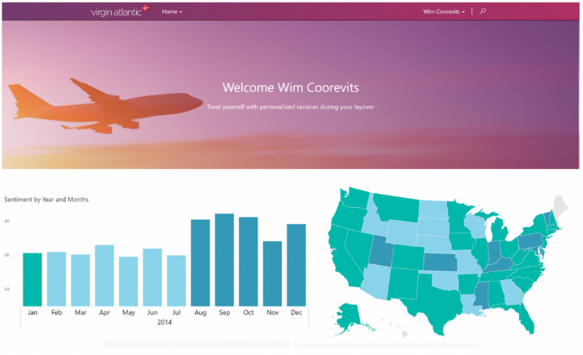

## Power Apps网站

- [**Power Apps Home Page**](https://make.powerapps.com/) - Apps start here, whether you build them from data, a sample app, or a blank screen.

- [**Power Apps Studio**](https://create.powerapps.com/studio/) - Develop your apps further by connecting to data, adding and arranging user interface (UI) elements (known as controls), and building formulas.

- **Power Apps Mobile** - Run your apps on Microsoft Windows, Apple iOS, and Google Android devices.

- [**Power Apps Admin Center**](https://admin.powerplatform.microsoft.com/) - Manage Power Apps environments and other components.

  

- [Power Apps文档](https://docs.microsoft.com/en-us/power-apps/)
- [Power Apps培训](https://docs.microsoft.com/en-us/learn/powerplatform/power-apps)

## Power Apps类型

### Canvas apps

从UI入手，一步一步创建App。

You start by choosing the screen size: tablet or mobile, then you have a blank screen from which to build. 

Below are a couple of examples of a mobile canvas app built by Heathrow Airport.

### Model-driven apps

从数据入手，创建App。

Model-driven apps build from data in Microsoft Dataverse. Power Apps will build you a great looking, fully functional app to act upon and interact with this data. 

Below is an example of a fundraiser donations tracking model-driven app.

#### Microsoft Dataverse

这个东西究竟和数据库有啥区别呢?

### Portals

从宣传入手，创建App。

Portals bring the power of no-code solutions to building externally facing websites. 

The same drag and drop experience you enjoy when building apps is available to build these rich, interactive websites.

## AI

四种AI模型。

- Prediction：预测
- Form processor：从图像中抓取文本。
- Object detector：识别图像中的物体
- Text Classification：文本分类

## Security and Administration

Power Apps has a multitude of security, governance, and reporting capabilities to let you manage Power Apps.

- 运行PowerShell cmdlets进行自动化管理

- Power Automate也能够执行这些自动化任务。

   [Center of Excellence](https://aka.ms/CoEStarterKitDownload)：一个入门套件

## Skills

### 创建Azure SQL database

https://docs.microsoft.com/en-us/azure/azure-sql/database/single-database-create-quickstart?tabs=azure-portal

### Navigate函数

在第一个参数中，指定要显示的屏幕的名称。

在第二个参数中，指定旧屏幕切换为新屏幕的方式：

| Transition 参数                   | 描述                                           | 演示                                               |
| :-------------------------------- | :--------------------------------------------- | :------------------------------------------------- |
| **ScreenTransition.Cover**        | 新屏幕将滑入视图，从右向左移动，覆盖当前屏幕。 |             |
| **ScreenTransition.CoverRight**   | 新屏幕将滑入视图，从左向右移动，覆盖当前屏幕。 |    |
| **ScreenTransition.Fade**         | 当前屏幕淡出以显示新屏幕。                     |              |
| **ScreenTransition.None**（默认） | 新屏幕将快速替换当前屏幕。                     |                |
| **ScreenTransition.UnCover**      | 盖当屏幕将滑出视图，从右向左移动，呈现新屏幕。 |           |
| **ScreenTransition.UnCoverRight** | 盖当屏幕将滑出视图，从左向右移动，呈现新屏幕。 |  |

### Canvas Apps最佳实践

详见https://pahandsonlab.blob.core.windows.net/documents/PowerApps%20canvas%20app%20coding%20standards%20and%20guidelines.pdf

- 命名规则

  - local:  lcl作为前缀。比如：locSuccessMessage
  - global: gbl作为前缀。比如：gblFocusedBorderColor

  - collection: col作为前缀。比如：colMenuItems，colThriveApps

  - 控件命名

      | Control name                          | Abbreviation |
      | ------------------------------------- | ------------ |
      | button                                | btn          |
      | camera control                        | cam          |
      | canvas                                | can          |
      | card                                  | crd          |
      | collection                            | col          |
      | combo box                             | cmb          |
      | dates                                 | dte          |
      | drop down                             | drp          |
      | form                                  | frm          |
      | gallery                               | gal          |
      | group                                 | grp          |
      | header page shape                     | hdr          |
      | html text                             | htm          |
      | icon                                  | ico          |
      | image                                 | img          |
      | label                                 | lbl          |
      | page section shape                    | sec          |
      | shapes (rectangle, circle, and so on) | shp          |
      | table data                            | tbl          |
      | text input                            | txt          |
      | timer                                 | tim          |

- Control usage
  - 避免在UI中引入过多的control，这样会降低性能
  - 避免在Gallery中引入Gallery

- Coding methodology
  - 如果数据很少改变，创建collections。如果数据从不改变，可以引入static data.
  - 重复利用数据源的一些特性来提高性能。比如，对于Dataverse或者关系型数据的时候，使用data source view，而不是一个复杂的查询。

