本文内容来自[Work with Dataverse Web API](https://docs.microsoft.com/en-us/learn/modules/common-data-service-web-api/)。

# Web API介绍

## Web API vs. the Organization Service

和Microsoft Dataverse交互有两种方式：

- web api

- organization service

  需要使用.net framework sdk

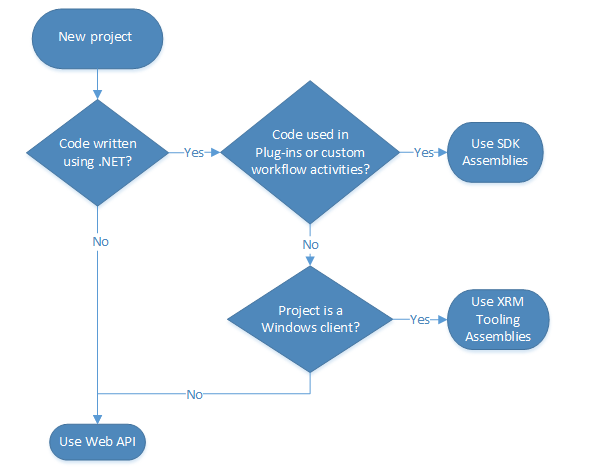

## OData 4.0

Dataverse Web API is implemented as an OData (OASIS Open Data Protocol) service. OData provides the ability to interact with Dataverse data with CRUD operations that are available through standard GET, POST, PATCH, and DELETE HTTP methods

OData 是一种描述如何创建和访问[Restful](https://baike.baidu.com/item/Restful)服务的[OASIS](https://baike.baidu.com/item/OASIS/4235159)标准。该标准由[微软](https://baike.baidu.com/item/微软/124767)发起 [1] ，前三个版本1.0、2.0、3.0都是微软开放标准，遵循微软开放规范承诺书（Microsoft Open Specification Promise）。第四个版本4.0于2014年3月17日在[OASIS](https://baike.baidu.com/item/OASIS/4235159)投票通过成为开放工业标准。

> 在https://www.odata.org/libraries/里面可以看到一些支持链接OData的软件，总体看来，python支持的并不好，毕竟这是微软搞出来的标准。

# 使用OAuth进行认证

## Authentication vs. Authorization

### 认证（Authentication）

认证：向访问方质询合法凭据的措施，提供创建用于标识和访问控制的安全主体的基础。即一个验证用户或者行为的身份的过程。

Microsoft Dataverse使用OAuth 2.0作为认证标准。OAuth 2.0是一个业界标准的授权协议，其定义了四种可以适用于各种应用场景的授权交互模式：授权码模式、应用授信模式、用户授信模式、简化模式。其中，授权码模式被广泛应用于第三方互联网开放平台，通过第三方登录是其最常见应用场景之一，比如使用微信、QQ和淘宝账号进行登录。

Dataverse的认证过程使用的是Azure Active Directory (Azure AD)。

### 授权（Authorization）

授权：授权经过身份验证的安全主体执行某项操作的措施。即一个验证认证用户是否被授权访问资源的过程。Dataverse 授权实在Azure AD tenant level。

## [Azure AD中注册Dataverse apps](https://docs.microsoft.com/en-us/learn/modules/common-data-service-web-api/2-authenticate)

打开[Azure portal](https://portal.azure.com/#view/Microsoft_AAD_RegisteredApps/ApplicationsListBlade)，注册一个app。

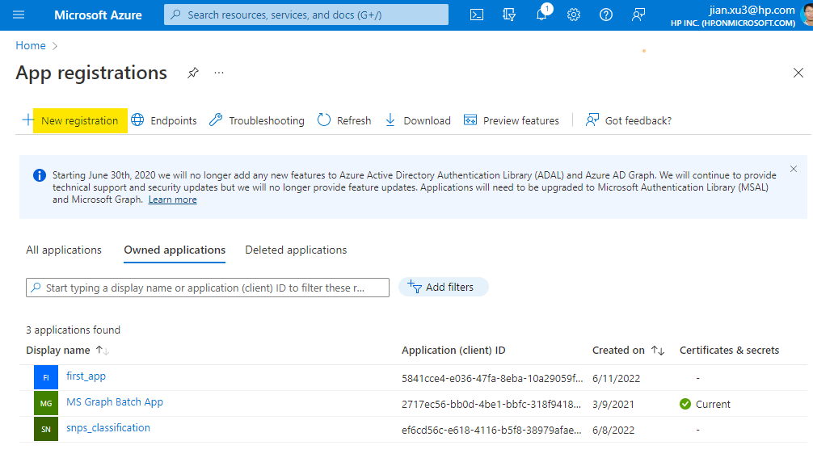

## 使用Web API使用Dataverse

所有对Dataverse的访问都是处于登录用户的上下文中。有两种方式：

- Interactive user
- 使用Server-to-Server(S2S)的Non-interactive user

### 定义API权限

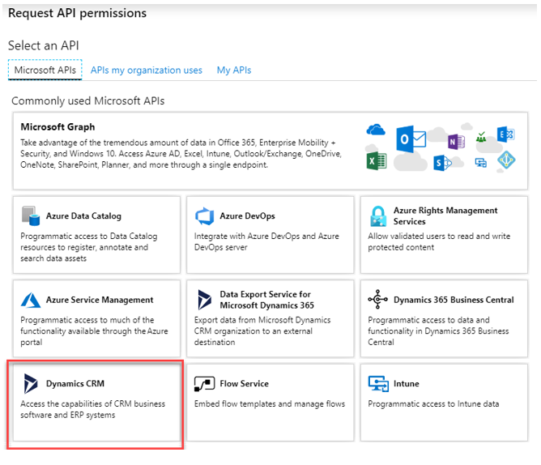

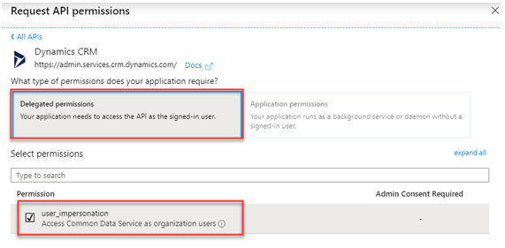

### 定义Dataverse application user

当使用S2S认证，需要定义一个Dataverse application user。打开 [Power Platform admin center](https://admin.powerplatform.microsoft.com/)，创建application user。具体步骤参见[Create an application user](https://docs.microsoft.com/en-us/power-platform/admin/manage-application-users#create-an-application-user)。

## 使用authentication libraries连接

使用Microsoft Authentication Library (MSAL)进行连接，由于是c#代码，所以从略。

# 使用Postman调用Microsoft Dataverse Web API

## 在Azure Active Directory中注册一个app

上个章节中已经有详细步骤

## 得到当前版本的Web API endpoint

打开https://make.powerapps.com/，选择你要设置的Environment，选择**Developer resources** 。

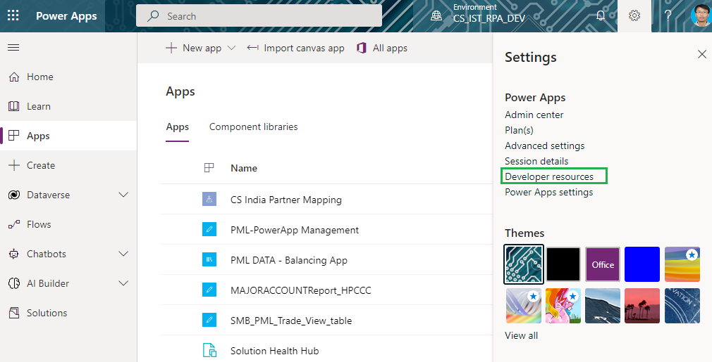

然后把Web API endpoint中的如图部分拷贝下来。

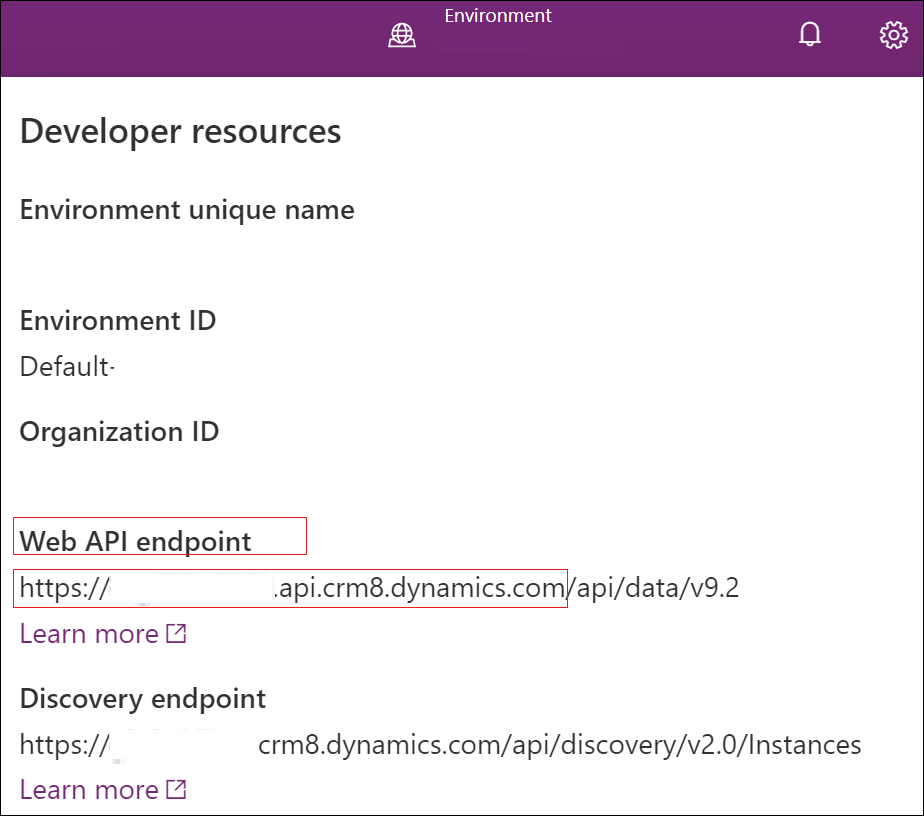

## 设置Postman

创建一个Environment，并在Environment其中创建如下参数。

| Variable  | Initial value                                                |
| :-------- | :----------------------------------------------------------- |
| url       | https://org00b09c74.api.crm.dynamics.com                     |
| clientid  | 51f81489-12ee-4a9e-aaae-a2591f45987d                         |
| version   | 9.2                                                          |
| webapiurl | {{url}}/api/data/v{{version}}/                               |
| callback  | https://callbackurl                                          |
| authurl   | https://login.microsoftonline.com/common/oauth2/authorize?resource={{url}} |

## 产生access token

1.  保证上一步创建的环境被选中。

2. 在GET访问方式后，输入`{{webapiurl}}`。

   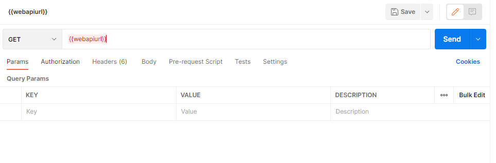

3. 在Authorization中选择OAuth 2.0

   

4. 在Configure New Token里面进行确保如下设置。

   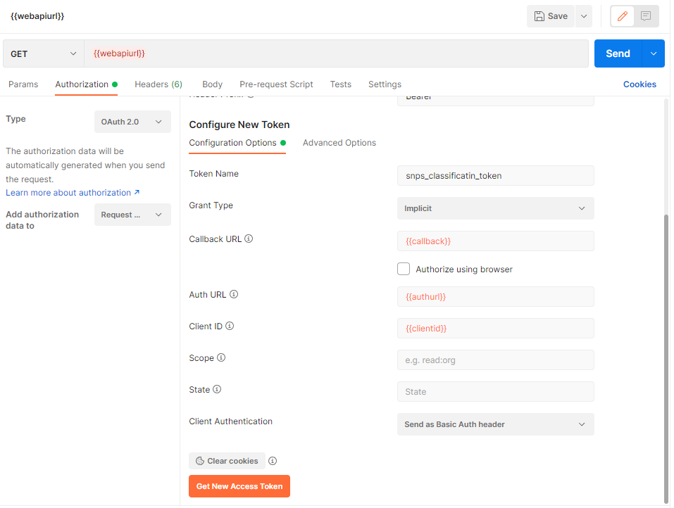

5. 点击上图的`Get New Access Token`进行用户登录。

6. 登录成功后，选择`Use Token`。

> 采用这种方式获取的Token的有效时间只有一个小时。

## 测试连接

点击上图的`Send`按钮发送request。在Body中可以得到如下信息。

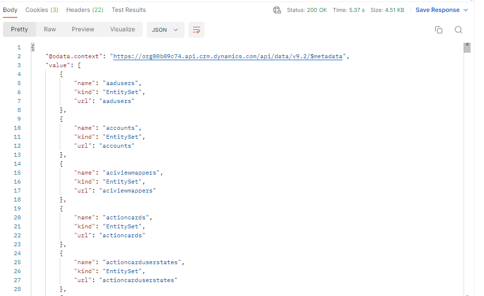

# 使用OData查询数据

详见https://docs.microsoft.com/en-us/learn/modules/common-data-service-web-api/4-odata。

## WhoAmI

request

~~~shell
GET {{webapiurl}}/WhoAmI
~~~

response

~~~json
{
    "@odata.context": "https://org00b09c74.api.crm.dynamics.com/api/data/v9.2/$metadata#Microsoft.Dynamics.CRM.WhoAmIResponse",
    "BusinessUnitId": "49479440-b7cd-ec11-a7b5-0022480a3cb0",
    "UserId": "82278f43-90cf-ec11-a7b5-000d3a3afe62",
    "OrganizationId": "f7888bfb-76bd-41ff-839e-e271f541d352"
}
~~~

## 插入一条记录

request

~~~shell
POST
{
    "name": "Sample Account",
    "creditonhold": false,
    "address1_latitude": 47.639583,
    "description": "This is the description of the sample account",
    "revenue": 5000000,
    "accountcategorycode": 1
}
~~~

response

~~~json

~~~

## 查询Table数据

request

~~~shell
GET {{webapiurl}}/accounts
~~~

response

~~~json
{
    "@odata.context": "https://org00b09c74.api.crm.dynamics.com/api/data/v9.2/$metadata#accounts",
    "value": [
        {
            "@odata.etag": "W/\"2918414\"",
            "territorycode": 1,
            "statecode": 0,
            "address2_shippingmethodcode": 1,
            "accountid": "db361c53-11ea-ec11-bb3d-000d3a37d649",
            "statuscode": 1,
            "accountclassificationcode": 1,
            "donotbulkemail": false,
            "description": "This is the description of the sample account",
            "createdon": "2022-06-12T05:34:28Z",
            "preferredcontactmethodcode": 1,
            "businesstypecode": 1,
            "donotpostalmail": false,
            "_ownerid_value": "82278f43-90cf-ec11-a7b5-000d3a3afe62",
            "donotbulkpostalmail": false,
            "name": "Sample Account",
			...
        }
    ]
}
~~~

## 读取一行记录

request

~~~shell
GET {{webapiurl}}/accounts(db361c53-11ea-ec11-bb3d-000d3a37d649)
~~~

response

~~~json
{
    "@odata.context": "https://org00b09c74.api.crm.dynamics.com/api/data/v9.2/$metadata#accounts/$entity",
    "@odata.etag": "W/\"2918414\"",
    "territorycode": 1,
    "statecode": 0,
    "address2_shippingmethodcode": 1,
    "accountid": "db361c53-11ea-ec11-bb3d-000d3a37d649",
    "statuscode": 1,
    "accountclassificationcode": 1,
    "donotbulkemail": false,
    "description": "This is the description of the sample account",
    "createdon": "2022-06-12T05:34:28Z",
    "preferredcontactmethodcode": 1,
	...
}
~~~

## 删除记录

request

~~~shell
GET {{webapiurl}}/accounts(db361c53-11ea-ec11-bb3d-000d3a37d649)
~~~

response

~~~json
{
    "@odata.context": "https://org00b09c74.api.crm.dynamics.com/api/data/v9.2/$metadata#accounts/$entity",
    "@odata.etag": "W/\"2918414\"",
    "territorycode": 1,
    "statecode": 0,
    "address2_shippingmethodcode": 1,
    "accountid": "db361c53-11ea-ec11-bb3d-000d3a37d649",
    "statuscode": 1,
    "accountclassificationcode": 1,
    "donotbulkemail": false,
    "description": "This is the description of the sample account",
    "createdon": "2022-06-12T05:34:28Z",
    "preferredcontactmethodcode": 1,
	...
}
~~~

# 使用FetchXML查询数据

FetchXML是一种强大的查询语言。

## Example FetchXML query

```xml
<fetch mapping='logical'>   
   <entity name='account'>  
      <attribute name='accountid'/>   
      <attribute name='name'/>   
   </entity>  
</fetch>  
```

## 产生查询的工具

- 在model-driven app中，使用`Advanced Find`中的**Download FetchXML** 。

  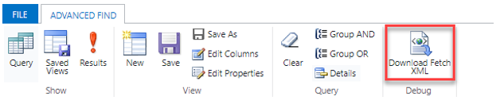

- **FetchXML Builder**

  这个插件可以在Xrm ToolBox使用，看起来功能强大。

# [Web API调用Power Automate actions](https://docs.microsoft.com/en-us/learn/modules/common-data-service-web-api/6-power-automate)

略

# [Use the Web API to impersonate another user](https://docs.microsoft.com/en-us/learn/modules/common-data-service-web-api/7-impersonate)

略

# Track entity data changes with change tracking and the Web API

*change tracking*可以用于同步多个系统的数据。

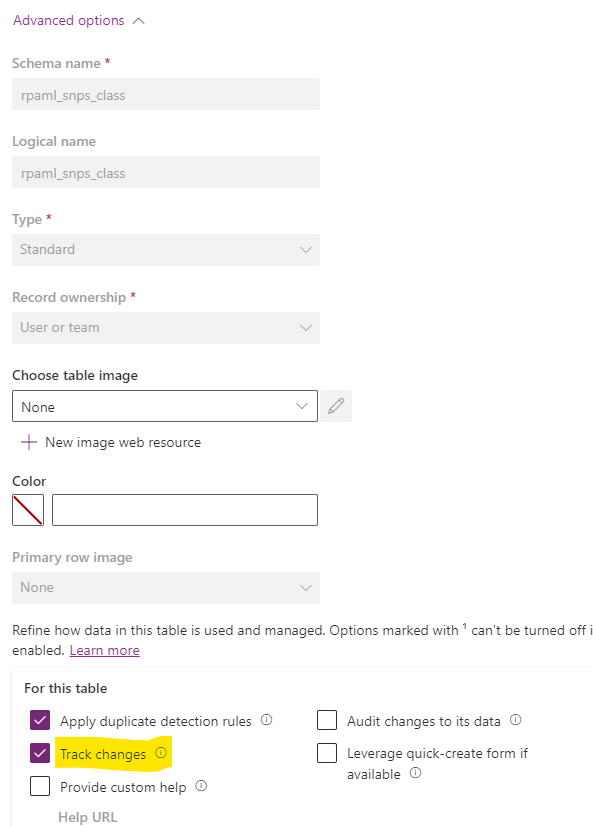

把这个选项激活后，就可以跟踪数据的变化了。

## 获取有变化的记录

1. 第一次请求，Header添加[Prefer: odata.track-changes]()

   ~~~shell
   GET {{webapiurl}}/rpaml_snps_classes?$select=rpaml_class_id,rpaml_classname,%20rpaml_class_en_name HTTP/1.1
   Prefer: odata.track-changes
   Cache-Control: no-cache
   OData-Version: 4.0
   Content-Type: application/json
   ~~~

   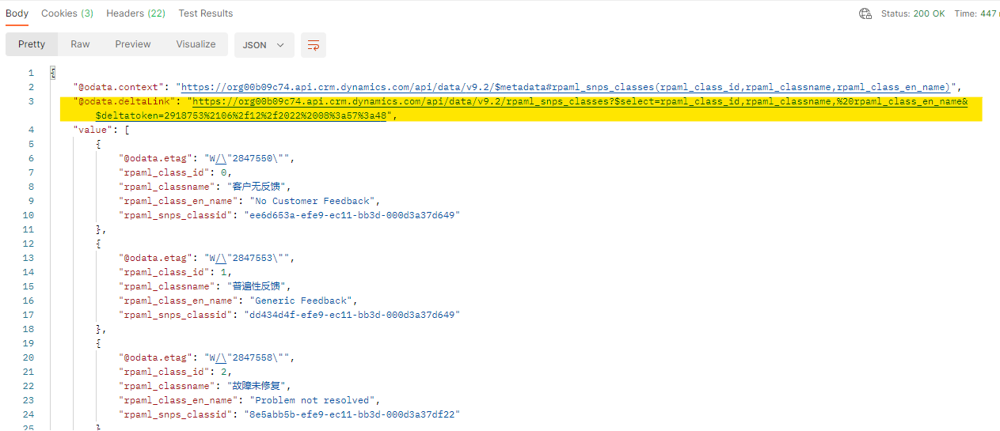

2. 添加一条数据。

   ~~~shell
   POST {{webapiurl}}/rpaml_snps_classes
   {
       "rpaml_class_id": "19",
       "rpaml_classname": "test"
   }
   ~~~

3. 使用上面response中`@odata.deltaLink`进行第二次请求

   ~~~shell
   GET {{webapiurl}}/rpaml_snps_classes?$select=rpaml_class_id,rpaml_classname,%20rpaml_class_en_name&$deltatoken=919042%2108%2f22%2f2017%2008%3a10%3a44
   ~~~

   这是就可以看到刚才上面添加的那条数据了。

   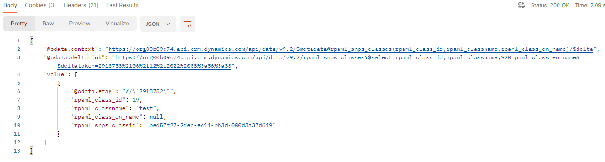

## 获取有变化的记录数

~~~shell
{{webapiurl}}/rpaml_snps_classes/$count?$deltatoken=2918751%2106%2f12%2f2022%2008%3a51%3a40
~~~

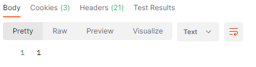

# 参考

1. [Get started using Postman with Microsoft Dataverse Web API](https://www.youtube.com/watch?v=HpUj11yU0fY): 里面非常清晰的描述了使用postman连接Microsoft Detaverse的方法。采用这种方法，不不需要注册Azure Active Directory app。只是获取的token的有效时间只有一个小时，一个小时后就，就需要重新登录获取新的token。