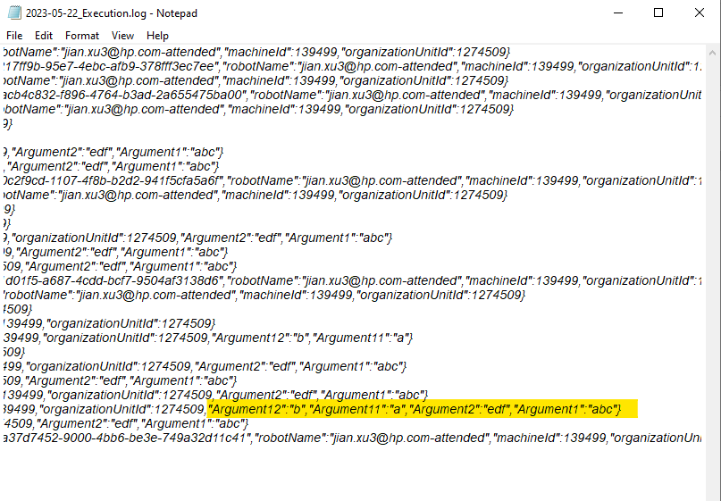
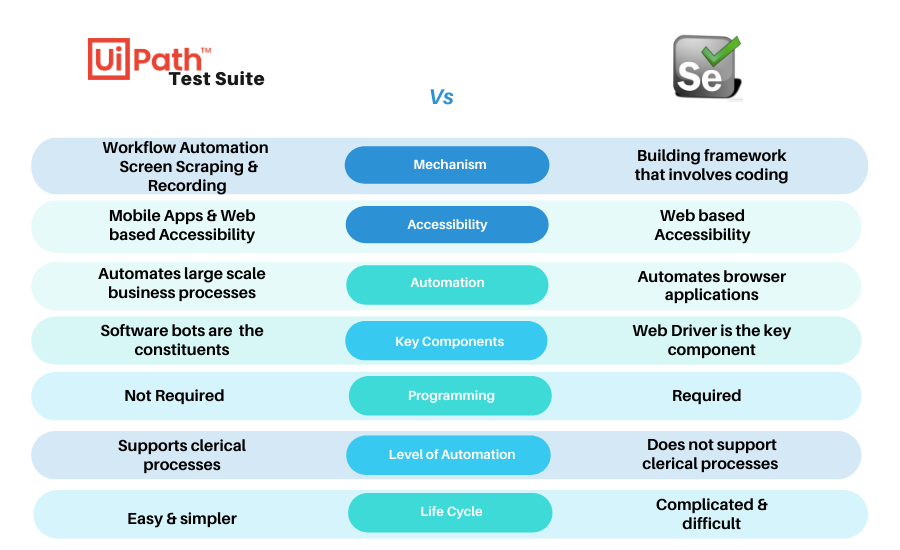
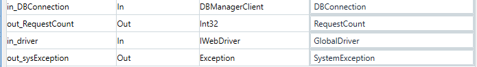
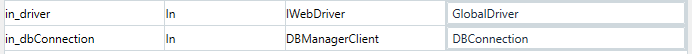
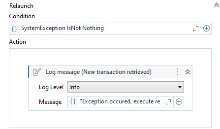
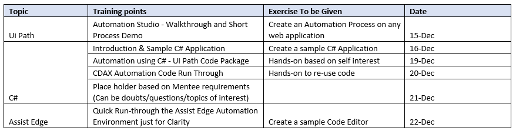

##  Skills

### UiPath Enterprise trial

**Let's Get Started:**   

1. [Download UiPath Orchestrator](https://protect-us.mimecast.com/s/LKjhCADo5oTGNrxjLT8tfsC?domain=link.uipath.com) by following the [Orchestrator guide](https://protect-us.mimecast.com/s/WmStCBBp5puz7PxvpfNRO41?domain=link.uipath.com). 
2. Activate using trial code: **6498-2082-7119-9450**. 
3. [Install UiPath Studio 64-bit](https://protect-us.mimecast.com/s/Ti55CDkr5rfD5j7XNuZB_0s?domain=link.uipath.com) or [32-bit](https://protect-us.mimecast.com/s/oBKnCERv5vsk31wBVuZK5UK?domain=link.uipath.com). 
4. See how to build and publish your first automation with [Studio](https://protect-us.mimecast.com/s/DXOnCG6xjxh21WrwKU0dpb9?domain=link.uipath.com) or [StudioX](https://protect-us.mimecast.com/s/clbKCJ6AmAhgqpkx3Fp7pea?domain=link.uipath.com) and create [automated tests](https://protect-us.mimecast.com/s/txYfCKrBnBFZ28QLzIn4lXz?domain=link.uipath.com). If you are interested in communicating between a remote application or desktop such as Citrix Virtual Apps and the dedicated UiPath extension, Remote Runtime installer is also available [here](https://protect-us.mimecast.com/s/Pyt_CL9DoDClRN0Lyt1flXj?domain=link.uipath.com). [Learn more](https://protect-us.mimecast.com/s/O5gPCM8gpgIvqxpjMIRqLni?domain=link.uipath.com). 
5. [Install UiPath Action Center](https://protect-us.mimecast.com/s/gD4zCNkjqjfw0VYoDs94urR?domain=link.uipath.com) and follow the [setup instructions](https://protect-us.mimecast.com/s/BP_WCOYkrkiEp5D3zIJRKFx?domain=link.uipath.com). 
6. [Install UiPath Insights](https://protect-us.mimecast.com/s/QQ4xCPNlvlcJKvBQ8cVJs0Q?domain=link.uipath.com) by following the [user guide](https://protect-us.mimecast.com/s/81nqCQWmwmFJkBn7McKJU8X?domain=link.uipath.com). 
7. Install [UiPath Test Manager](https://protect-us.mimecast.com/s/9UAzCR6nxnhyvnwNjI4TSpk?domain=link.uipath.com) and follow the [user guide](https://protect-us.mimecast.com/s/YFdlCVOrBrczx0VMNfA2xrp?domain=link.uipath.com) to leverage the full [Test Suite capabilities](https://protect-us.mimecast.com/s/CsejCW6vDvhN5z10RHP3sX4?domain=link.uipath.com). 
8. [Download the AI Center license file](https://protect-us.mimecast.com/s/mp_vCXDwEwTkXBlmVu8NUGm?domain=link.uipath.com) and follow the [user guide](https://protect-us.mimecast.com/s/4FtcCYExGxujLkK5EuWGM1k?domain=link.uipath.com) to proceed with the installation. 

### Activity: Add Log Fields

1. 在Execute Log文件增加字段。

   

2. 增加的字段的有效范围在当前Workflow（及其调用的子Workflow）范围内生效。

顺便提一句，Write Line和Log Message的区别在于，前者是Track级别的，后者默认是Log级别的。

### RPA vs. Selenium

**RPA:** Business automation technology that helps in automating the respective tasks, which are time consuming and boring. They are capable to automates the processes without human intervention. It automates the processes without human intervention. Software and bots are used to mimic human activities and perform the desired task. Commonly it is used to automate the backend processes. 

**Selenium:** Selenium is an automation tool that is used to automate the browser. It is a framework that is used for testing web applications. It is an umbrella project that can automate the web browser. It supports different types of web browsers such as Firefox, Chrome, etc. Selenium is available for Python, JavaScript, and few other languages. Selenium when used with Appium also supports testing for mobile devices. 

| Based On            | RPA                                                          | SELENIUM                                                     |
| :------------------ | :----------------------------------------------------------- | :----------------------------------------------------------- |
| Types of Automation | ;Robotic Process automation supports Flexible Automation     | Selenium supports programmable automation                    |
| Cost                | If we want to build a project in RPA we have to purchase its tools. So RPA is costly compare to selenium | Selenium is completely open-source so it’s free.             |
| Dependency          | RPA is platform-independent. It can be run on mobile, desktop, web-applications | Selenium is used to test only web applications. o It can’t be run on a desktop or mobile application. |
| Component Used      | RPA uses ROBOTS to complete any task                         | Selenium used WEB-DERIVERS to automate any task              |
| Level of Automation | RPA performs all clerical processes like data entry, Banking calculation | Selenium automates only functional, regression and performance testing |
| Will Automate       | Business Process                                             | Web applications                                             |
| Coding-Knowledge    | Minimum coding knowledge is required                         | Fundamental knowledge is required                            |
| Use-Case            | Run on the backend of a process                              | Can test the current webpage                                 |
| Life-Cycle          | Simpler Life Cycle.                                          | Complicated Life Cycle.                                      |

参见

- [Difference between RPA and Selenium](https://www.geeksforgeeks.org/difference-between-rpa-and-selenium/)
- [为什么相比Selenium更喜欢UiPath测试套件?](https://jiagoushi.pro/book/export/html/1323)

## 命名规范

参见 [UiPath Automation Best Practice Guide](https://html.cdn.contentraven.com/crcloud/crscorm/uploads/uipath_lms_11218/encryptedfile/507609/v5.0/scormcontent/assets/fmv0tzZKGG0OgC2-_a9nxERpOkxXHmQ0--UiPath_Automation_Best_Practice_Guide.pdf)

### Variables 

- Upper Camel Case

  for example FirstName, LastName, TransactionNumber, FilePath etc.

- 6 and 20 characters long

- Boolean variables names

  For example, ApplicationExists, IsRed, IsFound, HasRows, etc. Always use positive names. Negatives names (for example, NotFound) should be avoided.

- Datatable variable names should have the suffix Dt, for example: ItemsDt, ExtractedRowsDt.

### Arguments

- Upper Camel Case

  for  example in_DefaultTimeout, in_FileName, out_TextResult, io_RetryNumber.

- less than 30 characters

- avoid having more than 20 arguments in a  workflow

### Activities

-  Rename all the activities in a project (including Log Message, Assign, If, Sequence). **Do not leave the default name for activities.**

### Workflow files 

-  Upper Camel Case
- Except for Main, all workflow names should contain the verb describing what the  workflow does, for example GetTransactionData.xaml, ProcessTransa tion.xaml, TakeScreenshot.xaml.
- A workflow file starts with the prefix containing the application name. For example,  when working with SAP: SAP_Login.xaml, SAP_ExtractClientReport.
- When using a test framework - for the Test_Framework files – Use the prefix Test_ for a  workflow file that runs tests. Place these files in the Test_Framework folder

### Projects and sub-projects

-  Upper Camel Case naming
- Use a consistent naming convention for projects and sub-projects. For example, have a prefix for the department the process belongs to, an ID and the name. For example:
  - FIN_001_DataCollection (where FIN is the ID for Finance Department, 001 is the ID and DataCollection is the process name)
  -  RPA005_InvoiceProcessing (if the department name/ID is not necessary)

### Orchestrator

#### Robots

- Development machines: DEV_[Name of developer in upper Camel Case]. For example:  DEV_JohnDoe
-  Test/QA machines: QA_\[Machine Name\]\[Robot Number\]
-  Prod machines: \[Machine Name\]\[Robot Number\]

#### Environments

An environment links together multiple robots that are running the same process. Hence,  the naming will include a mix of robots and projects:

- Use prefix DEV_ or TEST_ or PROD_.
- Group by department using a prefix. For example, FIN_, AR_ etc.

#### Assets

- for usual assets: \[Department\]\_\[Project code\]\_\[Asset Name\]. E.g. AR_CA_MappingTableURL
- for credentials: C\_\[expiration period]\_\[Department\]\_\[Project code\]\_\[Asset Name\]. E.g. C_180_AP_SC_SapCredentials

#### Queues

- [Department]\_[Project code]\_[Queue Name] E.g. AR_CA_ExcelItems

### Configurations

## RPA Tools, C# mentoring program

### 2023-01-13

- Common Functionality
  - Application: C# Project
    - DB
    - Complex Business Logic
    - cdax
  - UI: UiPath preferred

- Enterprise Template

  - UiPath version update frequently

  - .Net Frame Version

  - Compatibility with  old projects

  - Many operations with DB

    - It seems that Queue is better， but is it robust?

      AE: RabbitMQ has some issues.

- Test Suite

### 2023-01-10

- why do we use Seleumium? 

  It seems that the Uipath modern experience is very powerful.

  - Anchor + Target
  - Unified  Target
    - **Selectors**
    - **Fuzzy Selectors**
    - **Images**

- GetTransactionData.xaml的参数比起默认多了个四个。

  

- Process.xmal增加两个参数

  

- 从Get Transaction Data到Initialization增加了一个Relaunch

- 如何添加Executor到Uipath
- System.Activities.CodeActivity是微软开发的吗
- 目前采用数据库的方式如何并发呢？

### 2022-12-15

As we discussed on the Kick-off meeting, this will be the plan.

| **Mentor** | **Mentee** |
| ---------- | ---------- |
| Aravind    | Mrityunjay |
| Axata      | Arshad     |
| Evan       | Michael    |

 

Training points :

Requesting Mentors to get in touch with the Mentees, on a daily basis and get their doubts cleared to enable them on the automation platform. Mentees can also get their doubts cleared on this connect.

 

Priority is being given to UI Path since that is the way going forward. As a parallel activity, the mentees can go through this training plan - [UiPath RPA Associate Certification Training](https://academy.uipath.com/learning-plans/uipath-rpa-associate-certification-training) as requested earlier. This is the best training material that one has to offer for UI Path. Mentors can also track this on their daily connect. I will also look for any C# trainings like this and get back.

 

The plan is Enable Arshad, Mrit & Michael at least to some extent on the automation platform before we part into the shutdown.

### 2022-12-13

[UiPath RPA Associate Certification Training](https://academy.uipath.com/learning-plans/uipath-rpa-associate-certification-training)

Please get accustomed to the UI Path environment as this will be the tool that we are going to use going forward. Try to complete two modules a day from this training. 

As discussed on the meeting, Mentors will connect individually with the mentees to track progress them & enable them to build proficiency.

**UI Path Studio :**

Please download UiPath Cloud Studio https://download.uipath.com/UiPathStudioCloud.msi

UiPath Assistant à Click **Sign In** à Connection Type should be **Service URL** à Service URL is https://cloud.uipath.com/HPInc/Development/orchestrator_

Note : Please Sign out from any existing instances after exporting the Package, before following above steps.

HP UiPath Portal

https://cloud.uipath.com/hpinc/portal_/home