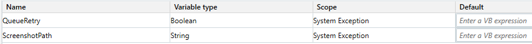

# Main

- Arguments

  

- Variables

  

~~~mermaid
flowchart TB
start((start)) --> Initialization
Initialization -->|Successful|GetTransactionData[Get Transaction Data]
Initialization -->|"System Exception  (failed initialization)"|EndProcess[End Process]
GetTransactionData --> |No Data|EndProcess
GetTransactionData --> |New Transaction|ProcessTransaction[Process Transaction]
ProcessTransaction --> |System Exception|Initialization
ProcessTransaction --> |Success or Business Exception|GetTransactionData

~~~

Here are transitions.

- Initialization

  - Successful: SystemException is Nothing

  - System Exception (failed initialization): SystemException isNot Nothing

- Get Transaction Data

  - No Data: TransactionItem IsNot Nothing

  - New Transaction: TransactionItem IsNot Nothing

- Process Transaction
  - Success: SystemException Is Nothing And BusinessException is Nothing
  - Business Exception: BusinessException IsNot Nothing
  - System Exception: SystemException IsNot Nothing

## Initialization

- If there is any exception in state, assign it to variable SystemException.

- If maxConsecutiveSystemExceptions exceeded

  ~~~vb
  Cint(Config("MaxConsecutiveSystemExceptions"))>0 AndAlso ConsecutiveSystemExceptions>=Cint(Config("MaxConsecutiveSystemExceptions"))
  ~~~

  

~~~mermaid
flowchart LR
ConfigIsNothing{Config  is Nothing} -->|True|InitAllSettings[Invoke InitAllSettings]
InitAllSettings --> SetOrchestratorQueueName[Assign OrchestratorQueueName, OrchestratorQueueFolder]
SetOrchestratorQueueName --> KillAllProcesses[Invoke KillAllProcesses]
KillAllProcesses --> AddLogFields["Add Log Fields (BusinessProcessName)"]
AddLogFields --> maxConsecutive{If   maxConsecutive SystemExceptions   exceeded}
ConfigIsNothing -->|False|maxConsecutive 
maxConsecutive -->|True|Exception[throw Exception]
maxConsecutive -->|False|InitiAllApplications[Invoke InitiAllApplications]
~~~

### InitAllSettings

- Arguments

- Variables: empty

### InitiAllApplications

- Arguments

  

- Variables: empty

## Get Transaction Data

~~~mermaid
flowchart LR
CheckStopSignal{Check Stop Signal} -->|True|AssignTransactionItem[Assign Nothing to  variable TransactionItem]
CheckStopSignal -->|False|GetTransactionData[Invoke GetTransactionData]
subgraph Retry["Try"]
GetTransactionData
end

GetTransactionData --> CatchException{Catch Exception}
CatchException -->|True|AssignTransactionItem
CatchException -->|False|end1((end))

~~~

### GetTransactionData

- Arguments

- Variables: empty

  

~~~mermaid
flowchart LR
subgraph Retry["Retry - RetryNumberGetTransactionItem "]
Gettransactionitem[Get transaction item] 
end
Gettransactionitem --> out_TransactionItem{out_TransactionItem  isNot Nothing} 
out_TransactionItem -->|True|Assign1[out_TransactionID=now.ToString out_TransactionField1=string.Empty out_TransactionField2=string.Empty]
~~~

## Process Transaction

~~~mermaid
flowchart LR
subgraph Try["Try"]
direction TB
Assign1[Assign Nothing to  BusinessException] --> Process[Invoke Process]
Process 
end
Process --> CatchBusiessRuleException{Catch  BusiessRuleException}
CatchBusiessRuleException -->|"True BusinessRuleException"|AssignBusiessRuleException[Assign  BusiessException]
AssignBusiessRuleException --> SetTransactionStatus[Invoke SetTransactionStatus]
CatchBusiessRuleException -->|False|CatchException{Catch Exception}
CatchException -->|"True  Exception"|AssignException[Assign SystemException]
AssignException --> SetTransactionStatus
CatchException -->|"False  Success"|SetTransactionStatus

~~~

### Process

- Arguments

  

- Variables:  empty

### SetTransactionStatus

- Arguments： call it 3 times

  - Success

    

  - BusinessException

    

  - SystemException

    

- Variables

  

- Issuccessful

  ~~~vbscript
  in_BusinessException is Nothing and in_SystemException is Nothing
  ~~~

- Is Business Exception

  ~~~vbscript
  in_BusinessException isnot Nothing
  ~~~

- If TransactionItem is a QueueItem

  ~~~vbscript
  in_TransactionItem isNot Nothing AndAlso (in_TransactionItem.GetType is GetType(Uipath.Core.QueueItem))
  ~~~

- Omit `Add transactionlog fields (Success)` before `Log Message (Success)`.

- Omit `Remove transactionlog fields (Success)` after `Log Message (Success)`.

- Omit `Add transactionlog fields (Business Exception)` before `Log Message (Business Exception)`.

- Omit `Remove transactionlog fields (Business Exception)` before `Log Message (Business Exception)`.

  

~~~mermaid
flowchart LR
Issuccessful{Is successful} -->|"True"|TransactionItem{If TransactionItem is a QueueItem}
    TransactionItem --> |True|Settransactionstatus["Set transaction status (Successful)"]
    TransactionItem --> |False|LogMessage["Log Message (Success)"]
    Settransactionstatus --> LogMessage
Issuccessful -->|False|IsBusinessException{Is Business Exception}    
    IsBusinessException -->|"True"|TransactionItem1{If TransactionItem  is a QueueItem}
        TransactionItem1 --> |True|Settransactionstatus1["Set transaction status  (Business Exception status)"]
        TransactionItem1 --> |False|LogMessage1["Log Message (Business Exception)"]
        Settransactionstatus1 --> LogMessage1
    LogMessage --> Assign3[io_TransactionNumber++ io_RetryNumber = 0 io_ConsecutiveSystemExceptions = 0]
    LogMessage1 --> Assign3
    IsBusinessException -->|"False"|SystemException[System Exception]

~~~
#### System Exception

- QueueRetry

    ~~~vbscript
    in_TransactionItem isNot Nothing AndAlso (in_TransactionItem.GetType is GetType(UiPath.Core.QueueItem))
    ~~~

- Omit `Add transaction log fields (System Exception)` before `Increment consecutive exceptions counter`.

- Omit  `Remove transaction log fields (System Exception)` after  `Invoke RetryCurrentTransaction`.

- When there is an exception in the following 2 try scope, it only prints the warning information instead of throwing it.

~~~mermaid
flowchart LR
subgraph Try2["Try"]
TakeScreenshot[Invoke TakeScreenshot]
end   
TakeScreenshot --> QueueRetry{QueueRetry?}
    QueueRetry --> |True|Settransactionstatus2["Set transaction status (System Exception)"]
        subgraph Try["Retry - RetryNumberSetTransactionStatus"]
            direction TB
            Settransactionstatus2 --> Assignio_RetryNumber[Assign in_TransactionItem.RetryNo to io_RetryNumber]
        end
        Assignio_RetryNumber --> io_ConsecutiveSystemExceptions[io_ConsecutiveSystemExceptions++]  
        io_ConsecutiveSystemExceptions --> InvokeRetryCurrentTransaction[Invoke  RetryCurrentTransaction] 
        subgraph Try1["Try"]
        CloseAllApplications[Invoke CloseAllApplications]
        end        
        InvokeRetryCurrentTransaction --> CloseAllApplications      
    QueueRetry --> |False|io_ConsecutiveSystemExceptions

~~~

#### TakeScreenshot

- Arguments

  

- Variables

  Empty

Default Screenshot Path:

~~~
Path.Combline(in_Config("ExScreenshotsFolderPath").ToString, "ExceptionScreenshot_"+Now.ToString("yyMMdd.hhmmss")+".png")
~~~

#### RetryCurrentTransaction

- Arguments

  

- Variables: Empty

- Retry transaction?

  ~~~vb
  Convert.ToInt32(in_Config("MaxRetryNumber"))>0
  ~~~

- Max retries reached?

  ~~~vb
  io_RetryNumber >= Convert.ToInt32(in_Config("MaxRetryNumber"))
  ~~~

- Use Orchestrator's retry?

  ~~~vb
  in_QueueRetry
  ~~~

~~~mermaid
flowchart LR
Retrytransaction{Retry  transaction?} --> |Yes|Maxretriesreached{Max retries  reached?}
	Maxretriesreached --> |Yes|LogMessageMaxretriesreached["Log message  (Max retries reached)"]
		LogMessageMaxretriesreached --> io_RetryNumber[io_RetryNumber=0]
		io_RetryNumber --> io_TransactionNumber[io_TransactionNumber++]
	Maxretriesreached --> |No|LogMessageRetry["Log message  (Retry)"]
		LogMessageRetry --> UseOrchestrator{Use Orchestrator's retry?} 
			UseOrchestrator --> |Yes|io_TransactionNumber
			UseOrchestrator --> |No|io_RetryNumber1[io_RetryNumber++]
Retrytransaction -->|No|LogMessageNoRetry["Log message  (No retry)"]
    LogMessageNoRetry --> io_TransactionNumber
~~~

## End Process

~~~mermaid
flowchart LR
subgraph Try["Try"]
CloseAllApplications[Invoke CloseAllApplications]
end

CloseAllApplications --> CatchException{Catch Exception}
CatchException -->|True|KillAllProcesses[Invoke KillAllProcesses]
CatchException -->|False|end1((end))
~~~

### CloseAllApplications

- Arguments： Empty
- Variables: Empty

### KillAllProcesses

- Arguments： Empty
- Variables: Empty
