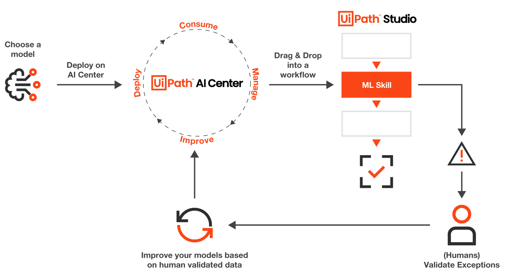
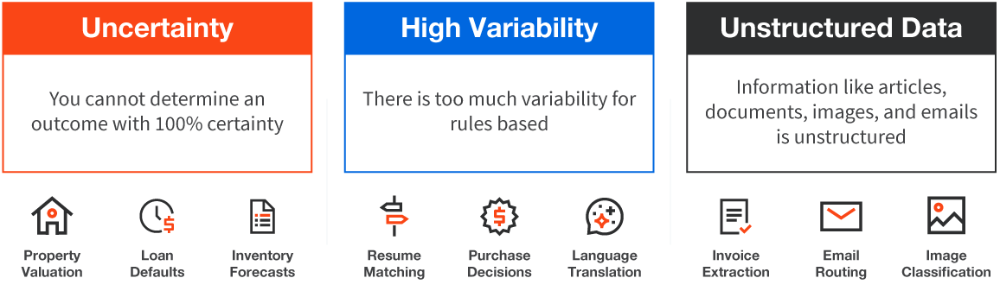
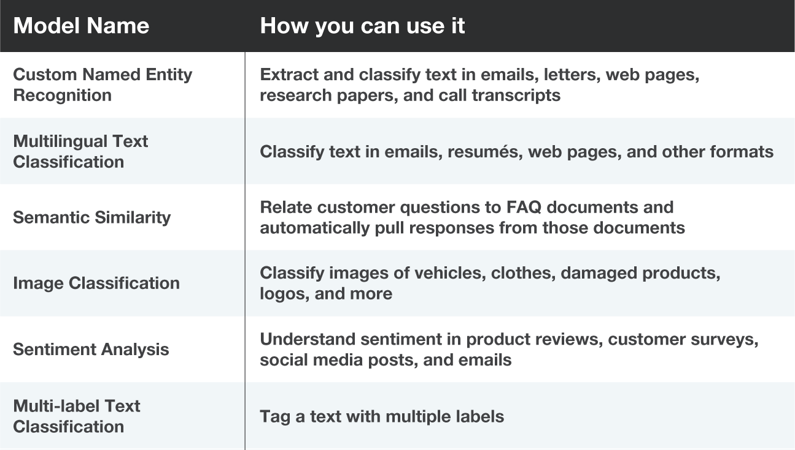
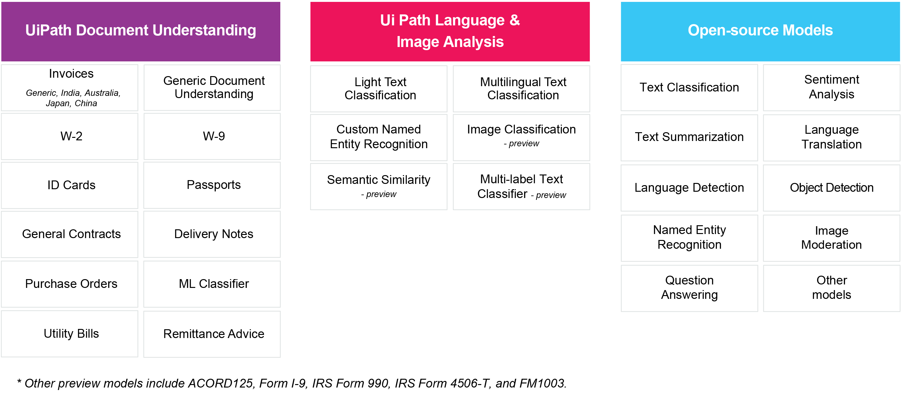
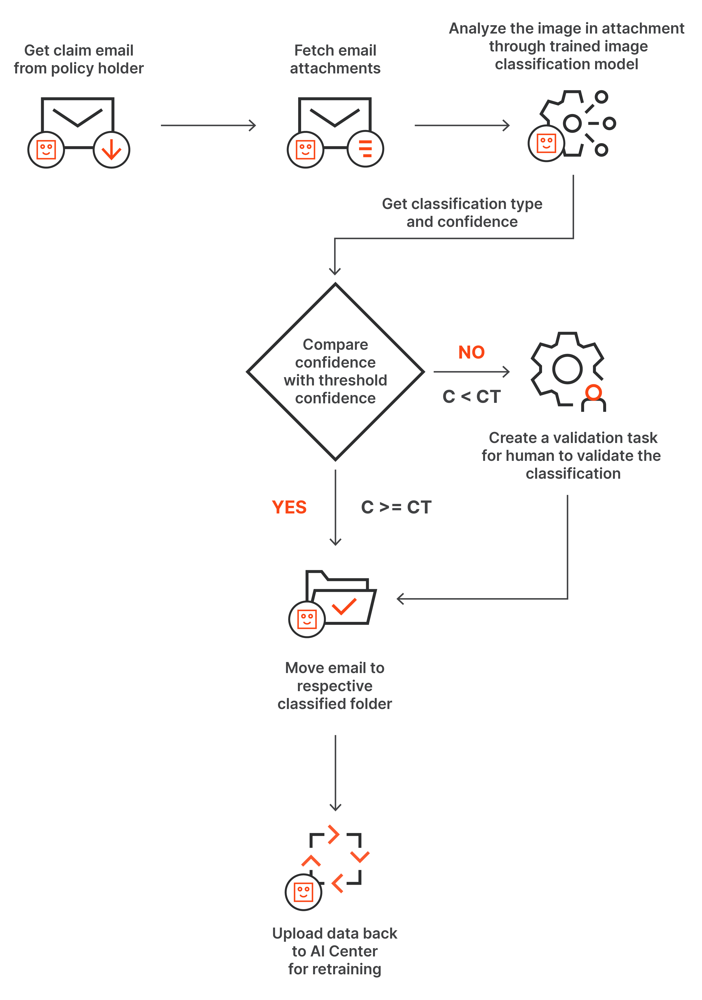
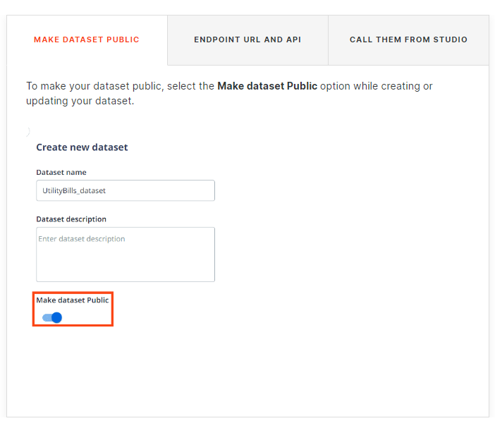

AI Center的详细文档参考 https://docs.uipath.com/ai-center/automation-cloud/latest/user-guide/about-ai-center

# [UiPath AI Center Overview](https://academy.uipath.com/learningpath-viewer/7784/1/497630/3)

## **Prerequisites**

### Access to AI Center

To experience the full features of AI Center and follow along the demos in this course, you need to install AI Center on-premises or access it through UiPath Automation Cloud, through **an Enterprise plan**. If you don't have such a plan, you can start an Enterprise Trial right now.

## **What Is AI Center?**

## **Deployment and Installation Options**

- In Cloud Availability
- On-premises Air-gapped：本地离线。适用于一些权限要求很高的环境。
- On-Premises Online：本地在线

- Hybrid Mode (Cloud AI Center + Orchestrator on-premise) : 混合模式
  - AI Center is available as a service hosted in UiPath cloud
  - however, the users don't need to move their existing on-premises installation of Orchestrator. 

- Automation Suite

  The Automation Suite installer enables you to install all your server-side products in a single deployment. 

## **Identifying Use Cases**

### **In which scenarios can AI Center be used?** 

### **Applications of the Out-of-the-Box Packages**

提供了over 25 pre-built models

## [**An End-to-End Preview of AI Center**](https://academy.uipath.com/learningpath-viewer/7784/1/497630/3)

视频里介绍了一个例子，非常不错。

## **Projects**

项目的权限有两个Level：

- Project
- Tenant

能够定义具体默认对某个项目权限吗？

## **Datasets**

- **How to make dataset public?** 

  

## **Data Labeling**

