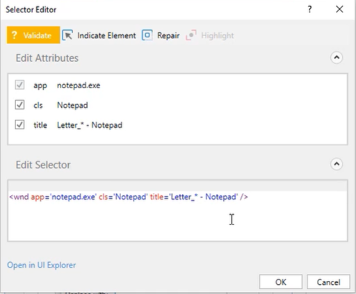
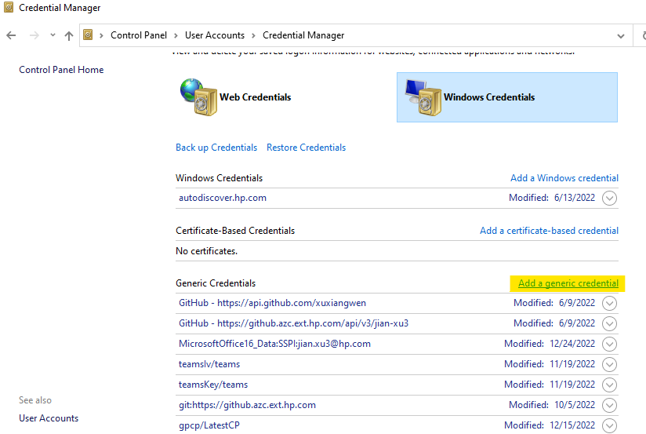
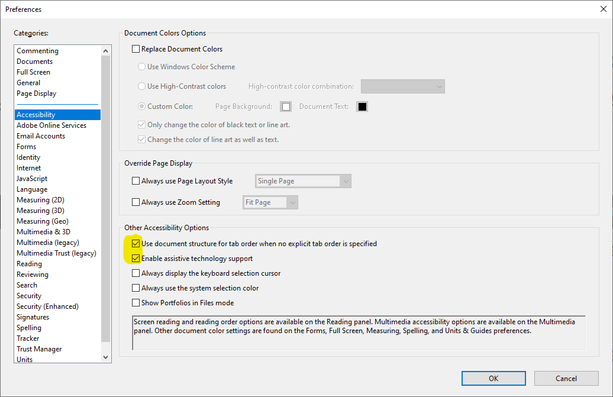

# [UiPath RPA Associate Certification Training](https://academy.uipath.com/learning-plans/uipath-rpa-associate-certification-training)

# UiPath Platform概览

参见[The UiPath Platform](https://html.cdn.contentraven.com/crcloud/crscorm/uploads/uipath_lms_11218/encryptedfile/507141/v3.0/scormcontent/assets/x3OCuNT8nnPjqtw7_PM9SEODDLsvHIwYz-The-UiPath-Platform.pdf)。

## UiPath产品概述

### UiPath Automation Hub

UiPath Automation Hub 是一款协作式流程识别、自动化管道管理和流程存储库工具。其目标是通过构建 RPA 感兴趣社区，加快在整个组织中采用 RPA。

### UiPath Task Capture

Task Capture是一个流程发现工具，可帮助您深入了解自动化概念，让您能够通过共享工作详情快速捕获、增强和加速自动化。

Task Capture 为您提供 2 个用于创建文档的选项：

- 通过从头开始构建流程图，然后捕获流程各部分的操作；
- 通过在执行操作时记录操作，并自动生成全面的工作流图表，包括每个步骤的详细信息。

请记住，该工具会在用户每次点击鼠标和使用键盘输入时截取屏幕截图，并收集有关流程统计信息（执行时间、操作次数、文本输入等）的智能数据。您可以编辑每个屏幕截图并为其添加注释，还可以添加每个步骤的信息。

可以使用这个参见 https://docs.uipath.com/zh-CN/task-capture/standalone/2021.10/user-guide/introduction，里面有Demo。

其他产品以后再添加。

## Robot类型

其中Attended Robot一般用于需要人机互动的流程，手动触发；Unattended Robot则常装于VM上，在Orchestrator上设置固定启动时间定点触发。

| Attended Robots                                  | Unattended Robots                                    |
| ------------------------------------------------ | ---------------------------------------------------- |
| 帮助个人用户完成小型的重复性任务                 | 无需人工干预即可运行漫长流程或自动化                 |
| 流程由用户或特定用户事件触发（例如收到调用请求） | 不依赖用户触发流程，因为它们由 Orchestrator 控制     |
| 在用户执行日常任务的同一台计算机上               | 连接到 Orchestrator 的任何计算机，通常使用专用计算机 |

### Attended Robots

### Unattended Robots

### **Automation Cloud Robots**

Automation Cloud Robots (ACRs) are SaaS robots hosted in the UiPath Automation Cloud that let you quickly run automations without building or managing your own unattended Robot infrastructure. 

- **VM Automation Cloud Robots**. 

  Access to a fully customizable Windows virtual machine and set up UiPath Robots to run any job in a matter of minutes.  

- **Serverless Automation Cloud Robots (Linux based cloud robots)**.

  Run background, cross-platform projects easily without worrying about infrastructure setup. So, you're able to provision, manage and scale these robots from Automation Cloud. In other words, UiPath takes care of everything—infrastructure, and robots. 

# [第一个Process](https://academy.uipath.com/learningpath-viewer/8279/1/507609/2)

Process功能如下：

1. 读取Excel文件中的Company Code。

2. 在一个页面（https://acme-test.uipath.com/first-automation）上查询该Company Code对应Discount。

   如果折扣没有获取到，有异常处理程序。

3. 然后使用Discount更新Excel文件。

4. 把更新后的Excel文件发出。

项目详见C:\xujian\eipi10\xuxiangwen.github.io\_notes\60-rpa\uipath\academy\processes\associate_certification\BuildYourFirstProcess\BuildYourFirstProcess

## 选择Compatibility

> 创建Process的时候，可以选择不同的Compatibility
>
> 
>
> - WIndows
>
>   Uses .NET 6 (in [Studio](https://docs.uipath.com/studio/docs/introduction) 2021.10.6 and later versions) or .NET 5 (in [Studio](https://docs.uipath.com/studio/docs/introduction) 2021.10 versions prior to 2021.10.6) with Windows support.
>
> - Cross-platform
>
>   Uses .NET 6 (in [Studio](https://docs.uipath.com/studio/docs/introduction) 2021.10.6 and later versions) or .NET 5 (in [Studio](https://docs.uipath.com/studio/docs/introduction) 2021.10 versions prior to 2021.10.6) with cross-platform support. You can execute in Linux or Mac with the chrome based automation.
>
> - Windows - Legacy 
>
>   Uses .NET Framework 4.6.1. the compatibility used in releases prior to 2021.10

## Automation实现的一般步骤

- Capturing the 'as-is' and 'to-be' process step

  Usually, in an automation project implementation, the **Business Analyst** is the one who captures all the '**as-is**' and '**to-be**' process steps and any other documented details from the subject matter experts (**SME**) and the business team.

- Documenting the process steps

  Afterwards, the process steps are thoroughly documented within the Process Definition Document (PDD) and validated with the Solution Architect. 

- Signing-off the PDD

  It is the **Project Manager**'s responsibility to **obtain sign-off on the documented PDD** from the business team.

- Designing the solution

  Once the business requirements of a process are finalized, the Solution Design stage of the implementation process begins. During this stage, the Solution Architect designs a future state flow and maps out the various modules to be developed to complete the automation.

- Developing the solution

  ext, the **Automation Developers** create the modules outlined in the design whiteboard using the PDD and Solution Design Document (SDD) as references.

### [UiPath Automation Best Practice Guide](https://html.cdn.contentraven.com/crcloud/crscorm/uploads/uipath_lms_11218/encryptedfile/558197/v2.0/scormcontent/assets/Dy7ExfmVOR_xzs_z_yFZ-35QSs1kHhXgm-UiPath_AutomationBestPractice_Guide.pdf)

- Sequence
  - containing no more than 15 (maximum 20) activities.
- If Activity
  - More than 3 imbricated IFs must be avoided

- Flow Decision
  - Flowcharts should not be nested in sequences.
- Selectors
  -  Replace attributes with volatile values with attributes that look steady and meaningful;
  - Replace variable parts of an attribute value with wildcards (*);
  -  If an attribute’s value is all wildcard (e.g. name=’*’) then attribute should be removed, since it would not contribute to restricting the search for the element;
  - If editing attributes doesn’t help, try adding more intermediary containers (e.g., Attach Browser and Attach Window) to help restricting the search for the element (only for classic exprience);
  - Avoid using idx attribute unless it is a very small number like 1 or 2.

# [RPA Developer的一天](https://academy.uipath.com/learningpath-viewer/8256/1/507151/2)

## 评估一个Process是否适合做Automation

 consider when evaluating if a process is fit for automation or not.

如何评估一个process是否适合做automation。

- **Process fitness**

  - Rule-based: 

  - Automatable and/or repetitive process

    有四种process：

    - Manual and non-repetitive: 不适合做automation
    - Manual and repetitive
    - Semi-automated and repetitive 
    - Automated

  - Standard input： process中的input是否是电子化的，是否容易读取。

  - Stable: process是否会在一定时期保持相同，是否接下来的时间会发生变化。

- **Automation complexity**

  - **Number of screens**

  - **Types of applications** 

    Some applications are more easily automated (such as the Office suite or browsers), others heavily increase the automation effort (Mainframe, for example). And the more different applications there are, the number of screens will increase, as well

  - **Business logic scenarios**

    An automation's complexity increases with the number of decision points in the business logic.

  - **Types and number of inputs**

使用如上因素，可以评估automation的潜力。

- No RPA

  Processes where change is frequent, the system environment is volatile, and multiple manual (even non-digital) actions are required.

- Semi-automation

  Processes that can be broken down into steps that can be clearly automated, and steps that need to stay manual (such as validations or usage of physical security tokens).

- High-cost RPA

  Processes that are rather digital and can be automated, but use some technologies that are complex (such as OCR) or require advanced programming skills.

- Zero-touch Automation

  Processes that are digital and involve a highly static system and process environment, so that they can be easily broken into instructions and simple triggers can be defined.

# [变量(Variables)和参数(Arguments)](https://academy.uipath.com/learningpath-viewer/8204/1/506639/2)

## Variable

- GenericValue： 能偶存储任何数据类型。

- 数据类型转换的方法

  

# [控制流(Control Flow)](https://academy.uipath.com/learningpath-viewer/8218/1/506674/2)

four predefined workflow layouts:

- Sequence
- Flowchart
- State Machine
- Global Exception Handler

# [UI Automation with Studio](https://academy.uipath.com/courses/ui-automation-with-studio-)

## [UI Automation介绍](https://academy.uipath.com/learningpath-viewer/8253/1/507130/2)

### UI Automation如何工作

#### UI Automation的核心概念

- **UI Automation Activities** - Activities can be containers, input activities, output activities or synchronization activities.  
- **Activity Properties** - Properties determine how the Robot performs an action. They can be found in the Properties panel.
- **Targeting Methods** - They provide several ways to identify the UI element the Robot will be interacting with.
- **Input and Output Methods** - Define the type of technology used in interacting with UI elements. Output methods are used to extract data (in general, as text) from a UI element. The technology used by Input methods is different than the one used in Ouput methods.
- **Recorders** **and Wizards**-  This functionality enables you to easily capture a user’s actions on the screen and translates them into sequences.
- **The Object Repository** - The Object Repository ensures the management, reusability, and reliability of UI elements by capturing them as objects in a repository, sharable across projects.
- **AI Computer Vision** - Is able to identify UI elements such as buttons, text input fields, or check boxes without the use of selectors.

#### **输入(input)和输出(output)方法**

- 输入方法

  - Hardware 事件
    - Clicking: the mouse cursor moves across the screen.
    - Typing: the keyboard driver is used to type individual characters. 
    - Compatible with all applications.
    - 无法在后台运行
    - **attended user不能操作鼠标和键盘**
  - SendWindowMessage
    - Replays the window messages that the target application receives when the mouse/keyboard is used. 
    - 可以在后台运行
    - 可以操作鼠标和键盘
  - Simulate
    - Uses the technology of the target application (the API level) to send instructions.
    - It is the fastest targeting method.
    - 可以在后台运行
    - 可以操作鼠标和键盘
  - ChromiumAPI
    - It is a browser automation input method based on the Devtools protocol.
    - It allows direct communication with the browser, in turn fewer communication channels, and thus improved automation reliability.
    - 可以在后台运行
    - 可以操作鼠标和键盘

- 输出方法

  - Full Text

    The FullText method is the default method and good enough in most cases. It is the fastest, it can extract hidden text, it has 100% accuracy, and can work in the background. 

  - Native

    The Native method is compatible with applications that use Graphics Design Interface (GDI), the Microsoft API used for representing graphical objects. It doesn’t extract hidden text and it cannot work in the background; and just like FullText, it doesn’t support virtual environments.

  - OCR

    OCR (or Optical Character Recognition) is the only output method that works with virtual environments and with “reading” text from images. Its technology relies on recognizing each character and its position. On the other hand, it cannot work in the background, it cannot extract hidden text, and its speed is by far the lowest.

## [Modern Experience](https://academy.uipath.com/learningpath-viewer/8253/1/507131/30)

### **Selection Option Screen**

本节的一些概念。

- Target： 需要操作的的对象。
- Anchor：用于定位Target的对象。有一个疑问： Anchor是如何工作的呢？是根据和Target的相对坐标来进行定位的吗？
- UI: https://rpachallenge.com/ 该网站有一些rpa的挑战。

本届演示了Selection的选项的作用，但是

- Pause configuration for 5 seconds： 页面需要等待的时间

- Image selection mode: 不是很懂。

- Hoverable elements selection:  悬停后，然后再进行元素选择。但是我自己创建的例子，好像不工作。

  

- Enable Native text:  不是很懂。

项目位置

C:\xujian\eipi10\xuxiangwen.github.io\_notes\60-rpa\uipath\academy\processes\associate_certification\UI element indicating a target and selection process

### **Input and Output Activities**

- UI: DoubleUI.exe. 可以从https://documentationexamplerepo.blob.core.windows.net/examples/StudioX_V2022.10/UIAutomation.zip里面获取到。

详细描述了如下Activities的属性

- Use Application/Browser
  - Windows attach mode
    - Application instance： 可以在当前窗口及其子窗口进行定位。
    - Single window: 仅仅在当前窗口定位，不能再子窗口进行定位。

项目位置

C:\xujian\eipi10\xuxiangwen.github.io\_notes\60-rpa\uipath\academy\processes\associate_certification\BasicUIAutomation

### **Input Methods**

- Hardware Events

  在UiPath中使用Hardware Events输入方法时，它会直接与硬件设备（鼠标或键盘）交互，通过向操作系统发送消息进行操作。

  - 不能在后台工作

- SendWindowMessages 

  UiPath会向应用程序发送与用户使用键盘或鼠标进行交互时应用程序收到的相同消息。这意味着UiPath基本上是以与用户相同的方式控制应用程序。

  - 可以在后台工作。
  - 准确性高，速度快。

- Simulate

  模仿（mimic）我们与应用程序交互的方式，Simulate 可以直接与 UI 元素进行交互。

  - 准确性高。
  - 比Hardware Events和Simulate更快
  - 可以后台运行。可以同时运行其他任务的执行。
  - 并非所有应用程序都与 Simulate 兼容。

- ChromiumAPI

  ChromiumAPI 是用于浏览器自动化的输入方法，基于 Devtools 协议。它与所有基于 Chromium 的浏览器兼容，如 Chrome 或 Edge。

  -  支持多种活动，包括使用应用程序/浏览器、点击、输入、悬停和键盘快捷键。
  - 与浏览器的直接通信，这意味着通信通道更少，自动化可靠性更高。
  - 可以后台运行。

- Background 

  - 使用 Simulate或者ChromiumAPI
  - 不能和以下行为：
    - Any activities using image as targeting method.
    - Native text automation.
    - All keyboard shortcuts.
    - Minimizing opened applications.
    - The Take Screenshot Activity.

- Picture-in-Picture (PIP).

  The Picture-in-Picture feature allows you to run attended processes in collaboration with the Robot. A process started in the Picture-in-Picture mode runs in an isolated Windows session, thus allowing you to use the machine while the process is running.

  不是很理解

#### 如何选择Input Methods呢

可以基于以下四个问题来决定。

- Which app do I need to automate? 
- How fast does the action need to be performed?
- Is the automation required to run in the background or in a hidden window?
- Is the automation user expected to perform another task at the same time with the one automated?

#### ChromiumAPI优点

- 和Hardware Events相比：

  - Reliability 可靠性

    直接和浏览器沟通，更加可靠

  - Works in the background 在后台运行

    **Hardware Events**需要浏览器在当前的Focus，而ChromiumAPI在浏览器最小化或者其他Tab是当前Focus，还可以工作。 

- 和Simulate相比：

  - 直接发送hotkeys到browser, Simulate不支持hotkeys.

  - The Clear before typing property is natural with this method, since it doesn't empty the target element field by default. 

    不太理解

  - Click with modifiers actions are more efficient and reliable.  

    不太理解

#### 输入方法比较

| **Input Method**                    | **Compatibility**                                            | **Background Execution** | **Speed** | **Hotkey Support** | Auto Empty Field   |
| ----------------------------------- | ------------------------------------------------------------ | ------------------------ | --------- | ------------------ | ------------------ |
| Hardware Events                     | 100%  - aInput Methods in UiPathll types of applications.    | No                       | 50%       | Yes                | No                 |
| Capability MethodSendWindowMessages | Compatibility  Input methods require you or robot to directly interact with an opened application or web page. Input methods can be changed at any point of time from **Properties** panel of the selected activity. Check the check-boxes adjacent to **SendWindowMessages** or **Simulate Type/Click** to select that input method. If none of them are selected, then the input method is the **Default** method.80% | Background ExecutionYes  | Speed50%  | Hotkey SupportYes  | Auto Empty FieldNo |
| **Default**Simulate                 | 100%**There are 3 types of Input Methods:**99% - web apps  60% - desktop apps | noYes                    | 50%100%   | yesNo              | noYes              |
| **SendWindowMessages**ChromiumAPI   | 80%100% - Chrome and  Edge browsers                          | yesYes                   | 50%50%    | yesYes             | noYes              |

### **The APP/Web Recorder**

几个要点：

- 当Use Application/Browser被选择后，点击"App/Web Recorder"后，这时只有Use Application/Browser里面的应用程序才能被记录。

- 当Enable如下选项。

  - 所有Target需要手工的点击Confirm
  - 可以自由添加Anchor

  

  

### **Output Methods**

 有三种输出方法：

- Full text
- Native Text
- OCR

| Output Method                        | FULL TEXT                                                    | **NATIVE**                                                   | **OCR**                                                      |
| ------------------------------------ | ------------------------------------------------------------ | ------------------------------------------------------------ | ------------------------------------------------------------ |
| **Default method and Compatibility** | It is the **Default method** and good enough in most cases.  | Compatible with applications that use **Graphics Design Interface (GDI)**, the **Microsoft API is** used for representing graphical objects. | OCR (or Optical Character Recognition) is the only output method that works with **virtual environments** and with **“reading” text from images**.  Its technology relies on recognizing each character and its position. |
| **Automation Speed**                 | **Fastest** compared to the other two methods.               | Somewhat **slower than FullText.**                           | By far the **slowest.**                                      |
| **Accuracy**                         | **100%** accuracy.                                           | **100%** accuracy on the **applications that support GDI.**  | Accuracy varies from **one text to** another, by **changing the settings** we can improve the results. |
| **Running in Background**            | **Works** in the background.                                 | **Cannot** work in the background.                           | **Cannot** work in the background.                           |
| **Hidden Text**                      | **Can** extract hidden text (for example, the options in a drop-down list). | **Cannot** extract hidden text.                              | **Cannot** extract hidden text.                              |
| **Virtual Environment**              | **Doesn’t** support virtual environments.                    | **Doesn’t** support virtual environments.                    | **Works** with virtual environments and with **“reading” text from images**. |
| **Text position and Formatting**     | **Doesn’t capture** text position and formatting.            | **Can** extract the text position and formatting (including text color) | Like the **Native** method, it also captures the text position. |
| **Other**                            | The method offers the **option** **to ignore the hidden message** and capture only the visible text. | By default, it can process all known **characters as separators** (**comma, space, and so on**), but when only certain separators are specified, it can ignore all the others. | The OCR method has **two default engines** that can be used alternatively:**Google Tesseract,** **Microsoft MODI.**There are additional OCR engines that can be installed free of charge (such as Omnipage and Abbyy Embedded) or paid (IntelligentOCR offered by Abbyy). |

对应的Output Activity有：

- Get Text Activity

  

  - Default: 尝试所有方法，能返回结果的第一个方法将会被使用
  - Text attribute：使用UI Element的"text"属性
  - Fulltext： this method offers the option to Ignore hidden text, which can be activated by selecting its respective check box.
  - Native：this method enables you to Allow formatting and retrieve the screen coordinates of the words by selecting the check boxes for each of these features

- CV Get Text

  Extracts the text from a specified UI element position based on an anchor. It should be added inside a CV Screen Scope Activity.

  It supports the following methods:

  - **OCR**: uses the OCR engine specified in the parent CV Screen Scope activity to retrieve the text.
  - **Select - all**: extract the entire text by using the clipboard. This simulates a copy/paste action and can only be used on selectable text, on either local or remote sessions.
  - **Select - row**: extract the text in the entire row by using the clipboard. This simulates a copy/paste action and can only be used on selectable text, on either local or remote sessions.

- Get OCR Text

  Extracts a string and its information from an indicated UI element or image using the OCR screen scraping method. This Activity gets generated automatically when performing screen scraping, along with a container. By default, the Google OCR engine is used.

### **Table Extraction** 

- 为什么教程中Table Extraction的UI不同？

  - 教程

    

  - 实际

    

- 为何有些行的值被忽略了，原因何在？

项目位置

 C:\xujian\eipi10\xuxiangwen.github.io\_notes\60-rpa\uipath\academy\processes\associate_certification\GoogleSearch_TableExtraction

### **UI Synchronization Activities**

#### Check App

- 可以检查Application的状态。
- 可以在Use Application/Browser以外使用。

项目位置

C:\xujian\eipi10\xuxiangwen.github.io\_notes\60-rpa\uipath\academy\processes\associate_certification\CheckApplicationState

#### **Verify Execution**

验证UI的状态是否符合要求。

- Verification

  

  可以方便的检查UI Element的一些状态。

  

- auto-verification

  

项目位置

C:\xujian\eipi10\xuxiangwen.github.io\_notes\60-rpa\uipath\academy\processes\associate_certification\VerifyExecutionWindows

### **Building Advanced UI Automation Projects**

本节实现内容如下

1. 输入要搜寻的电影名称

2. 在https://rpachallenge.com/movieSearch中查找。

3. 然后在查找结果的第一个，点击电影名称

   关键步骤是使用“Convert to Dynamic text target”实现定位。

4. 在随后窗口中后去电影描述

5. 把电影描述保存到文本文件里

项目位置

C:\xujian\eipi10\xuxiangwen.github.io\_notes\60-rpa\uipath\academy\processes\associate_certification\AdvancedUiAutomation

## [Classic Experience](https://academy.uipath.com/learningpath-viewer/8253/1/507132/30)

### Input Methods and Activities

- 输入方法（Input Method）：

  - Simulate Type/Click/Hover

  - SendWindowMessages

  - Hardware Events： 默认的方法

- **Input activities**
  - Click
  - Type Into
  - Send Hotkey

本届的demo中，有两个要点

- 使用Open/Attach Window和Open/Attach Browser来获取Applicaiton，可以嵌套。

  

- 对于Type into，设置了SendWindowMessages为True，这样使得程序能够在Background运行，提高可靠性。

  奇怪的，如果没有设置这个属性，程序也成功运行了。

项目位置：

C:\xujian\eipi10\xuxiangwen.github.io\_notes\60-rpa\uipath\academy\processes\associate_certification\Classic_Input_Actions

### Output Methods and Activities

- 输出方法（Output Method）：

  - FullText

  - Native

  - OCR

  详见Modern Experience中的描述。

- **Output activities**

  - Get Text

    Extracts a text value from a specified UI element. Find out more about Get Text [here](https://docs.uipath.com/activities/docs/get-value).

  - Get Full Text

    Extracts a string and its information from an indicated UI element using the **FullText screen scraping method**. Thus, the hidden text is also captured by default (although it provides the option to ignore hidden text). This activity is automatically generated when performing screen scraping with the FullText method, along with a container. 

    Find out more about Get Full Text [here](https://docs.uipath.com/activities/docs/get-full-text).

  - Get Visible Text

    Extracts a string and its information from an indicated UI element using the **Native screen scraping method**. This activity is automatically generated when performing screen scraping with the Native method chosen, along with a container.

    Find out more about Get Visible Text [here](https://docs.uipath.com/activities/docs/get-visible-text).

  - Get OCR Text

    Extracts a string and its information from an indicated UI element using the **OCR screen scraping method**. This activity can also be automatically generated when performing screen scraping, along with a container. By default, the UiPath Screen OCR engine is used.

    Find out more about Get OCR Text [here](https://docs.uipath.com/activities/docs/get-ocr-text).

  - Data Scraping Wizard

    Data scraping is a functionality of UiPath Studio that allows the **extraction of structured information from an application, browser or document to a DataTable variable.** The functionality can be accessed directly from the Design ribbon of UiPath Studio, the ‘Data Scraping’ button.

    The first element chosen is used to populate the first column, and the option to extract the URL (where these exist) is also presented. The user may change the order of the columns and specify the maximum number of entries to be extracted (the default is 100 and leaving 0 means extracting all the results). In the Preview stage, the ‘Extract Correlated Data’ option can be used to extract other fields of data, by indicating the first and the second entry, just like for the main field.

    Find out more about Data Scraping [here](https://docs.uipath.com/studio/docs/about-data-scraping).

  - Extract Attributes Activities

    This is actually a category of activities that can be used when you don’t want to extract the text out of the UI element, but maybe the color, the position or an ancestor. There are three different UiPath activities to do this:

    - **Get Ancestor**: UI elements are in parents-children structures (a text document has the Notepad app as a parent, who has the category of apps as a parent, and so on). Get Ancestor retrieves the ancestor (or the parent) of an UI element.
    - **Get Attribute**: UI elements have plenty of attributes. Think of a button on a website – it definitely has a color, a name, a state, and so on. Get Attribute allows the user to indicate an attribute, and the activity retrieves the value of that specific attribute.
    - **Get Position**: this activity retrieves the actual position on the screen of a specific element. This can be very useful when there are many similar elements on a screen; without having their actual position, it would become very difficult to identify each of them.

    Find out more about Get Ancestor [here](https://docs.uipath.com/activities/docs/get-ancestor). From there you can navigate the menu on the left to read about Get Attributes and Get Position.

#### **Screen scraping and data scraping**

- Screen scraping

  项目位置：C:\xujian\eipi10\xuxiangwen.github.io\_notes\60-rpa\uipath\academy\processes\associate_certification\ScreenScraping

- Data Scraping

  项目位置：C:\xujian\eipi10\xuxiangwen.github.io\_notes\60-rpa\uipath\academy\processes\associate_certification\DataSraping

#### **OCR methods**

1. Disable Extension of Chrome

   

2. 虽然无法使用Microsoft OCR，但是经过调试后（选择下面Region划定区域后），也可以正常工作:)。

   

项目位置：C:\xujian\eipi10\xuxiangwen.github.io\_notes\60-rpa\uipath\academy\processes\associate_certification\OcrMethod

#### **UI Element Synchronization**

UI synchronization helps us to handle complex situations encountered in UI Automation scenarios through specific activities***\**\*.\*\**\***

- UI synchronization activities
  - Find Emement
  - Element Exists
  - Wait Element Vanish
  - On Element Appear
  - On Element Vanish
  - Text Exists
  - Pick 
  - Pick Branch

项目略，总体上感觉比起Modern Experience，Classic Experience需要更多的设置，但是或许功能更加强大。用到了如下Activities

- 登录 https://acme-test.uipath.com/login 中的各种场景

# [DataTables and Excel Automation](https://academy.uipath.com/learningpath-viewer/8261/1/507321/2)

## WorkingWith DataTables

本节例子中，演示了：

1. 两个DataTable的join操作
2. 移除column操作
3. 排序DataTable
4. 过滤row操作
5. 输出DataTable

项目位置：

C:\xujian\eipi10\xuxiangwen.github.io\_notes\60-rpa\uipath\academy\processes\associate_certification\Demo - Working with DataTables

## Workbooks and Common Activities

UiPath有两种设计体验：Modern和Classic。每一种都有两种方式来访问和操作Workbook。

- Workbook or File Access Level（Modern和Classic相同）

  - 在后台运行
  - 不需要安装Excel，不用在Excel中打开文件，更加可靠和快速
  - 仅仅支持.xls和.xlsx文件，不支持.xlsm文件。
  - 避免已经打开Excel文件

  相关的Activiity有：

  

- Excel or  Excel App Integration（Modern和Classic提供了不同的选项）

  - UiPath将（像人类一样）打开Excel
  - 需要安装Excel
  - 支持.xls，.xlsx，.xlsm文件。
  - 部分支持.csv。

  相关的Activity有：

  

## Excel Application Scope and Specific Activities

本节，将会Focus在Classic Design Experience下的Excel Activity。

- Part 1

  本节例子中，演示了：使用Workbook or File Access Level 和Excel or  Excel App Integration两种方式操作Excel。

  - 项目位置：C:\xujian\eipi10\xuxiangwen.github.io\_notes\60-rpa\uipath\academy\processes\associate_certification\Demo - Working with Excel files Part 1

- Part 2

  本节例子中，演示了：采用For each遍历DataTable，然后插入到新的Datatable。

  项目位置：C:\xujian\eipi10\xuxiangwen.github.io\_notes\60-rpa\uipath\academy\processes\associate_certification\Demo - Working with Excel files Part 2

## Modern Design Excel Activities

在Modern Design Experience下，所有的Excel or  Excel App Integration Activity需要在"**Use Excel File**" activity之内。

## Using Excel Modern Design

- Part 1

  本节例子中，演示了：使用对Excel较为复杂的操作，比如：去重，增加Column，VLookup等。

  项目位置：C:\xujian\eipi10\xuxiangwen.github.io\_notes\60-rpa\uipath\academy\processes\associate_certification\Excel Data Consolidation 1

- Part 2

  本节例子中，演示了：如何在Excel中，Format as Table, 创建Pivot Table，插入Chart等复杂操作。确实功能非常强大。

  项目位置：C:\xujian\eipi10\xuxiangwen.github.io\_notes\60-rpa\uipath\academy\processes\associate_certification\Excel Data Consolidation 2

# [Data Manipulation with Strings](https://academy.uipath.com/courses/data-manipulation-with-strings-in-studio)

本节介绍了一些字符操作的一些函数。总体比较简单。

Matches Activity可以定义正则表达式，有点意思啊。

# [Data Manipulation with Lists and Dictionaries](https://academy.uipath.com/courses/data-manipulation-with-lists-and-dictionaries-in-studio)

本节介绍了List和Dictionary。总体比较简单。

# [Selectors in Studio](https://academy.uipath.com/courses/selectors-in-studio-)

## **Introducing Selectors** 

A selector in UiPath Studio is a feature that enables the identification of a specific User Interface element through its address and attributes. These are stored as XML fragments.

- Tags

  - Nodes in the selector XML fragment.
  - Correspond to a visual element on the screen.
  - First node is the app window.
  - Last node is the element itself.

  For example:

  - **wnd** (window)
  - **html** (web page)
  - **ctrl** (control)
  - **webctrl** (web page control)
  - **java** (Java application control)

- Attributes

  Every attribute has a name and a value. You should use only attributes with constant or known values.

  For example:

  - parentid=‘slide-list-container’
  - tag=‘A’
  - aaname=‘Details’
  - class=‘btn-dwnl’

## **The UI Explorer**

The UI Explorer is the functionality in UiPath Studio that allows you to analyze and edit selectors. 

### The UI frameworks

- Default 

  This is the proprietary method which usually works correctly with all types of user interfaces.

- Active Accessibility

  This represents an earlier solution from Microsoft that makes apps accessible. It is recommended when using legacy software, if the default framework does not work as expected.

- UI Automation

  This is the improved accessibility model from Microsoft, which is recommended when using newer applications in case the default framework does not work as expected.

### **The Property Explorer**

点击Visual Tree中的Element，在Property Explorer中可以显示所有的Property。

aaname = Active Accessibility name

## **Types of Selectors**

以下内容仅限classic experience。

- Full selectors

  - Contain all the tags and attributes needed to identify a UI element, including the top-level window.
  - Generated by the Basic Recorder.
  - Best suited when the actions performed require switching between multiple windows.

  

- Partial selectors

  - Don’t contain the tags and attributes of the top-level window, thus the activities with partial selectors must be enclosed in containers.
  - Generated by the Desktop Recorder.
  - Best suited for performing multiple actions in the same window.

  

## Fine-tuning Selectors

Fine-tuning is the process of refining selectors in order to have the workflow correctly executed in situations in which the generated selector is **unreliable**, **too specific** or **too sensitive** with regards to system changes.

- 可以在Selectors中使用变量

  

- 可以在Selectors中使用通配符

  - Asterisk (*) – replaces zero or more characters
  - Question mark (?) – replaces a single character

  

- **index variables**

  Index variables are used to access UI elements based on their numerical position in the list or to access specific UI elements in an array or structure.

  

## Managing Difficult Situations

Fine-tune selectors to improve element identification precision. 以下内容针对的是classic experience。

- Anchor base

  包含两个部分：

  - locate the anchor UI element (like ‘Find Element’)
  - perform the desired activity

- Relative selector

  This activity will basically incorporate the information about the anchor’s selector in the selector of the target UI element. 

- Visual tree hierarchy

  The hierarchy in the Visual Tree can improve the reliability of a selector by including the tags and attributes of the element that is above in the hierarchy.

- Find children

  This activity can identify all the children of an element that is more stable. 

项目位置：

- C:\xujian\eipi10\xuxiangwen.github.io\_notes\60-rpa\uipath\academy\processes\associate_certification\rpa_challenge_input_forms

​		完成了https://rpachallenge.com/网站的input forms挑战。

- C:\xujian\eipi10\xuxiangwen.github.io\_notes\60-rpa\uipath\academy\processes\associate_certification\Managing Difficult Situations

  演示了本节四种方式，非常不错。

- [UiPath RPA Associate Certification Training](https://academy.uipath.com/learning-plans/uipath-rpa-associate-certification-training)
- Descriptors in Studio

# [Descriptors in Studio](https://academy.uipath.com/courses/descriptors-in-studio)

## **Advanced Options of Selection Window**

本节将介绍以下高级选项。

- Enforce Visibility
- Dynamic Text Target
- Native Text Target
- Image Selection mode 

## **Image selection mode**

使用图片来定位Anchor和Target。

项目位置：C:\xujian\eipi10\xuxiangwen.github.io\_notes\60-rpa\uipath\academy\processes\associate_certification\ImageSelectionMode

## **Introducing the Descriptors**

### **What's** **Target?**

A target is a UI element, you want to interact with to perform some actions on it.

四种主要的Targeting方法有：

1. **Selectors** 
2. **Fuzzy Selectors** 
3. **Image** 
4. **Native Text**

### **What is an anchor and when should I use it?**

An anchor is another UI element that helps to uniquely identify the target.

- When you indicate a target using a modern UI automation Activity, UiPath tries to identify and automatically select an anchor.

- You can also manually add up to three anchors to the required target.

  下面这个例子中：如果仅仅使用On Us CheckW作为锚点，下面的Not On Us Check可能也会被识别，所以这时再增加一个锚点Cash In。（但是，实际例子中，发现并没有误识别）

### **What is the Unified Target?**

Unified Target is the modern framework for UI automation.

There are many technologies or methods out there that facilitate UI interactions, such as Selectors, Fuzzy Selectors, Images, Texts, computer vision, and so on. By using a unified framework, all the methods are backing each other up for higher **reliability,** and this way you can ensure that your Robot will overcome any roadblock caused by weak points in selecting the UI element.

- **Selectors**
- **Fuzzy Selectors**
- **Images**

**The Target and Anchor pair is known as Descriptor.** 

#### **UI Frameworks**

- Default 

  This is the proprietary method which usually works correctly with all types of user interfaces.

- AA: Active Accessibility

  This represents an earlier solution from Microsoft that makes apps accessible. It is recommended when using legacy software, if the default framework does not work as expected.

- UIA: UI Automation

  This is the improved accessibility model from Microsoft, which is recommended when using newer applications in case the default framework does not work as expected.

### **Validating the Descriptor**

#### **Show all matches**

可以再Strict selector，Fuzzy selector, Image中点击Show all matches，可以看到所有满足条件的Target.

#### **Target element validation**

1. the method was the first to successfully identify the element.&nbsp;

2. The method successfully identified the element

3. The method identified duplicates with the equivalent anchor, but at least one other anchor has worked.

4. The method failed to identify the element.

   

点击Validate的时候，可以发现准确率为89%=8/9。

可以有多种方法提高准确率：

- 提高Image的Accuracy从80%到91%
- 增加另一个Anchor
- 在Target，不勾选Image方法进行识别

### **Fine tuning the Descriptors**

#### **Fine-tuning of the Fuzzy Selector Trageting method.**

Fuzzy Selector和Selector很像，但是它通过fuzzy match而不是像Selector那样采用perfectly matched。

调整的方法如下：

- By adjusting the matching accuracy of the Fuzzy Selector from the Accuracy slider.
- By using **wildcards (?,\*)** in the fuzzy selector generated for the required target.
  '**?'** replaces **one character**, and **'\*'** replaces **zero or more characters**.
- By using **Variable and Argument** in the Fuzzy Selector for the required target. You can create a **new variable/Argument** or use the existing variable from the context menu of the Fuzzy selector.

项目位置：

- 自己实现的： C:\xujian\eipi10\xuxiangwen.github.io\_notes\60-rpa\uipath\academy\processes\associate_certification\DynamicUnitedTargets

  

- 教程下载的：C:\xujian\eipi10\xuxiangwen.github.io\_notes\60-rpa\uipath\academy\processes\associate_certification\DynamicUnifiedTargets

  

### **Introducing the Object Repository**

The Object Repository allows for creating and reusing UI taxonomies inside and across automation projects. With Object Repository you can build a UI API for your application and share it with your team within minutes.

# [Project Organization in Studio](https://academy.uipath.com/courses/project-organization-in-studio-)

## Choosing the Workflow Layout

三种Layout：

- Sequence
- Flowchart
- State Machine

## Organizing Projects in Workflows

**breaking complex process into smaller workflows.** 以下几个因素是判断一个workflow是否可以拆分：

- The application that is being automated.
- The purpose of a certain operation (login, processing, reading a document using OCR, filling in a template, and so on).
- Complexity of each workflow.
- Workflow reusability in other projects.

项目位置：

以下两个项目展示了如何把一个复杂的workflow拆分成多个workflow

- 初始项目：C:\xujian\eipi10\xuxiangwen.github.io\_notes\60-rpa\uipath\academy\processes\associate_certification\Demo - Organizing Project into workflows_1
- 最终项目：C:\xujian\eipi10\xuxiangwen.github.io\_notes\60-rpa\uipath\academy\processes\associate_certification\Demo - Organizing Project into workflows (Final Project)

## Libraries

把登录和登出https://acme-test.uipath.com/做出可以复用的Library。

- 创建windows credential

  

- 创建了两个公共的Activity

  - Login
  - Logout

项目位置：

- C:\xujian\eipi10\xuxiangwen.github.io\_notes\60-rpa\uipath\academy\processes\associate_certification\ACMELibrary
- C:\xujian\eipi10\xuxiangwen.github.io\_notes\60-rpa\uipath\academy\processes\associate_certification\ACMELibraryTest

## Project Templates

略

## Exception Handling

错误处理主要有两种方式：

- At activity level, using **Try/Catch** blocks or **Retry Scope**.
- At a global level, using the **Global Exception Handler**.

Exception主要有两种“

- Application Exception

  The Application Exception describes an error rooted in a technical issue, such as an application that is not responding. 

- Business Exception

  The Business Exception describes an error rooted in the fact that certain data which the automation project depends on is incomplete, missing, outside of set boundaries (like trying to extract more from the ATM than the daily limit) or does not pass other data validation criteria (like an invoice amount containing letters). 

## Version Control Systems Integration

支持：

- Git
- TFS
- SVN

## Best Practices

- 设计先行 **Design before building**
- 移除冗余 **Use Remove Unused button**
- 把复杂Process进行拆分 **Break the process down into components**
- 重用组件 **Reuse components**
- 使用Folder进行分类 **Use folders in your project**
- 遵循好的命名规范 **Follow a naming convention**
- 正确的定义参数 **Configure arguments correctly**
- 定义敏感数据 **Handle sensitive data with care**
- 进行错误处理 **Handle specific exceptions**
- 处理Global Exception **Handle global exceptions**
- 增加Annotation使得程序更加可读 **Make your projects easy to read**
- 记录Log **Use logging**
- 使用Workflow Analyzer **Use the Workflow Analyzer**

# [Debugging in Studio](https://academy.uipath.com/courses/debugging-in-studio-)

## **Basic Debugging Features**

### **The debugging interface**

- Slow Step： 可以看到当前运行activity会Highlighted。可以很直观的观察程序的运行。Slow Step从1到4，4是最快的，表示activity之间的切换速度。

- Execution Trail：

  When enabled, it shows the exact execution path at debugging. As the process is executed, each activity is highlighted and marked in the **Designer** panel, showing you the execution as it happens:

  - executed activities are marked and highlighted in green;
  - activities that were not executed are not marked in any way;
  - activities that threw an exception are marked and highlighted in red.

  > 实际观察，好像没啥变化。

- Highlighted Elements: 在UI上高亮显示当前操作的UI Elements

  

### Breakpoint 

项目位置： C:\xujian\eipi10\xuxiangwen.github.io\_notes\60-rpa\uipath\academy\processes\associate_certification\Debug_Windows

由于电话号码里面有字母，会发成错误。

### **Run from this Activity and Run to this Activity**

略

### **Test Activity and Create Test Bench**

- Test Activity

- Test Bench

  Test Bench是临时的，除非Save As成Workflow。

  

## **Advanced Debugging Features**

### **The Watch panel**

### **The Immediate panel**

### **The Call Stack panel**

# [Error and Exception Handling in Studio](https://academy.uipath.com/courses/error-and-exception-handling-in-studio-)

## **System and Business Exceptions**

Errors和Exceptions的最大区别在于Exceptions是程序需要去控制的。

- Errors: Errors are events that a particular program can’t normally deal with. 

  - Syntax errors
  - User errors
  - Programming errors

- Exceptions: Exceptions are events that are recognized (caught) by the program, categorized, and handled. More specifically, there is a routine configured by the developer that is activated when an exception is caught.

  - **System exceptions**

  - **Business exceptions**

    A business exception mainly refers to information used in an automated process. Either it may be incomplete or incorrect from a business perspective.

    When business exceptions occur, robots stop the process, and it requires human intervention to address a thrown exception.

## TryCatch, Throw and Rethrow

项目位置：C:\xujian\eipi10\xuxiangwen.github.io\_notes\60-rpa\uipath\academy\processes\associate_certification\TryCatchDemo_Solution_Windows

## **Retry Scope**

挺不错的Activity

上述例子将会检查Condition是否满足，如果不满足5秒钟再试，最多尝试5次。

项目位置：C:\xujian\eipi10\xuxiangwen.github.io\_notes\60-rpa\uipath\academy\processes\associate_certification\AcademyRetryScope_Windows

## The ContinueOnError Property

略

## The Global Exception Handler

项目位置：C:\xujian\eipi10\xuxiangwen.github.io\_notes\60-rpa\uipath\academy\processes\associate_certification\DemoGlobalExceptionHandler

# [Introduction to Logging in Studio](https://academy.uipath.com/courses/introduction-to-logging-in-studio)

## **Logging Overview**

### **Types of logs in UiPath**

- Studio logs.

- Setup logs

- Orchestrator diagnostic logs

- Robot logs

  

  - **Robot execution logs:**  they're messages generated by the execution of a process and typically contain information related to its behavior and user-defined messages.
  - **Robot diagnostic logs:** they provide information related to the Robot itself and its context.

### **Logging levels in UiPath**

| **Logging Level**           | **Meaning**                                                  |
| --------------------------- | ------------------------------------------------------------ |
| **Fatal/ Critical**         | The robot cannot or shouldn't recover from this error. Something has gone critically wrong and the process needs to stop.  For example, the robot has no means of handling an exception, or if the process is using Browser UI automation, the website it's interacting with displays a message that it is under maintenance. |
| **Error**                   | An error has occurred. The robot will try to recover and move on with the next item. |
| **Warning**                 | Any important data that you need to stand out from the rest of the log information. |
| **Information**             | Information about robot progress. Usually includes when you enter/exit a workflow, when data is read from an external source, etc. |
| **Trace**                   | Information that's useful while developing/debugging, however not useful and needed in production. |
| **Debugging/Verbose level** | Verbose level generates default logs for the execution of each Activity, allowing a much more in-depth diagnosis by giving more information about the values of variables and arguments.  You can generate verbose logs by enabling the '**Log Activities**' option in Studio. |

要想激活Verbose level

- Enable Log Activitiy

  

- Debug模式下运行Process

## **Accessing and Reading Robot Execution Logs**

### **Accessing logs**

- In the **Output Panel** in UiPath Studio for the previous process execution from Studio.

- In the **%localappdata%\UiPath\Logs\\<shortdate>_Execution.log** file for all processes ran on the machine from UiPath Studio. Logs are generated at Trace level and above or Verbose level and above depending on whether the Verbose level is activated or not.

  - C:\Users\xu6\AppData\Local\UiPath\Logs。
  - 点击Debug工具栏中的“Open Logs”。

  

- In the **%localappdata%\UiPath\Logs\\<shortdate>_Execution.log** file for all processes ran on the machine from UiPath Assistant. The logs are generated at the level defined in UiPath Assistant and above.

- In **Orchestrator,** in the Logs section when running processes while connected to Orchestrator. The logs are generated at the defined level and above.

### The anatomy of a log entry

略

### **Setting the log level for UiPath Assistant**

## **Logging Recommendations**

- Log message activities should ideally be used:

  - each time an exception is caught in a Catch block (**Log level = Error**).

  - each time a Business Rule Exception is thrown (**Log Level = Error**).

  - when data is read from external sources. For example, log a message at Information level when an Excel file is read (**Log Level = Information**).

  - in Parallel or Pick activities, log messages on every branch, to trace the branch is taken (**Log Level = Information**).

  - in If/Flowchart Decision/Switch/Flow Switch activities. **Note:** there should not be more than two (maximum three) nested IF statements, so it depends from workflow to workflow if you should add or not log message activities.

- When you invoke a workflow use the two properties Log Entry and Log Exit (**Log level = Information**). These let you specify if you want to log entry into/ exit from an invoked workflow. This is particularly useful for debugging without adding lots of Log Message activities.
- Write meaningful log messages: the message should be clear enough.
- Add context to your log message: include values of meaningful variables in that context.

# [Orchestrator Overview for RPA Developers](https://academy.uipath.com/courses/orchestrator-overview-for-rpa-developers)

## **Introducing UiPath Orchestrator**

### **What is Orchestrator?**

Orchestrator is the component of the UiPath Platform for managing automations, robots, and the related entities. 

## **Orchestrator Entities, Tenants, and Folders**

### **Orchestrator entities**

- Robot (Orchestrator Entity)
- Folder
- Package
- Process
- Job
- Heartbeat

### **Tenants and folders**

Just like folders, tenants are meant to replicate organizational hierarchies within the same instance of Orchestrator.

From a hierarchy perspective, folders are subdivisions of tenants.

#### **Tenant entities**

- User

- Machine (Orchestrator Entity)

- License

- Webhook

  Webhooks facilitate the communication between Orchestrator and other applications at API level. These are mapped at tenant level, which means they cannot be differentiated between folders and will provide information for the entire tenant.

  

#### **Folder entities**

有两种Folder

- Classic： A Classic folder is created by default for each new tenant.
- Modern

Folder Entity还有：

- Asset： An asset is a piece of data stored in Orchestrator for the use of robots.

  - **Text** - stores only strings (it is not required to add quotation marks).
  - **Bool** - supports true or false values.
  - **Integer** - stores only whole numbers.
  - **Credential** - contains usernames and passwords that the Robot requires to execute particular processes, such as login details.

  Assets can have a global value or a value per user. This means that only the designated user will access a certain value stored in that asset.

- Storage bucket

  Storage buckets are entities used for storing files which can be used in automation projects.

- Queue

  Queues are containers that can hold an unlimited number of items, storing different types of data.

- Trigger

  Triggers enable the execution of jobs in a structured manner. There are two types of triggers:

  - Time triggers: with these, you can schedule the recurrent execution of a process.
  - Queue triggers: these enable the execution of a process based on the new items added to a queue.

#### **Personal Workspaces**

A personal workspace is a modern folder available for the dedicated use of a particular attended user. Personal Workspaces make it easy to deploy automations to your own robot, for easy regular execution, with the organizational benefits of logging, visibility, and potential reuse. 

### **Roles**

有两种Role

- Tenant Role
- Folder Role

#### **Standard roles for modern folders**

| **Role**                         | **Level** |
| -------------------------------- | --------- |
| Tenant Administrator             | Tenant    |
| Allow to be Folder Administrator | Tenant    |
| Folder Administrator             | Folder    |
| Allow to be Automation User      | Tenant    |
| Automation User                  | Folder    |

### **Logs in Orchestrator** 

Logs are time-stamped files that contain informational events, errors, and warning messages relevant to the application. 

两种Orchestrator Log

- Diagnostic logs

  These are diagnostic logs generated by UiPath Orchestrator regarding its behavior. 

- Execution logs

  These are logs generated by process execution.  

## **Robot Provisioning and License Distribution**

示例中，展示了如何创建一个Unattended Robot。

1. 创建Robot account.   https://cloud.uipath.com/abciuasyzo/default

   

2. 给Robot account分配Role。

   - 选择Role

     

   - 输入机器人所在Windows的账号信息。

     

   - 创建。

     

   

   

3. 创建Machine Template

   

   

4. 将机器人连接到 Orchestrator

   ~~~shell
   cd C:\Users\xu6\AppData\Local\Programs\UiPath\Studio
   UiRobot.exe connect  --url https://cloud.uipath.com/abciuasyzo/default  --key b9e81125-3383-41ff-bbad-e18406085280
   ~~~

   - --url: Orchestrator url

   - --key: 来自Machine Template的Machine key。

     

   

   **机器人命令行接口** (UiRobot.exe) 是一个控制台应用程序，可用于请求启动作业并等待作业输出。`UiRobot.exe connect`用于用于将机器人连接到 Orchestrator。详细用法参见https://docs.uipath.com/robot/lang-zh_CN/docs/arguments-description/。

   断开连接：

   ~~~shell
   UiRobot.exe disconnect
   ~~~

5. 在Orchestrator上检查Robot连接情况

   

 6. 创建“DemoFolder” Folder。

    

 7. Assign Accout/Group。

    

    

 8. 分配Machine。

    

    

 9. ​	Folder中添加Process。

    

    

 10. 运行Job

     

## Unattended Automation With Folders

Process的种类：

- Background process

  可以并行运行多个Process。

- Foreground process
  一个时间只能运行一个Process

不太理解

# [Working with Orchestrator Resources](https://academy.uipath.com/courses/working-with-orchestrator-resources)

## **Orchestrator Resources in Studio**

项目位置：C:\xujian\eipi10\xuxiangwen.github.io\_notes\60-rpa\uipath\academy\processes\associate_certification\WorkingWithOrchestratorResources

- 登录https://acme-test.uipath.com
- 从Asset中获取用户名密码
- 输入用户名密码登录
- 点击Work Item
- 读取数据到DataTable
- 把DataTable数据插入到Queue中

## **Libraries and Templates in Orchestrator**

- 创建一个Library，并publish到Orchestrator

  项目位置：C:\xujian\eipi10\xuxiangwen.github.io\_notes\60-rpa\uipath\academy\processes\associate_certification\ACMELogin

- 创建一个Template，调用Orchestrator上的Library

  项目位置：C:\xujian\eipi10\xuxiangwen.github.io\_notes\60-rpa\uipath\academy\processes\associate_certification\ACMETemplate

## Storage Buckets

### What are Storage Buckets?

Storage buckets are Orchestrator entities used for storing files which can be used in automation projects.

Storage buckets can be created using the Orchestrator database or some external providers, such as Azure, Amazon, or MinIO. Each storage buckets is a folder-scoped entity, allowing fine-grained control over storage and content access.

项目位置：C:\xujian\eipi10\xuxiangwen.github.io\_notes\60-rpa\uipath\academy\processes\associate_certification\StorageBuckets

## **Queues**

构建了一个Queue的Demo

1. Dispatcher： 插入数据到Queue

   - 项目位置：	C:\xujian\eipi10\xuxiangwen.github.io\_notes\60-rpa\uipath\academy\processes\associate_certification\HTWWQ_Demo_Dispathcer

2. Performer: 消费Queue

   - 项目位置：	C:\xujian\eipi10\xuxiangwen.github.io\_notes\60-rpa\uipath\academy\processes\associate_certification\HTWWQ_Demo_Performer

   

### **Populating and consuming queues**

这里谈到的hierarchical manner是啥意思？

Within any given queue the transactions are processed in a hierarchical manner, according to this order: 

- Items that **have a Deadline**, as follows: 
  1. in order of **Priority**—**and**
  2. according to the set **Deadline** for items with the **same Priority.**
- Items with **no Deadline**, in order of **Priority—**and
  1. according to the rule **First In**, **First Out** for items with the **same Priority.**

For example, a **queue item** that's **due today at** **7:00 pm** and has a **Medium priority** is **processed first**, **before another item that has no due date and a High priority.**

### **Queue item statuses**

- New

  - The item was just added to the queue with Add Queue Item, or
  - the item was postponed, or
  - a deadline was added to it, or
  - the item was added after an attempt and failure of a previous queue item with auto-retry enabled.

- In Progress

  The item was processed with the Get Transaction Item or the Add Transaction Item activity.

  When an item has this status, the custom progress status is also displayed, in the Progress column.

- Failed

  The item did not meet a business or application requirement within the project.

  It was therefore sent to a Set Transaction Status activity, which changed its status to Failed 

- Successful

  The item was processed and sent to a Set Transaction Status activity, which changed its status to Successful.

- Abandoned

  The item remained in the In Progress status for a long period of time (approx. 24 hours) without being processed.

- Retried

  The item failed with an application exception and was retried (at the end of the process retried, the status will be updated to a final one - Successful or Failed.

- Deleted

  The item has been manually deleted from the Transactions page.

## Transactions and Types of Processes

 we can divide business processes into three categories: linear, iterative, and transactional.

- **Linear**

  

- **Iterative**

  

- **Transactional**

  

# [Email Automation with Studio](https://academy.uipath.com/courses/email-automation-with-studio)

## **Email Automation Overview**

有三种读取邮箱的方法。

### Retrieving Email with Gmail and Outlook Integration

- 项目位置：C:\xujian\eipi10\xuxiangwen.github.io\_notes\60-rpa\uipath\academy\processes\associate_certification\EmailAutomationWithIMAPAndGmail

  - 从https://acme-test.uipath.com/first-automation发送邮件到Gmail

  - 在Gmail中  Enabling POP3/IMAP from Gmail

    https://docs.uipath.com/installation-and-upgrade/docs/studio-enabling-gmail-for-email-activities

  - Enable Google App  Password

    https://www.getmailbird.com/gmail-app-password/

  > 但是这个例子还是失败。

### Retrieving Email with Outlook

- 项目位置：C:\xujian\eipi10\xuxiangwen.github.io\_notes\60-rpa\uipath\academy\processes\associate_certification\RetrievingEmailWithOutlook
  - 从outlook读取邮件
  - 根据邮件名，把邮件放到指定的目录

### Retrieving Email with Gmail and Outlook Integration

- 项目位置：C:\xujian\eipi10\xuxiangwen.github.io\_notes\60-rpa\uipath\academy\processes\associate_certification\RetrieveingEmailWithGmailAndOutllokIntegration

  有两个功能

  - 访问Gmail邮箱，删除所有Spam目录的邮件
  - 访问Outlook邮箱，下载附件到指定目录

## Filtering Emails

项目位置：C:\xujian\eipi10\xuxiangwen.github.io\_notes\60-rpa\uipath\academy\processes\associate_certification\EmailAutomationTraining

以下两节内容都来自该项目。

过滤有两种方式：

- 在获取邮件的时候过滤
- 在获取全部邮件后再进行过滤

### Filtering Emails with Outlook

Filtering email IMAP and Outlook.xaml

- 在获取邮件的时候过滤

  

- 在获取全部邮件后再进行过滤

  ~~~vb
  convert.ToDateTime(RetrievedEmail.Headers("Date")) >convert.ToDateTime(DateTime.Now.AddDays(-1).tostring("d"))
  ~~~

### Filtering Emails with IMAP

Filtering email IMAP and Outlook.xaml

不过IMAP还是报错。

- 在获取邮件的时候过滤

  

- 在获取全部邮件后再进行过滤

  ~~~vb
  convert.ToDateTime(RetrievedEmail.Headers("Date")) >convert.ToDateTime(DateTime.Now.AddDays(-1).tostring("d"))
  ~~~

## **Sending Emails**

项目位置：C:\xujian\eipi10\xuxiangwen.github.io\_notes\60-rpa\uipath\academy\processes\associate_certification\EmailAutomationTraining

以下三节内容都来自该项目。

### **Sending emails SMTP**

Sending Emails via SMTP.xaml

无法通过SMTP发送邮件给Gmail

### Sending emails Outlook

Sending emails via Outlook.xaml

无法通过OUTLOOK发送邮件给Gmail邮箱

### **Sending a Calendar Invite with Outlook Integration**

Sending meeting invite via Integration with Outlook.xaml

编译错误

# [PDF Automation with Studio](https://academy.uipath.com/courses/pdf-automation-with-studio)

## Extracting Data from PDF

两种PDF文件：

- Native PDF

- Scanned  PDF

  A PDF file that is made up of scanned images of a given document. With scanned PDFs you will not be able to select text or use the search function because the PDF is a collection of images. 

有两个Activity可以从PDF中抽取数据：

- Extract data using Read PDF Text activity.
- Extract data using Read PDF with OCR activity.

这两个Activity的公共属性有：

- **Range** - The range of pages that you want to read. If the range isn't specified, the whole file is read. You can specify a single page (e.g. "7"), a range of pages (e.g. "7-12"), or a complex range, (e.g. "2-5, 7, 15-End" or "All"). Only string variables and strings are supported. The default value is "All".

项目位置：C:\xujian\eipi10\xuxiangwen.github.io\_notes\60-rpa\uipath\academy\processes\associate_certification\ExtractingDataFromPDF

另外，如果使用Classic Experience，可以使用Screen Scrapping。项目位置：C:\xujian\eipi10\xuxiangwen.github.io\_notes\60-rpa\uipath\academy\processes\associate_certification\Demo - Extracting Data From PDF Files

## Extracting a Single Piece of Data From PDF

需要安装Adobe Acrobat Reader，而且需要设置一下Reading Order，并去掉Accessibility里面的两个选项。

里面介绍了使用UI Exploror来获取内容的一些技巧。

> 然而，Uipath无法获取PDF里面的内容，只可以获取整个文档

## Extracting Data Using Anchor Base

本节里面介绍了Classic下的Anchor Base和Modern下的Get Text来获取内容。

Anchor Base非常强大，可以用element作为Anchor，也可以用图片。

项目位置：C:\xujian\eipi10\xuxiangwen.github.io\_notes\60-rpa\uipath\academy\processes\associate_certification\Demo - Using the Anchor Base Activity to Extract Data

> 然而，Uipath无法获取PDF里面的内容，只可以获取整个文档

# [Version Control Systems Integration in Studio](https://academy.uipath.com/courses/version-control-systems-integration-in-studio-)

略。

# [RPA Testing with Studio](https://academy.uipath.com/courses/rpa-testing-with-studio)

## **Introduction to RPA Testing**

 参见 [Introduction-to-RPA-Testing.pdf](https://html.cdn.contentraven.com/crcloud/crscorm/uploads/uipath_lms_11218/encryptedfile/507041/v2.0/scormcontent/assets/nLA41WAX-eFyg9ZH_ICoEhkPBfRhNtxPf-Introduction-to-RPA-Testing.pdf)

总体方针：

- proactive maintenance is what we need to do
- reactive maintenance is whate we must avoid

### Why do we have to test RPA

The time to repair the roof is when the sun is shining.

Here's what causes the phenomenon of breaking robots.

3种Issue：

- Application  Issues: 比如application新的版本导致的UI的变化。
- Environment Issues：比如安全补丁，浏览器升级等等
- Automation Issues
  - Poor object recognition
  - Missing recovery handling

Proactive maintenance, not reactive maintenance.

### What features contribute to automation resilence?

- Work Flow Analyzer
- Activity Converage
- Selector Testing 
- Mock Testing 

### What are tangible benefits of Uipath Test Suite?

## Basic and Data-driven RPA Test Cases

有两种测试case

- Basic Test Cases
- Data-driven RPA Test Cases

## Mock Testing

感觉非常有意思，对于如何同步更新原始workflow的改变，感觉很有意思。

## Practice - RPA Testing

C:\xujian\eipi10\xuxiangwen.github.io\_notes\60-rpa\uipath\academy\processes\associate_certification\Practice - RPA Testing (solution)
