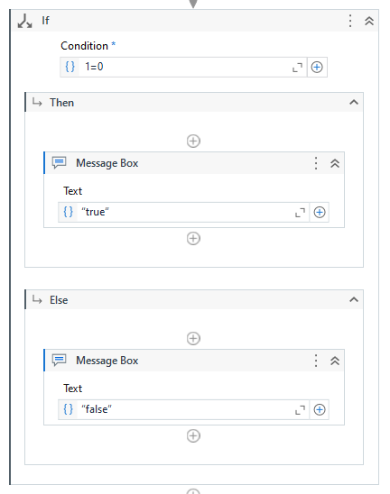
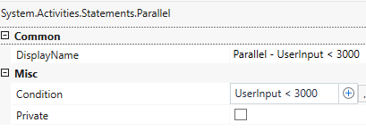
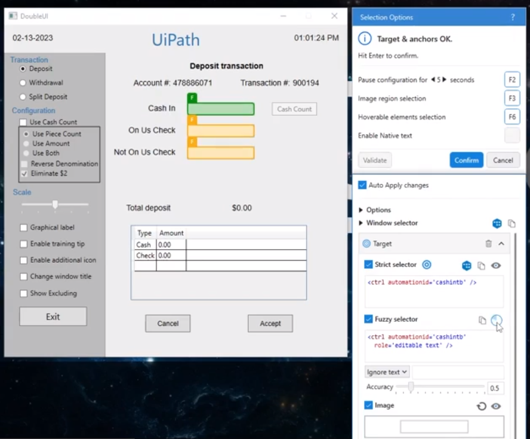
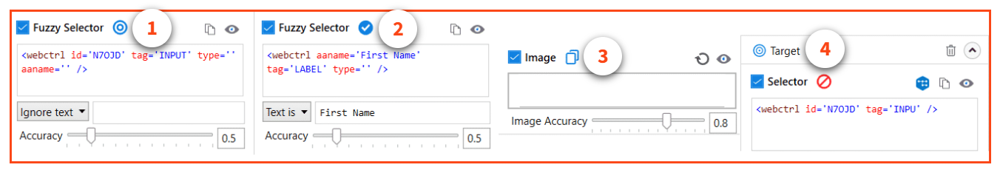
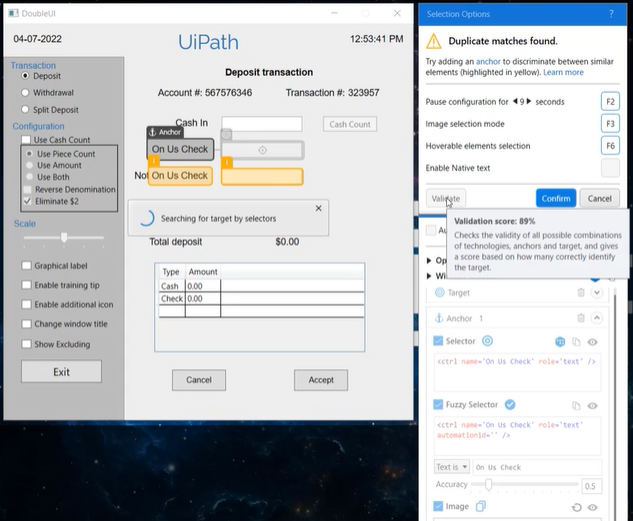
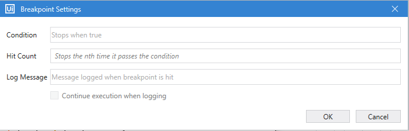
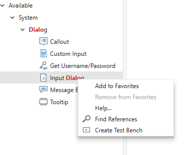
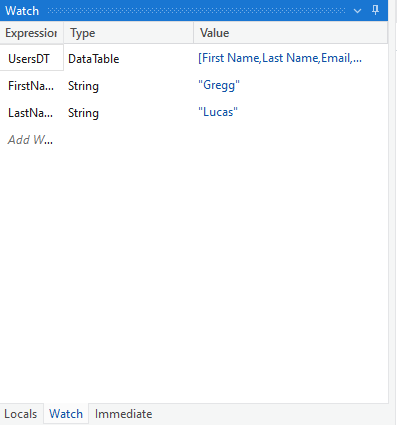
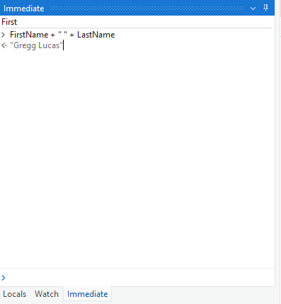
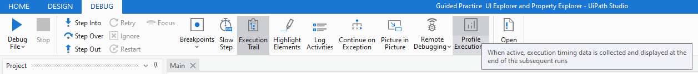

# 课程概述

## 课程链接

[Automation Developer Professional Training](https://academy.uipath.com/learning-plans/automation-developer-professional-training)

## 课程所用系统

- [DoubleUI.exe](C:\xujian\eipi10\xuxiangwen.github.io\_notes\60-rpa\uipath\academy\processes\automation-developer-professional-training\DoubleUI.exe)

  一个Windows程序

- [ACME System 1](https://acme-test.uipath.com/home)

  一个Web Site

  - Account
    - user： eipi10@qq.com
    - password： QAZsedc821202

  - 重置测试数据

    

- [RPA Challenge](https://rpachallenge.com/)

# 探索Automation

## [创建你的第一个process](https://academy.uipath.com/courses/build-your-first-process-with-studio)

### **创建process—Part One**

#### Automation Team

- Solution Architect
- Project Manager
- Business Analyst
- Automation Developer

#### Steps in automation process

automation implementation process中的步骤

- Business Analyst： Capturing the 'as-is' and 'to-be' process steps

  captures all the 'as-is' and 'to-be' process steps and any other documented details from the subject matter experts (SME) and the business team.

- Solution Architect： Documenting the process steps

  the process steps are thoroughly documented within the Process Definition Document (PDD) and validated with the Solution Architect.

- Project Manager： Signing-off the PDD

  It is the Project Manager's responsibility to obtain sign-off on the documented PDD from the business team.

- Solution Architect： Designing the solution

  Solution Architect designs a future state flow and maps out the various modules to be developed to complete the automation.

- Automation Developer： Developing the solution

  the Automation Developers create the modules outlined in the design whiteboard using the PDD and Solution Design Document (SDD) as references.

  Some important aspects we should consider before diving in.

  - Deciding between attended or unattended automation
  - Choosing the correct type of layout for the project in Studio
    - sequences
    - flowcharts
    - state machines.

  - ensure that we have installed the required dependencies to use the activities needed for the automation.
  - consider automation best practices, such as using a centralized knowledge repository, source control, Workflow Analyzer, etc.

#### [Example: ExcelConsolidation_Part1](C:\xujian\eipi10\xuxiangwen.github.io\_notes\60-rpa\uipath\academy\processes\automation-developer-professional-training\ExcelConsolidation_Part1)

使用“Use Excel File”等Activity，创建Excel文件，填写内容，格式化，拷贝数据，创建Pivot Table。

数据合并时有一个问题，有五个Excel文件，每个文件有10条记录，然后最终的文件只有40条记录，10条记录跑哪里去了。

### **创建process—Part Two**

#### [Example: ExcelConsolidation_Part2](C:\xujian\eipi10\xuxiangwen.github.io\_notes\60-rpa\uipath\academy\processes\automation-developer-professional-training\ExcelConsolidation_Part2)

修复了上一节中的问题，原因在于，第二个Excel文件的sheetname不是sheet1。

### **发布并运行process**

略。

[UiPath_AutomationBestPractice_Guide](https://html.cdn.contentraven.com/crcloud/crscorm/uploads/uipath_lms_11218/encryptedfile/558197/v2.0/scormcontent/assets/Dy7ExfmVOR_xzs_z_yFZ-35QSs1kHhXgm-UiPath_AutomationBestPractice_Guide.pdf)

## [变量，常量和参数](https://academy.uipath.com/courses/variables-constants-and-arguments-in-studio)

Variables, Constants and Arguments in Studio

### **创建使用并管理变量**

Creating, using and managing variables

在Stuido中，有四种方式创建变量。

- From the Data Manager
- From the Body of an Activity
- From the Properties Panel
- From the Variables Panel

### Workflow调用和参数

About the Invoke Workflow File activity and arguments

#### 三种工作流布局

Workflow Layout

- [Sequences](https://docs.uipath.com/studio/standalone/2022.10/user-guide/sequences)

- [Flowcharts](https://docs.uipath.com/studio/standalone/2022.10/user-guide/flowcharts)

  

- [State Machines](https://docs.uipath.com/studio/standalone/2022.10/user-guide/state-machines)

  

#### 参数

和变量类似，在Stuido中，有四种方式创建参数。

- From the Body of an Activity
- From the Properties Panel
- From the Arguments Panel
- From the Data Manager panel

##### 变量和参数区别

| **Variables**                                                | **Arguments**                                                |
| ------------------------------------------------------------ | ------------------------------------------------------------ |
| Don't have directions like In, Out, or In/Out.               | Do have directions like In, Out, In/Out.                     |
| To create a variable press: Ctrl + K.                        | To create an In Argument press: Ctrl +M. To create an Out Argument press: Ctrl+Shift+M. |
| To create variables, there must be at least one activity in the Designer Panel. | Arguments can be created if the Designer panel doesn't contain any activity. |
| Require a defined scope.                                     | Do not require a scope.                                      |

### **全局常量和全局变量**

Global constants and global variables

全局常量和全局变量在Window Legacy（Compatibility）下不能用。

### **数组**

Array type variables

Array是最常用的固定长度的集合，List是最常用的非固定长度的集合

## [控制流(Control Flow)](https://academy.uipath.com/courses/control-flow-in-studio)

- **Workflow layouts**
  - Sequence
  - Flowchart
  - State Machine
  - Global Exception Handler

- **Control flow statements**
  - conditional or decision-making activities: If, Else If,  and Switch
  - Loops: While, Do While, and For Each.

### If

两种If activity：

- **If Activity**

  

- **Else If Activity**

  

### **Loops: While, Do While and For Each**

While，Do While和For Each有一个属性Max iterations，可以避免因为程序的错误造成的无限循环。

| **While**                                                    | **For Each**                                                 |
| ------------------------------------------------------------ | ------------------------------------------------------------ |
| **Executes contained activities while the condition is True.** | **Performs an activity or series of activities on each element of an enumeration.** |
| **Iterates as long as the condition is met.**                | **Iterates through each element in the collection.**         |
| **Exits upon checking if the condition is false.**           | **Exits upon completion of processing of each item in the collection.** |

#### 问题

值得注意的是，这几个Activity的Property窗口在不同版本下变化较大。新版本的看起来好丑，怎么回事

- 

  

- 

  

### Switch

| **Switch**                                                   | **If**                                                       |
| ------------------------------------------------------------ | ------------------------------------------------------------ |
| **Useful when we need at least three potential sources of action. ** | **Useful only with two potential courses of action. **       |
| **Uses a condition that** **isn't** **Boolean. But enables the selection of one choice out of multiple, based on the value of a specified expression.** | **Uses a condition** **that's** **Boolean in nature. **      |
| **Workflow design with multiple nested If-Else replaced by Switch activity is easier to follow. ** | **Workflow design with multiple nested If-Else looks cluttered and difficult to follow. ** |
| **By default, Switch activity uses an integer argument in the Case Value section in Studio.** | **If activity can evaluate any valid Boolean expression, regardless of data type.** |

#### [Example: Switch](C:\xujian\eipi10\xuxiangwen.github.io\_notes\60-rpa\uipath\academy\processes\automation-developer-professional-training\Switch)

Flow Switch和Flow If，看上去挺高级。

## [Modern Experience下的Excel自动化](https://academy.uipath.com/courses/excel-automation-with-the-modern-experience-in-studio)

Excel Automation with the Modern Experience in Studio

### **Excel Automation介绍**

- Workbook or File Access Level（Modern和Classic相同）

  - 在后台运行
  - 不需要安装Excel，不用在Excel中打开文件，更加可靠和快速
  - 仅仅支持.xls和.xlsx文件，不支持.xlsm文件。
  - 避免已经打开Excel文件

  相关的Activiity有：

  

- Excel or  Excel App Integration（Modern和Classic提供了不同的选项）

  - UiPath将（像人类一样）打开Excel
  - 需要安装Excel
  - 支持.xls，.xlsx，.xlsm文件。
  - 部分支持.csv。

  Modern的Activity有：

  

  Classic的Activities如下。可以看到Modern提供了更强大功能，尤其是Chart和Pivot Table，但Classic也有一些额外的功能，比如执行宏，调用VBA。

  

| Criteria                    | Workbook Activities                                          | App Integration Activities                                   |
| --------------------------- | ------------------------------------------------------------ | ------------------------------------------------------------ |
| Excel Installation Required | No                                                           | Yes                                                          |
| Compatibility               | Works with .xlx and .xls                                     | Compatible with .csv, .xlsx, .xls, and .xlsm                 |
| Functionality               | Limited to basic Activities                                  | Wide range of Activities                                     |
| Advantages                  | Can be executed in the background without opening the Excel application, resulting in faster and more reliable operations | Can perform a wide range of operations, including advanced Excel features such as macros and pivot tables |

### **Design Experiences and Excel Add-in**

#### Design Experiences

UiPath有两种设计体验：Modern和Classic。

The Modern experience provides a user-friendly interface with new features, while the Classic experience has a traditional interface. 

#### **Excel -add in**

- Why Excel Add-in is important **?**

  With the Excel Add-in, users can leverage modern design experience features in UiPath Studio, such as indicating data directly from Excel, automating Excel tasks, and optimizing Excel-based processes. This integration empowers users to create efficient and effective automation solutions for Excel-related tasks, streamlining their workflow and maximizing productivity.

### 使用Workbook和DataTable Activities

**Build Automation Using Workbook and Data Tables Activities**

#### [Example: Practice 1_ Workbook and DataTable Activities](C:\xujian\eipi10\xuxiangwen.github.io\_notes\60-rpa\uipath\academy\processes\automation-developer-professional-training\Practice 1_ Workbook and DataTable Activities)

1. 使用Read Range Workbook读取Sheet到DataTable。
2. 使用Add Data Column添加一列到DataTable。
3. 使用For Each Row In DataTable遍历DataTable，并设置新列的值。
4. 使用Write Range Workbook更新Sheet。

### 使用Excel Modern Activities

**Build Automation using Excel Modern Activities.**

重要的Activities。

- Excel Process Scope

  - Show Excel Window属性

    "Show Excel window" is a property of the Excel Process Scope that controls the appearance of Excel windows during automation. By default, this property is set to "Same as project". The drop-down menu offers three options, as described below:

    - Same as project: this option applies the same settings as those in the project settings.
    - False: if this option is selected, Excel files are opened by the project in the background, and their windows are hidden.
    - True: if this option is selected, Excel files are opened by the project with their windows visible to the user.

- Use Excel File

  必须放在Excel Process Scope里面。而其他的Excel Modern Activity必须在Use Excel File内。

#### [Example: Excel Data Consolidation 1](C:\xujian\eipi10\xuxiangwen.github.io\_notes\60-rpa\uipath\academy\processes\automation-developer-professional-training\Excel Data Consolidation 1)

演示了：使用对Excel较为复杂的操作，比如：去重复，Excel之间拷贝数据，增加Column，Sheet之间进行VLookup等。

#### [Example: Excel Data Consolidation 2](C:\xujian\eipi10\xuxiangwen.github.io\_notes\60-rpa\uipath\academy\processes\automation-developer-professional-training\Excel Data Consolidation 2)

演示了：如何在Excel中，Format as Table, 创建Pivot Table，插入Chart等复杂操作。确实功能非常强大。

需要设置Show Excel Window为True，这是因为Format as Table等UI操作需要Excel处于打开状态。当该属性为True，可以看到程序的运行速度会降低，当对大批量数据进行操作时，建议设置为False。

#### [Example: Practice 2 Excel Activities](C:\xujian\eipi10\xuxiangwen.github.io\_notes\60-rpa\uipath\academy\processes\automation-developer-professional-training\Practice 2 Excel Activities) 

这个例子中，前面是采用Workbook or File Access Level对Excel进行数据处理，后面使用Excel Modern Activities对数据进行格式化，创建PivotTable和Chart。

## [Modern Design下的UI Automation](https://academy.uipath.com/courses/user-interface-ui-automation-with-modern-design-in-studio)

User Interface (UI) Automation with Modern Design in Studio

### UI Automation如何工作的

**An Overview of How UI Automation Works**

#### UI Automation的核心概念

- **UI Automation Activities** - Activities can be containers, input activities, output activities or synchronization activities.  
- **Activity Properties** - Properties determine how the Robot performs an action. They can be found in the Properties panel.
- **Targeting Methods** - They provide several ways to identify the UI element the Robot will be interacting with.
- **Input and Output Methods** - Define the type of technology used in interacting with UI elements. Output methods are used to extract data (in general, as text) from a UI element. The technology used by Input methods is different than the one used in Ouput methods.
- **Recorders** **and Wizards**-  This functionality enables you to easily capture a user’s actions on the screen and translates them into sequences.
- **The Object Repository** - The Object Repository ensures the management, reusability, and reliability of UI elements by capturing them as objects in a repository, sharable across projects.
- **AI Computer Vision** - Is able to identify UI elements such as buttons, text input fields, or check boxes without the use of selectors.

#### UI Automation Activities

1. Containers

   用于识别流程需要与之交互的浏览器或应用程序。

   - Modern

     - Use Application/Browser

   - Classic

     - Open Browser

     - Attach Browser

     - Open Application

2. Activities for Synchronization

   使机器人能够在Robot发生特定的事件时，基于用户界面的行为执行特定的操作。

3. Input Activities

   input data into user interface elements. 

4. Output Activities

   retrieve information from GUI Elements. 

### **Targeting Methods和Indicating the UI element**

#### Targeting Methods

就像我们用眼睛识别屏幕上的按钮一样，Robot使用不同的定位方法（targeting methods）来“看到”和“理解”屏幕上的元素。

下面是主要的Targeting Methods，通过这三种方法的组合，称之为Unified Targeting。可以保证以更高Robust来定位屏幕上的元素

1. **Strict Selectors**
2. **Fuzzy Selectors**
3. **Image Recognition**

##### Selection Options

- F2： Pause Configuration

  页面需要等待几秒，再进行选择

- F3： Image Selection Mode

  截取屏幕中的图片

- F6： Hoverable Elements Selection

  悬停后，再出现的内容上再选择

- Enable Native Text

### Input Activites和Input Methods

#### **Input Methods**

- Hardware Events

  在UiPath中使用Hardware Events输入方法时，它会直接与硬件设备（鼠标或键盘）交互，通过向操作系统发送消息进行操作。

  - 不能在后台工作

- SendWindowMessages 

  UiPath会向应用程序发送与用户使用键盘或鼠标进行交互时应用程序收到的相同消息。这意味着UiPath基本上是以与用户相同的方式控制应用程序。

  - 可以在后台工作。
  - 准确性高，速度快。

- Simulate

  模仿（mimic）用户与应用程序交互的方式，Simulate 可以直接与 UI 元素进行交互。

  - 准确性高。
  - 比Hardware Events和Simulate更快
  - 可以后台运行。可以同时运行其他任务的执行。
  - 并非所有应用程序都与 Simulate 兼容。

- ChromiumAPI

  ChromiumAPI 是用于浏览器自动化的输入方法，基于 Devtools 协议。它与所有基于 Chromium 的浏览器兼容，如 Chrome 或 Edge。

  -  支持多种活动，包括使用应用程序/浏览器、点击、输入、悬停和键盘快捷键。
  - 与浏览器的直接通信，这意味着通信通道更少，自动化可靠性更高。
  - 可以后台运行。

- Background 

  - 使用 Simulate或者ChromiumAPI
  - 不能和以下行为：
    - Any activities using image as targeting method.
    - Native text automation.
    - All keyboard shortcuts.
    - Minimizing opened applications.
    - The Take Screenshot Activity.

- Picture-in-Picture (PIP).

  允许您与机器人协同运行被监视的流程。在画中画模式中启动的流程在一个隔离的Windows会话中运行，因此允许您在流程运行时使用计算机

  The Picture-in-Picture feature allows you to run attended processes in collaboration with the Robot. A process started in the Picture-in-Picture mode runs in an isolated Windows session, thus allowing you to use the machine while the process is running. 

| **Input Method**   | **Compatibility**                  | **Background Execution** | **Speed** | **Hotkey Support** | Auto Empty Field |
| ------------------ | ---------------------------------- | ------------------------ | --------- | ------------------ | ---------------- |
| Hardware Events    | 100%  - all types of applications. | No                       | 50%       | Yes                | No               |
| SendWindowMessages | 80%                                | Yes                      | 50%       | Yes                | No               |
| Simulate           | 99% - web apps  60% - desktop apps | Yes                      | 100%      | No                 | Yes              |
| ChromiumAPI        | 100% - Chrome and  Edge browsers   | Yes                      | 50%       | Yes                | Yes              |

##### **前台和后台Process**

| Charcterstics  | **Foreground Process**                            | **Background Process**                                       |
| -------------- | ------------------------------------------------- | ------------------------------------------------------------ |
| Example        | Typing a document, browsing the internet          | Antivirus scans, file backups                                |
| Visibility     | Visible and interactive on the screen             | Not visible or interactive on the screen                     |
| Resource usage | Uses computer resources while actively being used | Uses computer resources while running, but at a lower priority |
| Interruptions  | Can be interrupted or paused by the user          | Generally can't be interrupted or paused by the user         |
| User attention | Requires user attention                           | Doesn't require immediate user attention                     |

#### Input Activities 

- Type Into

  部分Activity Properties仅仅适用于部分的Input Methods。

  

### Output Activities和Output Methods

Output actions are used to extract data, generally in the form of text, from UI elements. Output methods are how output actions extract data from UI elements.

#### Output Methods

 有三种输出方法：

- Full text： 提取元素的完整文本，包括其子元素。
- Native Text
- OCR

| Output Method                        | FULL TEXT                                                    | **NATIVE**                                                   | **OCR**                                                      |
| ------------------------------------ | ------------------------------------------------------------ | ------------------------------------------------------------ | ------------------------------------------------------------ |
| **Default method and Compatibility** | It is the **Default method** and good enough in most cases.  | Compatible with applications that use **Graphics Design Interface (GDI)**, the **Microsoft API is** used for representing graphical objects. | OCR (or Optical Character Recognition) is the only output method that works with **virtual environments** and with **“reading” text from images**.  Its technology relies on recognizing each character and its position. |
| **Automation Speed**                 | **Fastest** compared to the other two methods.               | Somewhat **slower** than FullText.                           | By far the **slowest.**                                      |
| **Accuracy**                         | 100**%** accuracy.                                           | **100%** accuracy on the **applications that support GDI.**  | Accuracy varies from **one text to** another, by **changing the settings** we can improve the results. |
| **Running in Background**            | **Works** in the background.                                 | **Cannot** work in the background.                           | **Cannot** work in the background.                           |
| **Hidden Text**                      | **Can** extract hidden text (for example, the options in a drop-down list). | **Cannot** extract hidden text.                              | **Cannot** extract hidden text.                              |
| **Virtual Environment**              | **Doesn’t** support virtual environments.                    | **Doesn’t** support virtual environments.                    | **Works** with virtual environments and with **“reading” text from images**. |
| **Text position and Formatting**     | **Doesn’t capture** text position and formatting.            | **Can** extract the text position and formatting (including text color) | Like the **Native** method, it also captures the text position. |
| **Other**                            | The method offers the **option** **to ignore the hidden message** and capture only the visible text. | By default, it can process all known **characters as separators** (**comma, space, and so on**), but when only certain separators are specified, it can ignore all the others. | The OCR method has **two default engines** that can be used alternatively:**Google Tesseract,** **Microsoft MODI.**There are additional OCR engines that can be installed free of charge (such as Omnipage and Abbyy Embedded) or paid (IntelligentOCR offered by Abbyy). |

#### Output Activities

- Get Text

  支持以下几种output methods。

  - Default: 尝试所有方法，能返回结果的第一个方法将会被使用
  - Text attribute：使用UI Element的"text"属性
  - Fulltext： 该方法提供了忽略隐藏文本的选项，可以通过选择其相应的复选框来激活（this method offers the option to Ignore hidden text, which can be activated by selecting its respective check box）
  - Native：这种方法使您能够允许格式设置，并通过选择每个功能的复选框来检索单词的屏幕坐标（this method enables you to Allow formatting and retrieve the screen coordinates of the words by selecting the check boxes for each of these features）

  

##### [Example: Output Methods and Output Activities](C:\xujian\eipi10\xuxiangwen.github.io\_notes\60-rpa\uipath\academy\processes\automation-developer-professional-training\Output Methods and Output Activities)

读取Excel内容到DataTable，遍历DataTable，在DoubleUI.exe中获取Transaction #，然后回填Excel。

##### [Example: Extract Invoice Details](C:\xujian\eipi10\xuxiangwen.github.io\_notes\60-rpa\uipath\academy\processes\automation-developer-professional-training\Extract Invoice Details)

根据Excel文件中的Invoice Number到[ACME System 1](https://acme-test.uipath.com/home)中获取具体信息，然后填写Excel中的相应内容。

### 使用**App/Web Recorder** 

- 如果Enable Full Configuration of Targets and Saved Values，在录制时指示 UI 元素时，它将要求进行确认，同意后才会加入。

  

- Action是否可以关联
  - Actions That Must Be Selected Before Recording
    - Copying text using the **Get Text** activity.
    - Hovering over an element using the **Hover** activity.
    - Highlighting an element using the **Highlight** activity.
  - Automatically Recorded Actions
    - Clicking on buttons, links, icons, or images: generates a **Click activity**.
    - Typing text in a text box or text area: generates a **Type Into activity**.
    - Selecting or clearing a check box: generates a **Check/Uncheck activity**.
    - Sending keyboard shortcuts using your keyboard: generates a **Keyboard Shortcuts** activity.
    - Selecting an item from a drop-down: generates a **Select Item** activity.

- When using the App/Web Recorder in UiPath Studio **with a "Use Application/Browser" activity selected**

  

  只能记录在该应用程序或浏览器窗口内的元素上的操作。 这在你想要为特定应用程序或网站创建有针对性的自动化工作流程时非常有用。

- When using the App/Web Recorder in UiPath Studio **without a "Use Application/Browser" activity selected**

  可以捕获计算机上所有打开的应用程序的操作。 这对于自动化涉及多个应用程序的复杂任务非常有帮助，因为您可以记录跨不同应用程序的操作并将它们合并为一个工作流程。

### 使用Table Extraction

#### [Example: Table Extraction](C:\xujian\eipi10\xuxiangwen.github.io\_notes\60-rpa\uipath\academy\processes\automation-developer-professional-training\Table Extraction)

从[ACME System 1](https://acme-test.uipath.com/home)中读取Work Item信息，使用Extract Table Data一页一页读取其中的Table数据。

# Automation Developer Associate

## [Strings](https://academy.uipath.com/courses/data-manipulation-with-strings-in-studio)

本节介绍了一些字符操作的一些函数。总体比较简单。

Matches Activity可以定义正则表达式，有点意思啊。

### [Example: Extract Email Address with RegEx](C:\xujian\eipi10\xuxiangwen.github.io\_notes\60-rpa\uipath\academy\processes\automation-developer-professional-training\Extract Email Address with RegEx)

使用正则表达式，抓取文本中的邮箱地址。

## [Lists and Dictionaries](https://academy.uipath.com/courses/data-manipulation-with-lists-and-dictionaries-in-studio)

本节介绍了List和Dictionary。总体比较简单。

## [UI Automation Synchronization](https://academy.uipath.com/courses/ui-automation-synchronization-with-studio)

几个核心概念。参考习题22。

- Containers: Activities that create triggers based on UI behavior, enabling the Robot to execute action
- Input Activities: Activities that send input to UI elements, such as clicking, checking, and typing.
- Output Activities: Activities that retrieve information from GUI elements, such as getting text or structured
- Synchronization Activities: Activities that create triggers based on UI behavior, enabling the Robot to execute action

### **Synchronization Activities**

### Check App State Activity

通过检查特定元素的出现或消失来验证应用程序或Web浏览器的状态。

- 可以在Use Application/Browser以外使用。

#### [Example: Check App State_Final Project ](C:\xujian\eipi10\xuxiangwen.github.io\_notes\60-rpa\uipath\academy\processes\automation-developer-professional-training\Check App State_Final Project)

### Verify Execution Feature

用于在运行时验证活动执行的正确性。它通过在活动执行后检查和确认指定元素的出现或消失来验证所需的结果。有两种方式。

- auto-verification： for **Type Into**

  

- verification ： for **Click,  Hover** activities

  

以上两种情况Verify Execution的Timeout默认是10秒。

#### [Example: Verify Execution_Final Project](C:\xujian\eipi10\xuxiangwen.github.io\_notes\60-rpa\uipath\academy\processes\automation-developer-professional-training\Verify Execution_Final Project)

### Pick Branch Activity

**Pick activity**是工作流自动化中的容器活动，它允许您同时监视多个输入源，并根据首个可用的输入执行相应的活动分支，其主要组成部分是 **Pick Branch activity**.

#### [Example: Pick Branch_Final Project](C:\xujian\eipi10\xuxiangwen.github.io\_notes\60-rpa\uipath\academy\processes\automation-developer-professional-training\Pick Branch_Final Project)

#### [Example: Exercise_CheckAppState_VerifyExecution](C:\xujian\eipi10\xuxiangwen.github.io\_notes\60-rpa\uipath\academy\processes\automation-developer-professional-training\Exercise_CheckAppState_VerifyExecution)

整合了Check App和Verify Execution的完整例子。

### **Parallel Activity**

在工作流设计中，Parallel Activity 允许在工作流内同时执行多个独立的任务。它充当活动的容器，促进协调和并发执行。

- 每个Sequence并行运行

- Condition

  - 当Condition中有表达式时，每个Sequence执行完成后，会评估Condition。如果Condition为True，立刻结束整个Parallel Activity 的执行，即使还有Sequence还没运行完。

    比如：你写了一个抢票程序，当其中一个Sequence抢到票了，其他Sequence，你肯定想取消了。

  - 当Condition中没有表达式，每个Sequence执行都执行完成。

#### [Exmaple: Parallel Activity_FInal Project](C:\xujian\eipi10\xuxiangwen.github.io\_notes\60-rpa\uipath\academy\processes\automation-developer-professional-training\Parallel Activity_FInal Project)

原先给的例子，其实不是非常的好。后来增加的Sequence完美的体现了Parallel的特性。

## [UI Automation Descriptors](https://academy.uipath.com/courses/ui-automation-descriptors-in-studio)

### UI Frameworks

- Default 

  This is the proprietary method which usually works correctly with all types of user interfaces.

- AA: Active Accessibility

  This represents an earlier solution from Microsoft that makes apps accessible. It is recommended when using legacy software, if the default framework does not work as expected.

- UIA: UI Automation

  This is the improved accessibility model from Microsoft, which is recommended when using newer applications in case the default framework does not work as expected.

### **Targeting Methods**

之前的培训里面，简单介绍了Targeting Methods，本节中将详细介绍。

下面是主要的Targeting Methods，通过这三种方法的组合，称之为Unified Targeting。可以保证以更高Robust来定位屏幕上的元素

1. **Strict Selectors**

   使用XML片段来根据用户界面元素的属性进行识别。它们要求元素的地址和属性完全匹配，提供精确的定位。

2. **Fuzzy Selectors**

   够基于模式或部分匹配来识别元素，从而提供更大的灵活性。它们使用多个属性验证选择器，以适应自动化过程中的变化。

3. **Image Recognition**

   读取应用程序窗口可见区域的像素数组，以确定是否与目标数组匹配。在无法应用其他定位方法或在虚拟机环境中时，这种方法非常有用。

4. Native Text

5. Computer Vision

为何在UiPath中看到的是五种呢。Computer Vision和Image有何区别呢？

- Windows Selectors： 仅当“User Application/Browser” Activity的Window attach mode是Application instance时，才可用。

      

### **Unified Targeting Method**

Unified Targeting Method是UI自动化的Modern解决方案，通过整合各种技术和方法，如选择器（Selectors）、模糊选择器（Fuzzy Selectors）和图像（Images），以识别UI元素，从而简化与用户界面的交互。

通过使用Unified Targeting Method，其中的各种方法相互补充和支持，提高了UI自动化的可靠性。这意味着即使其中一种方法在选择UI元素时遇到困难，其他方法可以介入克服障碍。

#### **Descriptor**

The Target and Anchor pair is known as Descriptor. 在底层，机器人生成这九种独特的组合，被称为Descriptor。每个Descriptor代表使用各自的定位方法识别Target和Anchor元素的独特组合

### **Validating the Descriptors**

#### Show All Matches

识别所选元素的所有可能匹配项。

#### **Target element validation**

在Selection Options窗口中，点击Validate后，将会尝试所有的Target方法，在每个Target方法后面将会有出现一个小图标，它表示尝试的结果

1. **Blue bullseye**: 该方法是第一个成功识别元素的方法。

2. **Checkmark**: 该方法成功地识别了元素。

3. **Duplicate icon**: 该方法成功识别了重复的元素。

4. **Stop sign icon**: 该方法未能识别元素。

   

点击Validate的时候，可以发现准确率为89%=8/9。

可以有多种方法提高准确率：

- 提高Image的Accuracy从80%到91%
- 增加另一个Anchor
- 在Target，不勾选Image方法进行识别

[Example: Target Element Validation](C:\xujian\eipi10\xuxiangwen.github.io\_notes\60-rpa\uipath\academy\processes\automation-developer-professional-training\Target Element Validation)

本例中，开始Validate准确率是44%。通过不勾选Target中的Image方法，可以把准确率提高到100%。

### **高级Selection Window Options**

#### **Enable Native Text**

> 当前UiPath版本中，该选项是在Toolbar上，而不是上面这种形式。

使用Native Text targeting method，Robot根据元素关联的文本标签与元素进行交互。您可以查看和编辑这些标签，并指定文本匹配是否应区分大小写。该方法在传统应用程序中尤其有用，因为并非所有元素都是可选择的。

#### **Enforce Visibility**

在启用时，允许您处理可见的UI元素。在运行时，也只考虑可见元素。

下图中，要定位的Element并不Visible，如果选择Fully visible的话，将会定位失败。

#### **Responsive Websites** 

通过启用此选项，自动化工具可以智能地处理目标布局的变化，并相应地调整锚点的位置。这个功能在自动化响应式网站（automating responsive websites）时尤其有用。响应式网站被设计成能够适应不同的屏幕尺寸和方向。由于响应式网站的布局根据可用的屏幕空间而变化，元素的位置也可能发生变化。

### Fine-Tuning Descriptor

#### **Key Actions for Fine-Tuning Descriptors**

- Evaluate Targeting Method Reliability 

  - 使用Validation选项来评估每种定位方法的可靠性。
  - 评估 Selector, Fuzzy Selector, and Image methods的准确性和一致性。
  - 如果某个定位方法持续失败或产生不可靠的结果，使用最合适的技术进行targeting method的微调。

- Adjust Fuzzy Selector Settings

  - 对vFuzzy Selector进行微调，以处理属性变化和动态元素。 
  - 提高匹配目标元素的准确性。

- Optimize Image Targeting

  微调图像设置，例如准确性，以提高对动态UI元素的匹配效果。

- Prioritize Targeting Methods

  - 根据可靠性和效果选择适当的targeting method。 
  - 调整targeting method的执行的顺序，优先考虑最可靠的方法。

- Test and Iterate

  - 在不同的场景下彻底测试自动化工作流程。 
  - 根据需要进行迭代和进一步微调，以达到最佳结果。

#### Dynamic Text Target Option

##### [Example: Dynamic Text Target_Starting Project](C:\xujian\eipi10\xuxiangwen.github.io\_notes\60-rpa\uipath\academy\processes\automation-developer-professional-training\Dynamic Text Target_Starting Project)

由于每次搜寻的电影不同，所以导致定位失败。

##### [Example: Dynamic Text Target](C:\xujian\eipi10\xuxiangwen.github.io\_notes\60-rpa\uipath\academy\processes\automation-developer-professional-training\Dynamic Text Target)

通过选择点击“Convert to dynamic-text target”，黄色两部分将会自动变化，从而解决定位问题。

#### Fine-tuning Descriptors using Wildcards

##### [Example: Fine Tuning Descriptor Using Wildcards_Solution](C:\xujian\eipi10\xuxiangwen.github.io\_notes\60-rpa\uipath\academy\processes\automation-developer-professional-training\Fine Tuning Descriptor Using Wildcards_Solution)

使用*（/ˈæs.tər.ɪsk/.）或者?来进行匹配。

#### Fine-tuning Descriptors using Variables

一般用于Strict Selector和 Fuzzy Selector。

##### [Example: Fine Tuning Descriptor Using Variables](C:\xujian\eipi10\xuxiangwen.github.io\_notes\60-rpa\uipath\academy\processes\automation-developer-professional-training\Fine Tuning Descriptor Using Variables)

由于无法精确定位EmployeeName。在“Jose A Bacon”上右键点击，使用Variable来替代。

值得注意的是在Property窗口，前面操作的内容的背后的设置如下。

### **使用For Each UI element**

感觉和Table Extraction有很大的相似之处。For Each UI element Activity允许我们自动化涉及多个用户界面元素的重复任务，例如数据输入、验证或提取。 

#### [Example: Using ForEach UI element](C:\xujian\eipi10\xuxiangwen.github.io\_notes\60-rpa\uipath\academy\processes\automation-developer-professional-training\Using ForEach UI element)

本例子中会遍历Table，读取相关信息。

相关设置信息如下。

### **使用Image Targeting method**

当其他方法如selectors和fuzzy selectors不可用时，启用Image region selection option来识别UI元素。它完全依赖于图像识别。

#### [Example: Image region selection option]()

### [Practice 2: Fine-tuning the Descriptor](C:\xujian\eipi10\xuxiangwen.github.io\_notes\60-rpa\uipath\academy\processes\automation-developer-professional-training\Descriptor_Final Solution)

使用了变量来进行动态定位UI Element。具体步骤如下

- 实现一个用户输入提示，从用户那里获取电影标题。
- 将电影标题在IMDB网站的搜索电影。
-  从网站中提取所搜索电影的IMDB评分。 
- 通过消息框显示检索到的IMDB评分。

## [深入了解Studio中的Selectors](https://academy.uipath.com/courses/selectors-in-studio-deep-dive)

### **Structure of Selectors, Tags, and Attributes**

在UiPath Studio中，Selectors是XML片段，用于识别特定的用户界面元素。Selectors由节点组成，每个节点由Tags和Attributes组成。 

- Tags

  - Nodes in the selector XML fragment.
  - Corresponds to a visual element on the screen.
  - The first node is the app window.
  - The last node is the element itself.

  For example:

  - **wnd** (window)
  - **html** (web page)
  - **ctrl** (control)
  - **webctrl** (web page control)
  - **java** (Java application control)

- Attributes

  属性是元素的特性或属性，有助于识别和与之交互。它们提供有关元素的具体信息，如其名称、ID、类、标题或类型。这些属性在自动化过程中用于查找并对所需元素执行操作。

  每个属性都有一个名称和一个值。应仅使用具有常量或已知值的属性。

  For example:

  - parentid=‘slide-list-container’
  - tag=‘A’
  - aaname=‘Details’
  - class=‘btn-dwnl’

### **Types of Selectors**

- Full selectors: 包含识别特定UI元素所需的所有信息，包括顶层窗口。主要用于Classic Design Experience。
- Partial selectors: 特定于容器活动，并存储与顶层窗口相关的信息。主要用于Modern Design Experience。

### **UI Explorer, Property Explorer and Get Attribute Activity**

- Validate

  它帮助用户快速识别选择器中的任何问题或错误，并有效地进行故障排除。

- Visual Tree Panel

  允许用户浏览UI结构并选择要进行分析和编辑的所需元素。可视树面板提供了应用程序UI的视觉概述，更容易识别和选择特定元素。

- Tags and Attribute Display and Inclusion/Exclusion of Tags and Attributes

  UI Explorer提供了对所选UI元素关联的Tags和Attributes的全面视图，使用户能够了解元素的特性，并在修改Selectors时做出明智的决策。

#### UI frameworks

- Default 

  这是通常能够正确处理所有类型用户界面的专有(proprietary)方法。

- Active Accessibility

  这代表Microsoft的早期解决方案，用于使应用程序具有可访问性。当使用传统软件时，如果默认框架不按预期工作，建议使用该方法。

- UI Automation

  这是Microsoft的改进可访问性模型，建议在使用较新应用程序时使用，以防默认框架不按预期工作。

### [**Example: Guided Practice - UI Explorer and Property Explorer**](C:\xujian\eipi10\xuxiangwen.github.io\_notes\60-rpa\uipath\academy\processes\automation-developer-professional-training\Property Explorer and UI explorer _GetAttribute)

https://academy.uipath.com/learningpath-viewer/11571/1/571950/2

练习了使用Get Attribute Activity。这是一个step by step的练习，可以用于以后的教学。

### **应对困难局面 : Visual Tree Hierarchy and Find Children**

使用Visual Tree和Find Children来应对一些复杂的情况。

#### [Example: Demo - Managing Difficult Situations_Final Project](C:\xujian\eipi10\xuxiangwen.github.io\_notes\60-rpa\uipath\academy\processes\automation-developer-professional-training\Demo - Managing Difficult Situations_Final Project)

循环的去获取https://www.rpachallenge.com/上的First Name Input Box，并Highlight，看起来挺有意思的。

- Visual Tree： 是一个层次结构，表示 GUI 应用程序中可视元素之间的关系。它定义了元素在用户界面中的组织、嵌套和位置。
- Find Children ： 允许您基于某些条件在父元素内搜索特定的子元素。它有助于自动化需要与共同父元素交互的多个 UI 元素的任务。

### [Practice:  Highlight WFT Type Items on ACME](C:\xujian\eipi10\xuxiangwen.github.io\_notes\60-rpa\uipath\academy\processes\automation-developer-professional-training\Highlight Workflow Items on ACME)

## [Debugging in Studio](https://academy.uipath.com/courses/debugging-in-studio)

### **Basic Debugging Features**

#### **The debugging interface**

- Slow Step： 可以看到当前运行activity会Highlighted。可以很直观的观察程序的运行。Slow Step从1到4，4是最快的，表示activity之间的切换速度。

- Execution Trail：

  When enabled, it shows the exact execution path at debugging. As the process is executed, each activity is highlighted and marked in the **Designer** panel, showing you the execution as it happens:

  - executed activities are marked and highlighted in green;
  - activities that were not executed are not marked in any way;
  - activities that threw an exception are marked and highlighted in red.

  > 实际观察，好像没啥变化。

- Highlighted Elements: 在UI上高亮显示当前操作的UI Elements

  

#### Breakpoints 

#### **Test Activity and Create Test Bench**

- Test Activity

- Test Bench

  Test Bench是临时的，除非另存为一个Workflow。

  

### **Advanced Debugging Features**

#### **The Watch panel**

允许开发人员添加variables 和expressions，实时显示它们的值，从而帮助快速识别工作流执行过程中的差异。

#### **The Immediate panel**

通过执行自定义表达式并评估变量而无需修改工作流，提供了动态的调试体验。

#### **The Call Stack panel**

以可视化方式显示activitie和function调用的顺序，有助于准确定位错误发生的具体位置。它实现了高效的故障排除和错误定位。

#### **Profile Execution** 

可以分析每个活动的执行时间，了解潜在的瓶颈，从而进行优化并提高工作流性能。

