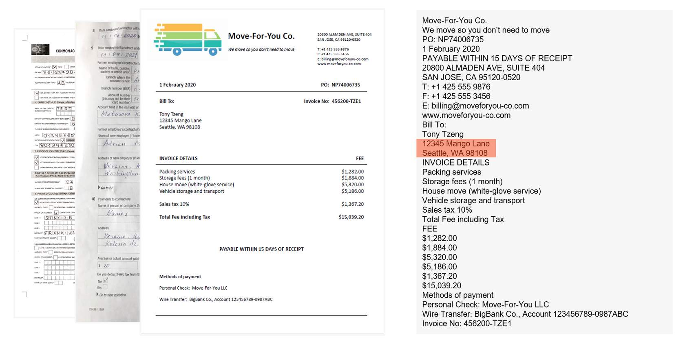
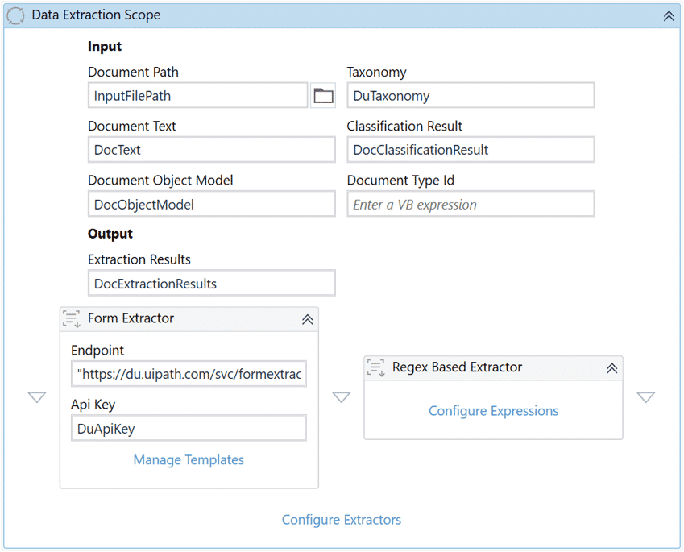

# [Build a Document Understanding Automation in Studio](https://academy.uipath.com/courses/build-a-document-understanding-automation-in-studio)

## **Project requirements and Solution design**

一个大型组织的应付账款团队，由几个全职员工组成，每天都会收到供应商的发票。他们收到的发票既有计算机生成的，也有扫描的，因为它们通过不同的方式送达：电子邮件，实体邮件等。因此，每张发票的布局可能都不同。

他们的日常过程包括将发票下载或扫描到本地驱动器，然后手动提取相关信息。提取的信息然后提交到他们的内部ERP应用程序进行进一步处理。数据提取和验证是耗时的过程，每张发票至少需要15分钟。

关于需求获取的方法，可以参见[Capturing-the-Document-Understanding-project-requirements-guide ](https://html.cdn.contentraven.com/crcloud/crscorm/uploads/uipath_lms_11218/encryptedfile/581648/v1.0/scormcontent/assets/DyxlIY/Capturing-the-Document-Understanding-project-requirements-guide.pdf)。

## **Develop using the Document Understanding framework**

### [Dispatcher_Invoice_Processing](C:\xujian\eipi10\xuxiangwen.github.io\_notes\60-rpa\uipath\academy\processes\build_du_automation\InvoiceProcessing_Workflows\Dispatcher_Invoice_Processing)

从InputFolder中读取文件，把文件的路径加入到Queue。

### [Example: DU_Invoice_Processing](C:\xujian\eipi10\xuxiangwen.github.io\_notes\60-rpa\uipath\academy\processes\build_du_automation\InvoiceProcessing_Workflows\DU_Invoice_Processing)

读取Queue里面的PDF文件路径，从PDF中抓取Invoice，人工验证后，然后进行训练。

## **Zoom in: The Studio activity packages for Document Understanding**

### **Taxonomy Manager**

用于定义要处理的文档类型和字段。必须安装了版本高于或等于v1.6.0的**UiPath.IntelligentOCR.Activities**包。

### **Digitize Document** 

**Digitize Document** 从给定的输入文件中获取机器可读的文本的过程，以便机器人可以理解其内容并根据其内容采取行动。这是将文件应用于DU框架之前的第一步。

#### Output

- **Text** from the processed file, which is stored in a **string variable.**

- **The Document Object Mode**l 

  (DOM) of that file, which is a JavaScript Object Notation (JSON) object containing basic information such as:

  - Name
  - Content type
  - Text length
  - Number of pages
  - Detailed information such as page rotation, detected language, content, and coordinates for every word identified in the file.

#### ApplyOcrOnPdf

它确定应对Portable Document Format （PDF）文档的OCR过程。

- If set to True, OCR is applied to all PDF pages of the document. 
- If set to False, only digitally typed text is extracted. 
- The default value is Auto, determining if the document requires applying the OCR algorithm depending on the input document.

#### OCR Engines

此活动中可以使用多个OCR引擎，例如UiPath Document OCR、OmniPage OCR、Google Cloud Vision OCR、Tesseract OCR，或者甚至可以构建一个自定义活动来包含不同的OCR引擎。

#### Tips

- 在Retry Scope activity内使用该活动。需要注意，每次重试都会消耗一个许可证。

- 根据文档、内容和所需功能选择OCR引擎。并非所有OCR引擎都支持所有场景。例如，如果需要提取手写（handwritten ）数据，请使用UiPath文档OCR和OmniPage OCR。
- 选择OCR引擎时，需要进行OCR Benchmark testing。测试多个OCR引擎，分析测试结果，根据准确性进行选择。
- 在配置所有涉及数字化的活动时，请确保使用相同的OCR引擎。例如：智能关键字分类器、表单提取器模板定义等。更换OCR引擎需要您为新的OCR引擎重新配置所有这些活动。

### **Classify Document Scope**

在分类步骤中，可用的分类器允许机器人识别文档类型，甚至（部分分类器）可以将文件拆分为多个文档。

#### **Classifiers**

1. [Keyword-based Classifier](https://docs.uipath.com/activities/other/latest/document-understanding/keyword-based-classifier): incorporates a keyword-based document classification algorithm, targeting classification for files that have repeatable entities.
2. [Intelligent Keyword Classifier](https://docs.uipath.com/activities/other/latest/document-understanding/intelligent-keyword-classifier) (supports document package splitting): uses the word vector it learns from files of certain document types to perform document classification.
3. [Machine Learning Classifier](https://docs.uipath.com/activities/other/latest/document-understanding/machine-learning-classifier): uses document classification ML models provided by UiPath.

### **Data Extraction Scope**

在提取步骤中，您可以根据每个字段选择最合适的提取器来轻松配置数据提取。根据用例的需求，您可以从多个数据提取算法中进行选择，如RegEx-based Extractor, Form Extractor, 和ML extractors. Read more [here](https://docs.uipath.com/document-understanding/automation-suite/2022.10/user-guide/data-extraction-overview#what-is-data-extraction-available-extractors).

#### Tips

- 提取置信度（extraction confidence）仅用作参考，不能作为检查准确性的唯一来源。有时，错误的值可能具有较高的置信度，而正确的值可能具有较低的置信度。因此，始终需要对提取的数据进行交叉验证（cross-validate），以确保数据的准确性。

- 在从扫描文档中提取数据时，请考虑检查OCR置信度。

- 将Document Data Extraction Scope activity放置在Try Catch activity 中，以处理运行时出现的意外错误（例如：超时错误）。

### **Classification Station and Validation Station**

The Document Understanding framework offers the ability to **detect errors** and **route the documents to the Action Center** for human review. **Action Center** is the **task management** component of the UiPath Automation platform.

#### **Classification Station: Overview and feature exploration**

**Classification Station** is used by invoking the **Present Classification Station** activity for attended robot use, or **Create Document Classification Action** activity for use with Action Center. Both of these are part of **IntelligentOCR.Activities** package

#### **Validation Station: Feature exploration**

### **Train Classifiers and Train Extractors Scope**

In the train classifiers and extractors step, the classifiers and extractors learn from the data corrected and validated in the Classification Station and Validation Station, respectively. This step is optional.

In the **Train Classifiers Scope** activity, you can use Keyword Based Classifier Trainer or Intelligent Keyword Classifier Trainer.

In the **Train Extractors Scope** activity, drop the **ML Extractor trainer** activity from **IntelligentOCR.Activities** and configure the **Configure Extractors Dialog**. 

### **Export Extraction Results**

In the export extraction result step, you connect the document processing workflows with other automation components. 

### [Best Practices Guide](https://html.cdn.contentraven.com/crcloud/crscorm/uploads/uipath_lms_11218/encryptedfile/581648/v1.0/scormcontent/assets/ZS4KxK/DUFrameworkActivities_BestPracticesGuide.pdf)

## **Confidence explained**

- **OCR confidence**: it is the score output by the OCR engine as an estimation of its ability to recognize the characters.

- **Classification confidence**: it is the score output by a classifier as an estimation of its ability to identify the type of document correctly. All classifier confidence values become 100% after validation.

  

- **Extraction confidence**: it is the score output by an extractor as an estimation of its ability to correctly identify and extract the correct fields or table cells.

  - Field confidence

    Field confidence is the value output by an extractor activity. It is an estimation of its ability to identify and extract this field correctly. All extraction confidence values become 100% after validation.

    

  - Table confidence

    The confidence value of table fields represents the minimum of all extraction confidence values for the table cells. Missing cells are not considered while calculating this value.

    

  - Table cell confidence

    Extractors output confidence levels for table cells but these values are not displayed individually in the validation interface. It can be accessed in the extraction results, as any other field confidence. 

    

## [**Practice: Forms processing**](C:\xujian\eipi10\xuxiangwen.github.io\_notes\60-rpa\uipath\academy\processes\build_du_automation\DU_FullExerciseWorkflow\DU_ILT_Day1_FullExercise\Document Understanding Training)

As a part of this exercise, you need to extract data from the following two documents: 

- Form 1040-X: Amended US Individual Income Tax Return 
- Vehicle Damage Report Form 

For each type of document, you need to extract the fields as shown in the table:

- **Form 1040-X**
  - Return 2019 (Boolean) 
  - Return 2018 (Boolean) 
  - Return 2017 (Boolean) 
  - Return 2016 (Boolean) 
  - First Name (text) 
  - Last Name (text) 
  - Social Security Number (text) 
  - Spouses First Name (text) 
  - Spouses Last Name (text) 
  - Spouses Social Security Number (text) 
  - Address Line 1 (text)  
  - Apartment Number (text) 
  - Phone Number (text) 
  - City Town Zip (text) 
  - Filing Status Single (Boolean) 
  - Filing Status Married Filing Jointly (Boolean) 
  - Filing Status Married Filing Separately (Boolean) 
  - Filing Status Qualifying Widower (Boolean) 
  - Filing Status Head Of Household (Boolean)
  - Dependents (table)
    - First Last Name (column - name) 
    - Social Security Number (column - text) 
    - Relationship To You (column - text) 
    - Child Tax Credit (column - Boolean)  
    - Credit For Other Dependents (column - Boolean)
  - Signature (Boolean)
  - Date (date)
  - Spouses Signature (Boolean) 
  - Spouses Date (date) 
- **Vehicle damage report form**
  - Registration-number (text) 
  - Inspector-name (name) 
  - Vehicle-license-number (text) 
  - Driving-license-number (text) 
  - Cost-of-damage (number) 

## **Solve a challenge with the help of the UiPath community**

### **Credit card application**

All credit card applications follow a similar structure. It is the only document that you have in the PDF file. You need to extract the following fields from the **credit card application**: 

| **Field name**       | **Notes**                                                    | **Tips**               | **Mandatory field** |
| -------------------- | ------------------------------------------------------------ | ---------------------- | ------------------- |
| Card type            | Domestic or international                                    | Use checkbox detection | Yes                 |
| Card variant         | Platinum or Visa                                             | Use checkbox detection | Yes                 |
| First name           |                                                              |                        | Yes                 |
| Middle name          |                                                              |                        | Yes                 |
| Last name            |                                                              |                        | Yes                 |
| Name on card         |                                                              |                        | Yes                 |
| Mother's maiden name |                                                              |                        |                     |
| Age                  |                                                              |                        | Yes                 |
| Gender               |                                                              | Use checkbox detection | Yes                 |
| Date of birth        |                                                              |                        |                     |
| Nationality          |                                                              |                        | Yes                 |
| Vehicle owned        |                                                              | Use checkbox detection |                     |
| Number of dependants |                                                              | Use checkbox detection |                     |
| Married              |                                                              | Use checkbox detection |                     |
| Address              | Full address, state, and city separately                     |                        |                     |
| Employment status    | Salaried/self-employed/retired                               | Use checkbox detection |                     |
| Name of the Company  |                                                              |                        |                     |
| Designation          |                                                              |                        |                     |
| Office address       |                                                              |                        |                     |
| Credit cards held    | Extract as a table and include all three columns (Card No., Issued Bank, and Credit Limit) | Tabular                |                     |

### **Bank account opening process documents**

The Account opening form is followed by a Know Your Customer (KYC) form in the same PDF file. The extraction should be done for both document types separately. 

You need to extract the following fields from the **account opening form**: 

| **Field name**      | **Notes**                                                    | **Tips**                                                     | **Mandatory field** |
| ------------------- | ------------------------------------------------------------ | ------------------------------------------------------------ | ------------------- |
| Customer type       | Public/staff                                                 | Use checkbox detection                                       | Yes                 |
| Salutation          | Mr./Mrs./Ms./Other                                           |                                                              |                     |
| Full name           | First, middle, and last name together                        |                                                              | Yes                 |
| Date of birth       |                                                              |                                                              | Yes                 |
| Gender              | Male/Female                                                  | Use checkbox detection                                       |                     |
| Nationality         |                                                              |                                                              |                     |
| Marital status      | Married/Unmarried/Other                                      | Use checkbox detection                                       |                     |
| Overseas address    |                                                              |                                                              |                     |
| City                |                                                              |                                                              |                     |
| Country             |                                                              |                                                              |                     |
| Passport details    | Extract passport details as a table that includes (passport No, Issue Date, Place of Issue, Nationality, and Date of Expiry) |                                                              |                     |
| Applicant signature |                                                              | Use signature detection to check whether the document is signed by the applicant | Yes                 |

You need to extract the following fields from the **KYC form**:

| **Field name**             | **Notes**                                            | **Tips**                                                     | **Mandatory field** |
| -------------------------- | ---------------------------------------------------- | ------------------------------------------------------------ | ------------------- |
| Application type           | New/change request                                   | Use checkbox detection                                       | Yes                 |
| Name of the applicant      |                                                      |                                                              | Yes                 |
| Gender                     | Male/Female                                          | Use checkbox detection                                       |                     |
| Marital status             | Single/Married                                       | Use checkbox detection                                       |                     |
| Date of birth              |                                                      |                                                              |                     |
| Nationality                | Indian/Other                                         | Extract the Nationality text if Other is selected            |                     |
| Residential status         | Resident Individual/ Non- Resident/ Foreign National | Use checkbox detection                                       |                     |
| Address for correspondence |                                                      |                                                              |                     |
| Applicant signature        |                                                      | Use signature detection to check whether the document is signed by the applicant |                     |
