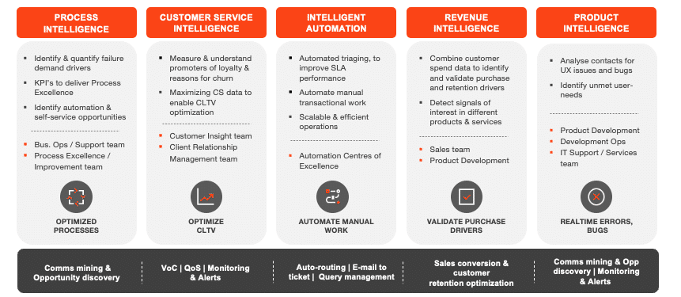
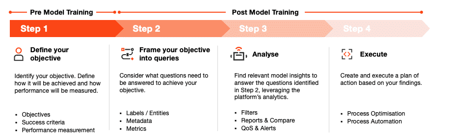

# [Using UiPath Communications Mining for Analytics and Monitoring](https://academy.uipath.com/courses/using-uipath-communications-mining-for-analytics-and-monitoring)

## 生成洞察的方法论

**Methodology for generating insights**

Communications Mining是一种工具，用于识别通信效率低下的地方、潜在的改进领域以及自动化的机会。

### “5个洞察支柱”框架

***\**\*‘5 Pillars of Insights’ framework\*\**\*** 

### 生成洞察的方法论

**Methodology to Generate Insights**

1.  **D****efining** your objectives
2.  **Framing** your objectives into queries
3.  **Analyzing** your data
4.  **Executing** on your findings

