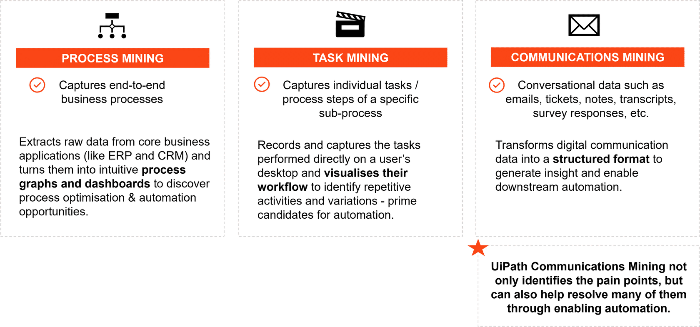

- UiPath Enterprise Trial
  - yxuehui@hinegroup.com
    - **5888-5761-2002-2481**

# [UiPath Communications Mining Overview](https://academy.uipath.com/courses/uipath-communications-mining-overview)

## 先决条件/演示环境设置

Prerequisites/Demo Environment Setup

see also [Communications Mining - Access via Automation Cloud.pdf](https://html.cdn.contentraven.com/crcloud/crscorm/uploads/uipath_lms_11218/encryptedfile/543372/v1.0/scormcontent/assets/xHOj9675axcOnQUi_4aMTOmHbjsBPwrDz-Communications%20Mining%20-%20Access%20via%20Automation%20Cloud.pdf)

###  Who can access?

To access Communications Mining via Automation Cloud, all the following conditions must be fulfilled: 

- Be a UiPath Cloud Enterprise customer 
- Have AI units available

### Access Summary 

| \#   | Task                                                         | Role(s) Responsible           |
| ---- | ------------------------------------------------------------ | ----------------------------- |
| 1    | Gain access to the platform via Automation Cloud             | Org Admin on Automation Cloud |
| 2    | Enable Communications Mining as a service on an Automation Cloud tenant | All users that require access |
| 3    | Create a ‘project’ on Communications Mining*                 | Org Admin on Automation Cloud |
| 4    | Add applicable users to that project, and specify their permissions* | Org Admin on Automation Cloud |

## **UiPath Communications Mining简介**

UiPath Communications Mining将非结构化的电子通信数据（例如电子邮件、工单、调查反馈、案例注释等）转换为结构化数据，以推动您组织中的行动和洞察力。

### **比较: Communications Mining vs. Process Mining and Task Mining**

## UiPath Communications Mining是如何工作的

UiPath Communications Mining提供强大的无代码自然语言处理解决方案，将无监督学习（**unsupervised learning**）与员工主导的主动学习（**employee-led active learning**）相结合，创建能够充分理解客户业务背景的模型。
