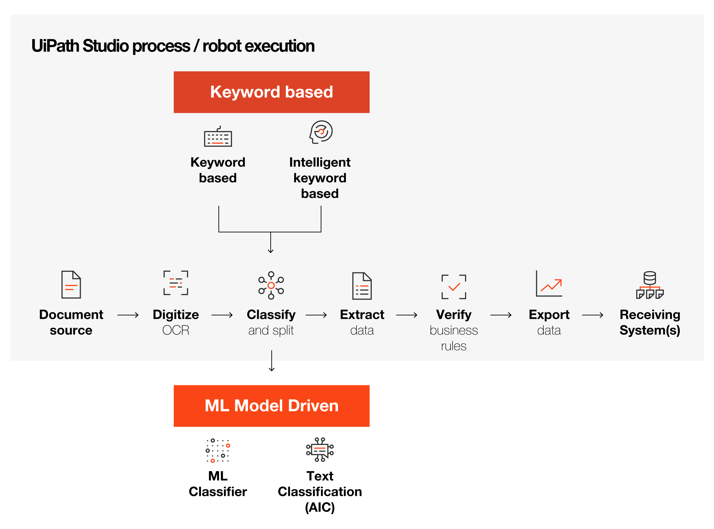

# [UiPath Document Understanding Overview](https://academy.uipath.com/courses/uipath-document-understanding-overview)

## Document类型

### **Forms and low-diversity Documents**

表单和低多样性文档（Forms and low-diversity documents）通常专注于以精确的格式收集信息，通过精确的区域引导填写者输入每一项数据。

这些文档有固定的格式，通常被称为表单。这些表单可以包含手写文本、签名和复选框。这些文档仅包含键值对和表格。

**Examples of structured documents:** Surveys, questionnaires, Tax forms. These contain exclusively key-value pairs and tables. 

### **Semi-structured documents** 

半结构化文档是不像结构化表单那样遵循严格格式的文档，它们不受指定数据字段的约束。这些文档没有固定的形式，但**遵循的格式足够常见**。它们包含像表格这样的固定和可变部分。它们也可能包含段落，但数据主要以键值对的形式存在。

**Examples of semi-structured documents:** Invoices, Receipts, Purchase Orders, Healthcare lab reports. 

### **Unstructured Documents**

非结构化文档是指信息并未按照清晰且结构化的模型进行组织的文档，它们没有固定的格式。这些文件都可以被人类轻易理解，但对于机器人来说则难度大得多。一些文档可能包含键-值对和表格，但大部分数据都以非结构化的形式存在于文本中。

**Examples of unstructured documents:** Contracts, Annual Reports. Some may contain key-value pairs and tables, but much of the data is in unstructured form inside the text.

Based on the classification of documents, there are two common types of data extraction methodologies:

## **UiPath Document Understanding架构**

## **Digitization**

Digitization是通过使用Optical Character Recognition（OCR）从给定文件中获取机器可读文本的过程。

### OCR engines

有如下OCR engines。 其中前三个是UiPath默认提供的。See https://docs.uipath.com/document-understanding/automation-suite/2022.10/user-guide/digitization-ocr-engines

- **UiPath Document OCR**

  Nearly all customers use UiPath Document OCR for printed text, checkboxes, handwritten text, signatures, barcodes, and QR codes.

- **UiPath Chinese-Japanese-Korean OCR**

  Print text;  Handwritten text.

- **Kofax Omnipage activity packs**

  Kofax OmniPage 是Kofax Incorporated 提供的光学字符识别(OCR) 应用程序。for printed text.

- **Google Cloud Vision OCR**

  https://cloud.google.com/vision/docs/languages

- **Microsoft Azure Computer Vision OCR**

- **Microsoft OCR** 

  deprecated - no longer supported by Microsoft

- **Tesseract OCR**

| **OCR Engine**                                               | **Activity Pack**                 | **Debug Logs Format in Logs Folder** | **Reports Confidence**                                       |
| :----------------------------------------------------------- | :-------------------------------- | :----------------------------------- | :----------------------------------------------------------- |
| [UiPath Document OCR](https://docs.uipath.com/activities/docs/ui-path-document-ocr) | `UiPath.OCR.Activities`           | `${date:format=yyyy-MM-dd            |  |
| [OmniPage OCR](https://docs.uipath.com/activities/docs/omnipage-ocr) | `UiPath.OmniPage.Activities`      | `${date:format=yyyy-MM-dd            |  |
| [Google Cloud Vision OCR](https://docs.uipath.com/activities/docs/google-cloud-ocr) | `UiPath.UIAutomation.Activities`  | `${date:format=yyyy-MM-dd            |  if **DetectionMode** is set to **TextDetection** (default) if **DetectionMode** is set to **DocumentTextDetection** |
| [Microsoft Azure Computer Vision OCR](https://docs.uipath.com/activities/docs/microsoft-azure-computer-vision-ocr) | `UiPath.UIAutomation.Activities`  | `${date:format=yyyy-MM-dd            |  if **UseReadAPI** is not selected (default) if **UseReadAPI** is selected |
| [Microsoft OCR](https://docs.uipath.com/activities/docs/microsoft-ocr) | `UiPath.UIAutomation.Activities`  | `${date:format=yyyy-MM-dd            |  |
| [Tesseract OCR](https://docs.uipath.com/activities/docs/google-ocr) | `UiPath.UIAutomation.Activities`  | `${date:format=yyyy-MM-dd            |  |
| [Abbyy Document OCR](https://docs.uipath.com/activities/docs/abbyy-document-ocr) | `UiPath.AbbyyEmbedded.Activities` | `${date:format=yyyy-MM-dd            |                               |

### **Is digitization the same as OCR?** 

No.

Digitization 是一个复杂的操作，其中OCR只是其中的一步。特别是在处理PDF文档的情况下，Digitization 算法包含了检测PDF是扫描版还是原生（native ）的逻辑，或者它是包含了扫描图像和原生文本的混合版。

常见的情况是文档是原生的，所以大部分的文本可以直接从PDF本身提取，但它也包含了一些需要使用OCR来读取的标志。Digitization 能够处理所有这些情况，确保在运行尽可能快速和轻便的同时，达到最大可能的文本检测准确性。

### **The capabilities of the available OCR engines**

| Engine                                    | Print | Handwriting | Checkboxes | Signature | Barcode | Languages                                                    |
| ----------------------------------------- | ----- | ----------- | ---------- | --------- | ------- | ------------------------------------------------------------ |
| UiPath Document OCR Cloud                 | ✔     | ✔           | ✔          | ✔         | ✔       | Print:  Latin based,     Handwriting (EN, FR, DE)            |
| UiPath Document OCR LocalServer           | ✔     | ✔           | ✔          | ✔         | ✔       | Print:  Latin based,     Handwriting (EN, FR, DE)            |
| UiPath  Chinese-Japanese-Korean OCR       | ✔     | ✔           | ✘          | ✘         | ✘       | Chinese  Japanese Korean                                     |
| Kofax  Omnipage activity packages         | ✔     | ✘           | ✘          | ✘         | ✘       | [https://docs.uipath.com/activities/docs/omnipage-ocr(opens   in a new tab)](https://docs.uipath.com/activities/docs/omnipage-ocr) |
| Google  Cloud Vision OCR                  | ✔     | ✔           | ✘          | ✘         | ✘       | [https://cloud.google.com/vision/docs/languages(opens   in a new tab)](https://cloud.google.com/vision/docs/languages) |
| Microsoft  Azure Computer Vision Read OCR | ✔     | ✔           | ✘          | ✘         | ✘       | https://learn.microsoft.com/en-us/azure/cognitive-services/computer-vision/language-support |

UiPath Document OCR Cloud了可以识别Checkboxes和Signatures。

## Classification

在Digitization 之后，文档被分类。在一个有多种文档类型的项目中，你需要知道你正在处理的是什么类型的文档，以便正确地提取数据。

这里的关键是，你可以在同一范围内使用多个分类器，你可以配置分类器，甚至在后续的过程中对它们进行训练。分类结果有助于在提取中应用正确的策略。

### 两大分类方法

- keyword-based
- ML-based classification

### 分类器（classifiers ）

| **Classifier name**                   | **Where is it?**                                             | **What does it do well?**                                    | **Can it split document packs?** | **Is it retrainable?** |
| ------------------------------------- | ------------------------------------------------------------ | ------------------------------------------------------------ | -------------------------------- | ---------------------- |
| **Keyword Classifier**                | Studio IntelligentOCR.Activities package                     | Classify documents exhibiting specific words which are known in advance. | No                               | Yes                    |
| **Intelligent Keyword Classifier**    | Studio IntelligentOCR.Activities package                     | Classify documents of different types (e.g. invoices versus passports).** ** | Yes                              | Yes                    |
| **Document Classifier/ML Classifier** | Document Understanding in Automation Cloud/Suite (AI Center must be enabled too) | Classify documents of different types (e.g. invoices versus passports).** ** | No                               | Yes                    |

### **Pre-trained classifiers**

这些分类器可以不经过训练直接拿来（out-of-the-box）用。详见[Pre-trained Extractors](https://docs.uipath.com/document-understanding/automation-cloud/latest/user-guide/out-of-the-box-pre-trained-ml-packages).

## Extraction

Extraction是获取你感兴趣的数据。例如，如果你想通过字符串操作从一个5页的文档中提取特定的数据，那将是相当麻烦的。但在文档理解框架中，你可以在同一范围应用中使用不同的extractors 来处理不同的文档结构。

### 四种Extraction方法

- Regex Extractor
- Form Extractor
- Forms AI
- Semi-structured AI

| **Extractor name**     | **Where is it?**                                             | **What does it do well?**                                    |
| ---------------------- | ------------------------------------------------------------ | ------------------------------------------------------------ |
| **RegEx Extractor**    | Studio IntelligentOCR.Activities package                     | Extracts single values with a known format on the page. Requires knowledge of Regular Expressions. |
| **Form Extractor**     | Studio IntelligentOCR.Activities package                     | Extracts regular values or simple tables from fixed forms. Requires some training to use effectively. |
| **Forms AI**           | Document Understanding in Automation Cloud/Suite (AI Center must be enabled too). Requires DocumentUnderstanding.ML.Activities in Studio | Extracts regular values or simple tables from fixed forms. Easy to use without special training. |
| **Semi-structured AI** | Document Understanding in Automation Cloud/Suite (AI Center must be enabled too)Requires DocumentUnderstanding.ML.Activities in Studio | Extracts regular or complex values or tables from complex documents. Ease of use depends on the complexity of the documen |

> **Forms AI is designed to work with fixed-form documents like tax forms, or ACORD forms. Semi-structured AI will work with a wide range of documents, including fixed forms, up to very high-diversity documents.** 

### **Pre-trained out-of-the-box extractors**

UiPath提供许多开箱机用的预训练模型。详见[Out-of-the-box Pre-trained ML Packages](https://docs.uipath.com/document-understanding/automation-suite/2022.10/user-guide/about-ml-packages#out-of-the-box-pre-trained-ml-packages)。

这些模型的优势如下：

- 开箱即用（out-of-the-box）模型的最大优点是你可以立即开始使用它们处理文档。

- 这些提取器接受PDF、PNG、JPEG和TIFF格式的文件，并且即使文档的格式发生变化，也能自动确定关键信息的位置。

- 它们不需要任何模板，可以自动识别并从你的文档中提取大量的实体。即使文档包含"噪声"，模型仍然会找到并提取相关的信息。

常用的有：

- **Invoices ML Extractor**: This model is suitable for processing invoices in English, Spanish, Portuguese, German, and Romanian languages.
- **Receipts ML Extractor**: This model is suitable for processing receipts in English, Spanish, German, French, Norwegian, Finnish, and Romanian languages.

## **Validation and Human-in-the-loop**

虽然UiPath的extraction 和classification 技术是最先进的（state of the art），但是实际实施中，总会碰到机器器人难以分类或其中有难以阅读的字段的文档。在这些情况下，Document Understanding框架提供了检测潜在错误并将文档路由到人工审查的能力。

### 三种UI

UiPath平台提供了三类user interfaces来进行手工的验证处理。

- Classification station or Validation station (in UiPath Action Center).

  **The Classification station** is used by invoking the **Present Classification Station** activity for attended robot use, or **Create Document Classification Action** activity for use with Action Center.

  **The Validation station** works in a similar way but applied to data extraction as opposed to document classification.

  

- Forms.

  create **Forms** using the **FormDesigner** which allows the creation of complex forms including a pdf document viewer pane. These can be done using the **UiPath.Form.Activities** to be used with attended robot, or using the **UiPath.Persistence.Activities.FormTask.CreateFormTask** if you prefer managing tasks in Action Center.

- Apps.

  If you desire a high degree of flexibility in customizing the validation interface and are willing to put in the required effort, you have the option to build a validation experience in **UiPath Apps**. Please see the Apps documentation guide [here](https://docs.uipath.com/apps/automation-cloud/latest). 

### **How are potential errors detected?**

Errors are detected in two ways:

1. By applying business rules。下面是一些例子。
   - Net amount plus tax amount must equal total amount.
   - Quantity multiplied by unit price must equal line amount.
   - Due date must come after the invoice date.
   - Sum of the line amounts must equal the net amount.
2. By applying confidence level thresholds.

### **How to retrain classifiers and extractors**

| Name                           | Training activity                      | Other components required                      |
| ------------------------------ | -------------------------------------- | ---------------------------------------------- |
| Keyword Based Classifier       | Keyword-Based Classifier Trainer       | -                                              |
| Intelligent Keyword Classifier | Intelligent Keyword Classifier Trainer | -                                              |
| Document Classifier            | Machine Learning Classifier Trainer    | AI Center scheduled Pipeline                   |
| Regex Extractor                | Not available                          | -                                              |
| Form Extractor                 | Not available                          | -                                              |
| Forms AI                       | Not available                          | -                                              |
| Semi-structured AI             | Machine Learning Extractor Trainer     | AI Center scheduled Pipeline, Document Manager |

## **First-party service**

UiPath Document Understanding 第一方（first-party）服务旨在成为与 UiPath 平台中所有文档理解能力的接口：通过训练机器学习模型建立分类器和提取器，预标签，标签等等。

## **DU组件**

主要有四大组件包。

- **UiPath.IntelligentOCR**
- **DocumentUnderstanding.ML**
- **UiPath.OCR**
- **Document Understanding process template**

### UiPath.IntelligentOCR

一旦安装了包，Taxonomy Manager wizard就会出现在 UiPath Studio 的顶部功能区。

主要的Activity有：

- **Taxonomy Manager** 
- **Digitize Document**
- **Classify Document Scope**
- **Data Extraction Scope** 
- **Classification Station and Validation Station**

### **DocumentUnderstanding.ML**

主要的Activity有：

- **ML Extractor**
- **ML Extractor Trainer**

### UiPath.OCR

主要的Activity有：

- **UiPath Document OCR**

  将此活动放入Digitize Document活动中，以使用UiPath Document OCR。

  确保为您的地区使用正确的端点：https://docs.uipath.com/document-understanding/automation-cloud/latest/user-guide/public-endpoints

  

- **OCR-Japanese Chinese Korean**

  将此活动放入Digitize Document活动中，以使用UiPath Document OCR-Japanese Chinese Korean。

  确保为您的地区使用正确的端点：https://docs.uipath.com/document-understanding/automation-cloud/latest/user-guide/public-endpoints

### DU Process template

**DU（Document Understanding） Process template**和Robotic Enterprise Framework类似，具有内置的逻辑、日志和配置能力，以及坚固的异常处理机制。

## DU项目的生命周期

| **Role**                      | **Responsibilities**                                         |
| ----------------------------- | ------------------------------------------------------------ |
| Automation Project Manager    | Responsible for overall project planning, execution, and delivery. |
| Automation Business Analyst   | Responsible for gathering and analyzing business requirements, identifying use cases, and documenting them. |
| Automation Solution Architect | Responsible for preparing the solution design document and move to production document. Also reviews code and ensures the developers have followed the best practices. |
| Automation Developer          | Responsible for developing and implementing the UiPath automation solution, including the selection of appropriate UiPath activities, and building the automation workflows. |
| Subject Matter Expert         | Experts in the specific domain of the project. They can provide valuable input on the requirements, limitations, and potential use cases of the project. In the case of Document Understanding, SME knowledge is especially important for providing context regarding the documents being used for the project. |
| End-User/s                    | The people who will be using the automation solution. They can provide valuable input on the usability, user-experience, and requirements. |
| IT/Operations                 | Responsible for the deployment, maintenance, and support of the systems and infrastructure needed for the project, including UiPath Orchestrator and the UiPath robots. |
| Quality Assurance             | Responsible for testing and validation of the automation solution, making sure it meets the requirements and standards. |

## **How does licensing work?**

### 总览

Licensing需要覆盖如下主键。

- Automation Developer licenses in order to build automation projects in Studio.
- Unattended/attended Robot licenses to run the automations.
- An Enterprise (or Enterprise Trial/Pro Trial) license for Automation Cloud/Automation Suite, with the Document Understanding, AI Center and Action Center third-party services enabled.
- AI units.

### **AI unit licensing**

AI units are the licensing units consumed in projects involving document understanding, machine learning, as well as any other AI capabilities.

You can buy packages of AI units, and they are consumed typically when doing classification and extraction in a AI unit/page system.

### **AI unit consumption**

Let's see which of the Document Understanding framework activities result in consumption of AI units:

- **Digitization**: the use of OCR engines doesn't result in AI unit consumption, although it may require a Document Understanding license (for the UiPath proprietary OCR engines) or external licenses for engines like Abbyy, Microsoft Azure Computer Vision OCR or Google Cloud Vision OCR. But there are also free OCR engines, like Omnipage OCR or Tesseract OCR.
- **Classification**: it may result in AI unit consumption for documents with more than 24 pages. Above this threshold, the consumption is incremental, but the maximum consumption will be 5 AI units no matter the number of pages. Keep in mind that the Keyword classifier is free.
- **Extraction**: it typically results in AI unit consumption, with the basic logic being 1 AI unit per page. Keep in mind that there are extractors which are either free (RegEx extractor) or cheaper (0.2 AI units/page).
- **Validation and Human in the loop**: this has no AI unit consumption attached.

> If the setup consists of Automation Cloud and first-party services, there are additional costs to the ones above. For hosting the machines, training models, and so on, an approximate +20% is added to the AI unit consumption mention above.

#### Examples

- Example 1

  A customer has a 3-page document, for which they use RegEx-Based

  Extractor and Form Extractor:

  • RegEx-Based Extractor: **free**

  • Form Extractor applied to 3 pages: 3 x 0.2 AI unit = **0.6 AI units**.

  In this example, **0.6 AI units** would be charged for processing a **3-page document**.

- Example 2

  A customer has a 10-page document, for which they use Intelligent Keyword Classifier and combine Form Extractor and ML Extractor:

  • Intelligent Keyword Classifier: **free (<24 pages)**

  • Form Extractor applied to 6 pages: 6 x 0.2 AI units = **1.2 AI units**

  • ML Extractor applied to 4 pages: 4 x 1 AI unit = **4 AI units**

  In this example, **5.2 AI units** would be charged for a **10-page document**.

- Example 3

  A customer has a 100-page document, for which they use ML Classifier, RegEx-Based Extractor, Intelligent Form Extractor, and ML Extractor (several extractors can be applied to the same page):

  • ML Classifier: **4 AI units for 100 pages**

  • RegEx-Based Extractor: **free**

  • Intelligent Form Extractor applied to 23 pages: 23 x 1 AI unit = **23 AI units**.

  • ML Extractor applied to 81 pages: 81 x 1 AI unit = **81 AI units**.

  • In this example, **108 AI units** would be charged for a **100-page document.**

# Old Course

**Digitize Document** activity

## Classify

- Classify Document Scope

  The Document Classification Scope Wizard will open at selecting the **Configure Classifiers** option and it allows users to customize which classifier will be used for each individual type of document. 

  It allows users to mix and match classifiers as well as use classifiers in parallel based on which one has the highest confidence level. 

- **Present Classification Station**

  In many cases, document files come as a "package": within the same file, there are multiple document types that contain different sets of information and which need to be treated separately as far as data extraction and post-processing goes.  

  The **Present Classification Station** allows you to:

  - manually "split" files into logical documents, by selecting a document type and a range of pages applicable for it;
  - verify any automatic classification and splitting of a file into logical documents and perform corrections to the automatically proposed classification and separation

### Practice

参考[**Practice - Setting up a Classifier**](https://academy.uipath.com/learningpath-viewer/3004/1/159302/3)

C:\xujian\eipi10\xuxiangwen.github.io\_notes\60-rpa\uipath\academy\processes\document_understanding\Practice_DocumentUnderstandingFramework_Classify

## Extract

**Data Extraction Scope**

几种抽取器：

- **Form Extractor**： 通过UI位置来抽取
- **RegEx Based Extractor**： 通过正则表达式来抽取
- **ML Extractor**：通过ML

### Practice

参考[**Practice - Setting up the Extractors**](https://academy.uipath.com/learningpath-viewer/3004/1/159302/3)

C:\xujian\eipi10\xuxiangwen.github.io\_notes\60-rpa\uipath\academy\processes\document_understanding\Practice_DocumentUnderstandingFramework_Classify

## Validate

**Present Validation Station**

### Practice

参考[**Practice - Setting up the Extractors**](https://academy.uipath.com/learningpath-viewer/3004/1/159302/3)

C:\xujian\eipi10\xuxiangwen.github.io\_notes\60-rpa\uipath\academy\processes\document_understanding\Practice_DocumentUnderstandingFramework_Classify

## post-processing

**Train Classifiers Scope**

By now you should be familiar with the structure of the Intelligent OCR activities. 

What this activity brings together is the ability to train your classifiers using either the output of the Classification Station (by using the Human Validated Classification Data input), or the output of the Validation Station (by using the Human Validated Data input) - as both sets of information are human confirmed and can be ingested by classifiers to self-learn. 

### Practice

参考[**Practice - Exporting the Data and Training the Classifiers**](https://academy.uipath.com/learningpath-viewer/3004/1/159302/3)

C:\xujian\eipi10\xuxiangwen.github.io\_notes\60-rpa\uipath\academy\processes\document_understanding\Practice_DocumentUnderstandingFramework_Classify