# [The Document Understanding Process Template in Studio](https://academy.uipath.com/courses/the-document-understanding-process-template-in-studio)

## **What is the Document Understanding process template?**

The Document Understanding Process is a fully functional UiPath Studio project template based on a document processing flowchart. It aims to offer a document understanding automation tool that is easy to use and easy to execute for any developer who wants to start working, either on a simple demo or on a large-scale implementation.

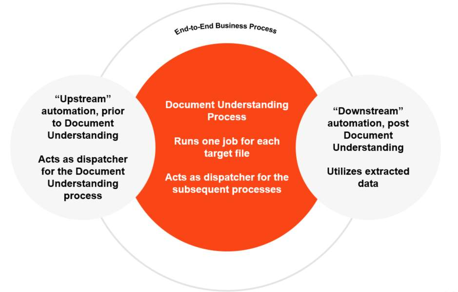

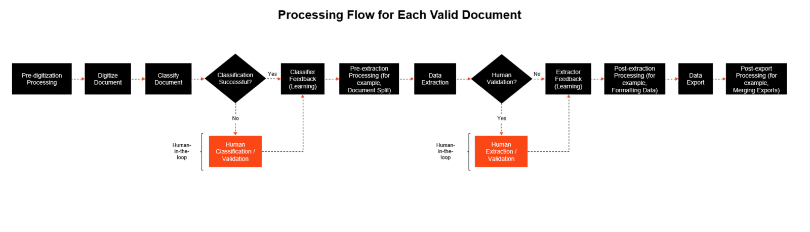

## **The architecture of the Document Understanding process template**

总体上提供两种方式，Attended 和 Unattended 

### **Attended Processes**

1. **Main for attended processes**. Right-click Main-Attended.xaml and set it as the Main workflow for the project.

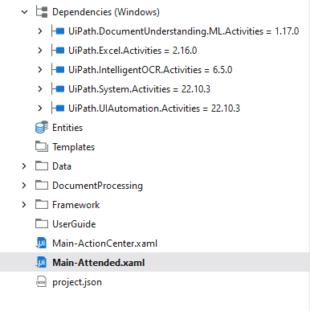

2. **Disable Background Running and Persistence Support**

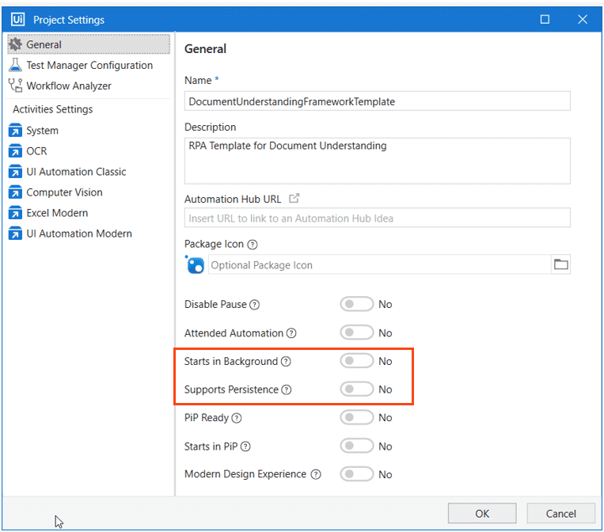

### **Unattended Processes**

1. **Main for unattended processes**. Right-click Main-ActionCenter.xaml and set it as the Main workflow for the project.

   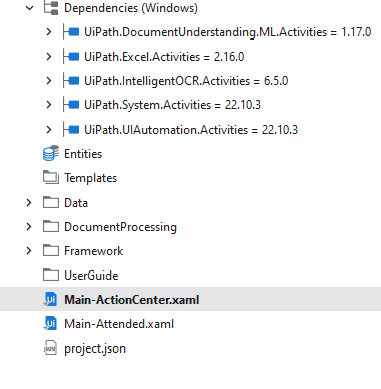

2. **Enable Persistence Support**

   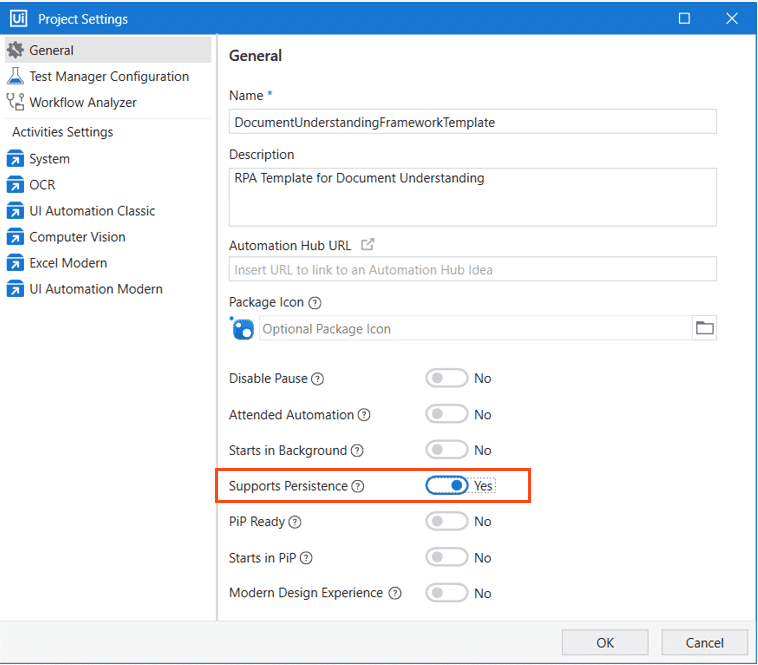

### **The custom success logic**

自定义成功的逻辑，我们希望不是每一次都需要人工验证。下面是两次，进行人工定义的地方。

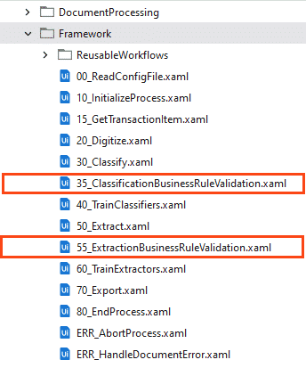

#### 35_ClassificationBusinessRuleValidation

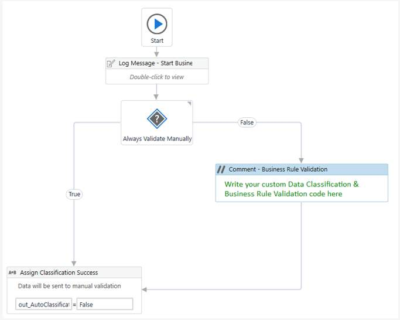

下面试一个自动以的例子。

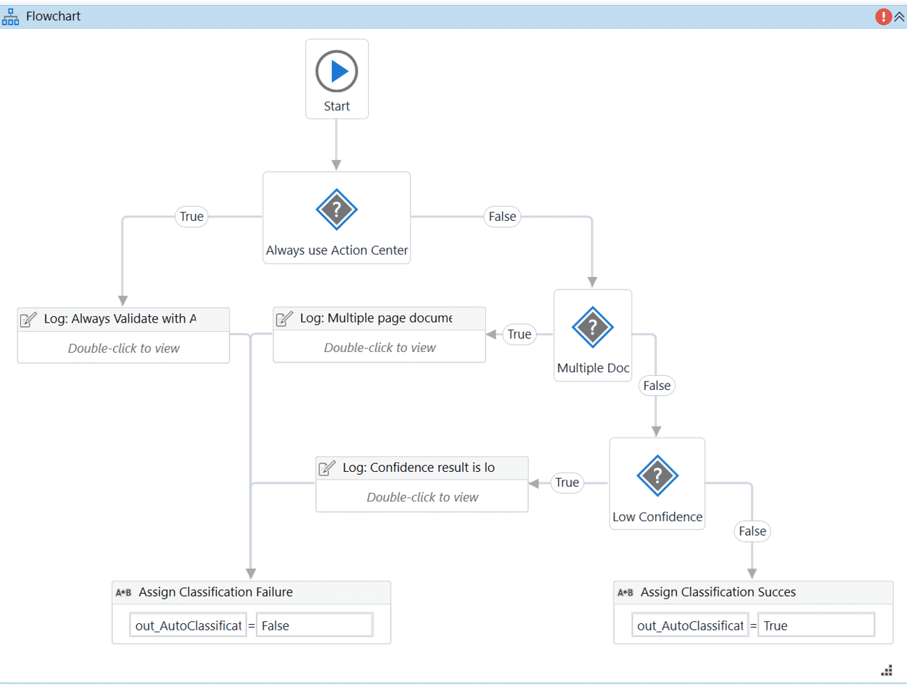

#### 55_ExtractionBusinessRuleValidation

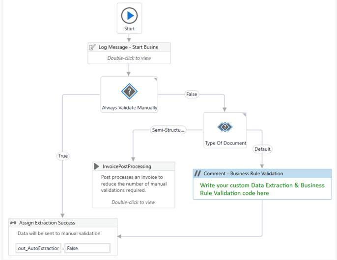

### **Invoice post-processing implementation**

For the invoice document type, a standard workflow is available that validates six business rules:

- Verify that all mandatory fields and columns are extracted.
- Verify that all table rows match the rule: Quantity * Unit Price = Line Amount.
- Verify that the sum of all Line Amounts = Net Amount.
- Verify the sum of the Net Amount and all fields defined as SubTotalAdditions = Total.
- Verify the extraction confidence of all defined ‘ConfidenceFields’ against their individual confidence thresholds.
- Verify the extraction confidence of all the other fields against the ‘other-Confidence’ threshold.

> **These rules should NOT be used as-is, except for demo purposes. For a real implementation, post-processing and validation should be tailored to the specifics of the business process.**

### Error handling

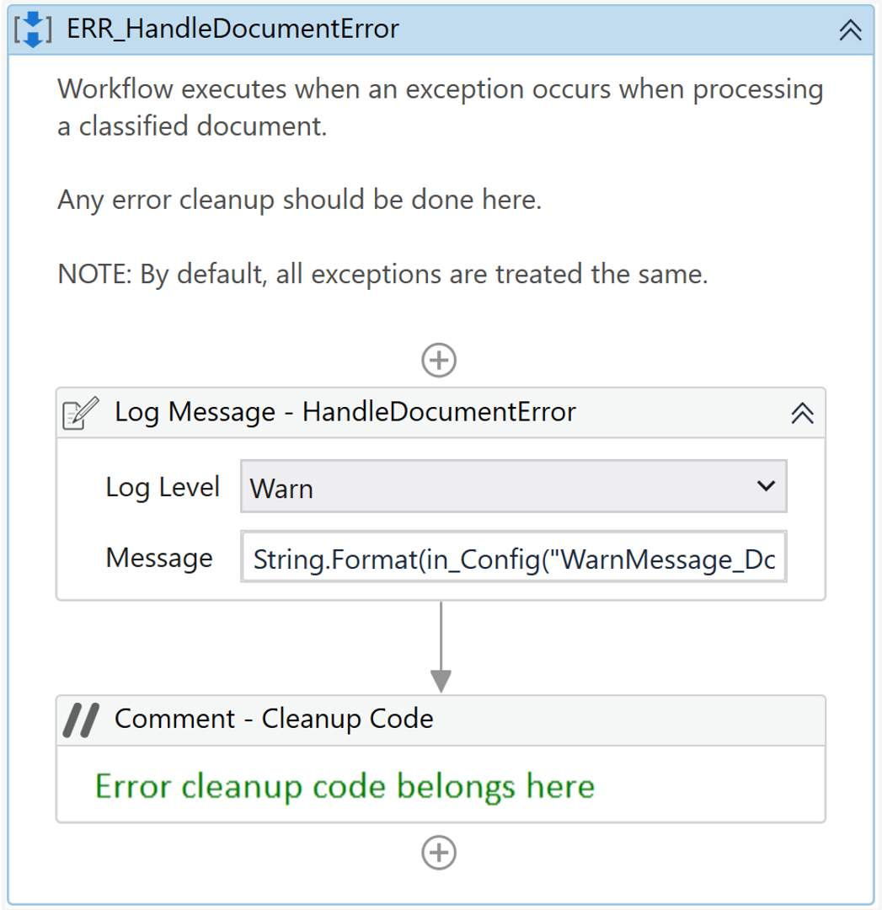

## **The Document Understanding process template in action**

### [Example: Dispatcher_Invoice_Processing](C:\Users\xu6\OneDrive - HP Inc\Desktop\xujian\eipi10\xuxiangwen.github.io\_notes\60-rpa\uipath\academy\processes\du_process_template\Dispatcher_Invoice_Processing)

### [Example: Performer_DU_Invoice](C:\Users\xu6\OneDrive - HP Inc\Desktop\xujian\eipi10\xuxiangwen.github.io\_notes\60-rpa\uipath\academy\processes\du_process_template\Performer_DU_Invoice)

## **The** **UiPath Document Understanding** **architecture and licensing**

目前，UiPath 平台提供的文档理解服务为第一方服务，既可以在云端使用，也可以在本地部署（on-premise）使用。

在云端，可以使用公共服务或云租户来访问文档理解功能，而在本地部署时，可以通过在线模式或空气隔离模式（the air-gapped mode）来访问。

此外，文档理解模型还可以通过混合模式进行访问。

### 五种DU架构

#### In cloud: using public services

- All services are hosted in the UiPath cloud. 
- It is possible to utilize ML models as public Software as a Service (SaaS) endpoints. 
- The licensing servers in the UiPath cloud track licensing and consumption.

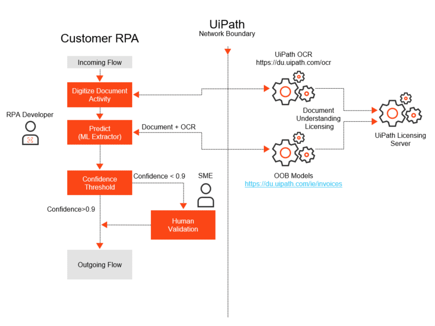

#### In cloud: using a cloud tenant

- All services are hosted in the UiPath cloud. 
- ML models are deployed in cloud AI Center. 
- The licensing servers in the UiPath cloud track licensing and consumption.

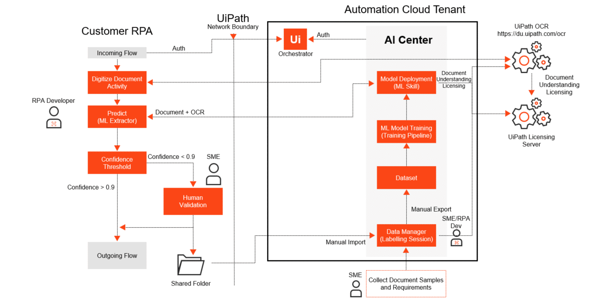

#### On-premises: online

- Orchestrator and AI Center are deployed on-premises. 
- ML models are deployed to on-premises AI Center.
- The licensing servers in the UiPath cloud track licensing and consumption.

This installation is the default and recommended on-premises installation that is easier to install, manage, and update. 

No customer data leaves the customer's premises; only metering data is sent to UiPath.

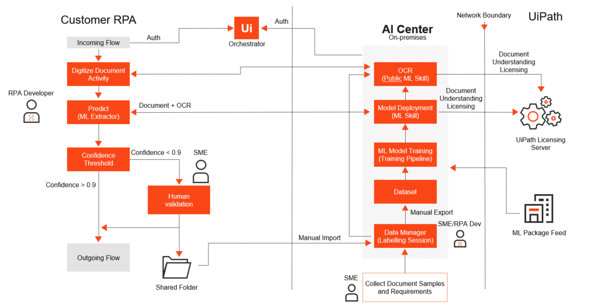

#### On-premises: air-gapped

- Orchestrator and AI Center are deployed on-premises. 
- ML models are deployed to on-premises AI Center.
- Licensing and consumption are tracked in the Orchestrator instance (v20.10 is required). 

This installation is more difficult to install, manage, and update than the online one. 

No customer data leaves the customer's premises.

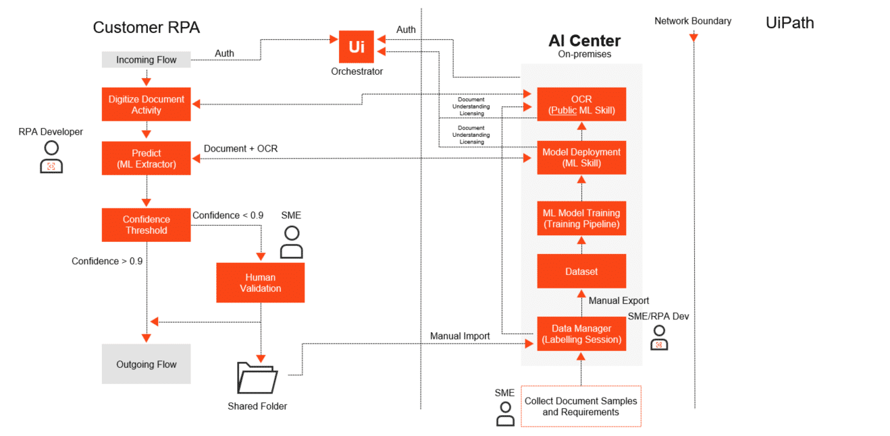

#### Hybrid: for Document Understanding models only

A new deployment option to make things easier is to have Orchestrator and robots on-premises and AI Center in cloud. This is applicable only to the Document Understanding models.

You can open ML skills as public endpoints in AI Center in cloud and call them from your robots connected on-premises. 

The licensing servers in the UiPath cloud track licensing and consumption.

### **Document Understanding licensing**

When we talk about licensing in the broader context of document understanding, we have the following components:

- Automation Developer licenses in order to build automation projects in Studio.
- Unattended/attended Robot licenses to run the automations.
- An Enterprise (or Enterprise Trial/Pro Trial) license for Automation Cloud/Automation Suite, with the Document Understanding, AI Center and Action Center third-party services enabled.
- AI units.

#### **AI unit licensing**

AI unit是在涉及文档理解、机器学习以及其他任何 AI 功能的项目中消耗的许可单位。

您可以购买AI unit的套餐，这些单位通常在 AI unit/page 系统中的分类和提取过程中被消耗。

Let's see how the consumption varies between on-prem and cloud:

- **For on-prem**

  It's a pretty straightforward machine-learning extractor using 1 AI unit per page.

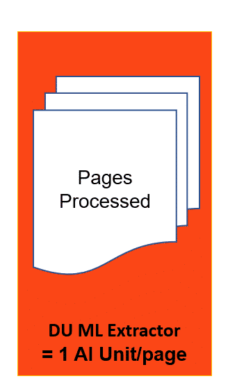

- **For cloud**

  - For the user Automation Cloud base, it's the same unit cost per page for the ML Extractor. 
  - You also need to take into consideration the compute charges for automation cloud, and a typical recommendation is about twenty percent additional AI units. 
  - This will cover the hosting machine, the machine learning skill, the training of the machine learning model which is GPU intensive, and then both for production and development test environments.

  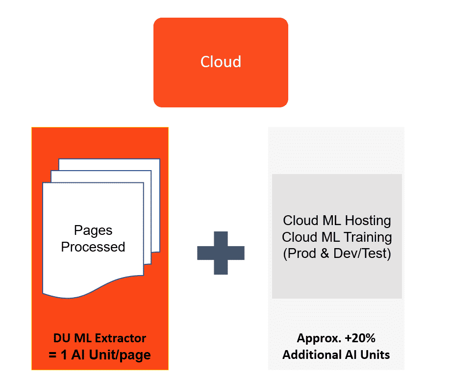

### **Classification pricing: Intelligent keyword classifier and ML classifier**

| **Document pages** | **AI Units needed** |
| ------------------ | ------------------- |
| 1-24               | 0                   |
| 25-49              | 1                   |
| 50-74              | 2                   |
| 75-99              | 3                   |
| 100-124            | 4                   |
| 125+               | 5                   |

#### **Key takeaways**

- The majority of classification scenarios will be free.
- Classification charges are capped at 5AI units per document.
- Classification charges are in addition to any charges incurred for extraction.
- Document splits do not incur charges.

### **Extraction pricing: Form extractor, Intelligent form extractor, Forms AI, and ML extractor**

| **Extractor**              | **AI unit charge per document page** |
| -------------------------- | ------------------------------------ |
| Form extractor             | 0.2                                  |
| Intelligent form extractor | 1                                    |
| Forms AI                   | 1                                    |
| ML extractor               | 1                                    |

- Most extraction costs 1 AI unit per extracted page.
- Form extractor use costs only 0.2AI units per extracted page.
- Recommend using classification/ document splitting to reduce extraction charges
- "Predict" usage inside Document Manager counted and charged as an extraction call.

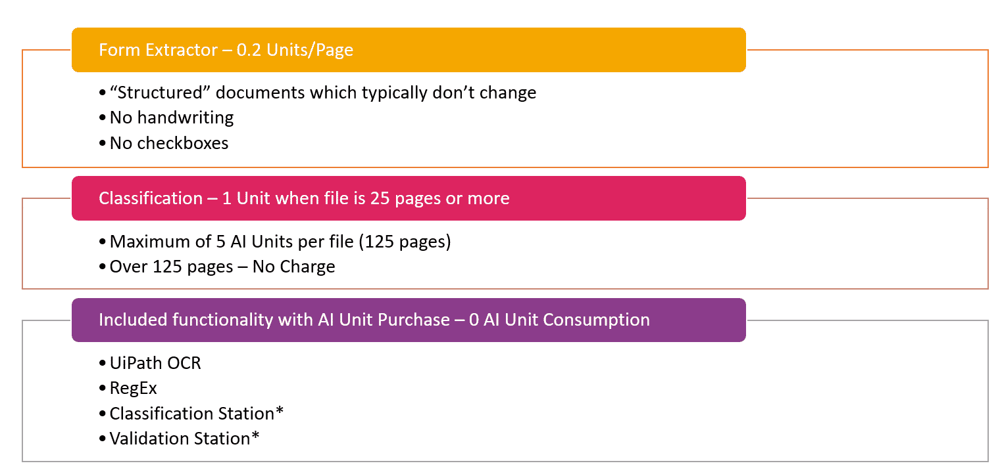

## **Exercise: Integrating solutions into a project**

### [Exercise: ILT_DU_Day3_Dispatcher](C:\Users\xu6\OneDrive - HP Inc\Desktop\xujian\eipi10\xuxiangwen.github.io\_notes\60-rpa\uipath\academy\processes\du_process_template\Integrating_Solutions\DUProcessTemplateSolution\ILT_DU_Day3_Dispatcher)

### [Exercise: ILT_DU_Day3_DU_Framework](C:\Users\xu6\OneDrive - HP Inc\Desktop\xujian\eipi10\xuxiangwen.github.io\_notes\60-rpa\uipath\academy\processes\du_process_template\Integrating_Solutions\DUProcessTemplateSolution\ILT_DU_Day3_DU_Framework)

### [Exercise: ILT_DU_Day3_DU_Framework_FullExercise](C:\Users\xu6\OneDrive - HP Inc\Desktop\xujian\eipi10\xuxiangwen.github.io\_notes\60-rpa\uipath\academy\processes\du_process_template\Integrating_Solutions\DUProcessTemplateSolution\ILT_DU_Day3_DU_Framework_FullExercise)

## **Solve a challenge with the help of the UiPath community**

在这部分的练习中，您将使用Document Understanding process template来解决采购 purchase order automation 的挑战，重点是一种更有组织和系统的方法。目标不仅是automate purchase order processing ，而且要在 Document Understanding process template and validations上予以强调。

您将扮演自动化开发人员的角色，负责为您的组织自动化采购订单处理工作流。您的任务是设计并实施一个稳健的自动化解决方案，以简化以下关键步骤：

1. 将文档分类为正确的类型
2. 从文档中提取关键信息
3. 对提取的数据进行验证
4. 将验证后的信息写入 Excel 文件，以便相关员工进一步处理

###  **purchase order** documents.

| **Field name**          | **Notes**       | **Cross-validation logic**                                   |
| ----------------------- | --------------- | ------------------------------------------------------------ |
| Purchase order number   | Mandatory field |                                                              |
| PO Date                 | Mandatory field |                                                              |
| Client name             | Mandatory field |                                                              |
| Client address          | Mandatory field |                                                              |
| Vendor name             |                 |                                                              |
| Vendor address          |                 |                                                              |
| Shipping name           |                 |                                                              |
| Shipping address        |                 |                                                              |
| Net amount              |                 | Total of all Line Amount values                              |
| Tax amount              |                 |                                                              |
| Total amount            | Mandatory field | Net Amount + Tax Amount (Total should match the value of Total Amount) |
| Line item - description |                 |                                                              |
| Line item - unit price  |                 |                                                              |
| Line item - quantity    |                 |                                                              |
| Line item - line amount | Mandatory field | Unit Price * Quantity (The calculated amount should match the Line Amount of each line) |

### **Required data extraction validation logic**

- All mandatory fields should be extracted and cannot be empty.
- Mandatory fields should have a confidence level above 80%.
- Mandatory numeric fields (Total Amount & each Line Amount) should have values. 
- Perform cross-validation for all requested fields using the provided formulas. For example, cross-validate the extracted Net Amount by calculating the total of all line amounts.  
- The Validation Station/ Action Center should only be used for documents that fail automatic verification and the logic should be defined.

### **Required business rule validations**

- The total of the PO should be less than $20,000. If there are POs above this limit, they should be directed to the Action Center for manual validation. The user's expertise helps them determine whether to give the OK to such POs or not. If the user rejects a PO, it should be logged in a text file. The structure of the exception text file is described in the next section. 
- The Purchase Order date should always be greater than the year 2021. If the PO Date refers to a date prior to year 2021, it should be manually verified by the user. The bot should log the reason for rejection in a text file if the user rejects the PO.

### **Exception notes text file**

- Only one Exception.txt should exist. 
- It should contain only the POs that the user rejects via manual verification.
- The file should log the exception in the following format: **<File Path: > “ | ” <Exception Message>** 
- Each exception should be logged in a new line.

### **Download - sample documents**

[**Must Execute Documents zip**](https://html.cdn.contentraven.com/crcloud/crscorm/uploads/uipath_lms_11218/encryptedfile/581997/v2.0/scormcontent/assets/EPJvNW/Must%20Execute%20Documents.zip)

Process the documents located in the **Must Execute Documents** **zip** folder exclusively through the Document Understanding workflow.

[**Other Documents zip**](https://html.cdn.contentraven.com/crcloud/crscorm/uploads/uipath_lms_11218/encryptedfile/581997/v2.0/scormcontent/assets/5PdvJp/Other%20Documents.zip)

Use the documents enclosed within the **Other Documents zip** folder for model training. The division of documents for training and execution should be determined according to the best practices and your discretion. 