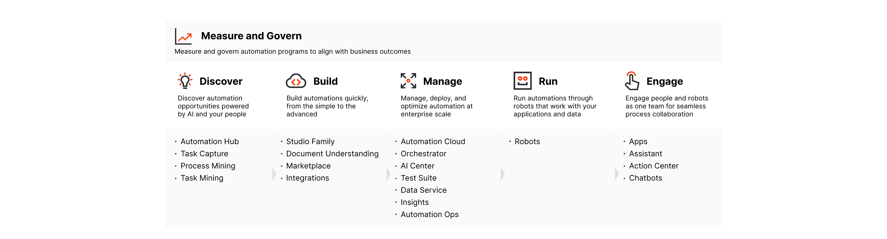
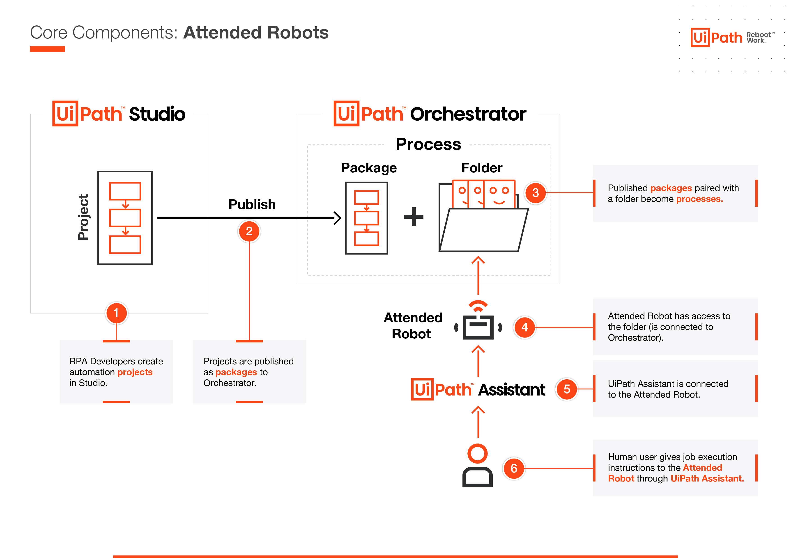
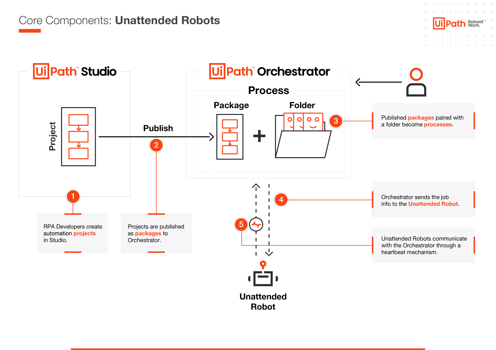
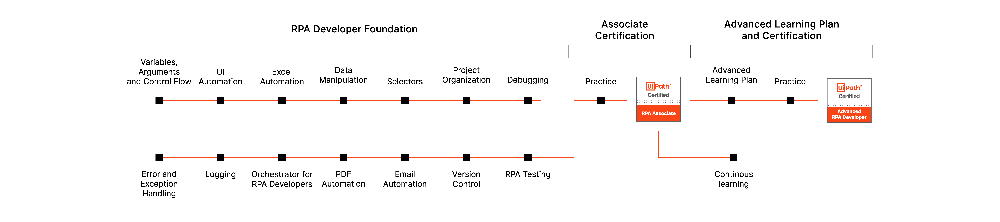

# [Get Started with RPA Development](https://academy.uipath.com/learningpath-viewer/6047/1/250076/11)

## [**UiPath Platform Overview**](https://academy.uipath.com/learningpath-viewer/6047/1/250076/11)

### Introducing the Studio-Robot-Orchestrator ecosystem

- UiPath Studio

  UiPath Studio is an integrated development environment for RPA developers to design, develop, and debug automation projects. Studio connects with Orchestrator to publish automated processes as NuGet packages to feeds. From there, they are distributed to robots to be executed. 

  - **StudioX** is meant for business users looking to automate tasks for themselves and their immediate teams. 

  - bullet

    **Studio** is meant for RPA developers looking to build complex unattended or attended process automations.  

  - bullet

    **Studio Pro** is meant for more advanced developers. This more advanced IDE contains test automation tools, RPA testing, and advanced coding services.

- UiPath Robot

  A software robot is an execution agent that runs automations built with the Studio family and then published as packages either locally, or to Orchestrator. 

  - **Attended robots**

     They work on the same machines as humans, during the same hours. They are triggered directly by humans (usually through UiPath Assistant) or by an event related to what the human user does.

    **UiPath Assistant** is the component that provides a friendly interface to interact with attended robots. It is the tool that we use to easily access, manage, and run automations.  

  - **Unattended robots**

    They are deployed on separate machines and their jobs are triggered exclusively from Orchestrator.

- UiPath Orchestrator

  Orchestrator, the heart of automation management, is a web application that allows managing, controlling, and monitoring the robots and the automations. 

  The main capabilities of Orchestrator:

  - **Provisioning**: Creates and maintains the connection with robots.
  - **Control and license distribution**: Enables the creation, assignment and maintenance of licenses, roles, permissions, groups, and folder hierarchies. 
  - **Automation storage and distribution**: Allows the controlled storage and distribution of automation projects, assets, and credentials, as well as large files used in automations. 
  - **Running automation jobs in unattended mode**: Enables the creation and distribution of automation jobs in various ways, including through queues and triggers.
  - **Monitoring**: Allows monitoring of jobs and robots and stores logs for auditing and analytics.

## [**UiPath First Run**](https://academy.uipath.com/learningpath-viewer/6047/1/250076/11)

## [**Your Learning Journey**](https://academy.uipath.com/learningpath-viewer/6047/1/250076/11)

## [**Build Your First Automation Process**](https://academy.uipath.com/learningpath-viewer/6047/1/250076/11)

RPA Challenge Website: https://rpachallenge.com/ 

这个网站里面可以去测试RPA程序是否能适应变化的UI。

