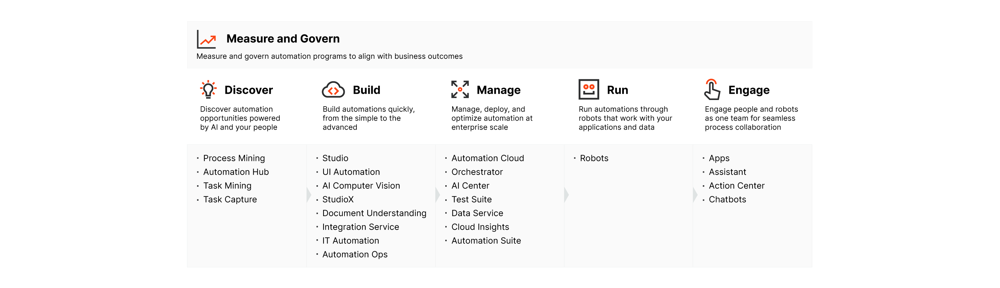
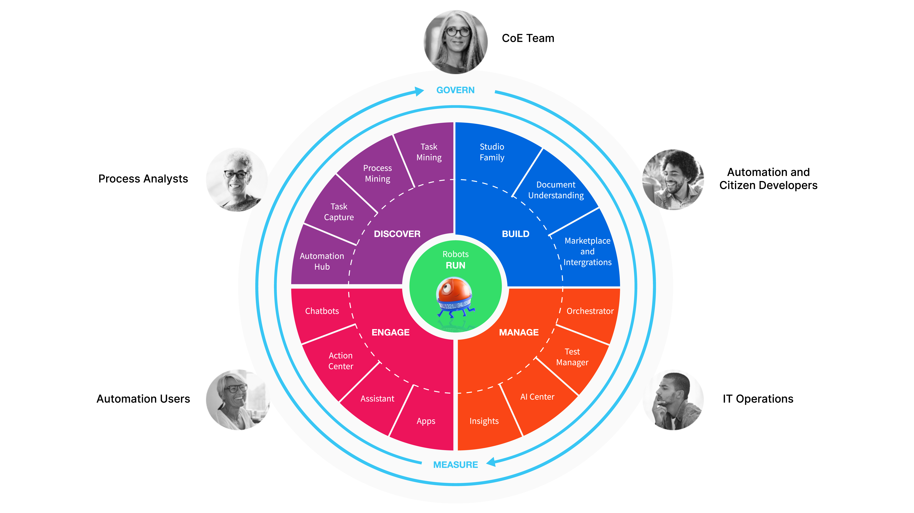

# [Introduction to RPA and Automation](https://academy.uipath.com/learningpath-viewer/5636/1/199653/2)

## [What Is RPA? What Is Automation?](https://academy.uipath.com/learningpath-viewer/5636/1/199653/2)

- **RPA:**
  - is the technology that allows computer software to mimic actions typically performed by humans.
  - is non-invasive and scalable.
  - can work in any industry, especially when combined with AI.
  - reduces costs rapidly and increases ROI.
  - can automate highly manual, repetitive and rule-based processes, with low exception rates and a standard electronic readable input.
- **A robot** is the computer software that executes automations. They are as accurate as the instructions people create for them.
- **Digital transformation** refers to technology, as well as people. Employee upskilling is key when it comes to a successful transformation.
- **Can anyone build an automation?** Short answer: **yes**. Stick around and discover how you could do it, too!

## [**Automation Is Driving the Digital Transformation**](https://academy.uipath.com/learningpath-viewer/5636/1/199653/2)

Digital transformation can be anything from IT infrastructure modernization to optimization or new digital business models. 

- **Is RPA the only technology available for Business Process** **Automation****?**
  No. Today, multiple technologies revolve around RPA to enhance automation results.
- RPA alone can process solely structured digital documents. Together with **AI** and **ML** models, it can process, for example, scanned invoices—which are unstructured, digitally converted documents. 
- RPA interacts with an application through the User Interface. With **Native Integrations**, automation development is much simpler for commonly used applications like SAP or Salesforce.

- **Advanced analytics** help you measure automation performance against business KPIs (like time or money saved).

- **Long-running workflows** enable you to orchestrate complex automated processes. It facilitates synchronous and asynchronous interactions between human users and robots for maximum effectiveness and resource allocation.

- **Process Mining** **and Task Mining** allow you to scientifically discover automation use cases in the organization by analyzing back-end and front-end data.

## [**Automation in Business**](https://academy.uipath.com/learningpath-viewer/5636/1/199653/2)

- **Automation is industry agnostic** - no matter how you look at it, there are automation use-cases in any business.
- **Automation doesn't just impact revenue and time** - automating repetitive tasks also leads to an improved customer and employee experience, eases the AI operations, ensures compliance, and makes the decision-making process faster.

## [**The Automation Journey**](https://academy.uipath.com/learningpath-viewer/5636/1/199653/2)

- **Mary** - the citizen developer who uses StudioX to automate her repetitive tasks.
- **John** - the Business User who submits an automation idea in Automation Hub and uses the automations built by the professional automation developer team in the CoE, through UiPath Assistant.
- **Automation** **developers**—who use Studio, Document Understanding, and AI Center to build automations.
- **Ian** from the IT Ops Team—who makes sure all developers and automations follow company-wide standards and guidelines.

In the PDF file below, you will find an overview of the UiPath Platform, what role uses a certain product and a use-case example. 

https://html.cdn.contentraven.com/crcloud/crscorm/uploads/uipath_lms_11218/encryptedfile/199653/v7.0/scormcontent/assets/6WQV5vqvVRxprZwu_OaUt0KCweQtHpTAc-The%20UiPath%20Platform.pdf

## [**How Else Can I Continue My Learning Journey?**](https://academy.uipath.com/learningpath-viewer/5636/1/199653/2)

How Should I Continue My Learning Journey...

https://html.cdn.contentraven.com/crcloud/crscorm/uploads/uipath_lms_11218/encryptedfile/199653/v7.0/scormcontent/assets/0NSqQ-A8akiD_oQE_8EPnYfsuto-Rerl9-How%20Should%20I%20Continue%20My%20Learning%20Journey%20on%20the%20UiPath%20Academy_with%20links.pdf

For RPA Developer: 

- [UiPath RPA Associate Certification Training](https://academy.uipath.com/learning-plans/uipath-rpa-associate-certification-training)
- [UiPath Advanced RPA Developer Certification Training](https://academy.uipath.com/learning-plans/uipath-advanced-rpa-developer-certification-training)
- [RPA certification](https://www.uipath.com/learning/certification)
- [RPA Solution Architect](https://academy.uipath.com/learning-plans/rpa-solution-architect-foundation-) 

## [**Learning Resources**](https://academy.uipath.com/learningpath-viewer/5636/1/199653/2)

The UiPath Platform

https://html.cdn.contentraven.com/crcloud/crscorm/uploads/uipath_lms_11218/encryptedfile/199653/v7.0/scormcontent/assets/eGudyXvHL_fSPkuC_eYeTJDhr5l7caQdV-The-UiPath-Platform.pdf
