# [SAP Automation with Studio](https://academy.uipath.com/learningpath-viewer/2252/1/155320/3)

## Supported SAP WinGUI Elements

参见https://docs.uipath.com/studio/standalone/2023.4/user-guide/supported-sap-wingui-elements

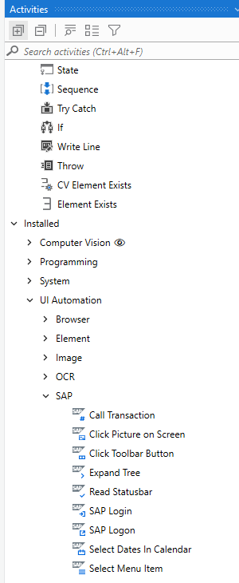

# SAP Scripting Interface

## **SAP WinGUI** 

SAP WinGUI is the **most commonly used interface** for accessing SAP functionalities in: 

- **SAP applications**, such as SAP ERP, SAP ECC, SAP S/4 HANA 
- the family of **SAP Bussines Suite applications**, such as SAP BI/BW, SAP CRM, SAP PLM.

**UiPath Studio** and **Robots** require **SAP WinGUI scripting to be enabled** on the **local machine**, as well as on the **server side**. 

### **Certification**

UiPath has certified integration with SAP S/4 HANA and SAP ECC for SAP WinGUI automation. 

## Supported SAP WinGUI versions

The below versions of SAP WinGUI are supported for Windows 7 and Windows 10, both architecture types (32-bit and 64-bit). **SAP Logon** and **SAP Logon Pad** are supported on all versions:

- SAP WinGUI 7.40
- SAP WinGUI 7.50
- SAP WinGUI 7.60

# **SAP Configuration Steps**

## Server Side SAP Configuration

**Important:** This part of the configuration can only be done by the System Administrator. 

## Client Side SAP Configuration

### Enable Scripting on the Client Side

See also https://help.sap.com/docs/intelligent-robotic-process-automation/desktop-studio-developer-guide/enabling-scripting-on-client-side

1. Open **SAP GUI configuration**.

   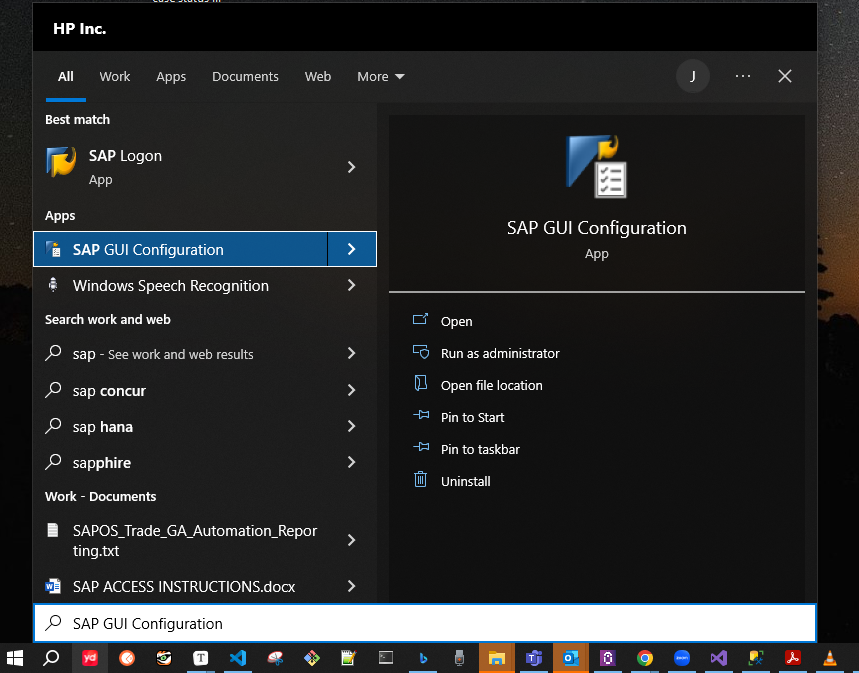

2. Navigate to **Accessibility & Scripting** and Choose **Scripting** and check that only **Enable Scripting** is selected (the other options are not required).

   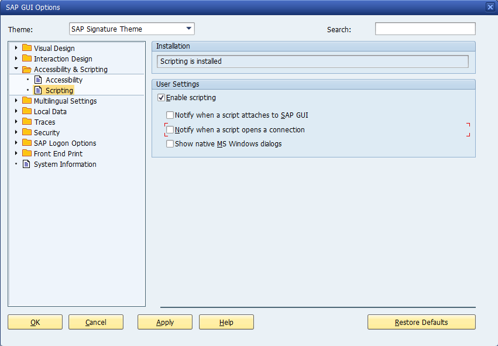

### Enable **High-Speed Connection** 

1. Right click the connection.

   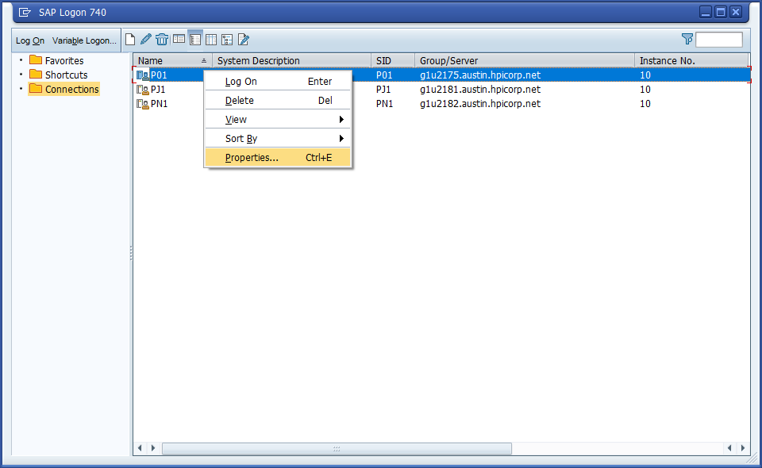

2. check High Speed Connection (LAN).

   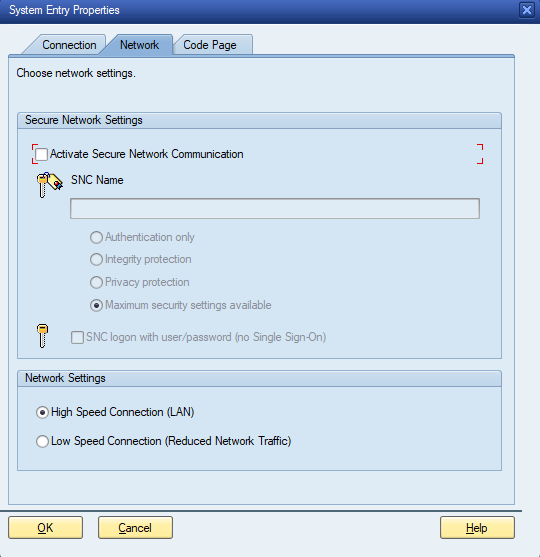

### Set Default Action to Allow

1. Open **SAP GUI configuration**. 

2. Navigate to **Security** and Choose **Security Settings** and Make sure Default Action is Allow.

   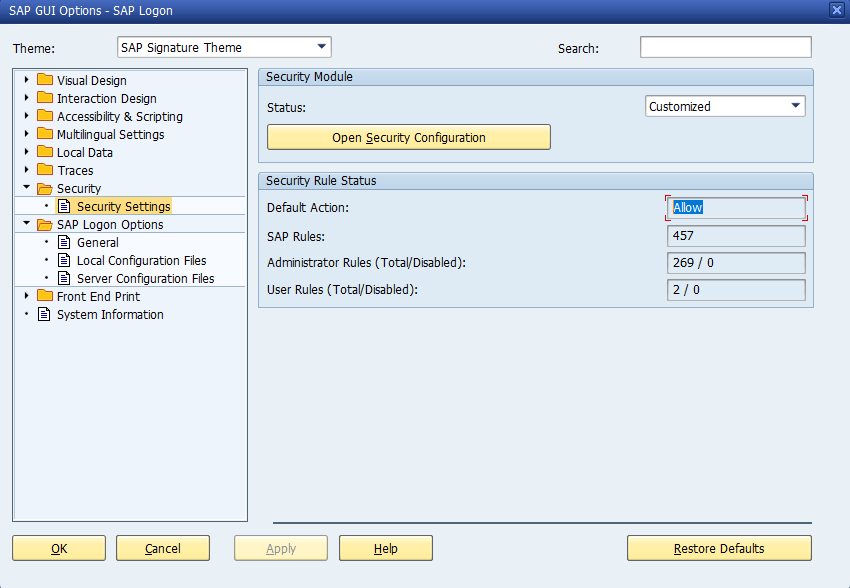

### Enable Modal Dialog

参见https://docs.testarchitect.com/automation-guide/application-testing/testing-sap-applications/troubleshooting-sap/how-to-activate-sap-gui-scripting/#concept_afk_5kt_jdb__section_oqy_hwg_2kb

You have to activate modal dialog boxes on the client to steer SAP applications.

1. Open the SAP GUI window and select the menu entry Help → Settings… on any screen.

   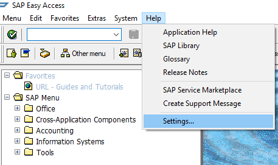

2. Switch to the **F1 Help** tab and select the option **In Modal Dialog Box** in the Display section.

   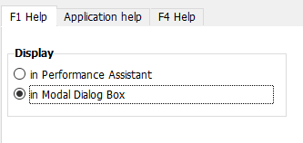

3. Switch the **F4 Help** tab and select the option **Dialog (modal)** in the **Display** section.

   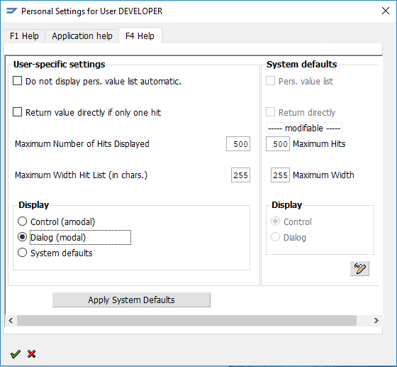

4. Confirm by clicking on the green check mark

    button.

   

   Note:

   Please note, that this is a per-user setting. The settings have to be configured on each client you want to test your application with. The SAP system administrator can set up the system default as Dialog (modal).

# **Connecting to SAP WinGUI and Calling Transactions**

项目位置：C:\xujian\eipi10\xuxiangwen.github.io\_notes\60-rpa\uipath\academy\processes\sap_automation\1 Connecting to SAP WinGUI

用到了三个主要的Activity。

- SAP Logon
- SAP Login
- Call Transaction

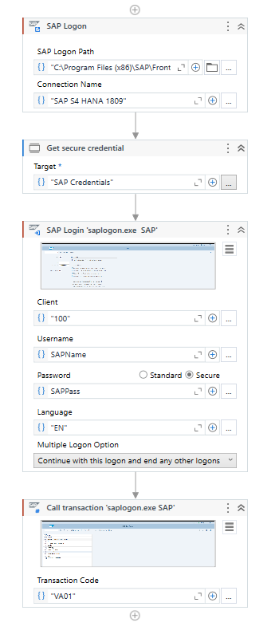

# **Creating a Purchase Order**

项目位置：C:\xujian\eipi10\xuxiangwen.github.io\_notes\60-rpa\uipath\academy\processes\sap_automation\2 Creating a Purchase Order

需要注意的是：

- 使用`[k(enter)]` in Type Into Activity

  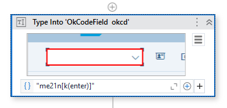

- 使用*

  **Wildcards** are useful when **selectors** **frequently change** - the screen ID from SAP is a good example. Adding a wildcard instead of the screen ID within the selector ensures that the selector will **remain stable and valid** throughout the automation.

  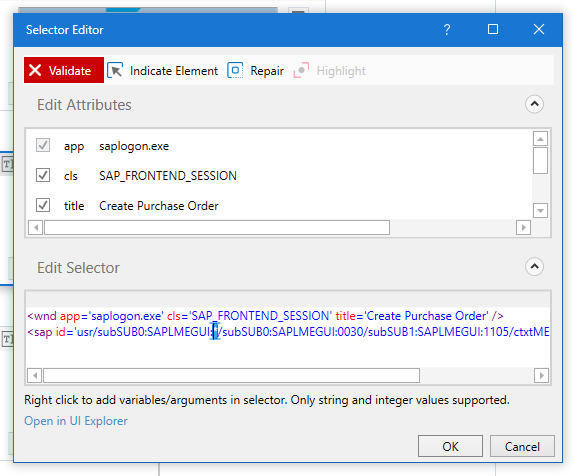

- 使用SAP.ClickToolbarButton选择SAP的工具栏

  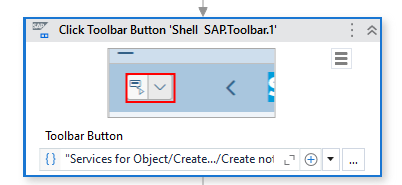

- 使用SAP.SelectMenuItem选择SAP的菜单

  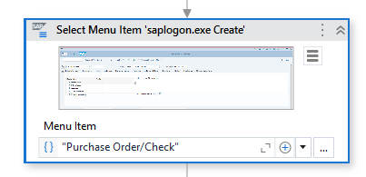

- 使用SAP.ReadStatusBar读取SAP的状态栏，并使用VerifyControlAttribute验证控件的属性值是否正确。

  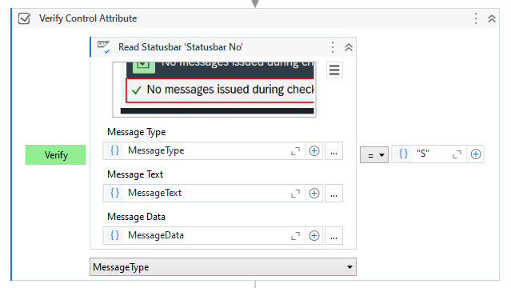

  

# Importing Data From Excel to SAP

项目位置：C:\xujian\eipi10\xuxiangwen.github.io\_notes\60-rpa\uipath\academy\processes\sap_automation\3 Importing Data from Excel to SAP

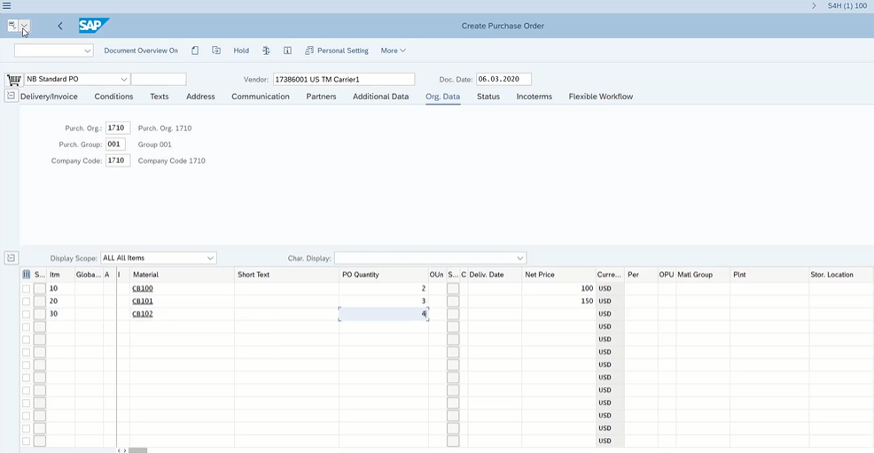

读取Excel中的数据，逐行写到SAP的订单中。在遍历行中， 需要设置tableRow.

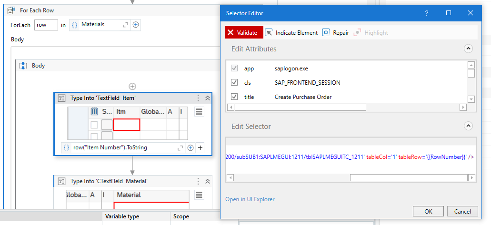

在Type Into Activity中设置如下两个属性。

- Empty Field
- SimulateType

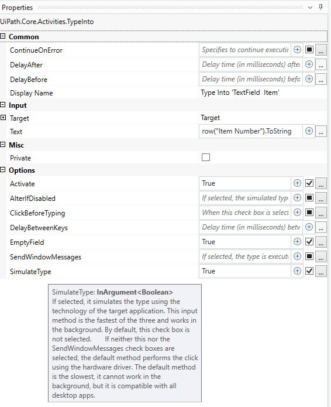

# Creating an Invoice 

项目位置：C:\xujian\eipi10\xuxiangwen.github.io\_notes\60-rpa\uipath\academy\processes\sap_automation\4 Creating an Invoice

- 选择SAP.ExpandTree选择Tree中的节点。

  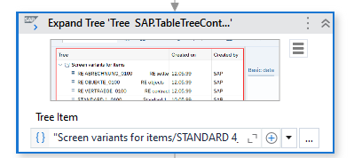

- Through the use of the **UI Explorer**, SAP elements, such as the **Traffic Light** (Ampel), can be identified and used as **indicators** to perform certain **branching activities**. In our case, we could tell if the balance was equal to zero or not, which in turn dictated if we could post the invoice. Depending on the elements state, a branching scenario can be formed.  

# Common  Table Operations

项目位置：C:\xujian\eipi10\xuxiangwen.github.io\_notes\60-rpa\uipath\academy\processes\sap_automation\5 Common Table Operations

操作**all types of SAP table elements**。

- 通过Ctrl选择两个或多个列。

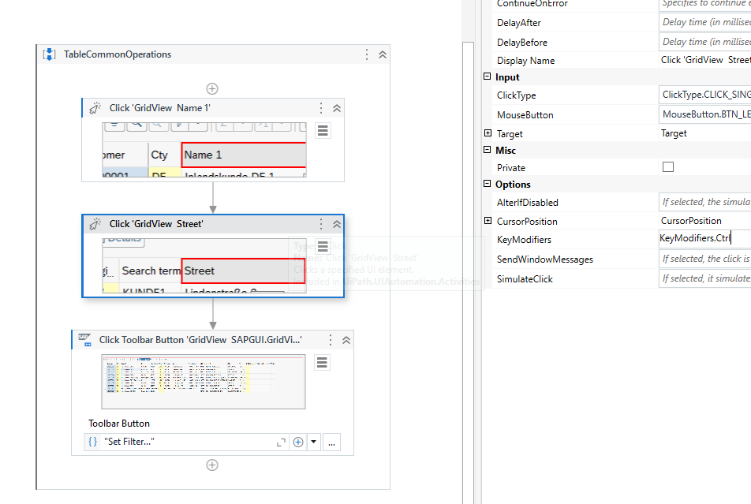

# Data Scraping in SAP Tables

项目位置：C:\xujian\eipi10\xuxiangwen.github.io\_notes\60-rpa\uipath\academy\processes\sap_automation\6 Data Scrapping in SAP Tables

通过Data Scraping抓取Table数据。

 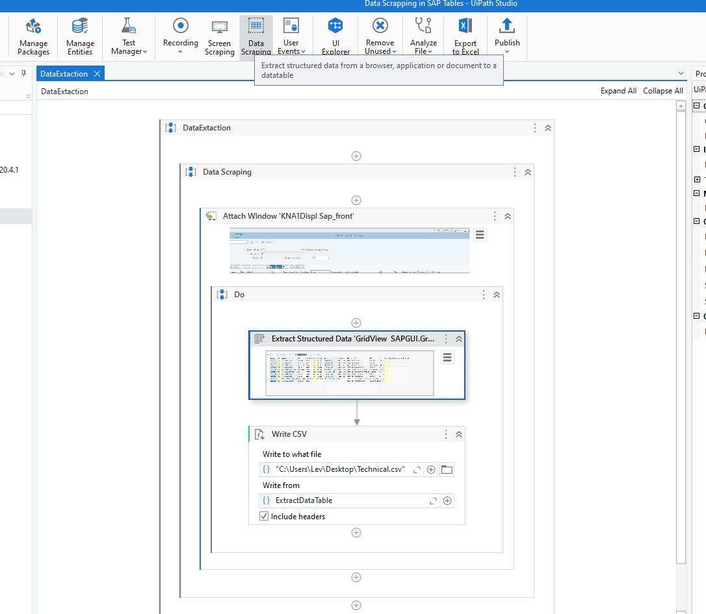

可以设置column_name_source了来确定输出的列名。

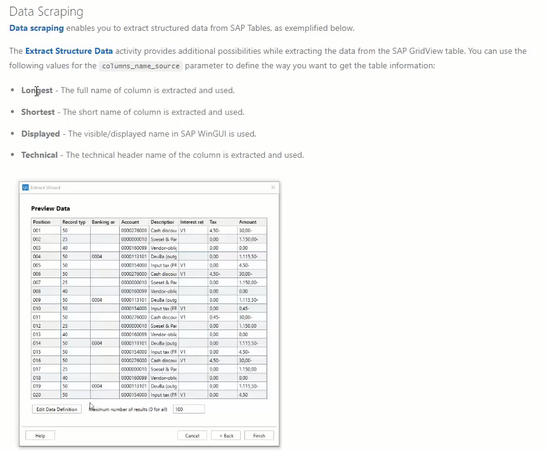

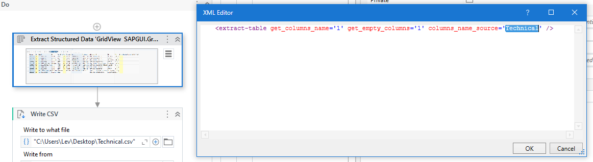

# Picture on Screen an SAP Calendar

项目位置：C:\xujian\eipi10\xuxiangwen.github.io\_notes\60-rpa\uipath\academy\processes\sap_automation\7 Picture on Screen and SAP Calendar

- 使用SAP.Select DatesInCalendar选择日期

  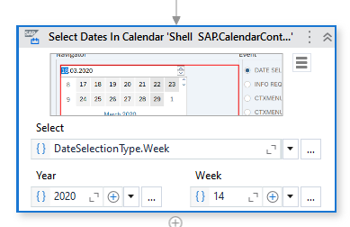

- 使用**Click on Picture** 来选择图片。

  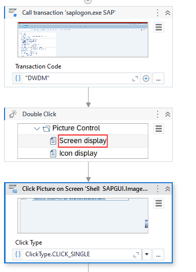

# SAP Context Menu and Pop-ups

项目位置：C:\xujian\eipi10\xuxiangwen.github.io\_notes\60-rpa\uipath\academy\processes\sap_automation\8 SAP Context Menu and Pop-ups

- 按F4之后，可以选择**pop-ups** or **context menus**中的内容。

  When facing **pop-ups** or **context menus**, the simple **Click activity** is enough to manipulate them. This will become possible once the **identification framework** is changed by **pressing F4 when** **indicating the selector**.

  SAP Context Menu需要按F4切换到[AA element detection framework](https://docs.uipath.com/studio/standalone/2023.4/user-guide/automatic-recording)才能工作。

  需要注意的是：UiPath有几种**Active UI Framework** 

  - ##### **Default** - This is the UiPath proprietary method. Usually works fine with all types of user interfaces.

  - ##### **Active Accessibility** - This is an earlier solution from Microsoft for making apps accessible. It is recommended that you use this option with legacy software, when the **Default** one does not work.

  - ##### **UI Automation** - This is the improved accessibility model from Microsoft. It is recommended that you use this option with newer apps, when the Default one does not work.

- The 3 available **identification frameworks** are the default **SAP Scripting Interface**, **AA** and **UIA**. 

- 按F2之后，可以延迟3秒，以便我们选择内嵌的菜单。

  A common situation is selecting an **option nested in the drop down** **menu** of a button that also needs to be clicked. By **pressing** **F2**, the selection will be **delayed for 3 seconds,** **allowing to select the nested item** after expanding the drop-down.

- ##### 