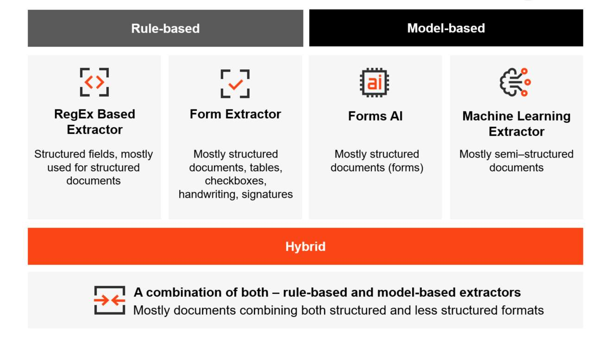
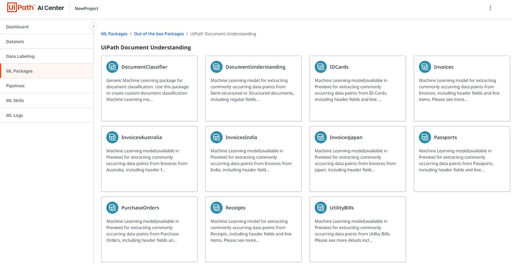
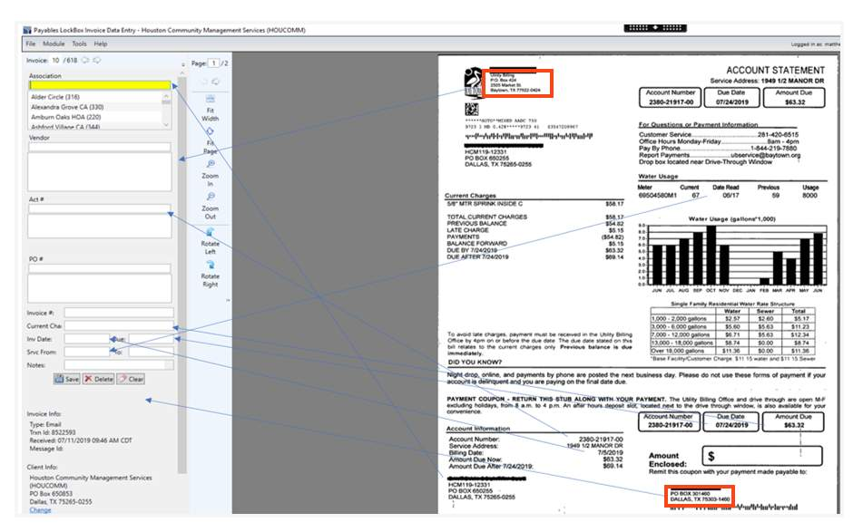
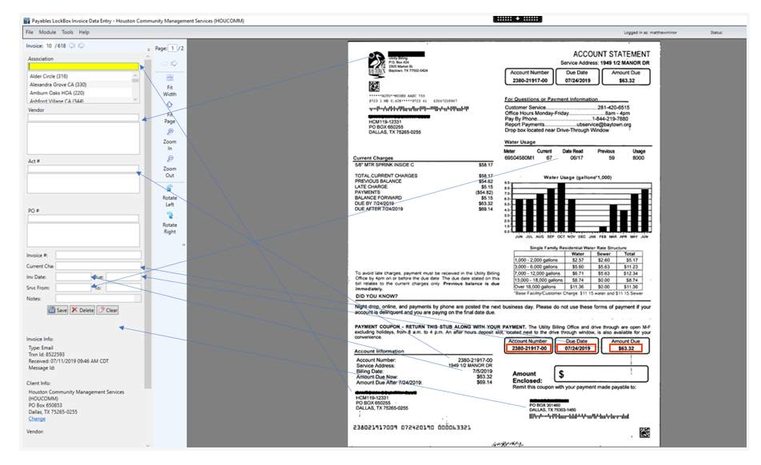
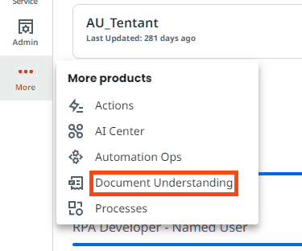
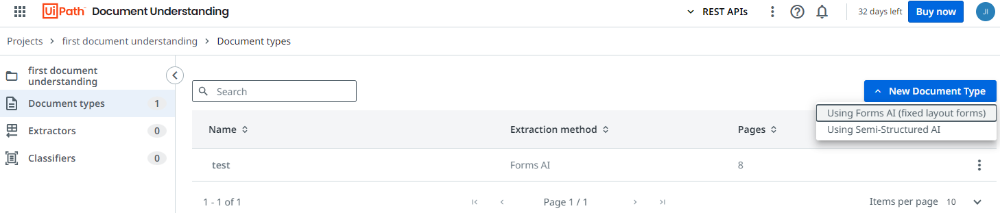
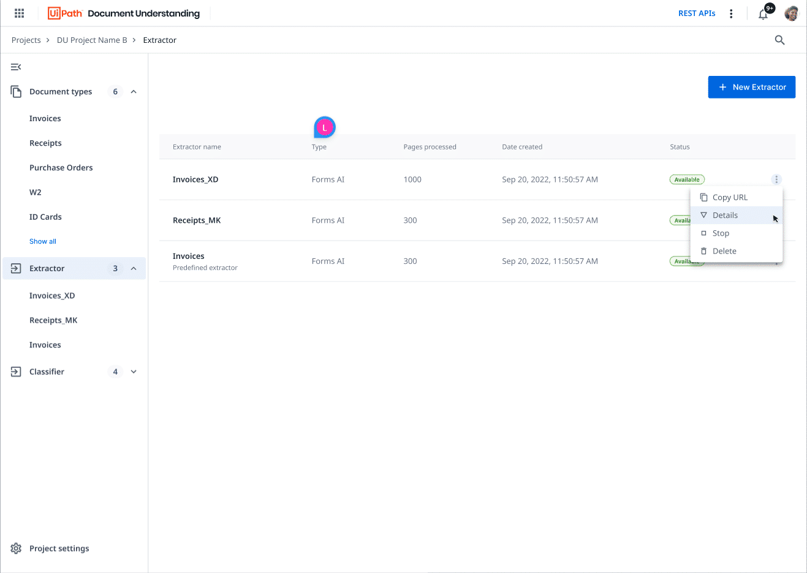
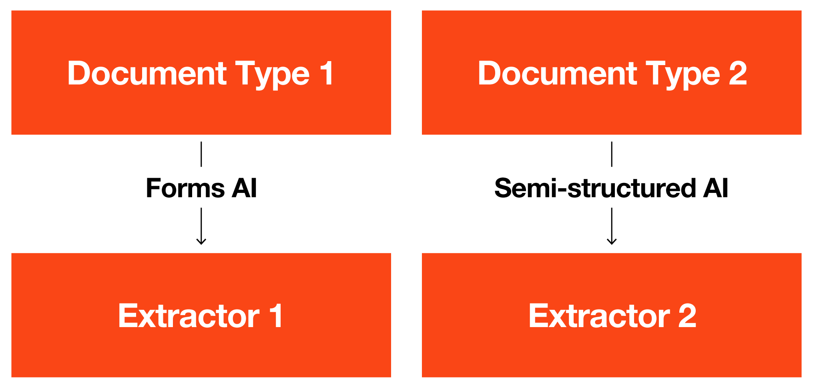
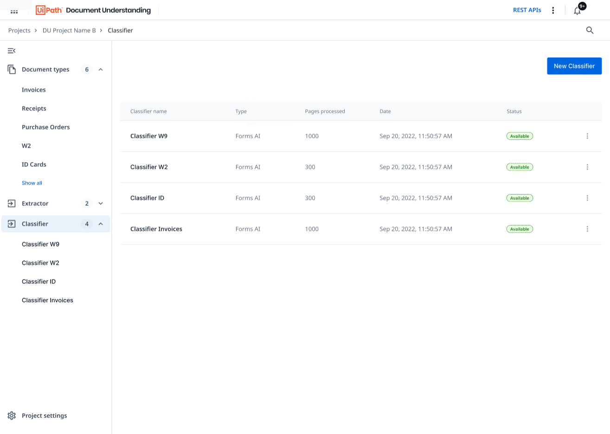
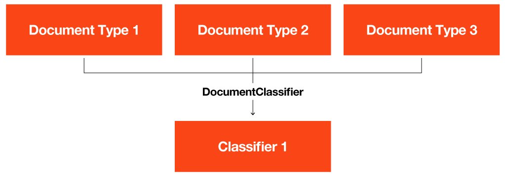

# [Train ML Models for Document Understanding](https://academy.uipath.com/courses/train-ml-models-for-document-understanding)

## **Introduction to model-based extraction**

There are **three** types of data extraction methods and **four** available extractors:

- **Rule-Based**

  Used for documents with a fixed format, such as tax or insurance forms.

  - The RegEx based extractor

  - The form extractor

- **Model-based**

  用于包含相同信息但**格式差异很大**的文件，例如发票或收据。通常，这些文件是半结构化或非结构化的，但在某些情况下，它们也可以是固定格式的良好选择。

  - Forms AI： 
  - The Machine Learning extractor

- **Hybrid**:

  Used in documents, which require a combination of rule-based and model-based extraction.

### Model-based extractor

基于模型的提取器用于包含相同信息但结构差异很大的文件，比如发票或收据。对于这些文件，应用基于规则的方法可能会很麻烦，因为对于每个新文件，都必须创建新模板或规则。此外，旧模板和规则需要不断更新和维护。因此，基于模型的提取器更受青睐，因为它们灵活处理新的文件格式。

基于模型的提取方法与人类相同，通过注意到需要提取的数据的相关特征来收集知识，例如：

1. Position on the page
2. Correlation of text 
3. Value itself

| **Model-based extraction (template-less approach)**          | **Rule-based extraction (template-based approach)**          |
| ------------------------------------------------------------ | ------------------------------------------------------------ |
| Relies on ML models.                                         | Relies on rules or templates.                                |
| Processes less structured documents with varying layouts, such as invoices or receipts. | Processes documents in a fixed format for structured data like forms or licenses. |
| Understands a wide range of document types/layouts.          | Has high accuracy for already known documents.               |
| Requires pre-trained ML models with further retraining capabilities. | Requires extra costs for the addition of templates or rules and ongoing maintenance. |
| Is flexible to handle new document types.                    | Is unable to work on unknown documents.                      |

## **开箱即用的DU机器学习模型**

UiPath平台可以适用于所有三种情况中的DU机器学习模型：

- Using an out-of-the-box ML model from AI Cente
- Starting from a UiPath ML model and training it with your own data
- Building your own model from scratch. If you or your team has expertise in machine learning, you can develop your own model from scratch. 

### **out-of-the-box ML extractors**

## 收集机器学习提取器的需求

**Gather the requirements for the ML extractor**

Steps

- Understanding the goals of the automation project.

  As a first step, you need to understand what type of documents you are trying to process. 

  - What document type do you have to process (for example, invoice, receipt, tax form)?
  - In how many formats/layouts/templates do these documents come, what are the volumes that need to be processed, and what languages are they in?

- Getting sample documents.

  Next, have a look at some real documents as the ones that need to be processed. Also, ask for a couple of samples that come in different formats. 

  - Are there any big proportions? (for example, 40% of the documents come in three formats)
  - How do they look?
  - Is the quality of the documents good?
  - How will Optical Character Recognition (OCR) perform?

- Identifying the fields which need to be extracted.

  With the stakeholders of the process, you now need to define the fields that they need to extract from these documents. 

  - What type of fields are they? (numbers, strings, etc.)
  - Where can you find them in the documents? (header level, item level, not present in document)
  - Are any of the fields unique to the customer?
  - Are any of them already available in some of the out-of-the-box models?

- Deciding the approach.

  With the sample documents and answers to all the asked questions, you can now create the taxonomy of the model. This will involve answering the following questions:

  - Which are the regular fields?
  - Which are the column fields?
  - Which are the classification fields?

### **Guided practice**

下面用实际的例子来说明需求收集的过程，[Example_RequirementGathering.pdf](https://html.cdn.contentraven.com/crcloud/crscorm/uploads/uipath_lms_11218/encryptedfile/581650/v2.0/scormcontent/assets/pij6Lc/Example_RequirementGathering.pdf)包含了用红色标记的相关字段的示例文档。

#### **ambiguity of the address**

让我们从检查PDF中的第一份文档截图开始，我们遇到了两个与Baytown市相关的不同地址。存在歧义。

您会注意到，与Baytown市相关的有两个地址，一个在左上角，另一个在右下角，但只有右下角的地址是正确的。然而，在其他示例中，页面上只有一个地址。

这是客户需求中典型的歧义示例，您需要澄清并将其压缩成一组字段。

由于存在歧义，这里要学到的基本教训是，每个字段必须具有一致的含义。如果某个数据在不同的上下文中有略微不同的含义，即使值本身可能相同，那么很可能需要有两个单独的字段。

在这种情况下，在自动化项目中，自动化开发人员需要根据业务规则选择合适的字段。换句话说，机器学习模型的目标不一定是返回业务所需的结果，而是返回所有必要的信息，以便在工作流程中可以轻松地推断出结果。

#### **more than one address**

同上一节图。

在这个具体的例子中，左上角的地址是供应商地址，而右下角的地址是供应商付款地址。

很多时候，它们可能是相同的地址。在这种情况下，它们不会单独提及。

然而，在这个特定的文档中，它们是非常明显不同的，无论是值还是在页面上的位置。

#### **The same field appears in different places in the same document**

接下来，花点时间找出文档中出现在多个地方的字段。我们鼓励您找出账号在文档中出现的地方。

您能找出所有账号出现的地方吗

账号出现在三个不同的地方。

为了获得最准确的机器学习模型，所有三个位置都需要被标记。

您还会注意到，页面上有一些字段，比如账号、到期日和应付金额，出现在多个地方

#### **Individual practice: Any other issues?**

你的回合：仔细查看样本文档。是否有其他歧义、差异、信息重复或其他可能降低模型准确性并影响信心的问题？

### 一个常见误解

关于机器学习模型的一个常见误解是，它们是一个包含不同布局的大型智能数据库，可以向其中添加新的布局。

事实是：

机器学习模型模拟了人类识别这些字段的方式：通过知识。通过以往的经验（训练），人类学习一些模式并建立知识，比如发票号通常是什么样子，如何在页面上找到它，在发票号值周围有什么文本等

## **AI Center and DU services**

### **Creating ML models in AI Center**

There are **three** ways to create ML models in AI Center, matching the three scenarios discussed in the previous lesson:

1. **Upload your ML model**: Use an ML model that you have trained in your framework of choice and upload it to AI Center.
2. **Use an out-of-the-box package from UiPath**: Choose from a set of out-of-the-box models developed by UiPath. Among these models, there are ML extractors as well.
3. **Import an ML package**: Import an ML model from another AI Center project or AI Center instance.

### **The UiPath Document Understanding service**

在公司的UiPath里，默认这个没有显示，在自己个人的UiPath里，如下图所示。

每一个项目Project包含如下内容。

- Document types
- Extractors
- Extractors

#### Document types

- **Forms AI** 

  Fixed-form document types like Tax forms or ACORD forms should be paired with the Forms AI extraction method. 

- **Semi-structured AI**. 

   extracting data from documents with many slightly different layouts. This extraction method can also work on forms and low-diversity document types if Forms AI doesn't produce the right results. 

  Semi-structured AI requires the use of AI Center for training ML models, so using it requires that you have the AI Center service enabled on your tenant. 

#### Extractors

An extractor 是用于从文档中检索数据的模型。它有一个相关联的URL，可以从自动化工作流中调用，以从文档中提取信息。

在创建文档类型时，可以选择两种不同的提取方法：表单AI和半结构化AI。

Extractors 可以以两种方式部署：

1. By clicking Publish in a Document type session using Forms AI.
2. By clicking Train in a Document type session using semi-structured AI.

#### Classifiers

Classifiers是用于对数字化文档进行分类的模型。与提取器类似，分类器有一个关联的URL，可以从自动化工作流中调用以对文档进行分类。

每个分类器能够识别两种或更多种类的文档。例如，它可以识别发票和采购订单

### **Select the documents and label the data**
