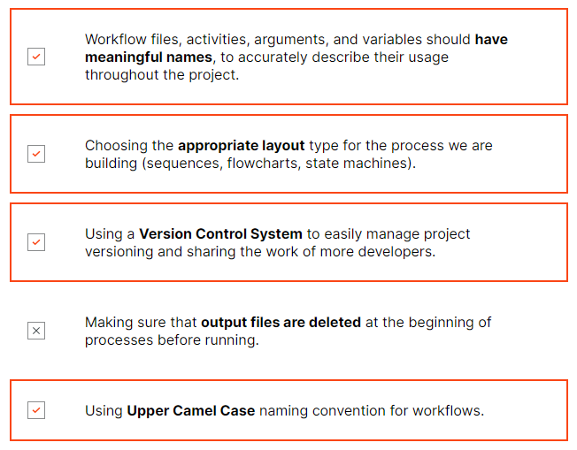
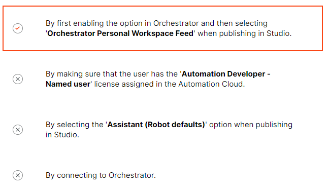

1.  

   

2.  

   

3. By clicking **Project** panel and selecting the **File Explorer** option.

4. By clicking **Design** or **Debug** ribbon tab, then clicking **Debug File** drop-down list and selecting **Debug Project**. 

5. 

