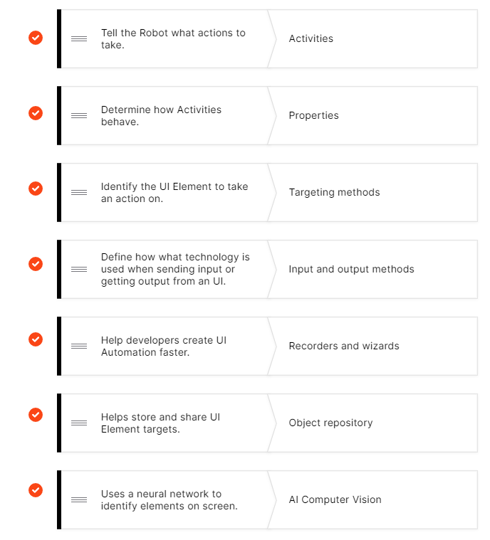

# Answer

## 1-5

1. ABCE

2. C

3. DE

4. BDE

   As per best practices:

   - Variables and Arguments should be Upper Camel Case (also known as PascalCase).
   - Datatable variable names should have the suffix dt.
   - Arguments should have a prefix stating the argument type.

5. C. 答案B有一定迷惑性。

6. D

## 6-10

7. 

  

8. C

9. ACD

10. A

## 11-15

11.  C

12.  B

13.   略

14.   ABE

15.  A 

## 16-20

16. CD

17. BCDE

18. B

19. B

20.  C

## 21-25

21.  BD

22.  A

23.  BC。有点疑问是B这个答案，更加准确表达是“The Pick Branch activity allows you to monitor multiple input sources simultaneously and execute the appropriate branch of activities based on the first available input. ”

24.  A

25.  BCE

## 26-30

26.   D
27.   A
28.   E
29.   C
30.   A

## 31-35

31.   B
32.   A
33.   B
34.   ABC
35.   A

## 36-40

36.    B。UiPath中，A是正确答案，看来是错的。
37.    ACE
38.    ABD
39.    BC
40.    ABD

## 41-45

41.  A

    Because of the additional costs with hosting machines, the machine learning skill, the training of the machine learning model which is GPU intensive, the AI units costs are bigger in Automation Cloud.

42. B, C

43. A, C, B

44. C

45. A, D, E

## 46-50

46.  D
47.  A, B
48.  D
49.  C
50.  A, B

## 51-55 

51. C
52. C, E
53. D
54. A
55. B, C

## 56-60

56. A, D
