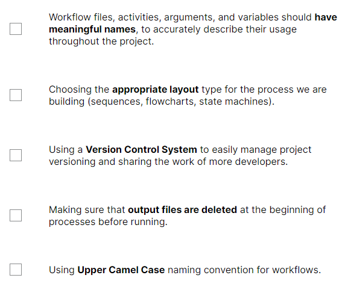
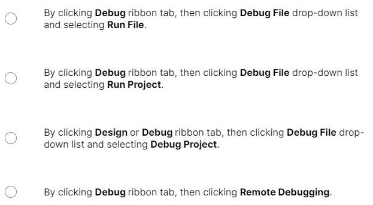
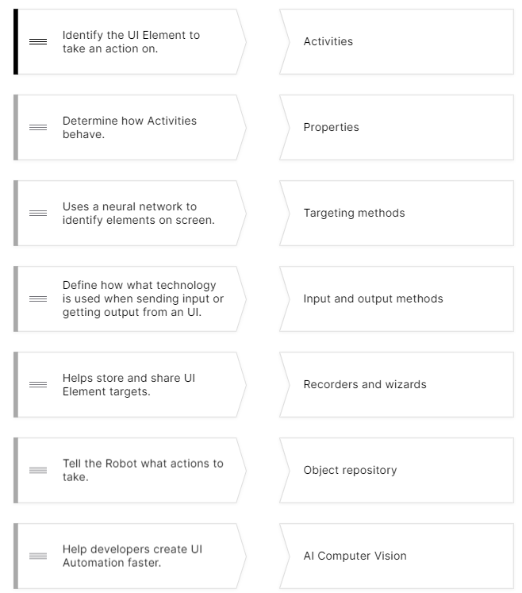
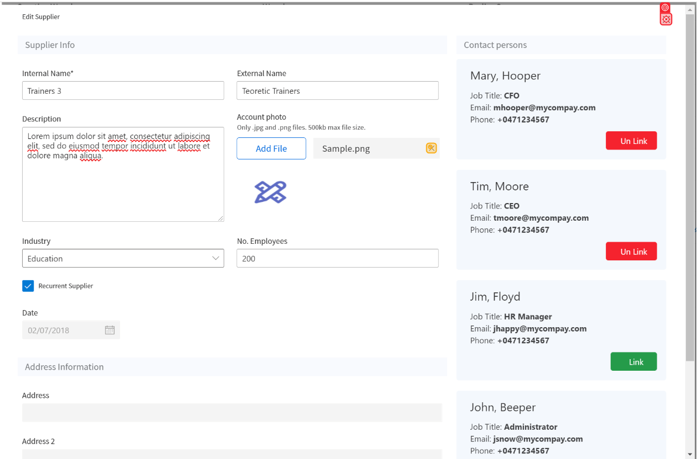
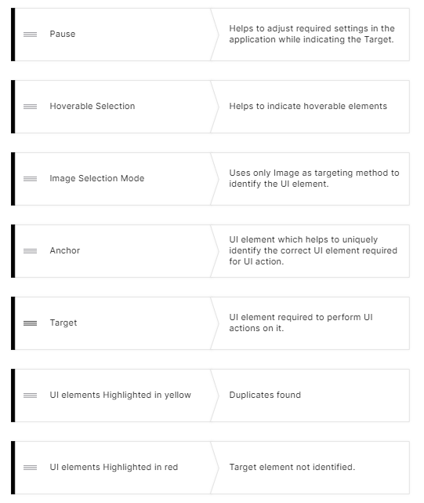
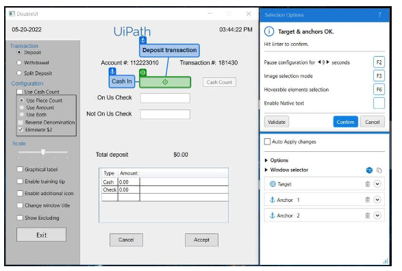
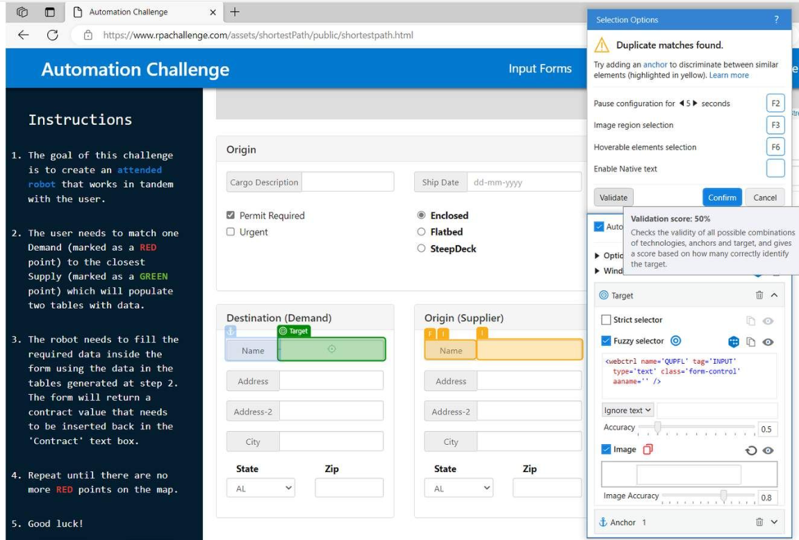
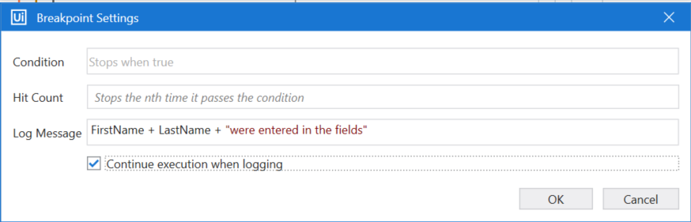
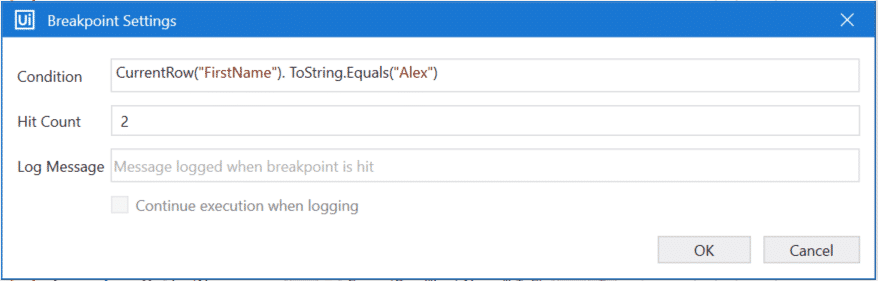

# Question

## 1-5

1. **What are some automation best practices to consider when automating a project?**

   

2. **How can we run the project in debug mode in Studio?**

   

3. **Which activity among the following has a MaxIterations property?**

   A. ExtractedRowsDt  	B. TransactionNumber	C. notfound

   D. out_InvoiceNumber 	E. dt_ExtractedRows

4. **Review question: Which of the following adheres to best practices for naming conventions?**

   A. Assign 	B. If 	C. Switch 	D. While 	E. For Each

5. **Which of the following statements is true regarding Workbook activities and Excel App Integration activities when working with Excel files?** 

   A. Workbook activities require Excel to be installed on the system, while Excel App Integration activities do not. 

   B. Workbook activities allow for faster and more reliable execution of Excel tasks, while Excel App Integration activities are slower and less reliable. 

   C. Workbook activities can be executed in the background without opening Excel, while Excel App integration activities require Excel to be open and running. 

## 6-10

6. **What happens if you use a Write Range activity and try to write data in an .xlsx file that does not exist?**

   A. It will create a new blank file.	B. It will throw an error. 

   C. It will continue the execution without writing the data.

   D. It will create that file for you and write the data in it.

7. **Match the below definitions with the key UI Automation concepts.**

   

8. **What is the purpose of the "Selection Screen" in UiPath Studio?**

   A. To display a list of activities that can be used to select elements. 

   B. To provide a way to indicate elements using image recognition.

   C. To allow users to configure targeting options for an UI element.

   D. To provide a visual representation of the UI hierarchy.

9. **Please refer to the image attached. You want to close this window by clicking on the "X" button. Something doesn't seem right.**

   **From the given option, identify issue with current** **selection.**

   - Choose all three options that apply

   

   A. A duplicate was found.	B. The UI element is not clickable.

   C. The target needs an anchor.	D. Target element not identified correctly

10. **Which of the following statements best describes the "Same as App/Browser" option in UiPath's input activities?** 

    A. It allows the user to simulate input in the same way as the application or browser is being automated.

    B. It disables input activities for the application or browser being automated. 

    C. It provides a default selection of input activities for the application or browser being automated. 

    D. It allows the user to customize the input mode for the application or browser being automated. 

## 11-15

11. **What is the "Textattribute" scraping method used for in UiPath's Get Text activity?** 

    A. Extracting the full text of an element including its child elements. 

    B. Extracting text using the element's native properties. 

    C. Extracting text from a specified attribute of an element. 

    D.  Trying all possible output methods to return a text. 

12. **App/web recorder doesn't support image targeting method.**

    A. True 	B. False

13. **Match the following with their respective functionalities.**

    

14. **which of the following statements are** **true about Switch Actvity?** 

    A. Useful when we need at least three potential sources of action. 

    B. Uses a condition that isn't boolean.

    C. Useful only with two potential courses of action. 

    D. Uses a condition that's boolean in nature.

    E. In the Case input field,quotation marks aren't used to write strings.

15. **From the given options, identify the scraping wizard used in the modern design experience.** 

    A. Table Extraction	B. Data Scraping	C. Screen Scraping 	D. APP/web Recorder

## 16-20

16. **By using** **table extraction wizard you have already scraped the structured data with the required configuration. Later you** **realized** **that you didn't set a limit for the extraction. How can you solve that?**

    A. Re-configure the table extraction wizard from start.

    B. Use Data table/excel activities to alter the limit.

    C. Edit the value in the properties panel of Extract Table Data Activity.

    D. Accessing the Editing Extract Data option in the context menu of Extract Table Data Activity.

17. **Which of the following string modifications can be performed using the Modify Text activity?**

    A. Split	B. Combine text	C. Text to Upper/Lower	D. Trim	E. Find and **replace**

18. Consider the string variable Letters = "abcdefg". Which out of the four values would the expression Letters.Substring(1,2) return?

    A. "ab"	B. "bc"	C. "bcd"	D. "abc"

19. **How can we loop** **through to access and** **retrieve each value from a dictionary collection?**

    A. By using an **Assign** activity and then using the variable keys. Our activity could look like this: Assign to: **Dictionary****Values** the Set value: **DictionaryVariableName.Keys**

    B. By using a **For Each** activity and then using the variable values. Our activity could look like this: For Each: **currentItem** In **DictionaryVariableName.Values**

    C. By using an **Assign** activity and then using the variable values. Our activity could look like this: Assign to: **Dictionary****Values** the Set value: **DictionaryVariableName.Values**

    D. By using a **For Each** activity and then using the variable keys. Our activity could look like this: For Each: **currentItem** In **DictionaryVariableName.Keys**

20. **Which method checks if an item with a given key exists in the dictionary variable and returns a \**Boolean\** result and the value if found?**

    A. **VarName.Count** 	B. **VarName.ContainsKey(Key)**	C. **VarName.TryGetValue(Key, Value)**	D. **VarName.Item(Key)**

## 21-25

21. **What is the best collection data type to store several cake recipes (names and ingredients)?**

    A. String	B. Dictionary	C. Array	D. List

22. **What are the categories of activities in UI automation that help developers write instructions for the Robot to interact with interfaces of various applications?**

    A. Containers, Input Activities, Output Activities, Synchronization Activities 

    B. Recording Activities, Debugging Activities, Error Handling Activities, Reporting Activities 

    C. Data Manipulation Activities, Database Activities, File System Activities, API Activities

    D. Conditional Activities, Looping Activities, Exception Handling Activities, Logging Activities

23.  **Which (2) of the following statements are true about the** **Pick Branch** **activity in UiPath?**  

    A. The Pick Branch activity is used to determine the state of an application or window. 

    B. The Pick Branch activity allows you to monitor multiple input sources simultaneously and execute the appropriate branch of activities based on the first available input. 

    C. The Pick Branch activity is used to define a set of activities that will be executed when a specific condition or event occurs. 

    D. The Pick Branch activity is used to define a set of activities that will be executed when a specific condition or event occurs. 

24.  **What are the activities inside a Parallel container called?**

    A. Child activities	B. Parent activities	C. Master activities	D. Sequence activities

25.  **What are the key benefits of using the Parallel Activity in UiPath?** 

    A. Ability to handle activities with dependencies 

    B. Efficient parallel processing 

    C. Synchronization mechanisms for coordinated execution 

    D. Sequential execution of activities 

    E. Improved performance of complex workflows 

## 26-30

26. **Considering the provided selection, how many Target-anchor pairs does the robot generate under the hood?** 

    

    A. Two	B. Six	C. Nine	D. Twenty Seven

27. **How can you increase the validation score to 100% based on the given configuration shown in the image?**

    

    A. By adding section title Destination (Demand) as another Anchor

    B. By increasing the image accuracy for the Target UI elment

    C. By increasing the Image accuracy for the Anchor UI element

    D. By enabling the Selector targeting method

28. **The "Convert to Dynamic Text Target" option is available for which purpose in the context of UI automation?** 

    A. Context menu of the Activity

    B. In the Target section of the selection option window 

    C. Under Anchor Element 

    D. Ability to handle activities with dependencies 

    E. Under Target Element 

29.  **Which of the following types of activities always use partial selectors?** 

    A. Classic activities 	B. Container activities 	C. Child activities  	D. Modern activities 

30. **How can the Visual Tree be used to fine-tune selectors and locate specific UI elements within an application?** 

    A. By inspecting the properties and attributes of UI elements in the Visual Tree. 

    B. By using CSS selectors to target elements within the Visual Tree. 

    C. By analyzing the hierarchical structure and relationships between elements in the Visual Tree. 

    D. By performing automated tests on the UI elements within the Visual Tree. 

## 31-35

31.  **Is the following selector "webctrl idx='144' tag='IMG'" a reliable selector for a dynamic page?** 

    A. False	B. True

32.  **Which action does the Play button in the Ribbon take by default?** 

    A. Debug Current File	B. Debug Project	C. Run Current File	D. Run Project

33.  **Which panel is used to inspect data available at a certain point during debugging?** 

    A. Watch	B. Immediate	C. Locals	D. Call Stack

34.  **Where does changing a variable in the Immediate Panel reflect?**

    A. The Locals panel.	B. Further execution in debug mode of the workflow.	C. The Watch panel.

    D. The Output panel.	E. The execution of the workflow at runtime.

35.  **Is this type of tracepoint a good replacement for using Log Message activity for debugging purposes?** 

    

    A. Yes, it'll log the needed message. 

    B. No, the Continue Execution when logging option needs to be checked out. 

    C. No, tracepoints are only useful for production environments. 

## 36-40

36. **Considering the below breakpoint settings, when will the workflow execution be paused?** 

    

    A. When it reaches the activity holding the breakpoint a second time and the row value in the "First Name" column contains "Alex".

    B. Whenever the row value in the "First Name" column changes to "Alex" for the second time. 

    C. When it reaches the activity holding the breakpoint and the row value in the "First Name" column contains "Alex". 

    D. When it reaches the activity holding the breakpoint. 

37. **Which of the following types of information** **can you** **find in the Locals Panel?** Choose the three options that apply 

    A. The value of the variables.	B. A cumulative percentage of the execution time of each activity.

    C. Properties of current activity.	D. The value of the expressions.	E. Exceptions

38. **From which panels can you directly add variables to the Watch panel?**  Choose the three options that apply 

    A. Locals Panel	B. Data Manager Panel	C. Activities Panel	D. Variables Panel	E. Immediate Panel

39. **Which of the following extractors are available through the UiPath Document Understanding first-party service?**

    A. RegEx extractor	B. Semi-structured AI	C. Forms AI	D. Form extractor

40. **Which three of the following are entities of a UiPath Document Understanding project?**

    A. Document types	B. Classifiers	C. Validators	D. Extractors	E. Taxonomy Manager

## 41-45

41. **How do the AI unit consumption between Automation Cloud and Automation Suite compare?**

    A. The consumption is bigger in Automation Cloud	B. It's the same consumption

    C. The consumption is bigger in Automation Suite

42. **Which (2) of the following statements are true?**

    A. In a document understanding project, you can use only one classifier, so you need to choose carefully.

    B. In a document understanding project, you can use more than one classifiers.

    C. The Intelligent Keyword Classifier is the only one of the out-of-the-box classifiers which can split a document.

    D. All the out-of-the-box classifiers can split a document.

43. **Match the following documents with the appropriate category.**

    1. Bank statement （银行对账单）	
    2. ACORD 125 Commercial Insurance Application
    3. Lease contract

    A. Semi-structured	B. Unstructured	C. Low-diversity

44. **How can extractors be trained in the UiPath Document Understanding service?**

    A. Only in an automated way	B. Only manually	C. Both manually and automated

45. **Which of the following UiPath Platform components can be used naturally in a document understanding automation project?**

    A. Robots	B. Task Mining	C. Automation Ops	D. Action Center 	E. AI Center		
## 46-50

46. **What are the two different ways to accomplish Classification and Extraction through** **Document Understanding** **Cloud APIs?** 

    A. Offline processing and online processing	B. Sequential processing and parallel processing

    C. Batch processing and real-time processing 	D. Asynchronous and synchronous processing 

47. **Which of the following UiPath components you need in order to use the UiPath Document Understanding Cloud APIs?**

    A. UiPath Automation Cloud	

    B. The UiPath Document Understanding service in UiPath Automation Cloud

    C. UiPath Studio

    D. UiPath Automation Cloud Robots

48. **What is DOM?**

    A. The type of document that is being processed for interpreting information from documents. 

    B. A JSON file containing information regarding the fields that were extracted by an extractor

    C. A JSON file containing information regarding the meaning and position of the words in the document

    D. A JSON file containing important information about a document, such as the number of pages or the coordinates of every word identified

49. **For which documents is it recommended to use multiple classifiers in parallel?**

    A. For unstructure documents, since they can be used in combination to play different roles.

    B. For invoices, since they could be from different countries.

    C. For none, since it messes with the results.

50. **Which (2) of the following statements about validation are correct?**

    A. The classification validation can be done in both attended and unattended scenarios

    B. The extraction validation can be done in both in attended and unattended scenarios

    C. The extraction validation can be done only in unattended scenarios

    D. The classification validation can be done only in attended scenarios

## 51-55

51. **Why do you need to map the fields in the Configure Extractors wizard while using the ML Extractor?**

    A. Some extractors have their own taxonomy, which is why you need to map the fields; the ML Extractor does not have its own taxonomy, so there is no need to map any fields.

    B. There is always a need to map the fields according to the name allowed by the ML extractor.

    C. Some extractors have their own taxonomy, which is why you need to map the fields; this is the case for the ML Extractor. 

    D. There is no need to map fields while using extractors.

51. **Where does error handling take place in the Document Understanding process template?**

    A. In the End Process workflow	B. In the Digitization workflow	C. In the Process Each Document section	

    D. In the Classification workflow	E. In the Main workflow

51. **How does the Document Understanding process act, as part of an end-to-end automation process?**

    A. Acts only as a dispatcher for Document Understanding jobs.

    B. Acts as a dispatcher for upstream jobs and as a performer for downstream jobs. 

    C. Acts only as a performer for Document Understanding jobs.

    D. Acts as a performer for upstream jobs and as a dispatcher for downstream jobs.

51. =