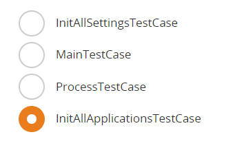

1. What are some automation best practices to consider when automating a project?

   

2. How can we publish to the 'Orchestrator Personal Workspace Feed'?

   

3. How do we open the project's location on the machine in Studio?

   

4. How can we run the project in debug mode in Studio?

   

5. What is the component of the UiPath Ecosystem that gives a user access to ready-to-use automations?

   

6. A developer wants to move an automation into production. A **Click** activity contains the below automatically-generated selector. Which attribute in the selector is stable?

   

7. How are processes and procedures different in terms of documentation?

   

8. What is the purpose of the UiPath Automation Implementation Methodology?

   

9. A developer uses GIT for version control in UiPath Studio. After changing the local file and executing the Push action, Studio identifies a discrepancy between the local file and the remote repository file. Which window appears on the developer's screen to address this issue?

   

10. When Microsoft Excel is not installed on the machine identified for the robot deployment, which activity should be used to write data to an Excel file?

   

11. What is the definition of a process?

    

12. What activity retrieves the size in KB (kilobyte) of a specific folder?

    

13. In the UiPath implementation model, at which stage is the **Statement of Work (SOW)** reviewed?

    

14. Where can a published Template Project be found?

    

15. What is the variable type of the "Output Data Table" activity?

    

16. What is the correct approach using the Microsoft 365 activities to retrieve all the emails with a specific keyword in the subject?

    

17. A user needs to download a report for a variable number of months of the year and extract the needed months from multiple emails. The user decides to loop over the months using a For Each activity. Which data type is best suited to store the values of the names of the months?

    

18. Given there are two lists in a workflow:

    1. "FranceCities" which contains city names in France
    2. "IndiaCities" which contains city names in India

    Which expression should be used as the input to a **MessageBox** in order to show all city names from both lists?
    
    

17. The developer is building a workflow using **Type Into** activity to interact with minimized apps on an employee's workstation without causing disruptions to the user.
    What **Input mode** should be enabled on the activity?

    

18. The project manager examined the Orchestrator logs for any pertinent error information related to a process after the process owner informed them about missing expected outputs. To view all alerts/errors, which Level should the project manager filter the logs by?

    

19. How can unattended robots be connected to **Orchestrator** using client credentials in the **Assistant**?

    

20. A developer is creating a process that uploads data to an **Orchestrator** queue. The data originates from emails in one inbox. The **Queue Item** needs to be processed first if the email was sent by the process owner.
    To ensure the **Queue Items** are processed in the correct order, which property of the **Add Queue Item** activity should be used?

    

21. Which screen scraping method should be employed to extract text from a scanned PDF?

    

22. Which of the following statements accurately describes the purpose of the **Read Range** in UiPath Studio's Excel activities?

    

23. When a developer is examining a suspended state upon reaching a breakpoint, which activity will the Executor be directed to if Step Out is selected from the Debug section in UiPath Studio's ribbon interface?

    

    

24. Based on best practices, which activity should be used to retrieve individual pieces of data from a digital PDF in the background using **UI Automation**?

    

25. Which of the following is a characteristic of attended automation tasks?

    

26. What is the status of a queue item before it is changed to "Abandoned"?

    

27. Which filter option should be used for the **For Each File in Folder** activity to iterate between all the Microsoft Word documents in a local folder?

    

28. 
    A developer has been assigned the responsibility of creating a process that interacts with a Financial Accounting application. The process will be designed as follows:

    

    1. The process must validate the **Payment Status** field within the application.
    2. There are three potential values in the **Payment Status** field, namely: **Pending**, **Paid**, or **Awaiting Approval**.
    3. For **Pending** status, the process needs to examine the "Due Date" field. If the Due Date has passed, an alert should be raised. If not, no action is required.
    4. For **Paid** status, change the "Overall Status" to "Completed".
    5. For **Awaiting Approval** status, an alert email should be sent to the email address found in the **Account Owner** field.

    Following the best practices, which activity should be used for designing the process flow for Step 2?

    

29. What property should be configured to ensure that the **Read Range Workbook** activity returns all rows when reading a .xlsx file with headers and 300 rows of data

    

30. Which property of the **Get Outlook Mail Messages** activity allows you to specify the number of messages to be retrieved and the order in which they are retrieved?

    

31. What are the key attributes or characteristics of an automation developer?

    

32. In UiPath Studio, after a developer has published a library to a folder on their machine and opened a new process, which option should be configured through the "Manage Packages" window to load the library into the process?

    

33. What are the main components of a digital business process?

    

34. In which situation is an anchor NOT automatically created?

    

35. Which activity should the developer use for a process that iterates through a list of doctors in a hospital's database and adds the title "Dr." to every person from the list?

    

36. Which automation project team member creates the Process Definition Document (PDD)?

    

37. What is the best practice rule regarding nested IF clauses?

    

38. A developer has a project which includes a **Global Exception Handler**. Based on best practice, all exceptions must be handled as defined by the business requirements. To ensure the defined exceptions do not reach the **Global Exception Handler**, which activity is used?

    

39. A developer found a bug in one of the transitions shown below (both conditions are the same):

    

    What transition/transitions will be executed in this situation?

40. What type of information is primarily available in the **Logs monitoring** feature in **UiPath Orchestrator**?

    

41. When using **UiPath Orchestrator**, how can the unattended robot user's actions and access to certain data be limited?

    

42. A developer has defined a variable named "CurrentDate" of type **DateTime**. Which of the following expressions can be used to show the name of the day that was 3 days prior to the date from the variable?

    

43. A developer creates a new **REFramework** project in **UiPath Studio** and sets the value of **MaxConsecutiveSystemExceptions** to "2" in the "Config.xlsx" file. How many transaction items can have **Status** = "Failed" and **ErrorType** = "Application" before the process is ended?

    

44. A developer is using the **Dispatcher-Performer** model in UiPath to create a workflow where the **Dispatcher** component, constructed within the **REFramework**, adds data from a data table to a queue. What type of automation project would be most fitting for this **Dispatcher** implementation?

    

45. A developer used the **REFramework** with **Orchestrator** queues. The value of the **Max # of retries** on the queue is "2" and the **MaxRetryNumber** value in the config file is "1". In the case of repeating **System Exceptions**, what is the maximum number of times a **Queue Item** will be retried?

    

46. How can the **Invoke Code** activity be used to execute vb.net code with an input argument and an output argument in a UiPath project?

    

47. When is it necessary to use the **Invoke Method** activity?

    

48. 
    Beyond the secure stores with built-in support, **Orchestrator** architecture supports the functionality of loading third-party or developing custom plugins, enabling you to use any desired credential store.

    Instructions: Order the steps for loading a custom or third-party credential store into **Orchestrator**.

    

49. A developer has designed a project featuring a flowchart. The developer then obtained a business modification request as stated below:

    1. If the Customer Name includes special characters, the robot must eliminate them before proceeding with the process.
    2. If the Customer Name contains only letters, maintain the current logic without making any changes.

    To incorporate the new requirement according to UiPath best practices, which activity should the developer utilize in the flowchart?
    
    

50. In a **UiPath State Machine** project, which activity is mandatory as the top-level container for defining the overall structure and organization of the automation process?

    

51. In which **REFramework** workflow are the custom fields "logF_TransactionStatus", "logF_TransactionNumber" and "logF_TransactionID" being added to logs?

    

52. What is the effect of using a UiPath.UIAutomation.Activities package version that does not match the deployed driver version of the UiPath Remote Runtime?

    

53. How does the Screen Refresh button function in the Computer Vision wizard?

    

54. Which of the following is a characteristic of the **Final State** in a **State Machine**?

    

55. In which workflow(s) is the **Queue Item** status updated in a regular **REFramework Performer** process?

    

56. Which **Log Levels** will be displayed if a user of **UiPath Orchestrator** filters the severity to **Error** for **UiPath Robots**' logs?

    

57. A developer automated a process in the **REFramework** using **Orchestrator** queues. In which state(s) is the status updated to **Successful** for each **Transaction Item** from the queue?

    

58. Which LINQ query will return the quantity of pears from the following table?

    

    

59. When building an automation for a booking company as part of a larger project initiative, a developer should follow the high-level steps:

    1. Retrieve emails from the company-wide Bookings Microsoft Outlook Inbox account.
    2. Extract the booking data from the current email.
    3. Add individual reservation data to the Orchestrator queue.
    4. Log in to the company's desktop application.
    5. For each Queue Item:

    a. Navigate to the Bookings section from the Requests section.

    b. Add the reservation data to the Bookings section.

    c. Close the current booking.

    6. Log out and close the company's application.

    The developer decides to use the **Dispatcher/Performer** model for the automation. Which steps will be included in the **Performer** process?

    

60. What LINQ query can be used to filter a list of **DataTables** based on a specific column's value in C#?

    

61. What is the correct way to define an **Input Element**?

    

62. Which is a valid connection type for performing remote debugging?

    

63. After installing UiPath Remote Runtime, what automatically happens at every user login on the remote server?

    

64. What is the name of the state(s) where the **TransactionItem** variable is used, in the context of a **Performer** process that uses the **Robotic Enterprise Framework** template and **Orchestrator** queues?

    

65. Which UiPath activity is used to establish a connection to the neural network server for **Computer Vision** activities?

    

66. What is the purpose of **UiPath Orchestrator** webhooks?

    

67. A developer is debugging a workflow and the **Executor** is pointing to the **Log Message** activity as shown in the following exhibit:
    Currently, the value of "rowIndex" variable is "15". There are 285 more rows left in the data table.
    

    Which button should be clicked in order to quickly execute the **Log Message** activity for the remaining rows and make the **Debugger** immediately finish the **For Each Row in Data Table** activity?
    
    

68. According to best practices, where in the **REFramework** should credentials be retrieved?

    

69. When performing **Remote Debugging** using a **Remote Machine** connection, Studio sends the list of project dependencies to the remote robot. From where does the remote robot download the required packages?

    

70. Which is the status of a **Queue Item** when the transaction fails with an **Application Exception** and the queue item is part of a **Queue** that has **Retry** mechanism enabled?

    

71. Which of the following examples correctly demonstrates the appropriate usage of **Remote Runtime** for automating virtual environments in a UiPath project?

    

72. In **UiPath Orchestrator**, considering the allocation of runtimes to machine objects and their impact on concurrent execution capacity, which of the following choices describes the maximum number of automation that can simultaneously run on an associated host machine that has been assigned 3 runtimes?

    

73. What is the primary purpose of using custom log fields in **REFramework** projects?

    

74. When using **REFramework** without **Orchestrator** access, what is the best practice to ensure that a transaction will be retried in case a **System Exception** occurs during its processing?

    

75. Which feature in **UiPath Orchestrator** allows diagnosing potential issues and optimizing resources for better efficiency of unattended automations?

    

76. Which unit test from **REFramework** test suite checks that specific elements/screens are present after the initialization?

    

77. What is one of the key benefits of using **Monitoring** in **UiPath Orchestrator** for an organization?

    

78. A developer needs to use the **REFramework** in order to implement a linear process. Which value should be set to "out_TransactionItem" the second time it enters the **Get Transaction Data** state?

    

79. Which of the following examples represent best practices of the correct usage regarding **Invoke Method** and **Invoke Code** activities in a UiPath project?

    

80. A developer uses **Background Process Automation** on a single attended robot. Which of the following is a characteristic of the background process?

    

81. In order to automate a Citrix application, the developer installed the **UiPath Remote Runtime** component on the target Citrix Server and the **UiPath Extension for Citrix** on the Client Machine.

    When the developer is trying to indicate an element on the screen, they are prompted a message suggesting a compatibility problem with the version of the **Remote Runtime** installed on the server.

    Which of the following must be compatible with the **Remote Runtime** version?

    

82. In **UiPath Orchestrator Monitoring**, which feature allows you to centrally analyze the performance and efficiency of your automation processes across multiple components, such as **Robots, Machines, Queues, and Jobs**?

    

83. Which activities include the Relative To feature indication in UiPath Computer Vision?

    

84. Based on the UiPath best practices, when a **Business Rule Exception** occurs while processing an item from an **Orchestrator** queue, what is the transaction item status that should be set to that particular **Queue Item**?

    

85. What is the correct statement regarding the differences between **Window Messages** and **Simulate** input methods?

    

86. What actions should be taken by a developer to transform a **REFramework** process into a linear process?

    

87. A developer is using the **REFramework** to create a process. In which state is the **Queue Item Status** updated to "Failed"

    

88. A process required by the Finance team was developed using the state machine architecture. One of those states needs to be able to transition to 4 other different states based on the business conditions.

    In which of the following should the transition logic be introduced?

    

89. What is a major benefit of a **REFramework Dispatcher** process using **Orchestrator** queues?

    

90. A developer completed the following sequence of steps:

    1. Created a process with the **REFramework**.
    2. Published the package to **Orchestrator**.
    3. Created a job for it.

    After completing these steps, the job starts from **Orchestrator** and processes transactions. After processing two transactions, the job is stopped from **Orchestrator**.

    During which state in the **REFramework** will the job **Stop Signal** be recognized?

    

91. Which method can be used to perform LINQ operations on **DataTables** and **Lists** in VB.NET?

    

92. In a **UiPath State Machine**, what are the three sections found within a **Transition** activity when it's expanded?

    

93. When iterating through multiple digital PDF invoice files with the same structure, what action should be taken to retrieve the "Total Value" based on best practices?

    

94. What is the purpose of the **CV Screen Scope** activity in UiPath?

    

95. Which UiPath product combines collaboration with people, UI and API automation, and native integrated AI capabilities?

    

    Answer: 

    

96. Which of the following is NOT an Orchestrator capability?\***

    Answer:

    

97. Which recommended properties should a developer configure before using the **Send SMTP Mail Message** activity?

    

    Answer:

    The last one.

98. **Do users need to first be added to Automation Cloud to receive any type of license?**

    Answer:

    

    Adding a new user in Automation Cloud is the first step to assign a license to any new user.

99. Which of the following actions can be easily performed by Studio users that are signed in to Orchestrator?

    - Choose all applicable answers.

    Answer:

    

    By being signed in to Orchestrator, users can publish packages to Orchestrator. As soon as they do that, the processes will appear in Assistant, thus jobs can be run.

    Jobs cannot be run from Automation Cloud.

100. 

101. d

102. 