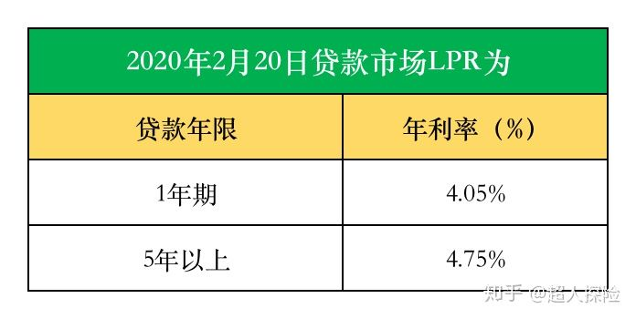

LPR全称为Loan Prime Rate，意为贷款基础利率。LPR的计算方法由18家银行共同报价产生，计算方法为去掉一个最高价和一个最低价，最后算术平均得出，每月20日重新报价计算，可以简单解读为，这是一个市场化利率的意思。目前的LPR利率是每月更新一次的。

2020年2月20日贷款市场报价利率（LPR）为：1年期LPR为4.05%，相比上月下降10个BP；5年期以上LPR为4.75%，相比上月下降了5BP。

