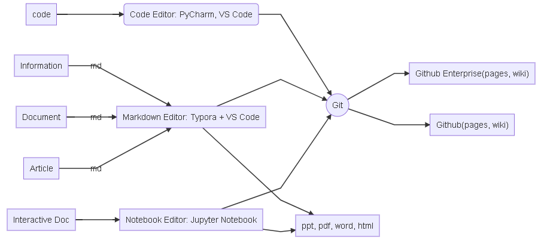
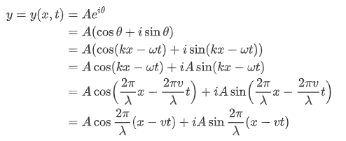
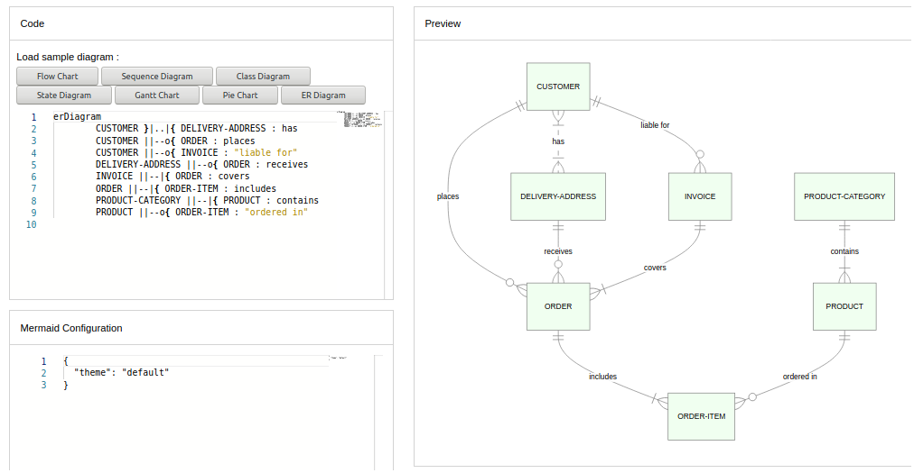
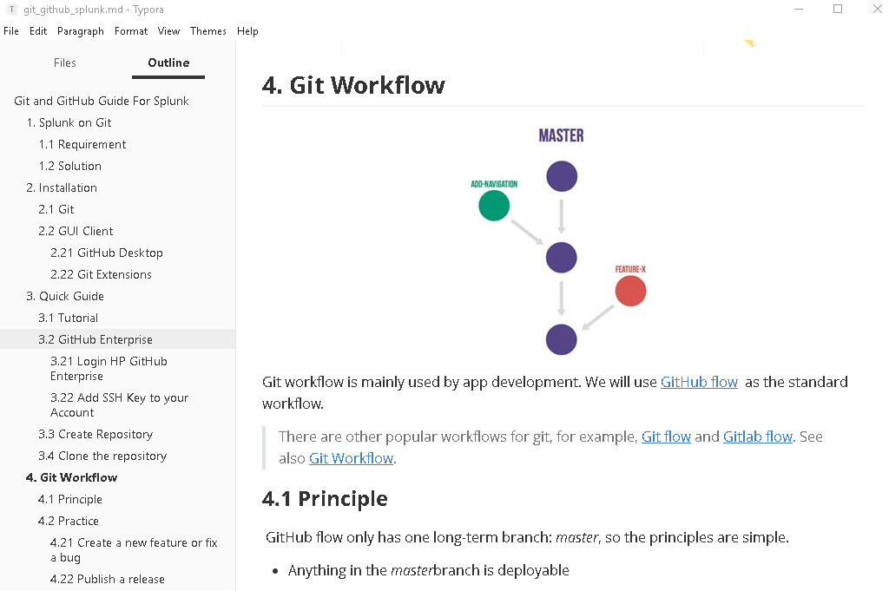
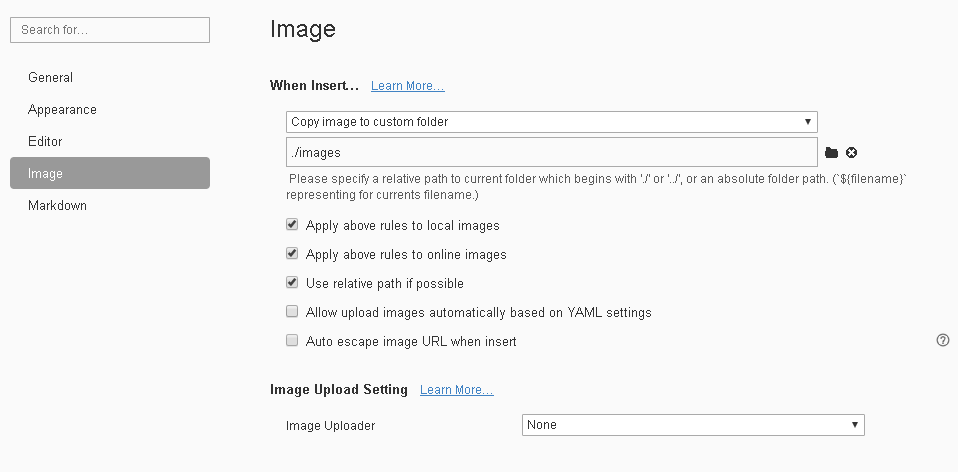
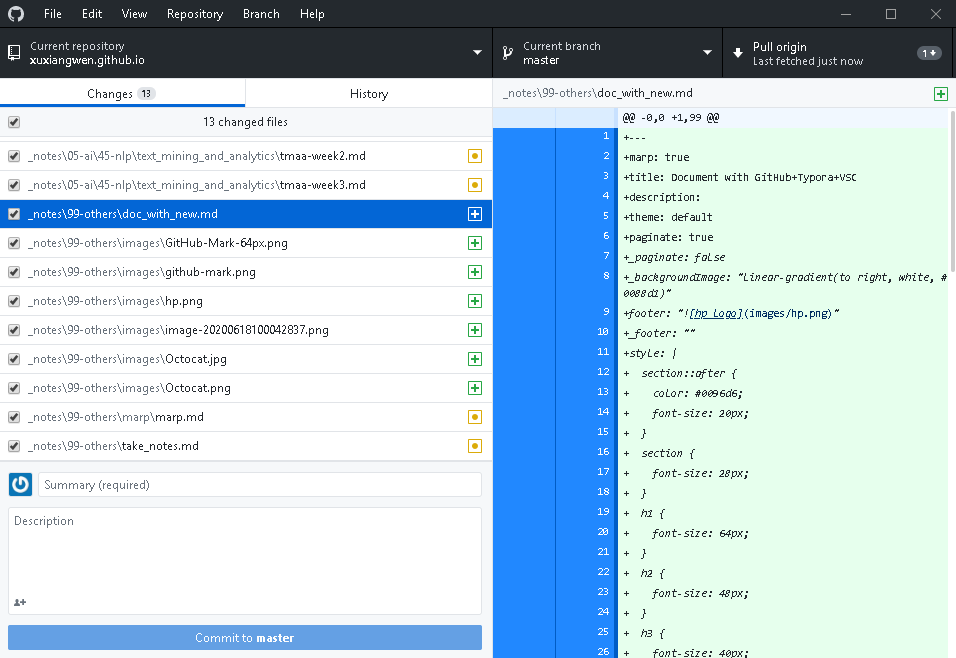
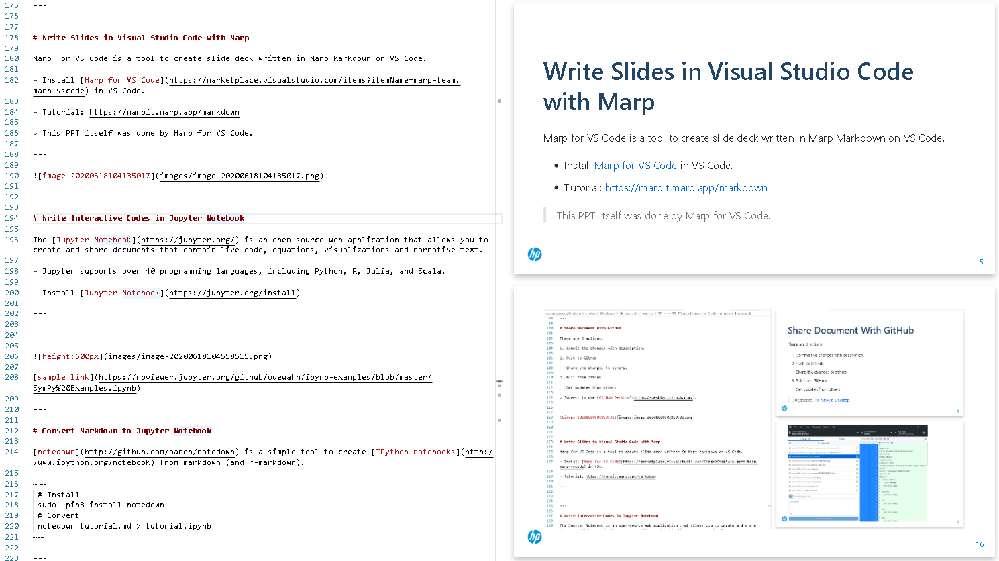
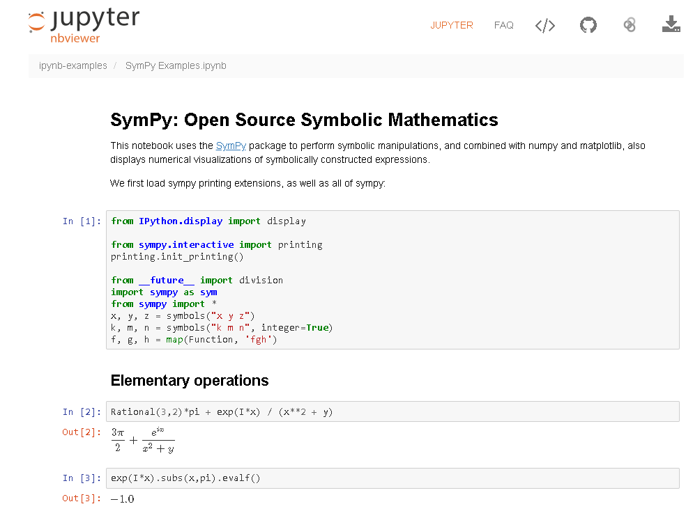
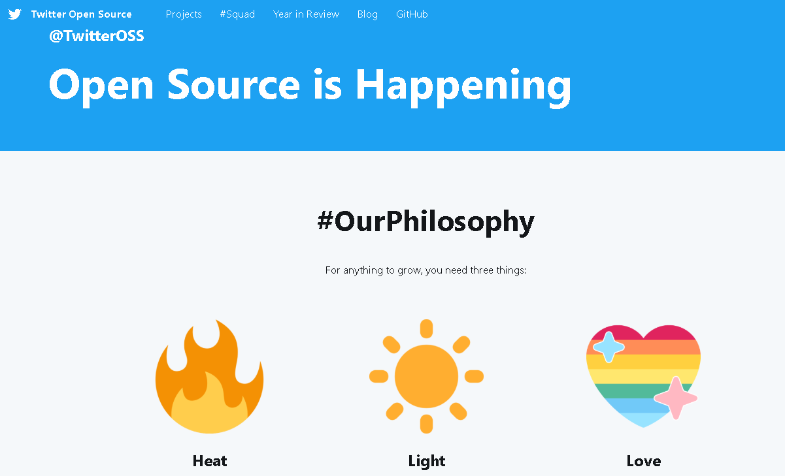

<!-- Scoped style -->

# <!--fit-->  Document with Some Tools

Michael
June, 2020

---

#  Agenda

- Basic
  - Workflow
  - Use Markdown
  - Write Documents in Typora 
  - Share Documents With GitHub
- Advance
  - Write Slides in Visual Studio Code with Marp
  - Write Interactive Codes in Jupyter Notebook
  - Convert Markdown to Jupyter Notebook
  - Publish Documents with GitHub Pages

---

# Workflow

> All tools are free.

---
## Principles
- Most documents are written by Markdown. 
- All history versions of documents are stored by Git and GitHub. 

---

# Use Markdown

[Markdown](https://en.wikipedia.org/wiki/Markdown) is a lightweight markup language with plain-text-formatting syntax, created in 2004.

- Fast: Without Rich Format
- Easy: Learn it in 5 minutes.
  tutorial: https://guides.github.com/features/mastering-markdown/

---

---

## Show Mathematics using Tex/LaTeX syntax

All markdown tools supports rendering normal mathematics using Tex/LaTeX syntax.

---
Here are the codes behind the mathematics.
~~~markdown
\begin{align*}
y = y(x,t) &= A e^{i\theta} \\
&= A (\cos \theta + i \sin \theta) \\
&= A (\cos(kx - \omega t) + i \sin(kx - \omega t)) \\
&= A\cos(kx - \omega t) + i A\sin(kx - \omega t)  \\
&= A\cos \Big(\frac{2\pi}{\lambda}x - \frac{2\pi v}{\lambda} t \Big) + i A\sin \Big(\frac{2\pi}{\lambda}x - \frac{2\pi v}{\lambda} t \Big)  \\
&= A\cos \frac{2\pi}{\lambda} (x - v t) + i A\sin \frac{2\pi}{\lambda} (x - v t)
\end{align*}
~~~

---

## Show Diagrams using Mermaid 

 [Mermaid](https://mermaid-js.github.io/mermaid/#/) is a tool to geneate diagrams and flowcharts from text in a similar manner as markdown. 

Mermaid was nominated and won the JS Open Source Awards (2019) in the category "The most exciting use of technology"!!!

> The worflow diagram was done by Mermaid.  
> Though Mermaid is still much simpler than other commercial tools(like visio),  it is faster to create and modify diagrams via codes. 

---

see [more examples](https://mermaid-js.github.io/mermaid/#/examples), [Mermaid live editor](https://mermaid-js.github.io/mermaid-live-editor)

---

# Write Documents in Typora

[Typora](https://typora.io/) is a markdown editor.  It gives you a seamless experience as both a reader and a writer.

- Distractions Free
- Seamless Live Preview
- What You See Is What You Mean

> Typora is commercial software (not open source), but is free during beta.

---

Easy to locate the chapter in Outline. 

---

# Easy to Insert Image

- insert images via capturing screen 
- copy images from web pages

Don't need to download or upload, it only takes less than 3 seconds to add an image in the document.

---

# Share Documents With [GitHub](https://github.com/)

There are 3 actions.

1. Commit the changes with description.

2. Push to GitHub

   Share the changes to others.

3. Pull from GitHub

   Get updates from others.

> Suggest to use [GitHub Desktop](https://desktop.github.com/). 

---

GitHub Desktop monitors the documents automatically. It is pretty easy to commit, push and pull  changes on GitHub Desktop.

---

# Write Slides in Visual Studio Code with Marp

[Marp for VS Code](https://github.com/marp-team/marp-vscode) is a tool to create slide deck written in Marp Markdown on VS Code.

- Install [Marp for VS Code](https://marketplace.visualstudio.com/items?itemName=marp-team.marp-vscode) in VS Code.

- Tutorial: https://marpit.marp.app/markdown

> This PPT itself was done by Marp for VS Code.

---

---

# Write Interactive Codes in Jupyter Notebook

The [Jupyter Notebook](https://jupyter.org/) is an open-source web application that allows you to create and share documents that contain live code, equations, visualizations and narrative text.

- Jupyter supports over 40 programming languages, including Python, R, Julia, and Scala.

- Install [Jupyter Notebook](https://jupyter.org/install) 

---

[sample link](https://nbviewer.jupyter.org/github/odewahn/ipynb-examples/blob/master/SymPy%20Examples.ipynb)

---

# Convert Markdown to Jupyter Notebook

[notedown](http://github.com/aaren/notedown) is a simple tool to create [IPython notebooks](http://www.ipython.org/notebook) from markdown (and r-markdown).

~~~
 # Install
 sudo  pip3 install notedown
 # Convert
 notedown tutorial.md > tutorial.ipynb
~~~

 

---

# Publish Documents with GitHub Pages

use [GitHub Pages](https://pages.github.com/) to host a website about yourself, your organization, or your project directly from a GitHub repository.
    
        

---

## Example: [Twitter GitHub](https://twitter.github.io/)

see [more examples](https://github.com/collections/github-pages-examples)

---

<!-- 
_paginate: false
_footer: ''
_backgroundImage: "linear-gradient(to left, white, #0088d1)" 
-->

<!-- Scoped style -->

# Thank You :smile: