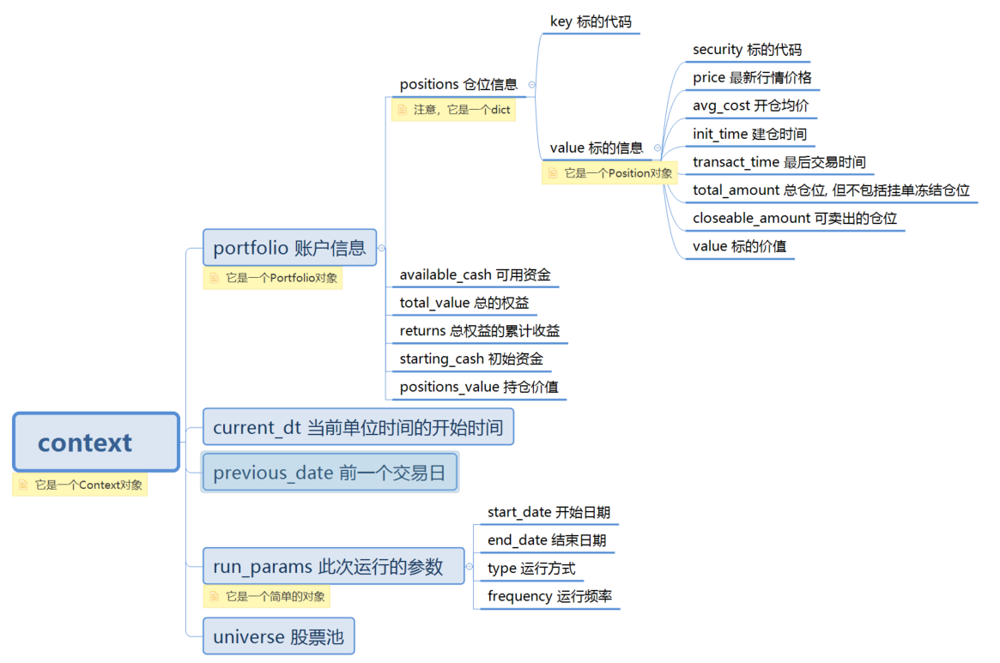
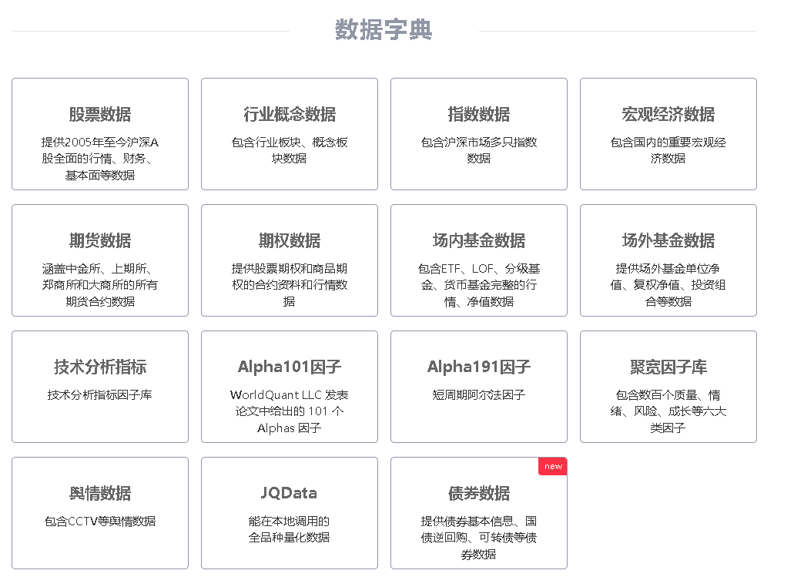

### 基本结构

~~~python3
  def initialize(context):
      run_daily(period,time='every_bar')
      g.security = '000001.XSHE'

  def period(context):
      order(g.security, 100)
~~~

### context

context是一个回测系统建立的Context类型的对象，其中存储了如当前策略运行的时间点、所持有的股票、数量、持仓成本等数据。

### 聚宽数据

https://www.joinquant.com/data

| 列名       | 列的含义                         | 类型 | 单位 | 说明                         |
| :--------- | :------------------------------- | :--- | :--- | :--------------------------- |
| id         | id                               | 数字 |      |                              |
| stat_month | 统计月份                         | 文本 |      | YYYY-MM                      |
| m2         | 货币和准货币(M2)供应量           | 数字 |      |                              |
| m1         | 货币(M1)供应量                   | 数字 |      | 货币=流通中货币+单位活期存款 |
| m0         | 流通中现金(M0)供应量             | 数字 |      |                              |
| m2_yoy     | 货币和准货币(M2)供应量同比增长率 | 数字 |      |                              |
| m1_yoy     | 货币(M1)供应量同比增长率         | 数字 |      |                              |
| m0_yoy     | 流通中现金(M0)供应量同比增长率   | 数字 |      |                              |
