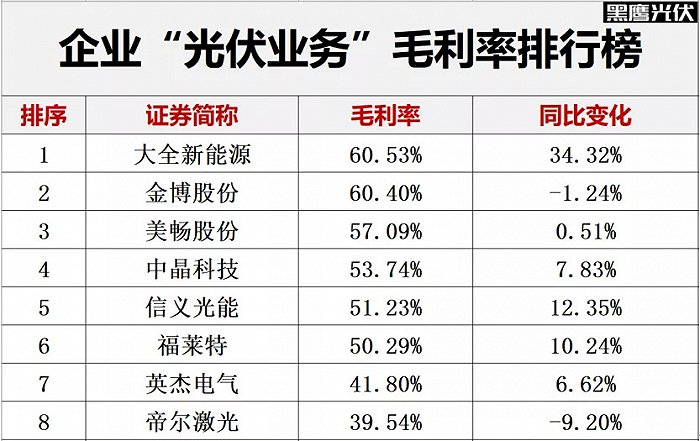

[哪些光伏企业最能赚钱？](https://finance.sina.com.cn/jjxw/2021-09-23/doc-iktzqtyt7622643.shtml)

[光伏企业研发实力排行榜](https://www.jiemian.com/article/6214980.html)

## 净利润

整体来看，2021年上半年，69家光伏制造企业总计创造净利润279.58亿元，同比增长67.62%，整体仍保持快速增长趋势。

我们注意到，前十名光伏制造企业净利润合计达208.48亿元，占整体的比例达74.57%，前二十名企业净利润占比达94.13%。

此外，上半年前21名光伏制造企业净利润均实现正增长，其中10家企业净利润增幅在100%以上，增幅前两名均为多晶硅企业，第一名新特能源，净利润同比增长了70565.25%，第二名大全新能源净利润同比增长了708.33%。

上半年，还有18家光伏企业净利润出现负增长，13家企业出现亏损，7家企业净利润降幅在100%以上，其中多为光伏电池片与组件企业。

## 毛利率

2021年上半年，至少41家光伏制造企业毛利率同比下降，占比在60%以上，其中涵盖光伏电池片、组件、支架、逆变器等领域核心玩家。而毛利率上涨的企业中，光伏玻璃、多晶硅等企业占据头部位置。（注：本文不构成投资建议）

## 供应链谁最赚钱？

### 多晶硅

2020年光伏上市公司多晶硅业务全部实现快速增长，年度多晶硅销售收入第一名是[通威股份](https://finance.sina.com.cn/realstock/company/sh600438/nc.shtml)(52.040, 1.58, 3.13%)，但大全新能源、新特能源都在以更快速的势头追赶，2020年两者多晶硅销售收入分别同比增长了80.51%和78.70%，远超通威股份26.28%的增速。（注：截止目前，保利协鑫能源仍未公布2020年财报，所以未予统计。）

### 硅片

目前在硅片领域，仍是双寡头格局，2020年[中环股份](https://finance.sina.com.cn/realstock/company/sz002129/nc.shtml)(46.310, 0.11, 0.24%)、[隆基股份](https://finance.sina.com.cn/realstock/company/sh601012/nc.shtml)(79.550, 0.00, 0.00%)硅片对外销售规模约分别为168.29亿元和155.13亿元，占据绝对领先地位。

### 电池片

在太阳能电池片领域，通威稳坐销售规模第一把交椅，2020年其太阳能电池片收入达155亿元，第二名是[爱旭股份](https://finance.sina.com.cn/realstock/company/sh600732/nc.shtml)(14.760, 0.05, 0.34%)，收入为93.45亿元，两者实力要显著高于其他竞争对手。

### 组件

太阳能组件是当前光伏两极分化最为严重的领域，可能没有之一。

首先，从销售规模看，2020年7家组件收入在100亿元以上的产业巨头都实现了正增长，其中增长最快的三家企业为隆基股份增长139.83%、[天合光能](https://finance.sina.com.cn/realstock/company/sh688599/nc.shtml)(49.370, -0.29, -0.58%)增长34.51%和[晶澳科技](https://finance.sina.com.cn/realstock/company/sz002459/nc.shtml)(59.770, 0.41, 0.69%)增长23.64%

### 光伏玻璃

2020年光伏上市公司中光伏玻璃业务全部实现了30%以上的高速增长：光伏玻璃双寡头信义光能、[福莱特](https://finance.sina.com.cn/realstock/company/sh601865/nc.shtml)(43.800, 0.80, 1.86%)都实现了39%左右的增长，而增长最快的当属亚玛顿，其光伏玻璃产品收入同比增长了99.37%。

### 逆变器

如今光伏逆变器领域也隐现“强者愈强”的现象。

如下表所示，2020年光伏逆变器收入前三名的企业[阳光电源](https://finance.sina.com.cn/realstock/company/sz300274/nc.shtml)(145.920, -4.28, -2.85%)、[锦浪科技](https://finance.sina.com.cn/realstock/company/sz300763/nc.shtml)(235.540, 3.34, 1.44%)、[固德威](https://finance.sina.com.cn/realstock/company/sh688390/nc.shtml)(350.000, -19.88, -5.37%)，同时也位居增幅前三位，强者恒强的趋势非常明显。

而诸如[科士达](https://finance.sina.com.cn/realstock/company/sz002518/nc.shtml)(26.030, -1.11, -4.09%)、[易事特](https://finance.sina.com.cn/realstock/company/sz300376/nc.shtml)(9.270, -0.19, -2.01%)等中小型光伏逆变器厂商2020年逆变器销售收入则分别同比下降了58.16%和34.18%。

### 光伏支架

光伏支架领域则出现了“一强多弱”的局面。

据黑鹰光伏统计，2020年上市公司中只有[中信博](https://finance.sina.com.cn/realstock/company/sh688408/nc.shtml)(164.830, 10.15, 6.56%)“光伏支架”业务实现了高速增长，其他上市公司则均出现不同程度下降。

### EVA胶膜

际上，EVA胶膜企业也是2020年光伏领域最大赢家之一。

据黑鹰光伏统计，2020年主要EVA胶膜上市公司都实现了30%以上快速增长，如今行业龙头[福斯特](https://finance.sina.com.cn/realstock/company/sh603806/nc.shtml)(122.670, -3.83, -3.03%)已拥有绝对的优势地位，2020年福斯特EVA胶膜收入达75.62亿元，是第二位[东方日升](https://finance.sina.com.cn/realstock/company/sz300118/nc.shtml)(18.260, -0.48, -2.56%)的4.24倍。

### 光伏背板

在太阳能电池背板领域，2020年中来股份销售规模升至第一位，而[赛伍技术](https://finance.sina.com.cn/realstock/company/sh603212/nc.shtml)(31.350, -0.26, -0.82%)由于“背板”收入下降了29.92%，创2020年5家“太阳能电池背板”光伏上市公司中最大降幅，其收入排名已降至第二位。

2020年在太阳能电池背板领域增长最快的企业当属[乐凯胶片](https://finance.sina.com.cn/realstock/company/sh600135/nc.shtml)(7.260, 0.05, 0.69%)，其“太阳能电池背板”收入同比增长了41.69%至9.88亿元，刷新其历史最高纪录。

### 国内电池银浆

### 金刚线

## 研发

### 专利数排名

### 研发支出

### 研发投入比

### 研发人员规模

### 研发人员占比

