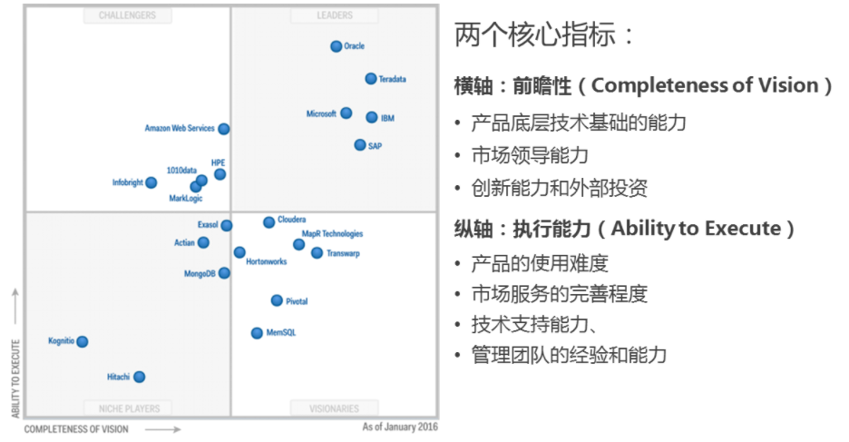
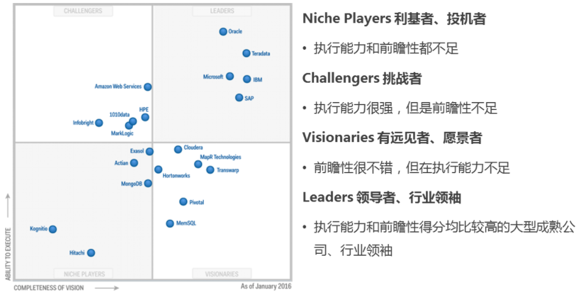
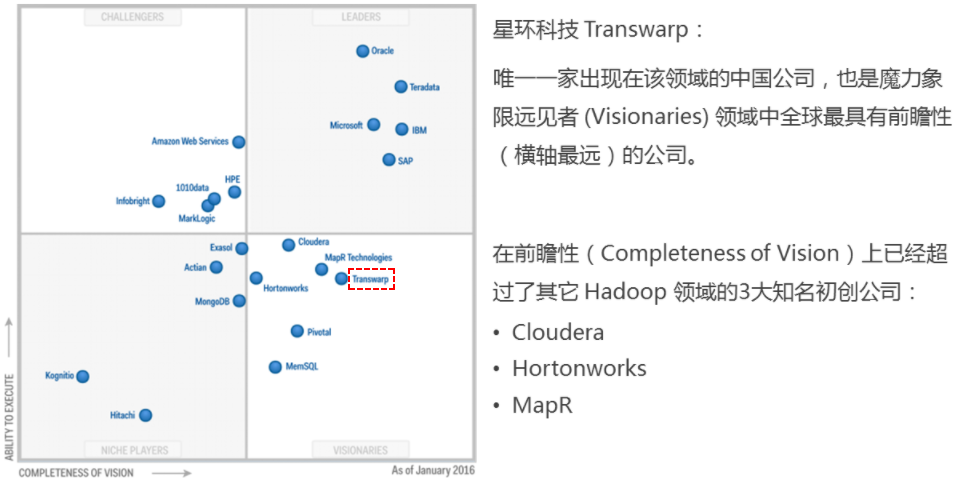

## 如何看懂Gartner魔力象限

https://ask.hellobi.com/blog/biwork/3487

Magic Quadrant 魔力象限以二维模型来阐述各个厂商、供应商的实力与差异，基于两个分析指标方向。

- 横轴：前瞻性（Completeness of Vision），包括厂商或供应商提供的产品底层技术基础的能力、市场领导能力、创新能力和外部投资等等。
- 纵轴：执行能力（Ability to Execute），包括产品的使用难度、市场服务的完善程度和技术支持能力、管理团队的经验和能力等。

最后将这些分析指标综合起来定位在四个不同的区域：

### Niche Players 利基者、投机者 

执行能力（Ability to Execute）和前瞻性（Completeness of Vision）都不足，但是可能在特定的某个市场做的不错，同时也不会超过那些特别大型的成熟厂商或者供应商。通常是集中在某些特定领域、专业领域，或者是一些比较新的企业。

### Challengers 挑战者

执行能力（Ability to Execute）很强，但是前瞻性（Completeness of Vision）不足。通常情况下是指比较大型的成熟厂商，由于其本身特定市场比较成熟、市场执行能力很强，但是在新领域新市场的拓展上目前还没有做出太多的发展计划改变。作为挑战者，在继续保持强有力的执行能力的同时，如果在市场前瞻性上能够调整和突破，是非常有希望进入领导者（Leaders）区域的。

### Visionaries 有远见者、愿景者 

Visionaries 本身这个词的词义是指空想主义者、愿景者，但是放在这里还是用远见者描述更加合适。通常描述前瞻性（Completeness of Vision）很不错、了解未来的市场发展动态和前景，有潜力进行创新。在执行能力（Ability to Execute）上分为有远见但是短期内无法实现的早期创业者，和一些有远见但是执行反应能力调整不及时的比较成熟的大型厂商、供应商们。所以对于在这个区域的厂商或者供应商，一般要么就是早期市场中刚成长起来的中小企业，有创新能力有远见，一旦在市场执行得到提升也是非常有希望进入到领导者（Leaders）区域。

以 2016 Gartner 发布的有关数据仓库及数据管理解决方案市场的魔力象限（Magic Quadrant for Data Warehouse and Data Management Solutions for Analytics）为例。在对全球21家厂商进行对比分析后，Gartner 分析报告首次出现了来自中国的公司星环科技 Transwarp，唯一一家出现在该领域的中国公司，也是魔力象限远见者 (Visionaries) 领域中全球最具有前瞻性（横轴最远）的公司。在 Hadoop 发行版厂商中，在前瞻性（Completeness of Vision）上已经超过了 Hadoop 领域的知名初创公司 Hortonworks、Cloudera 和 MapR。 星环科技在执行能力（Ability to Execute）上来看，目前也与以上提到的三大 Hadoop 厂商差距不大，如果能够在执行能力上继续得到提升的话，相信在不久的将来在数据仓库及数据管理解决方案（Data Warehouse and Data Management Solutions ）的领导者区域应该可以看到中国厂商的身影。

### Leaders 领导者、行业领袖 

执行能力（Ability to Execute）和前瞻性（Completeness of Vision）得分均比较高的大型成熟公司、行业领袖。他们拥有大量的客户群体，在全球市场上都有极高的知名度。这些行业领袖在市场中有很大的影响力，有能力有实力影响和引领整个行业的发展。

以上图为例，在数据仓库及数据管理解决方案（Data Warehouse and Data Management Solutions ）的领导者区域还是以 Oracle、Teradata、IBM、SAP、Microsoft 这些传统巨头为主。同时也可以看到 Oracle 在执行能力上要远远高于其它厂商，在前瞻性上要稍微落后于 Teradata 和 IBM。但这幅图最可怕之处是这五大厂商在领导者区域的位置已经深入领导者象限腹地，与挑战者或是远见者的平均得分的差距还是非常大的，可以说是行业的绝对领袖。