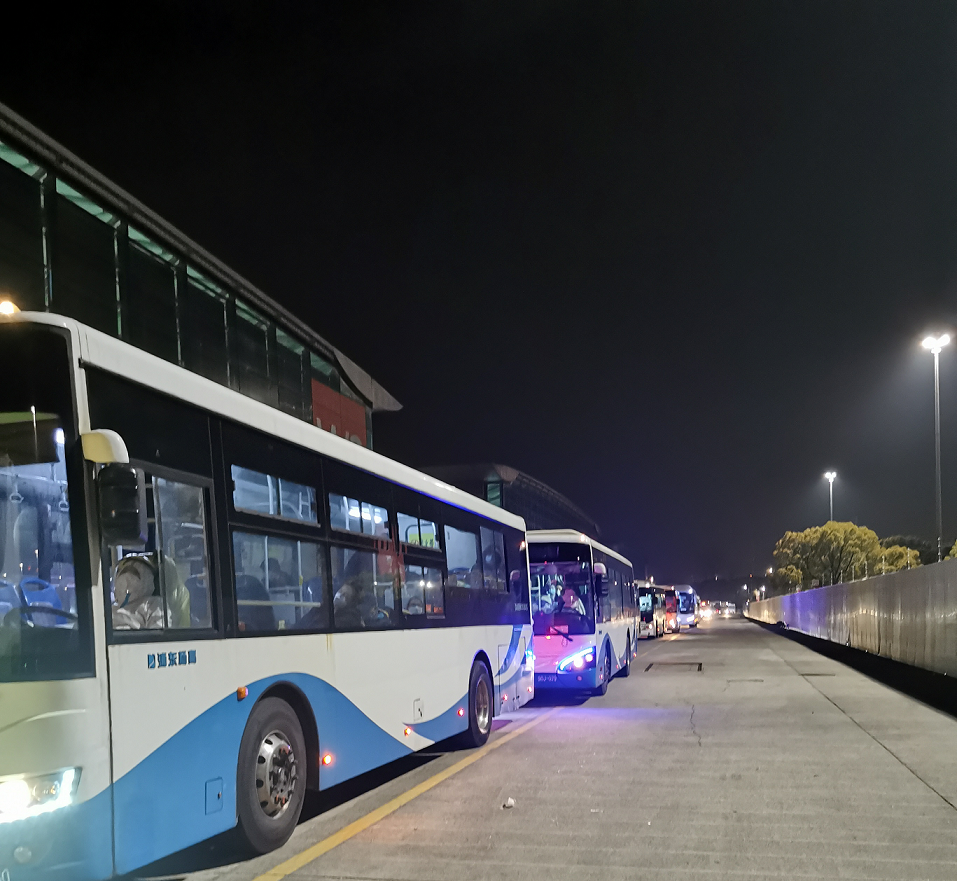
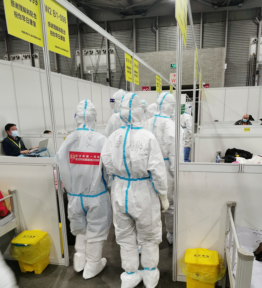
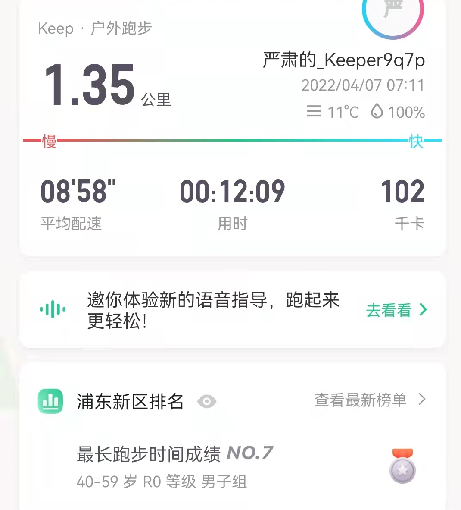

记录一下，这次生病的经历。非常感谢家人，朋友和同学对我的关心和支持，这让我感到有了无穷的力量。

### 疫苗

- 本人：两针
  - 2022-04-02 ：北京生物疫苗第一针，
  - 2022-04-04：北京生物疫苗第二针
- 孩子：两针，2022-03-12 打的第二针
- 母亲和妻子：三针

### 2022-03-26 周六

- 自测抗原，全家阴性
- 和本楼志愿者有接触，他们家四人当天抗原阳性，后来核酸检测都是阳性。
- 楼栋单元被封。

### 2022-03-28 周一

- 全家核酸检测。这个核酸检测结果一直未出。

### 2022-03-30 周三

- 喉咙有点痒, 有一点头晕和乏力。
- 全家核酸检测，第二天结果出来，都是阴性

### 2022-03-31 周四

- 喉咙发干；有些头晕，全身乏力
- 大部分时间卧床休息。
- 吃阿咖酚散，
- 晚上工作了两个小时。

### 2022-04-01 周五

- 喉咙非常痛，像针扎；有一些发烧（38度左右）；头晕，全身无力；嗓子有些哑。

- 卧床休息。

- 吃阿咖酚散，下午开始吃连花清瘟胶囊

- 自测抗原阳性。家人都是阴性，且没有任何异样。

  

- 开始被隔离在单独房间。

- 电脑不知道怎么被水泼了，无法启动。

### 2022-04-02 周六

- 喉咙非常痛，像针扎；有一些发烧（38度左右）；头晕，全身无力；嗓子非常哑。

- 卧床休息。

- 吃连花清瘟胶囊。

- 个人核酸检测。这个核酸检测结果一直未出。

- 飘窗晒电脑。试了很多次，无法开机，晚上睡觉前，又试了一下，启动了。

- 女儿送我千纸鹤。

  

### 2022-04-03 周日

- 喉咙不太痛了；体温37度左右；有时会咳黄痰；有轻微鼻塞。
- 一半时间卧床，可以玩游戏了。
- 吃连花清瘟胶囊。

### 2022-04-04 周一

- 喉咙完全不痛了，发干；咳嗽变得很厉害，痰多，黄白色；鼻塞，鼻涕多。

  - 下午开始连续喷嚏，痰基本是白色。体温36.4度

- 精力感觉基本恢复了。

- 吃连花清瘟胶囊。

- 自测抗原阳性

  

- 女儿送我福袋。

  
  
  

### 2022-04-05 周二

- 和昨天症状相同，所有方面都有所减轻，尤其咳嗽力度明显减弱，痰基本是白色的。上午体温36.6。

- 精力感觉和昨天差不多

- 只吃清肺消炎丸。

- 下午接到疾控中心电话，说我的核酸检测结果阳性，准备转运。

  - 晚上8:44，接到居委会电话，让我下楼转运。

  - 晚上9:15，上了874公交车，陆陆续续车上上了有30多人吧。奇怪，一上车，喉咙开始痒了，不停咳嗽。

  - 晚上10:08，到了龙阳路新国际博览中心，前面排着很多大巴，进舱速度很慢慢，我们不得不在车上等待。

    

  - 次日5:37，总算办理好了入住方舱。一夜无眠，不过比我们辛苦多的多是医护人员，他们穿着防护服，还要工作。分发的东西很齐备。

    

    

### 2022-04-06 周三

- 早上补了一觉，咳嗽痰都少了好多，越来越好了。

- 白天是10院的医护人员，晚上换岗了，是武汉来支援的医护人员。

  

- 吃清肺消炎丸两次。

- 午餐和晚餐。营养丰富，味道一般。

  

- 方舱环境一览。

  

  

  

  后悔啊，为啥没带足球，走之前，还犹豫来着。带双羽毛球拍也好啊。

### 2022-04-07 周四

- 还有有一点咳嗽和痰。

- 早上5点多就起来了，好久没这么早起来了。

- 早上散步

  

- 连了WiFi，网速也快起来了，嗖嗖的。要来串羊肉串吗？

  

