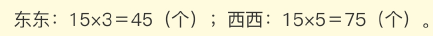

1. 

2.   1871

3. 

4.  2

5. 

132. 

6. 

7.  1001

8. 

9. 

10. 

11. 

13.  

14. 

15. 

16. 

131. 

132. 

133. 

134. 

21. 

22. 

23. 设白球为y，红球为3y+2，取球次数x。

    y =  7x + 3

    3y +2  = 15x + 53

    求得y = 52， x = 7

24. 15X + 53

25. 7X + 3

26. 3

83. 

84. 

85. 

86. 6

26. 

27. 

28. 

29. 

29. 

31. 133. 2

31. 

32. 

33. 

34. 16

35. 

36. 

37. 

38. 一个全程

39. 

40. 100+9*400 = 3700

41. 

42. 200*9+150 = 1950 秒

43. 

44. 

45. 

112. 8

113. 5

46. 

47. 

48. 

49. 

50. 

51. 

52. 

53. 

54. 

55. 2

56. 4216

57. 

58. 

59. 

60. 

61. 

62. 400秒

63.  

64. 

65. 

66. 是一半

67. 是一半

68. 12 平方厘米

69. 40

70. 18

108. 7

109. 10

110. 24

111. 8

71. 60 平方厘米

72. 是一半

73. 三角形DCE是三角形ABC的两倍面积

74. 12

75. 三角形ABE，三角形AEC

77. 48平方厘米

78. 14 平方厘米

79. 梯形OCEF

80. 

81. 6

87. 

88. 

89. 

90. 

91. 

92. 

93. x = 3

94. 

95. 

96. 1

97. 523.07

98. 35

99. 

100. 18

101. 39 平方厘米

102. 36 平方厘米

103. 12.5 平方厘米

104. 9 平方厘米

105. 6

106. 6 平方厘米

107. 6 平方厘米

114. 

115. 97

116. 6.4

117. 64

118. 15

119. 28

120. 3800

121. 888

122. 对的

123. 对的

124. 

125. 

126. 1，2

127. 90

128. 22365

129. 3367

130. 

131. 2

134. 

134. 

135. 

136. 

137. 

138. 

139. 

139. 12天

140. 12，三角形ABC，三角形BDC

