1. 

2.  

   A. 1233     B.  945    C. 1871     D. 189

3. 

4. 

5. 

6. 

6. 

7.  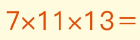

8. 

9. 

10. 

11. 

13. 

14. 

15. 

16. 

17. 

18. 

19. 

20. 

21. 

22. 

23. 

24. 

24. 

26. 

83. 

84. 

85. 

    A. 组成加数的数字与*右边的数字相同。

    B. 组成加数的数字与*左边的数字相同。

    C. 没有什么关系

86. 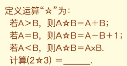

26. 

27. 

28. 红球数比白球数的3倍多2个。

    

29. 

34. 

31. 

31. 

32. 

33. 

34. 

35. 

36. 

37. 

38. 

39. 

40. 

41. 

42. 

43. 

44. 

45. 

108. 

109. 

46. 

47. 

48. 

49. 

50. 

51. 

52. 

53. 

54. 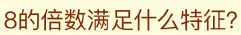

55. 

56. 

    A. 118     B. 4216     C. 74      D. 122

57. 

58. 

59. 

60. 

61. 

62. 

63. 

64. 

65. 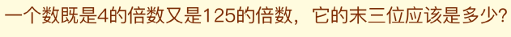

66. 

67. 

68. 

74. 

    空白部分=S1+S2+S3+S4

75. 

76. 

77. 

78. 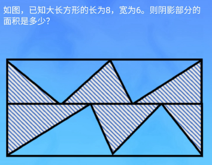

79. 

80. 

81. 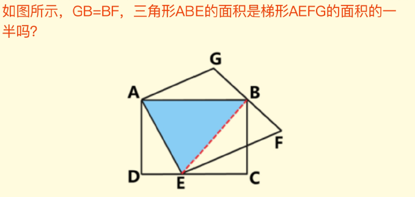

82. 

83. 

84. 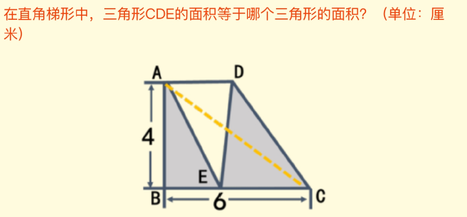

86. 

87. 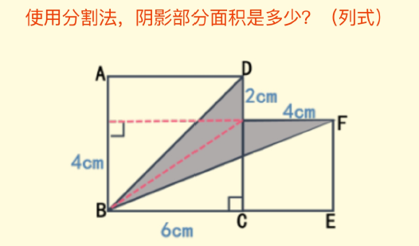

88. 

    阴影部门面积多少？

89. 

90. 

91. 

92. 

93. 

94. 

95. 

96. 

97. 

98. 

    

99. 

    

100. 

101. 

102. 

103. 

104. 

105. 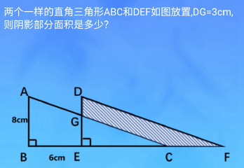

106. 

107. 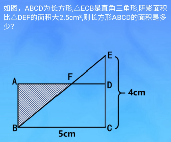

110. 

111. 

112. 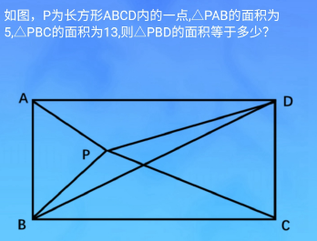

113. 

114. 

115. 

116. 

117. 

118. 

119. 

120. 

     那么这个四位数组第是多少？

121. 

122. 

123. 

124. 

     且每人所交的钱数均为整数，那么总钱数最多是多少元？

125. 

126. 

127. 

     它的最后两位数是多少？

128. 

     那么这个五位数是多少？

129. 

     

130. 

131. 

133. 

134. 

135. 

136. 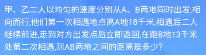

137. 

138. 

139. 

139. 

140. 

     阴影部分面积多大？