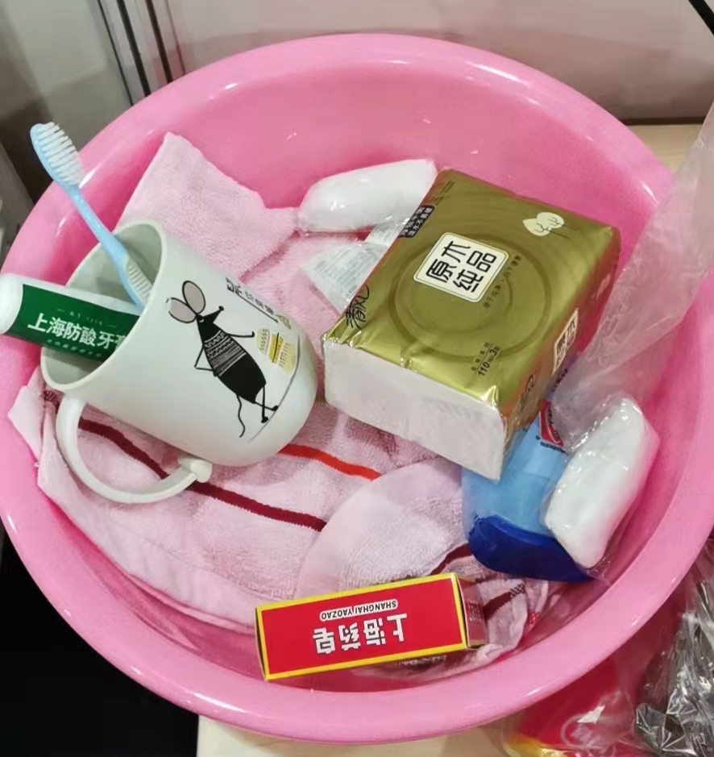

2022年4月，我在上海感染了新冠病毒，本文记录了从在家发病，转运方舱，以及方舱回家的一段生活。非常感谢家人，朋友和同学这段时间对我的关心和支持，这让我感到有了无穷的力量。

### 疫苗

- 本人：两针
  - 2022-04-02 ：北京生物疫苗第一针，
  - 2022-04-04：北京生物疫苗第二针
- 孩子：两针，2022年3月份打的第二针
- 母亲和妻子：三针

### 2022-03-26 周六 家 

- 自测抗原，全家阴性
- 和本楼志愿者有接触，他们家四人当天抗原阳性，当晚核酸检测都是阳性。估计被这个传染的可能性很大
- 楼栋单元被封。

### 2022-03-28 周一 家 

- 全家核酸检测。这个核酸检测结果一直未出。

### 2022-03-30 周三 家 

- 喉咙有点痒, 有一点头晕和乏力。
- 全家核酸检测，第二天结果出来，都是阴性

### 2022-03-31 周四 家 

- 喉咙发干；有些头晕，全身乏力
- 大部分时间卧床休息。
- 吃阿咖酚散。
- 晚上工作了两个小时。

### 2022-04-01 周五 家 

- 喉咙非常痛，像针扎；有一些发烧（38度左右）；头晕，全身无力；嗓子有些哑。

- 卧床休息。

- 吃阿咖酚散，下午开始吃连花清瘟胶囊。小区的球队兄弟还给我带了两盒，谢谢啊。

- 自测抗原阳性。家人都是阴性，且没有任何异样。

  

- 开始被隔离在家里单独房间。

- 祸不单行，电脑不知道怎么被水泼了，无法启动。

### 2022-04-02 周六 家 

- 喉咙非常痛，像针扎；有一些发烧（38度左右）；头晕，全身无力；嗓子非常哑。

- 卧床休息。

- 吃连花清瘟胶囊。

- 个人核酸检测。这个核酸检测结果一直未出。

- 飘窗晒电脑。试了很多次，无法开机，晚上睡觉前，又试了一下，启动了。

- 女儿送我千纸鹤。

  

### 2022-04-03 周日 家 

- 喉咙不太痛了；体温37度左右；有时会咳黄痰；有轻微鼻塞。
- 一半时间卧床，可以玩游戏了。
- 吃连花清瘟胶囊。

### 2022-04-04 周一 家 

- 喉咙完全不痛了，只是有些发干；咳嗽变得很厉害，痰多，黄白色；鼻塞，鼻涕多。

  - 下午开始连续喷嚏，痰基本是白色。体温36.4度

- 精力感觉基本恢复了。

- 吃连花清瘟胶囊。

- 自测抗原阳性。

  

- 女儿送我福袋。

  

  

### 2022-04-05 周二 家 

- 和昨天症状相同，所有方面都有所减轻，尤其咳嗽力度明显减弱，痰基本是白色的。上午体温36.6。

- 精力感觉和昨天差不多。

- 只吃清肺消炎丸。

- 小区的志愿者帮助我们给妈妈配到了糖尿病和高血压的药，真的很感谢他。经过了很多尝试，在目前物流基本瘫痪的情况下，这真的是雪中送炭。

- 下午接到疾控中心电话，说我的核酸检测结果阳性，准备转运。

  - 晚上8:44，接到居委会电话，让我下楼转运。

  - 晚上9:15，上了874公交车，陆陆续续车上上了有30多人吧。奇怪，一上车，喉咙开始痒了，不停咳嗽。

  - 晚上10:08，到了龙阳路新国际博览中心，前面排着很多大巴，进舱速度很慢很慢，我们不得不在车上等待。

    

  - 次日5:37，总算办理好了入住方舱。一夜无眠，不过比我们辛苦多的多是医护人员，他们穿着防护服，还要工作。

  - 分发的东西很齐备。

    

    
  
    

### 2022-04-06 周三 方舱

- 早上补了一觉，咳嗽痰都少了好多，鼻涕基本没了，越来越好了。

- 白天是10院的医护人员，晚上换岗了，是武汉来支援的医护人员。

  

- 吃清肺消炎丸两次。

- 午餐和晚餐。营养丰富。

  

- 方舱环境一览。可以遛弯，这比家里可好多了。就是没法洗澡，厕所是一排应急的流动厕所仓，数量足够，但很脏。

  

  

  

  后悔啊，为啥没带个足球，走之前，还犹豫来着。带双羽毛球拍也好啊。

- 老婆接到居委电话，家人作为密接，也要被转运至酒店或隔离点隔离，不知道他们会被运到哪里。家里小猫怎么办啊？

  

  > 直到我后来出舱，家人也没有被转运走，看来的确是住满了，没地方了啊。

### 2022-04-07 周四 方舱

- 还有有一点咳嗽和痰。

- 早上5点多就起来了，好久没这么早起来了。

- 早上散步

  

- 连了wifi，网速也快起来了，嗖嗖的。要来串羊肉串吗？

  

​		不过上午9点后，就明显慢下来了，看来还是人多。

- 晚上11:00多，开始测核酸了。上海能使用的方舱已经8w+，在建的还有几w，但仍然不够用啊。看到下面这个通知，看来尽快出舱有希望了。

  

### 2022-04-08 周五 方舱

- 还有偶尔有一点咳嗽和痰。看来这个状态将会持续一段时间啦

- 早上5点多，听到孩子连续撕裂的哭声，估计是不舒服喉咙痛。这哭声提醒我，虽然大多数人是轻症甚至无症状，但由于感染人数巨大，少数的重症其实绝对数量也不小，绝不可掉以轻心。

- 哥哥发了他们附近小区的一些"唱歌"的画面。

  的确有不少人家里已经没粮了。或许能够在方舱也是一种幸运。

### 2022-04-09 周六 方舱

- 今天有大鸡腿。

  

- 从7号开始一天一次核酸。当了一下志愿者，帮忙大白来维护核酸的队伍。哪一个是我？

  

- 闲逛

  

- 下午溜到W4和球队的大腿相见。

  

  

- 经过了几天的磨合，方舱的环境也越来越好。开始的时候，大家把东西乱扔，水槽垃圾尤其多，厕所很脏，现在，大家越来越爱护自己生活的环境了，垃圾少了，上厕所的时候，很多人都会准备一盆水。

### 2022-04-10 周日 方舱

- 今天早上总算能跑起来了。

  

- 闲逛
  

- 又有百叶卷？好像是上海清明特产。

  

- 昨天下午，护士过来通知有一部分人，明天可以回家了。瞄了一眼名单，大概有10%左右。我的对床也被通知了，什么时候才轮到我。

  

- 这几天陆陆续续看到很多负面的消息。上海作为超大城市，物资供应和医疗服务都是极其严峻的考验，现在正是困难时刻，上海坚持住。

### 2022-04-11 周一 方舱

- 或许是对床今天就要回家了，今天忽然很想回家。

- 今天突破三公里了。以后每天保持这个量啦。估计这样下去，体重可以再降一降。

  

- 今天配了酸奶，加上早上剩下的牛奶，还不错。

  

  

- 今天老婆说，她去我单独居家隔离的房间拿东西，不想“西西”也偷偷跟进去了，不得已只好给小猫喷点酒精消毒，然后洗澡了。“西西”是不是也想我了啊？

  

### 2022-04-12 周二 方舱

- 早上帮着分发早餐，分了40分钟，还是有点儿累啊。由此，今天早上只跑了1.5公里。

- 上午给武汉第一医院的医护拍了些照片和视频。拍完后，他们自己剪了一个视频，效果还不错啊。

  

- 中午护士通知我明天可以出舱了，非常高兴啊。对床的昨天没有出去，也是明天，明天好多人都可以出舱了。发的贴牌，明天贴衣服上。

  

### 2022-04-13 周三 方舱

- 早上五点就起来了，早餐分发了一个小时。下雨，没有跑步。

- 早上6点多，护士来通知我，说不能出舱了，核酸复阳，收回了我的贴牌，心里真的好失落。外面也一直下着雨，就像我的心情。之前球队大腿说，如果你是最后10%出舱的，你就牛了，看来他的乌鸦嘴要灵验了。

- 今天的雨很大，屋顶轰隆隆超级响。网上看到其它地方的方舱漏雨，我们这算很好了。

  

- 下午在整理方舱的涂鸦集，把图片变小，整理好后，文件从300MB变成了不到100MB。本来想今天能出去的，想把这个涂鸦集作为方舱的留念，毕竟这个经历也挺难得的。看来老天是想让我多收集一些啊，明天再去转转，看看还有什么新的涂鸦。

### 2022-04-14 周四 方舱

- 早上起来，还有小雨，没有跑步，也没有去做志愿者，想想还是好好休息一下吧。

- 上午基本不下雨了，天气也凉爽起来，感觉心情突然好起来了。

- 中午，护士突然过来通知，说明天可以出舱。真的搞不清了，我究竟啥时候阳的，为啥又可以出了。我哥说他能查到核酸记录，我却不能，目前好像就是方舱的人查不到核酸检查记录。今天早上又进行了核酸，真的有些担心，不能高兴太早了啊。希望方舱早日清空，上海早日清零，大家早日回归正常的生活。

  

- 家里的小猫怎么这么可爱。

  

### 2022-04-15 周五 方舱

- 早上6:00护士给我又发了出舱的贴牌。到周围转了一圈，发现也有人被通知不能出舱，看来阴阳互换，还是有不少的。

  

  

- 今天要出舱了，排队中。这次应该没跑了，发了通知给家人，同学和朋友，让他们安心。这次方舱经历，收获了太多的祝福和支持，诚挚的感谢大家。

  

- 坐上了公交车，就要离开住了10晚的方舱了，心里忽然有一丝的不舍，这真的是一段很特别的经历啊。不到20分钟，车开到了中转站——源深体育馆。

- 根据已经出舱朋友的建议，没有留在馆里等各镇的接驳车，而是来到楼下打车。非常幸运，正好有一辆强生的空车。上了车，和司机聊了起来，他说浦东能够运营的出租车辆只有94辆，这几天高峰时段，加几百块钱抢车的非常多。看来我还真的挺幸运，今天出舱的人相对少，而且来源深体育馆别比较早。不知道为啥，在公交车和出租车上，头都有点儿晕，或许是兴奋吧。一路基本无车，不到30分钟，就来到了小区，我回来了。

  

### 最后

还是家里的饭菜香啊，真的感觉到了幸福，幸福就是这么简单。非常感谢方舱的医护工作者，非常感谢小区的志愿者，非常感谢朋友和同学，你们的关心和支持让我感到了幸福。

相信上海已经度过了最困难的时刻，胜利的曙光已现，再坚持一个月，应该可以清零了。希望上海的经验和教训也能被充分吸取，希望新冠疫情能早一点真正结束，希望大家能陪伴着自己的家人一起健康的生活，这就是幸福。

​	

