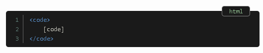
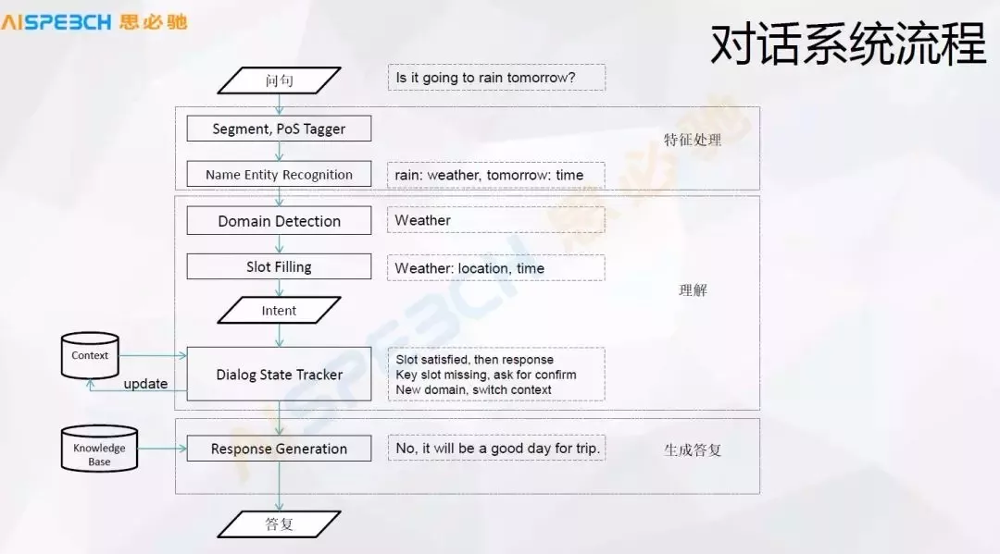

# 5-40-week plan

从6月1日到11月30日，差不多6个月（差不多30周）范围内，完成40周课程。

| No.  | Course                                                       | Week                                                         | Start__Date | End__Date  |
| :--: | :----------------------------------------------------------- | :----------------------------------------------------------- | :---------: | ---------- |
|  1   | Natural Language Processing with Classification and Vector Spaces | [Week 4: Machine Translation and Document Search](https://www.coursera.org/learn/classification-vector-spaces-in-nlp/home/week/4) | 2021-05-31  | 2021-06-02 |
|  2   | Natural Language Processing with Attention Models            | [Week 1: Neural Machine Translation](https://www.coursera.org/learn/attention-models-in-nlp/home/week/1) | 2021-06-03  | 2021-06-14 |
|  3   | Natural Language Processing with Attention Models            | [Week 2: Text Summarization](https://www.coursera.org/learn/attention-models-in-nlp/home/week/2) | 2021-06-15  | 2021-06-27 |
|  4   | Custom Models, Layers, and Loss Functions with TensorFlow    | [Week 1: Functional APIs](https://www.coursera.org/learn/custom-models-layers-loss-functions-with-tensorflow/home/week/1) | 2021-06-30  | 2021-07-01 |
|  5   | Custom Models, Layers, and Loss Functions with TensorFlow    | [Week 2: Custom Loss Functions](https://www.coursera.org/learn/custom-models-layers-loss-functions-with-tensorflow/home/week/2) | 2021-07-01  | 2021-07-01 |
|  6   | Custom Models, Layers, and Loss Functions with TensorFlow    | [Week 3: Custom Layers](https://www.coursera.org/learn/custom-models-layers-loss-functions-with-tensorflow/home/week/3) | 2021-07-02  | 2021-07-02 |
|  7   | Natural Language Processing with Attention Models            | [Week 3: Question Answering](https://www.coursera.org/learn/attention-models-in-nlp/home/week/3) | 2021-06-28  |            |
|  8   | Natural Language Processing with Attention Models            | [Week 4: Chatbot](https://www.coursera.org/learn/attention-models-in-nlp/home/week/4) |             |            |
|      |                                                              |                                                              |             |            |
|      |                                                              |                                                              |             |            |
|      |                                                              |                                                              |             |            |

# 0. Log

### 2021-07-06

https://github.com/Keyird/DeepLearning-TensorFlow2 这个网站里有很多Deep Learning模型，尝试自己也实现一遍， 然和在和作者的模型，对比一下，加深理解。

### 2021-06-23

- 光刻胶

  

- 靶材
  - 江丰电子

### 2021-05-31

next plan:

05:40 ~ 06:10  流利说

06:50 ~ 09:50 Coursera课程

13:00 ~ 16:00 聊天机器人rash

21:00 ~ 22:00  Dash例子

## 1. 任务

### Todo List

- 2021-01-28：吴恩达 **Machine Learning Yearning**
  
  **Github**：*https://github.com/deeplearning-ai/machine-learning-yearning-cn*
  
  **在线阅读**：*https://deeplearning-ai.github.io/machine-learning-yearning-cn/docs/home/*
  
  **中文版**：https://github.com/deeplearning-ai/machine-learning-yearning-cn/releases
  
- 2021-01-13：有时间好好过一下snowflake。
  
- 2021-01-05： [fasttext和cnn的比较，使用keras imdb看效果——cnn要慢10倍。](https://www.cnblogs.com/bonelee/p/9145776.html) 这篇文章主要那个说了用Bi-gram来构建序列，然后
  
- 2020-12-25: 把图像增强的方式，有机会过一遍[在Keras中使用图像增强来进行深度学习](https://www.kesci.com/mw/notebook/5e84541e246a590036b97c9f)
  
- 2020-12-22: 仔细阅读，理解Batch Normalization技术
  
  - [详解深度学习中的Normalization，BN/LN/WN](https://zhuanlan.zhihu.com/p/33173246)
  - [深度学习中的Normalization模型](http://old-101.cvmart.net/community/article/detail/368)
  
- 2020-12-18: [Using Transfer Learning for NLP with Small Data](https://blog.insightdatascience.com/using-transfer-learning-for-nlp-with-small-data-71e10baf99a6) 仔细阅读这篇文章。看来要尽快学习到bert的技术，这样才可以. 类似文章
  
  https://towardsdatascience.com/text-classification-with-extremely-small-datasets-333d322caee2
  
- 2020-12-14：阅读该文[Attention 机制](https://easyai.tech/ai-definition/attention/)
  
- 2020-12-12：多分类sample
  
  - [Multi-Class Text Classification with Scikit-Learn](https://towardsdatascience.com/multi-class-text-classification-with-scikit-learn-12f1e60e0a9f)
  - [Multi Class Text Classification With Deep Learning Using BERT](https://towardsdatascience.com/multi-class-text-classification-with-deep-learning-using-bert-b59ca2f5c613)
  - [Multi-Class Text Classification Model Comparison and Selection](https://towardsdatascience.com/multi-class-text-classification-model-comparison-and-selection-5eb066197568)
  
- 2020-12-07：收集当前文本分类的一些例子，同时展示benchmark。
  
- 2020-12-07：整理之前tensorflow课程里面的内容，把每个ipynb里面有什么大概做一个介绍。
  
  - customising-models-tensorflow2： done
  - getting-started-with-tensor-flow2： tbd
  
- 2020-12-08：针对超参数调优，做一个blog

- 2020-12-01：把Cats vs. Dogs的模型优化，做一个blog。

- 2020-12-15： markdown bug for '\_'  . see https://eipi10.cn/deep-learning/2020/10/21/conv2d/

  

- 2020-12-05：做 [DSD100 dataset](https://sigsep.github.io/datasets/dsd100.html)的介绍

- 2020-12-10： [AI Experiments](https://experiments.withgoogle.com/collection/ai) 里面又很多好玩的东西

- 2020-12-08： 手工实现 [基于PyTorch实现word2vec模型](https://lonepatient.top/2019/01/18/Pytorch-word2vec.html#one-word-model) 

  - 手推一下公式
  - 实际计算一下向量。

- 2020-12-06：给jekyii的代码块添加行号，同时添加语言提示

  - [Jekyll: Syntax Highlighting And Line Numbers](https://www.bytedude.com/jekyll-syntax-highlighting-and-line-numbers/)：自己做的一个插件，效果特别好，以后好好研究一下，希望能用上。

    

  - [基于Jekyll搭建个人博客](https://wu-kan.cn/_posts/2019-01-18-%E5%9F%BA%E4%BA%8EJekyll%E6%90%AD%E5%BB%BA%E4%B8%AA%E4%BA%BA%E5%8D%9A%E5%AE%A2/)：采用prism实现，看来效果不错，可以研究一下。

  - [Adding line numbers to the code block layout for my Jekyll site](http://blog.arwsoft.id/2017/adding-line-numbers-to-code-block-layout-for-my-jekyll-site)：自己用javascript来写的，但是行号还是会被选中，效果不是最好。

  - [Line Numbers in Jekyll Code Blocks](https://www.richwerden.com/2017/line-numbers-in-jekyll-code.html) ：使用rouge，但是效果不是特别号

    ~~~yml
    markdown: kramdown
    kramdown:
        highlighter: rouge
        syntax_highlighter_opts:
            block:
                line_numbers: true
    ~~~

  - 或许可以尝试 https://github.com/EnlighterJS/EnlighterJS

- 2020-12-07：kminst数据集介绍，好像是日本做的，对日本字的识别 

- 2020-12-07：做 [LSUN dataset](https://www.yf.io/p/lsun)的介绍

  [LSUN Dataset](https://www.yf.io/p/lsun) 是一个大规模图像数据集，其基于人类在循环中进行深度学习的构建，包含 10 个场景类别和 20 个对象类别，共计约 100 万张标记图像。该数据集由加州大学伯克利分校等于 2015 年发布。

  2020-12-07：增加数据集LSUN Dataset。

  这个数据集超大，下载起来太麻烦了

### Done

- 2021-01-18： 如何得到notebook的名称，[How Do I Get The Current IPython / Jupyter Notebook Name](https://izziswift.com/how-do-i-get-the-current-ipython-jupyter-notebook-name/)

- 2020-12-14：[博士带你学LSTM|怎么样开发Stacked LSTMs？](https://mp.weixin.qq.com/s?__biz=Mzg4MDE3OTA5NA==&mid=2247491166&idx=1&sn=e38d0c2db4a192431e56914b1e0ca63e&source=41#wechat_redirect) 考虑实现该文

- 2020-12-26： 添加callbacks.LearningRateScheduler和callbacks.ReduceLROnPlateau

- 2020-12-23： LearningRateScheduler+和+ReduceLROnPlateau+会有冲突吗？

- 2020-12-24： 如果 ReduceLROnPlateau  和LearningRateScheduler 同时使用，LearningRateScheduler 总是赢

  In ReduceLROnPlateau, lr changes at the end of previous epoch, In LearningRateScheduler lr changes at the beginning of current epoch.

  therefore, LearningRateScheduler always wins.

- 2020-12-20: 自己实现Alexnet

  由于VGG和Alexnet结构项式，但采用了，更小的卷积核，更深的结构，获得了更好的性能。所以研究VGG就可以了，不用看Alexnet。

- 2020-11-26： 把之前blog里面的每个内容都分别进行细化。比如mnist中，就把tensorflow和pytorch分开，变成两篇文章。把模型的构建都改成funcational形式，增加混淆矩阵，同时分成多个模型优化步骤。

  - 数据获取
    - tensorflow.keras.datasets
    - tensorflow-datasets
  - 经典神经网络
  - Lenet
  - 更好的模型
  - 网上更好的模型
  - 迁移学习
  
- 2020-12-12：LSTM参数计算，GRU参数计算

- 2020-12-16：使用from_logits=True，验证predict的值，每一行的sum是否是1。已经验证，每一行的sum不是1，需要手工再做softmax运算。

- 2020-11-26：把eipi10.cn里面style改成，左边，文章目录结构，中间文件内容，右边所有文章列表的结构。

### 其它

- 这个machine guide非常棒 https://developers.google.com/machine-learning/guides
- 这个网站好像不错 https://www.yuque.com/zy19970/vo3yim/seytxm 语雀 https://www.yuque.com/dashboard
- 采用keras调优以下fashion minist的一些其它模型。

### 文章
- Street View House Numbers Classification https://www.kaggle.com/dimitriosroussis/svhn-classification-with-cnn-keras-96-acc  这篇文章中，有一些对Street View House Numbers Classification进行分类，一些比较有意思的方法. 里面对于SVHN数据集，能够取得95%以上的准确性。非常不错。

  这个更厉害，取得了97.6%的准确率

  https://www.kaggle.com/tteokl/svhn-classification-using-cnn-97-86-format-2

- 这篇文章 **使用非常少的数据构建强大的图像分类模型.md** https://github.com/ictar/python-doc/blob/master/Machine%20Learning/%E4%BD%BF%E7%94%A8%E9%9D%9E%E5%B8%B8%E5%B0%91%E7%9A%84%E6%95%B0%E6%8D%AE%E6%9E%84%E5%BB%BA%E5%BC%BA%E5%A4%A7%E7%9A%84%E5%9B%BE%E5%83%8F%E5%88%86%E7%B1%BB%E6%A8%A1%E5%9E%8B.md  讲了用很少数据能够构建很高准确率的方法，值得好好研读。 文章虽然out of date，但是思想值得一看。

## 感悟

- from_logits=True这个参数的究竟作用是什么，还有点每搞清楚，有时候模型性能非常差

  目的是减少计算误差。

- 当某一个更复杂的模型，收敛的速度比一个简单模型更慢时，考虑有可能是learning_rate过大的原因。比如三个模型中 ， 模型1比模型2慢，当模型3把 learning_rate降低到0.0002，收敛速度大大提高。

  ~~~python
  def get_mlp1(input_shape):
      model = models.Sequential()
      model.add(layers.Flatten(input_shape=input_shape))
      model.add(layers.Dense(128, activation='relu'))
      model.add(layers.Dense(10, activation='softmax'))    
  	model.compile(optimizer=tf.keras.optimizers.Adam(learning_rate=0.001),
                    loss=losses.SparseCategoricalCrossentropy(),
                    metrics=['accuracy'])
      return model
                             
  def get_mlp2(input_shape, learning_rate):
      model = models.Sequential()
      model.add(layers.Flatten(input_shape=input_shape))
      model.add(layers.Dense(128, activation='relu'))
      model.add(layers.Dense(128, activation='relu'))    
      model.add(layers.Dense(10, activation='softmax'))    
  	model.compile(optimizer=tf.keras.optimizers.Adam(learning_rate=0.001),
                    loss=losses.SparseCategoricalCrossentropy(),
                    metrics=['accuracy'])
      return model 
  
  def get_mlp3(input_shape, learning_rate):
      model = models.Sequential()
      model.add(layers.Flatten(input_shape=input_shape))
      model.add(layers.Dense(128, activation='relu'))
      model.add(layers.Dense(128, activation='relu'))  
      model.add(layers.Dense(10, activation='softmax'))    
  	model.compile(optimizer=tf.keras.optimizers.Adam(learning_rate=0.0001),
                    loss=losses.SparseCategoricalCrossentropy(),
                    metrics=['accuracy'])
      return model 
  
  input_shape = (32, 32, 1)
  model1 = get_mlp1(input_shape)
  model2 = get_mlp2(input_shape)
  model3 = get_mlp3(input_shape)
  ~~~

  

# 1. 索引

- 
- 滴答清单 https://dida365.com 微信
- [百度思维导图](http://naotu.baidu.com/home)：eipi10@qq.com
- [coggle思维导图](https://coggle.it/)
- [dl_env](http://aa00:18888/notebooks/eipi10/python-book/arsenal/notebook/dl/dl_env.ipynb): 环境配置，软件安装，以及notebook的一些通用代码
- [dl_01](http://aa00:18888/notebooks/eipi10/python-book/arsenal/notebook/dl/dl_01.ipynb):  即本文。包括notebook索引，Idea/plan，笔记/感想，好文等
- [dl_02](http://aa00:18888/notebooks/eipi10/python-book/arsenal/notebook/dl/dl_02.ipynb): 知识库1-20
- [dl_03](http://aa00:18888/notebooks/eipi10/python-book/arsenal/notebook/dl/dl_03.ipynb): 知识库21-40
- [dl_04](http://aa00:18888/notebooks/eipi10/python-book/arsenal/notebook/dl/dl_04.ipynb): 知识库41-60

# 2. Idea and Plan

- 【2018-10-19】有空可以看看下面这些比较火的算法
    - https://github.com/danielfrg/tsne Python library containing T-SNE algorithms.里面有几个例子，非常不错
    - FastRGF ： 这个算法最近几年很火，知乎大V推荐
    - libFM: Factorization Machine Library。 基于SVD的因子分解，对稀疏数据尤其有效
    - LIBFFM: A Library for Field-aware Factorization Machines
    - XGBoost：GBDT的实现，基于树的方法。
- 【2018-10-17】平时刷题
    - https://developers.google.com/machine-learning/crash-course/ml-intro 这里有很多tensorflow相关的课程，无聊的时候，不想做其他的时候，刷刷这个。
    - https://tianchi.aliyun.com/learn/index.htm?spm=5176.11510288.5610778.9.7b16b7bdxqULT6 阿里云——天池的AI学习
- 【2018-10-17】当前一些有兴趣的比赛
    - https://www.datafountain.cn/competitions/312/details/rule 基金间的相关性预测
    - https://dc.cloud.alipay.com/index#/topic/intro?id=8  还是之前ali nlp的比赛，可以继续参加，验证自己成绩的提高。
    - https://tianchi.aliyun.com/competition/raceEnteredSuccess.htm?raceId=231687 瑞金医院MMC人工智能辅助构建知识图谱大赛。想用这个机会学习一下知识图谱
    - https://www.kaggle.com/c/two-sigma-financial-news 这是一个kaggle关于通过文本预测股票动向的比赛，可以考虑参加一下。
- 【2018-09-18】明年准备了一个机器学习十大算法课程。用通俗易懂的例子介绍10个算法。目前可以做的是：正态分布（e，pi等有意思），kmeans, 最近邻，em， 奇异值分解，logistic regression，决策树，HMM，朴素贝叶斯，神经网络(可以用kaggle中[
Digit Recognizer](https://www.kaggle.com/c/digit-recognizer/kernels)为例), word2vec（包括可视化）。

# 3. 笔记/感想

- 【2019-03-02】 最近的一个月，忙于用户画像的开发，真是累坏了，但整个心也算是收回来了。好好开始充电了。最近还是要重点学习一下NLP方面的内容。学习的思路如下。1）学习一门有较好作业和进度要求的课程；2）学习一些网上的程序，小技巧，增加兴趣和实战能力；3）找一本比较好的教材，在学习相关知识的同时，能够有一定的理论深度。4） 使用一些业界比较好的工具和产品，比较自己的程序的差距和优缺点。
    - 课程
        - [Text Mining and Analytics](https://www.coursera.org/learn/text-mining/home/info)宅成翔教授的经典课程，在coursera有课程，有作业，以这个为主，来进行学习。由于第三周编程作业，需要使用C++，的确有挑战。
        - [Natural Language Processing | Dan Jurafsky, Chr·istopher Manning](https://www.youtube.com/playlist?list=PLQiyVNMpDLKnZYBTUOlSI9mi9wAErFtFm) 看到知乎里面，大家都说Dan的课程是经典。所以必须一看，只是没有作业。可以作为辅助课程来看
        - [YSDA course in Natural Language Processing]() 俄罗斯人的课程，大家都说不错。在coursera上做过一些，的确不错。放在之后来看。   
    - 书籍 
        - [An Introduction to Natural Language Processing, 
        Computational Linguistics, and Speech Recognition
        Second Edition](http://www.cs.colorado.edu/~martin/slp2.html) 应该和上面的视频是配套的书。这是[第三版](https://web.stanford.edu/~jurafsky/slp3/ed3book.pdf)。
        - [Natural Language Processing](https://github.com/jacobeisenstein/gt-nlp-class/blob/master/notes/eisenstein-nlp-notes.pdf)由Jacob Eisenstein编写，18年底最新release出来的自然语言处理综述教材。这本书也有配套课程的。
        - [Text_Data_Management_and_Analysis](https://github.com/xuxiangwen/ai/blob/master/book/nlpext_Data_Management_and_Analysis-A_Practical_Introduction_to_Information_Retrieval_and_Text_Mining.pdf) 宅成翔教授的书，上面课程的配套书。
    - 工具和api 
        - 百度AI http://ai.baidu.com/ 里面有很多NLP的API，可以玩一玩。也可以研究一下，项目中是否可以来用。

# 4 好文 (必须读过，而且要点评) 

## 4.2 chatbot

- [一文详解启发式对话中的知识管理](https://www.jiqizhixin.com/articles/2018-10-15-27): 作者介绍了启发式对话系统中的知识管理，详细介绍了对话系统的流程和其中的一些技术细节点。文章的中后部分介绍了启发式对话系统中的关键思路，还没有详细阅读，以后仔细看看。
  

  

  

## 资源

### 网站

- [Embedding Projector](http://projector.tensorflow.org/)：可视化embedding的好工具。

  

- [paperswithcode.com](https://paperswithcode.com/sota)：有State of  the Art。非常好

  

- [www.stateoftheart.ai](https://www.stateoftheart.ai/models)：也是State of  the Art，采用思维导图方式呈现，很震撼，但及时性不如上面那个网站。

  

### 比赛

- 千言：多技能对话 https://www.datafountain.cn/competitions/470/datasets4
- 千言数据集：文本相似度 https://aistudio.baidu.com/aistudio/competition/detail/45/1
- 房产行业聊天问答匹配 https://www.datafountain.cn/competitions/474/datasets
- 百度大脑。新手专享https://aistudio.baidu.com/aistudio/newbie

### 面试

- leecode
- 牛客网

### Top &  Emerging Trends

