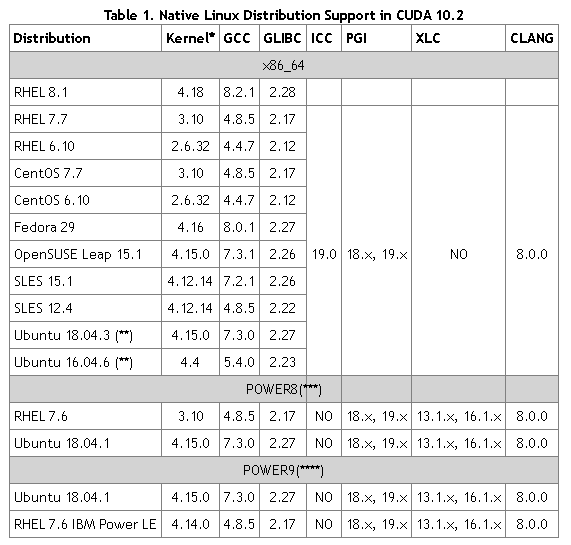
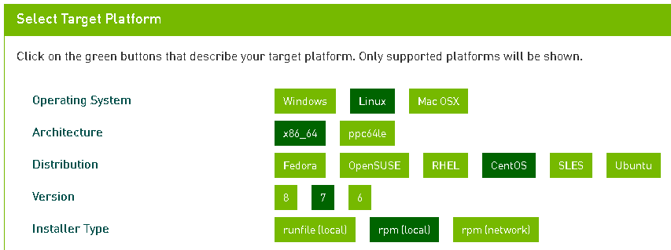
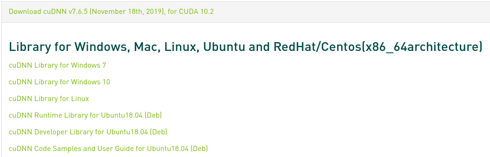

 https://docs.nvidia.com/cuda/cuda-installation-guide-linux/index.html 

- 2019-11-28：
  - CUDA:  [v10.2.89](https://docs.nvidia.com/cuda/index.html) 
  - cuDNN: 

本文将安装nvidia GPU driver, CUDA and cuDNN。

**CUDA(Compute Unified Device Architecture)**：是英伟达公司推出的一种基于新的并行编程模型和指令集架构的通用计算架构，它能利用英伟达GPU的并行计算引擎，比CPU更高效的解决许多复杂计算任务。

**cuDNNCUDA Deep Neural Network library）**：是NVIDIA打造的针对深度神经网络的加速库，是一个用于深层神经网络的GPU加速库。如果你要用GPU训练模型，cuDNN不是必须的，但是一般会采用这个加速库。 

## 1. [系统需要](https://docs.nvidia.com/cuda/cuda-installation-guide-linux/index.html#system-requirements)

首先要保证操作系统和软件包符合下表的要求。

## 2. [安装之前](https://docs.nvidia.com/cuda/cuda-installation-guide-linux/index.html#pre-installation-actions)

1.  验证GPU是否是CUDA兼容的。

    ~~~shell
    lspci | grep -i nvidia
    ~~~

2. 验证linux是否是支持的版本。

   ~~~shell
   uname -m && cat /etc/*release
   ~~~

3. 验证gcc的版本。

   ~~~shell
   gcc --version
   ~~~

4. 验证系统内核版本和安装开发包。

   ~~~shell
   uname -r
   sudo yum install kernel-devel-$(uname -r) kernel-headers-$(uname -r)
   ~~~

## 3. 安装nvida显卡驱动

参考 [Centos7.4安装CUDA9.1](https://blog.veir.me/2018/03/17/centos7-install-cuda9/)，虽然是9.1版本，但步骤相同。

1. 下载驱动。比如：2019-11-28，1070ti对应的最新版本 440.36 

   https://www.nvidia.com/Download/index.aspx?lang=en-us

2. 检查当前驱动情况

~~~shell
   sudo yum install nvidia-detect 		# 安装nvida-detect
   nvidia-detect  -v 					# 检测能够升级到的驱动器版本
   cat /proc/driver/nvidia/version    	# 查看当前驱动版本
~~~

3. 卸载之前驱动。如果第一次安装，忽略。

   ~~~shell
   sudo /usr/bin/nvidia-uninstall
   ~~~

4. 屏蔽nouveau显卡驱动，把nvidiafb从屏蔽列表中移除。

   ~~~shell
   sudo cp /lib/modprobe.d/dist-blacklist.conf .
   sed -i 's/blacklist nvidiafb/# blacklist nvidiafb/g' dist-blacklist.conf 
   
   echo                             >> dist-blacklist.conf
   echo blacklist nouveau           >> dist-blacklist.conf
   echo options nouveau modeset=0   >> dist-blacklist.conf
   
   sudo chown root:root dist-blacklist.conf
   sudo mv dist-blacklist.conf /lib/modprobe.d/dist-blacklist.conf
   sudo cat /lib/modprobe.d/dist-blacklist.conf | grep -E 'nouveau|nvidiafb'
   ~~~

5. 重建 initramfs 镜像。

   ~~~shell
   sudo mv /boot/initramfs-$(uname -r).img /boot/initramfs-$(uname -r).img.bak
   sudo dracut /boot/initramfs-$(uname -r).img $(uname -r)
   ~~~

6. 修改运行级别为文本模式。

   ~~~shell
   sudo systemctl set-default multi-user.target    #设置运行级别为文本模式
   sudo shutdown -r now
   ~~~

7. 安装驱动。

   ~~~shell
   lsmod | grep nouveau                            #查看nouveau是否已经禁用
   chmod 755 NVIDIA-Linux-x86_64-440.36.run
   sudo  ./NVIDIA-Linux-x86_64-440.36.run
   sudo systemctl set-default graphical.target     #设置运行级别回图形模式
   sudo shutdown -r now
   ~~~

   >安装选项:
   >
   >- dkms: yes
   >- 32位兼容: yes
   >- nvidia-xconfig: no

8. 检查安装。

   ~~~shell
   cat /proc/driver/nvidia/version    
   nvidia-smi
   ~~~

## 4. 安装CUDA

1. 卸载老版本

   ~~~shell
   sudo yum remove -y xorg-x11-drv-nvidia-libs #之前安装中，发现老版本的，删除后才正常
   sudo yum remove -y xorg-x11-drv-nvidia      #之前安装中，发现老版本的，删除后才正常
   sudo yum remove -y cuda-drivers
   sudo yum remove -y cuda
   ~~~

2. 安装

   在 [CUDA Download](https://developer.nvidia.com/cuda-downloads?target_os=Linux&target_arch=x86_64&target_distro=CentOS&target_version=7&target_type=rpmlocal) 选择合适的CUDA版本，选择了rpm（local），将会出现如下安装代码。

   

   ~~~shell
   wget http://developer.download.nvidia.com/compute/cuda/10.2/Prod/local_installers/cuda-repo-rhel7-10-2-local-10.2.89-440.33.01-1.0-1.x86_64.rpm
   sudo rpm -i cuda-repo-rhel7-10-2-local-10.2.89-440.33.01-1.0-1.x86_64.rpm
   sudo yum clean all
   sudo yum -y install nvidia-driver-latest-dkms cuda
   sudo yum -y install cuda-drivers
   ~~~

   > 似乎选择runfile（local) 安装的步骤更少，下次有机会尝试一下。

3. 在.bashrc中添加参数。

   ~~~shell
   if ! grep "/usr/local/cuda/bin" ~/.bashrc
   then 
     echo                                                                    >> ~/.bashrc
     echo export PATH="\$PATH:/usr/local/cuda/bin"                           >> ~/.bashrc
     echo export CUDA_HOME=/usr/local/cuda                                   >> ~/.bashrc
     echo export LD_LIBRARY_PATH="/usr/local/cuda/lib64:\$LD_LIBRARY_PATH"   >> ~/.bashrc
   fi
   ~~~

4. 安装验证

   ~~~shell
   cat /usr/local/cuda/version.txt 
   nvcc -V
   ~~~

5. 再次检查nvidia。如果出现报错，请返回`3. 安装nvida显卡驱动`中第5步，再次安装显卡驱动。

   ~~~shell
   cat /proc/driver/nvidia/version    
   nvidia-smi
   ~~~

## 5. 安装cuDNN

参见[安装向导]( https://docs.nvidia.com/deeplearning/sdk/cudnn-install/index.html )。

1. 下载cuDNN。打开 https://developer.nvidia.com/cudnn ，登录以后，选择最新版本后，点击`uDNN Library for Linux`链接进行下载。

   

2. 安装

   ~~~shell
   tar -xzvf cudnn-10.2-linux-x64-v7.6.5.32.tgz
   sudo cp cuda/include/cudnn.h /usr/local/cuda/include
   sudo cp cuda/lib64/libcudnn* /usr/local/cuda/lib64
   sudo chmod a+r /usr/local/cuda/include/cudnn.h /usr/local/cuda/lib64/libcudnn*
   ~~~

3. 安装验证

   ~~~shell
   cat /usr/local/cuda/include/cudnn.h | grep CUDNN_MAJOR -A 2  
   ~~~

## 其它

### 修复vncserver

安装完nvidia驱动后，可能vncserver不能工作。其大概原因是默认的gnome和显卡驱动中opengl不兼容。所以只要在vncserver中使用另外一个桌面Xfce。

   ~~~
sudo yum groupinstall “Xfce” -y

cat << EOF > ~/.vnc/xstartup   
xrdb $HOME/.Xresources
startxfce4 &
EOF

#启动vncserver
vncserver :1    
   ~~~

 参考：[How to Install and Configure VNC Server on CentOS 7](https://vitux.com/centos-vnc-server/)