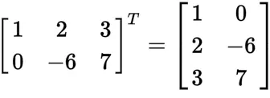
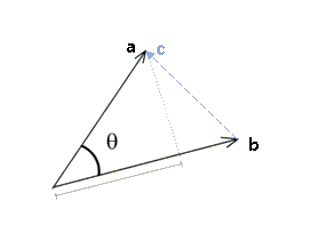
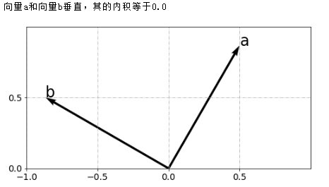
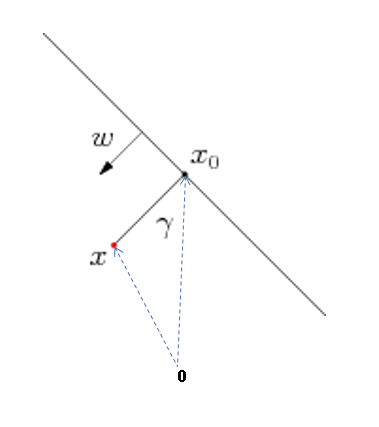
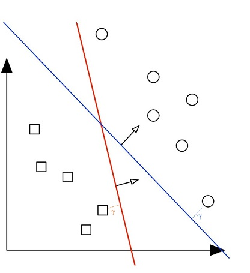

# 0. Mathmatics

## 0.1 线性代数（linear algebra）

### 向量（vector）

 向量是线性代数中的基本概念，也是机器学习的基础数据表示形式。 
$$
\mathbf{a} = \begin{bmatrix}a_1 \\ a_2 \\ \ldots \\ a_n\end{bmatrix}
$$
向量可以看成是$n$维空间中一个点的坐标，比如，下图中，向量$\begin{bmatrix}2 \\ 1\end{bmatrix}$可以表示为a的坐标。

  

图中，很容易看出，向量既有大小（长度）也有方向。创建向量Python代码如下：

~~~python
import numpy as np

a = np.array([2, 1])
print(a)
~~~

#### 向量加法

把向量看成一个点的坐标，很容易得到向量的加法规则。
$$
\mathbf{a} + \mathbf{b} = \mathbf{c}
$$

Python代码如下：

~~~python
import numpy as np

a = np.array([2, 1])
b = np.array([1, 2])
c = a + b
print(c)
~~~

#### 向量大小

 向量的大小也叫向量的模，公式如下。
$$
\| \mathbf{a} \| = 
\sqrt{a_{1}^{2} + a_{2}^{2} + \ldots + a_{n}^{2}} 
$$

Python代码如下：

~~~
import numpy as np

a = np.array([3, 4])
length = np.linalg.norm(a)
print('the length of a is {}'.format(length))
~~~

#### 向量转置

向量的默认形式是以一列排列的，称之为列向量，如果对列向量进行转置，就变成了行向量。
$$
\mathbf{a^T} = \begin{bmatrix}a_1 & a_2 & \ldots  & a_n\end{bmatrix}
$$
$\mathbf a^T$表示$\mathbf a$的转置，是一个行向量。

~~~python
import numpy as np

a = np.array([3, 4])
print(a)
print(a.T)
~~~

运行结果如下：

~~~shell
[3 4]
[3 4]
~~~

上面结果显示，在python的numpy包中，并不区分行向量和列向量。

### 矩阵（matrix）

在数学中，矩阵（[Matrix](https://baike.baidu.com/item/Matrix/3543921)）是一个按照长方阵列排列的[复数](https://baike.baidu.com/item/复数/254365)或[实数](https://baike.baidu.com/item/实数/296419)集合。

矩阵的表示如下：
$$
\mathbf A = 
\begin{bmatrix} 
a_{11} & a_{12} & \cdots & a_{1n} \\
a_{21} & a_{22} & \cdots & a_{2n}  \\ 
\vdots & \vdots  & \vdots & \vdots \\
a_{m1} & a_{m2} & \cdots & a_{mn} 
\end{bmatrix}
$$
矩阵可以看成行向量或者列向量的组合。比如：
$$
\mathbf A = 
\begin{bmatrix} 
a_{11} & a_{12} & \cdots & a_{1n} \\
a_{21} & a_{22} & \cdots & a_{2n}  \\ 
\vdots & \vdots  & \vdots & \vdots \\
a_{m1} & a_{m2} & \cdots & a_{mn} 
\end{bmatrix} =
\begin{bmatrix} 
\mathbf {a_1^T} \\ 
\mathbf {a_2^T} \\ \vdots \\ \mathbf {a_m^T} \end{bmatrix} =
\begin{bmatrix} \mathbf {a_1^{'}} & \mathbf a_2^{'} & \cdots & \mathbf a_p^{'} 
\end{bmatrix}
$$
其中$\mathbf {a_i^T} = \begin{bmatrix} 
a_{i1} & a_{i2} & \cdots & a_{in} \end{bmatrix}，\mathbf {a_j^{'}} = \begin{bmatrix} 
a_{1j} \\  a_{2j} \\ \cdots \\  a_{mj} \end{bmatrix}$

这样的表示方法更加的简洁，而且在做矩阵相关计算的时候会非常的方便。后文很多地方，都使用了这种表达方式。

#### 矩阵转置

沿着对角线对矩阵进行反转，称之为矩阵转置，转置后的矩阵，记为$\mathbf A^T$。假设$\mathbf A$为$ m  \times  n$阶矩阵，$\mathbf A^T$是$n \times m$阶矩阵。示例如下。

 

#### 矩阵乘法

当$\mathbf A$ 是$m\times n$矩阵，$B$是$n\times p$矩阵，它们的乘积$\mathbf A \cdot \mathbf B$是一个$m\times p$矩阵 。矩阵的乘法仅当第一个矩阵$\mathbf A $的列数和另一个矩阵$\mathbf B$的行数相等时才能进行。

  

 示例如下： 

 python代码如下：

~~~
import numpy as np

a = np.array([[1, 0, 2], [-1, 3, 1]])
b = np.array([[3, 1], [2, 1], [1, 0]])
c = a.dot(b)
print('a = \n{}\n'.format(a))
print('b = \n{}\n'.format(b))
print('c = \n{}\n'.format(c))
~~~

和向量相比，矩阵和矩阵乘法看起来有点儿抽象了，它的意义在于线性映射（线性变换），在后文中将会详述。

### 向量内积（ Dot Product ）

向量内积也称向量点积， 向量点乘 ，是两个向量各个分量分别相乘，然后全部相加而得。
$$
\mathbf{a}\cdot \mathbf{b} = 
\begin{bmatrix} a_1 \\ a_2 \\ \ldots \\ a_n
\end{bmatrix} \cdot 
\begin{bmatrix} b_1 \\ b_2 \\ \ldots \\ b_n 
\end{bmatrix} = 
a_{1}b_{1} + a_{2}b_{2} + \ldots + a_{n}b_{n} = \sum a_ib_i
$$

~~~
import numpy as np
a = np.array([2, 3])
b = np.array([3, 4])
print(a.dot(b))  
~~~

向量内积的等价表达形式是：

$$
\mathbf{a}\cdot \mathbf{b} = \mathbf a^T \cdot \mathbf b
$$

一个列向量，可以看成$1 \times n$阶矩阵，一个行向量可以看成$n \times 1$阶矩阵。上面公式右边的表达形式，能够使得向量内积和矩阵乘法（也称矩阵内积）用表达方式统一，后文中会讲述矩阵乘法和内积的关系。

#### 夹角余弦

进一步推导，还可以得到以下公式
$$
\mathbf{a}\cdot \mathbf{b} = \|\mathbf a \| \|\mathbf b\| \cos \theta
$$
其中$\theta$表示两个向量之间的夹角。

利用[余弦定理](https://baike.baidu.com/item/%E4%BD%99%E5%BC%A6%E5%AE%9A%E7%90%86)，推导出上面公式。首先，把向量a, b看成是两条边,  则第三边为 $c=a-b $，则有：
$$
\begin{aligned}
\| \mathbf c\|^2 &= \| \mathbf a\|^2 + \| \mathbf b\|^2 - 2\| \mathbf a\|\|\mathbf  b\|cos\theta \\
\| \mathbf a\|\| \mathbf b\|cos\theta &= \frac {\| \mathbf a\|^2 + \| \mathbf b\|^2 - \| \mathbf c\|^2  } 2 \\
\| \mathbf a\|\| \mathbf b\|cos\theta &= \frac{\sum a_i^2 + \sum b_i^2 - \sum (a_i-b_i)^2}{2} \\
\| \mathbf a\|\| \mathbf b\|cos\theta &= \sum a_ib_i = \mathbf a \cdot \mathbf  b
\end{aligned}
$$

如果两个向量是垂直的，即夹角是$90^\circ $，则其内积为0。见如下Python代码：

~~~
import numpy as np
import math
import matplotlib.pyplot as plt

a = np.array([1/2, math.sqrt(3)/2])
b = np.array([-math.sqrt(3)/2, 1/2])

print('vector a is perpendicular to vector b，dot procut of them is {}'.format(a.dot(b)))
V = np.array([a, b])

plt.axis('scaled')
plt.xlim([-1, 1])
plt.ylim([0, 1])
plt.xticks(np.arange(-1, 1, 0.5))
plt.yticks(np.arange(0, 1, 0.5))
plt.grid(linestyle='-.')

plt.quiver([0], [0], V[:,0], V[:,1], angles='xy', scale_units='xy',  scale=1)
plt.text(*a, 'a',size=24)
plt.text(*b, 'b',size=24)

plt.show()
~~~

#### 单位向量

 指大小等于1的向量。可以用$\frac {\mathbf b} {\|\mathbf b\|}$表示单位向量。

这样公式可以变成：
$$
\mathbf{a}\cdot \frac {\mathbf b} {\|\mathbf b\|} = \|\mathbf a \| \cos \theta
$$
#### 几何意义

如下图所示，$\|\mathbf a \| \cos \theta$是向量$\mathbf a$在向量$\mathbf b$上投影的长度。

 ![Image result for 单位向量 投影](data:image/png;base64,iVBORw0KGgoAAAANSUhEUgAAAScAAACrCAMAAAATgapkAAAA/1BMVEX////7+/sAAADu7u78/Pzv7+/x8fH29vby8vL09PT19fX6+vro6Ojr6+vm5uacw+VCQkLd3d3a2to+PDp1k61QZnijzPCVv+PHx8dWVlY+Pj5NlNKMjIzs8/rExMS1tbV8fHyx0Otup9pwcHBiYmKjo6MlJSVQUFA4RlLU5fQ0NDQUFBTR0dGkyOdqamqtra1tiKCbm5uDg4MeHh7j7fdhn9dTl9PJ2umsy+YuLi4mMDgqN0JKXm+DpMBCU2EUGR1YboFkfpSMtd7E2/Bve4Y5YocsS2caLkBKgrV6qdZmotjY4euzx9tCPDZKZH1cZm9Te58QDAZ7mrUnMTocJCrRfMaCAAAWDklEQVR4nO1diVvjOLK3LVmHZTkEuidALsLRdOgAAw2Bnpm+YHffNP12385u//9/y9PhQ75iJyQhaRDfVy5FLrnyQ1apdFQsC1kyAUURkxQblBm85eubTAGDZ66k0FOUGjwpEdafK6mqukPFbEmpwXu1FFMZGyueJrxNawiHxYXqvOCU8C84TYmTqS3R2NgJNiYfiqQEDN5W1UOlQoiTwZcKI2tiseZDnKDCRqnEYG3FGEmUsb3aiqX+gZYbuACAiPri4vo8R31V3DRvzVEuLy5XVSgeKB5ofrJwVd2BoUyQVa9K2M8qllKylmJgJdsTyt369O1pFfunm3uRul5esZd+3CjuPozbIo0HLzhNxGnYvrvvDhvjcXelcJpb/8Tm1D/BK/XRfnuQ3Jrvn/CS+yfiE4QQCRT1ubgQDhTN8og2qbrJFDB4IC/EVWKun6EVwmYxoYHneeyufUvjWwOQKONn+SrFuFIMKMWAnygJ6ihGVDFawfYk+PvB7e3+eKXa0+r1T9ZpW/XjGqeV6Z9WDqdB+3pwZVl37RecJuEEv2mAVg2nlRuP77fvpVRF//Ts/TvUau/f+Pf74/EpevHvJrQn9iC78etG+3aV2tPK9U8i3Q8G97B7epVT7KUfTxVrSvOKveC0jvOZ2Oyf8jhNMR43MEsJl+JUaz6zDKfJipnYwDxOVf0TBNC2bcgVBVRQm2JJiZfwVPEw0DeZAglvY3VhRPIMwYS6sERYVcrt6rohSJSBSFAo+nFGISS4hmJUZbD6bhglSmq+QlgX29G4IDSOvrSBPlfWNMdXWND8WKB8XAAyfPW8b6wM4ohS1OscfPgbddUnVYr5oTKmkqBEsScZF1hzXkfQL1zvfO/EEWlvwMK377mOCwr6cdUzbfbOz947YTrotoYv9i7mdbG/Obo4PHnnJOkYD1uDp8KJTIuTab5CnPL27lE4IRRsdw53nUza8q1BowXr/QPr27tynKALZeKKup6kHpOUYsXjhLcCS91kChg8BpJKKyQoyvKlwkqquNjj/c7hSRYilTjrNhqtYT3FXEMZUlsxzUNfFVuYY8/zsK8od8UFA+RF1HM170oeB/omUyDhPaQuFEhKeMJTfVOpsFdWt31WCJFMmza6aTUaA61khWKuuhClDOIJTyoUw0ndXqW9W8g4s9SspIubZTCNxNNuGyKhF3sn+U4xTD1R2pUwtW5gHcV+entH3xXBdC5Lhy0J1K1dLjxnnFIeV33/rsDelb13ZKJwwXuXFJ8XwNRRpYOGSt3aik1h70y+0L9zqbhI6yYowQlPvWpPSNo7QYVBkRQZfJl/5+bcqGzd0HqTg+kSM1HQ1TC1hjUU87Ri6rthlPBsGv+O+lSmQFEfSApcSXmOp019kylg8K66IK6on+UrhEuKYS8L06HFhUreTUsDdVujbmAo43JDMV5fsZW2d8JTOc7AtBPO+4avXfjiPWt7R60gN4A6xnqezg6bk3jxaij2c9u7ID8qOOGWxmkY4dQYLAunFbV39nm+C38XyFLp+8avnX7xlmHv8v4dNXy60L9Tn4uuf0r/jiR8hXC62LK2447pIGlWI1UqDDGOm5O0eFV1e4ZiOOd41lNM+ncy+YoK/04kl0gKkOJRwgtXR91kChg8Uhfh00nKs3yFsFnMwOZhBM1GzyLRZME2peoexG4SnBq3rFIxlSFKGWIoRqZQbBXtHTuIUPqrLz8Jxwb9ZJ3TeO0aDTaNYj+RvTuK37OL8NYdmTmK16VsbMIkLd6zs3fY6sXzTXsgulXOG0hvJcQJDlsmULc/i72bonlv78QDyk2c1H3gXCo1wvfu/lSlRkNf4NL9u/mt37l6Fc+eYv0OWnwvHij1bSu5FQY70iGz9Wodwt0u7QIybA0w71LaZVOt3ylKEr6mf+f5nnBfvEDR0L9DyqdzE/8OqM+9pr7JFEh44d95GdeJaOqXCdOYimLmJgOAI8Q881bMtUohFR95IU7Iq1YMqAwCWc9O00iYFgvr4tXx72g/HldeBrniwn2sw+7z29czilE6DFK7VlZmH8Yq4NSMHd7j7cK6C3HqwueEE7JAJ5re/XBuF9ddgBPstu6fal+PVsHc0lexv4AafNn+AqusGwg3gp1/iNzcjn5+0f4Cc2+93ndoyfXgafYXqLqh2T95hjAtEba4vvhNX6aQBpIGJdTfNG/N0aBpCIQfGXyhMOe9jbhj2ia8rG5TsZD3b1q3fEbFgkrFYhoWp4Gs1Z5SAtO2p4xwMhO3O5pUd0F7gnIfRqo9lQlP3Z5MPmpPT9g/MRKPK9/36cS6n7O9Yxfx/NsFq9rXMxknfavZeg2nZ81x6sV7UPb8yrqLcGKDqwinsrQoe7esc2XIGsUzccebNeouGo8rezcZpzmOx5/gnCJhm3HH9OHcxzXqLjiniIS9kwuOEjNKYRYi/BOcU4w7Jjn5hqxscc32dBW2J/dg76ijxvG5tNb+XT9GqcOy6kzVjw+x7J+w0xfZwLELcFrfftwexd33mRoxPfo8gu+oepxmDqU1xikwHV49zJsdp66t7J2oIBj1I5xGJl4rae+qz5W5nb9MhzeyfTXqLjpXdiX8YKkYPDrbO9+McNreNHCaY/+08HOKIY8C9yieYzoIPPTYODRA2DskDDTbPZZfJdue6LqeU0zGlWcBM4RnbU9WOH66cNSnhe/d+tm7ZryQcjyquQ+jqn/qnsrzCHDn2NI4afd9Yf3T4nGixkLK+14i8EicJBX9eMeRTM/hR8F642Txo+hQyvsLbgjMByeys7Pd3zs/OVCjsTWwd2XjcWOF1y+YNpx5PC79YGXvmqNNYIERtWDQDPq9oNmMvL618e8oNhzebUbrxKGp6d+5iX8XJbitU89bL/9OXOKO6c15ifDM7Wm58wWL7J9sY4W3QOBx/ZMaZy5x/mlxOPXjM4Udb4p9PbX78Ss7wknPXrIcXX2csLWdLKQExcLzsXc1FFste2eOx63NeE/ccQ9PFJ7Zv5PtaXn7Cxbg37k02dIsRkxkQXFGv7cGaL3j0JynOqYFxa21DHu3hvtVLGs7nhY4Ux3TguKGwCc8Rz0HnJITKTujMH7BYnAy16XWDic/2TnYm2r/0zrauxnj0Ngeu4g6pncXUpPHn5cq7J/KcJrsKDwyDo0d7iZVuzXL9rESamzpTAkkvMX68UzcQRNDYx/rZGG7um7IlTLRPlatWPd2CBGuFrapykzex1oqnIlD89hxAcLJuPJ4hN3Fxx8P533XbFwA4nHlm17yrs05Dk3BuGCtzuV7LB5XvjtiiQoL7cdNP3hN7N1RtHPQ6SCzDS3Y3j3dPtaZ4tCM4hGTdHjnHYcmj1OpvauD0zLi0BSc6EPGCu9JX9Q2/TlFUHBOMccDrQYLzylqftgtVyx1TnFiHJqqc4p+fE4xG4fGRToaTYbPR2zBMLiMO6ZzHdxl+jg0RriXsmLsazWI+lzzVPjBrESxNG/EocFPE4cmCVfRsYvWORczzszP+9afkF66vRO19OLu+0CKLzl+5pr4wTRZ4d3paXWWi9Oy/WCzo6/v3yUO71Y/XJRbRByaDE51/Lu88CLOKerYM5InXsJn4tBYLF7hdS6oFcWhCc8pGhFGyeQ4o5VxaBJeh8NhtoozGgXIgTpYTq04NMK/U9RQbKo4o1PEoQmP7HHWNzboQK9eHJpQuCzcS0Wx7xrnFEP+qnGDNV8hbMahKTunOCEOzaznFEfGGV7bEF5EHJr52Lun8O/8eFz5Ybti/e4Z2zuaLKQc5dRZMk5Pcv6ulr0L+onD28wJL8Hepf27rB+8WHtXNw5NyuHdtLRbJr9kJg6N4dPNHIemnn9nRfwKxaFhsBlv0NntWSwUAMFFh7M5x6EpKPa1GioODSBaSXpzVTNAztLi0DALio7p739XMB0ZAv096/wNRpPfuwXZu6vV8++YjA3zj+vr8f84F+bRtv6xYJxmiNOzt3fhzsF//DlufzcFmu9HMkjMJnkOOFWs30FjS/POt3HLFDg8YGqn7ZLfu5CH992VWb+DLJmJ+9APrsbtYRQ+Bloj0ZKgdblLozg0arVOL42l4tA8ev3OLlq/E+6djbwawuH6nbFmN8P6XVkcGk+6TowkOwcvkB2wVvsORwLw4BgEgDkdW0dsQTrcC08o0dSfGCsmikMzKZSMZ/h3nvbyAPKIVnLKODRmsJwaQWxqxaHpxQ7vHlBN8Kp9zWIB5/By7/LM2Xwi/06dy396/45Zo3iFd6cZiTy072koMHKQuKmz+8z9uyQ2zMY2i8N837Zb0e8fH72XOsso188YJxrHhnlzZG6DHI73o6MXl3vi1r5jPRVO3cZTx6GxbMPhBZY5r8LG4+9hXWdiYB7IyZWCfaxTxKFBVklxqn8qiBsi9z4/ZRwa7veTPXE9wFNxaMB++3+5uhVcdig42HMfFYcmG+5lijg0gc/5rAFy5hKHhpszcTC7X6XVPg0F3N3zS9PXmyUOTbY95Yvz9i5uT2Kc+XRxaHA8rnwvz7vn5jMH7btYwE+HMVnbfvyoz1LfpLIfx/Qo/uWGjqolh5PoyMvUWVucjp13Z300BU7GzkFuF8+PX40fusU1Lhunq7nhpBzYN2c9nuoKSu1dMhO3MyrdT9e9vu4mX69smudxv2+erhsO7rvAsHfzjwsZOfofDnSrKhqPR4fyDIf3zTnBpOScIuEP4++09jnFwjg0U55TdE9brdubK0TT5xQBoUTzVYccq84p2saPMLzb63OP09JzisiI0hzaquL2ZO2Ph0tuT6cyKnTrdtjVWsTtCdbcsF27PUW+bL+gPWk9+3H3vYdTfVJ+nXO/rXBaXv8Eb8MA2q3TG/nKR/NP81uXyuAku+eeHfZVJk6Jw3sQfVqY1PO+aZy0gnr4ovnoohLM8SgnkBKeUHybxBpvnN53vbBaae+sSuGsYmaKFMvj5Dh/nfXN90AG2DhMSnePN7a2tnY3NnbFZWNjQ9Nd9dHG1onI/PPP63/9U2ROovLUzXFmV8nsqgoU3d2Nbtgyq97aOtEPODGedrIVPU0+Z+NjKix74/TV/8nqtr788lGpJUUm0uhSwu9uFP6KlbKAIBlnskPn0+vXvznOf1+//iRKP73+44fj/Pb69ds487vKvBOZz47z5/W/ZeYPlRElvzvO52xGSL6NMp/izI8481ucEY/WTwszv2UeLTMpnBRWH7/+Vzyu9aX4+80xfTjohXFt0OaHt7/88stHx/koLm+dTzpzpzKvBf2P4zTE5Tfni6C/On89jO9+ccLMj5a4fHa+CvrV+SFua/1wfhWZL85nQVvvnFfi8tr5IWjDcf6jSuTTWvppn6Kn6UcX6SEe0GhlcWqIJ338tHCQdHp/Ic88iPa04fz66pVoAn+8evXrZ+ezyHxSma+fnR8iI/63X0RGtDed+de/Zeb3V69e/a5KvmQyb0VG/Le/Rplf48wnkfnhfP6qniYz79QD9NNE5nOsx9eUHrn2JFD68mM5KL05igK6UV78C5irk9I4tVoSzKWkDRmy5enjsdYcF9inZi8+GCI1uzrP83dF9s457nCj7qjG0nXzhcTPnH6cGYHEjHFmbcWmHGeKtHMRhLMuE9Y5l4tTyt0sam4ap9bpYNhN+3eLwum4EyTCWf9uiXFGU8IsNRY0h4eJfyda0u2NL3dmpvy7iJ+nf+fsXow84JGViDOaEi5NSXsaDH3dehbdnk4umlnh2fYd5gQMfsZ+vDTFt8LC+ae59+PSuk2Yf1p9nKxF43QsO25QLLxaOOFRbzuw0ml5OF1e+KkAPzX39SwszmihsEy9w/5m7/DISqXJ+wvYHPunScIRTguPM1px3lx+0UD9EnfTkQM7oJqVpFVxaGL66PPm7irFGZ3QnvwT6ZT7jqSB8s/9zVVrT6vRP1mwd7SXwWl5/dMk4ZXCKTg8PgqCF5wqcGqqX0tccZwq9rHmcZpiPF5nP51IBx+sApwq9rEuPw4NY8zmigIqLnKLqKDEU7yiRH4uf7ZQ3WQKGLwnL3LvqqDYTXjmThKWX31jR+PUDEyczFu5VkMphnCiJPJqKEaBUomc3l1BrNUjiqJqYWarYibHBTKF1JdUGNtCiprIuDVHubpwP+GB4kEwQViNCzpyRMA6TtAxcUrdWqJSLcX8ULGH9g3KK1kh7OrilRgXwMs3nb2D7cOTi/rjghn8YLnyuO7jgjgtsB+XOK21vTPTgnHS7Wk1fz+YTBTOJK78Ft5M31orDk2VYhKn7ver7gR7lxeOcKp3TrHOcUBsHAesf06xCCudKs8pwrrnFHUcGiJwGly329enbMlxaNI8UqFpVOwZrGLPmHypcDlQRXFocBKHhtRWTMWhwQTsj/fb+61v4/YpVootLw7NnMaZxanC3k0/Ib0/Hg8sZt2Or6/W394laQH9+ED2SfC6fa/E1svela63LGxc8G3cmgGnp7Z3Fet3KZwm+3dlwqa9k9jcje/sHE6V9i4dhyY+pwiNOKOQGscBSyO2FMShQXXi0NjVdUNgKEO0SgmvhMWfW6IY1XFohL27kefyBU4trM8pyoA24ZOFjZs6Do0R7qUgDk1ZxBa3LNzLnOPQAJDwxjlF19PnK4NcRToODXGFf4eFSuyhferG6nmuPqfICUVCWHwqqtJiSmr2ODRztncps1JWbL53iKjXQL01oWLCjSaQufITO8grpncK0IfrllTv6vpB74iFFMrNqHq7BWdMBSmQHViAsJwgEIQTvCr9+NT77DEh4uv5FDGMxOdU9OuAibuJRxGWOGFxwR4S8ADFU18IEkKvh63T79+H4/t7ItsHEZIAeiywPPE1ARP3E9GGiGULZwAwiiwxyrKs6PeF1g4nyi2GoS8e54tniicRSwypiYUwF88SOMkLBlIfALmFsUuFW0EhGd/fPpy2x+37QJSLduMBG1kINm0EicSJuULEJvIcEEHy/aA2s2CE01Pbu4L3rtTeKcUQEm+SwAnJvQcAyvbkW9TGDFM5uRfIZ7vUk0C76uUkPoPUtry7G9y9+XY3EK2ECveBAi68H2wFlElIBfGsECf5K0Os6UmOhfszU1bCpVFIsww1466lBAweSzMBlb2DytJFvFstXFV3FHdNUgRE9YwLa0Usz2fiRg9BYLkSJ8ZZk8kL8Sybi05HtBpKkO17DHpU3EAF7hjZorfGkHDmCQcRCbiA8JKweJG51FboYkEbif+CaCWkqe1dOgALysahQSjhq8K9LCkODfeZ+IaBCwgHTY4BD3DTlcFwOAeBsH1MbuTh4s9nm8K+BRQEPhBOXsARYOJmn3KPc+zygMssCwLGAQsQUVnqMxpw7hPe5L6o3J8mDs1K2btkndMtV0zcKloPMhSz13ydc9ZzZbZ8SLnfQuWc9s+0fjc7TtazWr+b/r37Kdbv8JTrd+EyWUXd+fU7Mv36naHe9Ot3mTg04uJFcWg0ryiojtjiuX4Se2aKODRmuJcJcWi8KAJNSA0lq4SjODTZMDnTxaHRLTekqmHrqVg9dW3S0p+Z0xSGF91MDcpqCFcUm4rZ5mNmVMzkayn2/4FhNd6/xTeNAAAAAElFTkSuQmCC) 

把上节公式调换等号左右的公式：
$$
\|\mathbf a \| \cos \theta = \mathbf{a}\cdot \frac {\mathbf b} {\|\mathbf b\|}
$$
显然可以得出：**向量的投影等于该向量和（被投影）单位向量的内积。**

如果把$ \|\mathbf a \|$移动到等号右边，可以得出，**夹角余弦等于单位向量的内积**。
$$
\cos \theta = \frac {\mathbf{a}}  {\|\mathbf a \|}  \cdot \frac {\mathbf b} {\|\mathbf b\|}
$$
#### 其他意义

- 物理上，向量内积可以理解为做[功](https://zh.wikipedia.org/wiki/%E5%8A%9F)。 功就是力与位移的内积。
  $$
  \mathbf W = \mathbf F \cdot \mathbf d = \|\mathbf F \| \|\mathbf d\| \cos \theta
  $$
  
  其中$\mathbf W$ ：功，$\mathbf F$：力， $\mathbf d$：位移。
  
- 几何上，向量内积，可以表示向量的夹角

  - $\mathbf a \cdot \mathbf b = 0$，表示$a$和$b$是垂直的
  - $\mathbf a \cdot \mathbf b >0 $，表示$a$和$b$的夹角小于90度
  - $\mathbf a \cdot \mathbf b < 0 $，表示$a$和$b$的夹角大于90度

- 几何上，把$\mathbf x$看成是坐标，则$\mathbf w \cdot \mathbf x= 0$，表示一个过原点，且垂直于$w$的平面方程。而对于空间上的任何一个点$ \mathbf  u$：

  - $\mathbf w \cdot \mathbf u = 0 $，则点u属于平面
  - $\mathbf w \cdot \mathbf u > 0 $，则点u在平面上方（$\mathbf w$和$\mathbf u$的夹角小于90度）
  - $\mathbf w \cdot \mathbf u < 0 $，则点u在平面下方（$\mathbf w$和$\mathbf u$的夹角大于90度）
> 平面上方和下方是以w的方向作为参照的，如果和w同向，就是上方，反之就是下方。

#### 再看矩阵乘法

把矩阵$\mathbf A$表示成多个行向量的组合，矩阵$\mathbf B $表示成多个列向量的组合。
$$
\mathbf A = \begin{bmatrix} a_{11} & a_{12} & \cdots & a_{1n} \\a_{21} & a_{22} & \cdots & a_{2n}  \\\vdots & \vdots  & \vdots & \vdots \\a_{m1} & a_{m2} & \cdots & a_{mn}  \\\end{bmatrix} = \begin{bmatrix} \mathbf {a_1^T} \\ \mathbf {a_2^T} \\ \vdots \\ \mathbf {a_m^T} \end{bmatrix}，\mathbf B = \begin{bmatrix} b_{11} & b_{12} & \cdots & b_{1p} \\b_{21} & b_{22} & \cdots & b_{2p}  \\p\vdots & \vdots  & \vdots & \vdots \\b_{n1} & b_{n2} & \cdots & a_{np}  \\\end{bmatrix} = \begin{bmatrix} \mathbf {b_1} & \mathbf {b_2} & \cdots & \mathbf {b_p} \end{bmatrix}
$$
矩阵乘法可以看成是行向量和列向量的内积，所以矩阵乘法也可以看成是**矩阵的内积**。
$$
\mathbf A \cdot \mathbf B = 
\begin{bmatrix} \mathbf {a_1^T} \\ \mathbf {a_2^T} \\ \vdots \\ \mathbf {a_m^T} \end{bmatrix} \cdot
\begin{bmatrix} \mathbf {b_1} & \mathbf {b_2} & \cdots & \mathbf {b_p} \end{bmatrix} =
\begin{bmatrix} 
\mathbf {a_1^T} \cdot \mathbf {b_1} & \mathbf {a_1^T} \cdot \mathbf {b_2} & \cdots & \mathbf {a_1^T} \cdot \mathbf {b_p} \\
\mathbf {a_2^T} \cdot \mathbf {b_1} & \mathbf {a_2^T} \cdot \mathbf {b_2} & \cdots & \mathbf {a_2^T} \cdot \mathbf {b_p} \\
\vdots & \vdots  & \vdots & \vdots \\
\mathbf {a_m^T} \cdot \mathbf {b_1} & \mathbf {a_m^T} \cdot \mathbf {b_2} & \cdots & \mathbf {a_m^T} \cdot \mathbf {b_p} 
\end{bmatrix}
$$

###  点到平面的距离

上节中说到，$\mathbf w \cdot \mathbf x = 0$，表示一个过原点，且垂直于$\mathbf w$的平面方程。而对于空间中任意平面，其平面方程为：$ \mathbf w  \cdot \mathbf x + b = 0$，该平面垂直于$\mathbf w$，但不一定过原点。

- 如果是二维空间，则表示是一个直线方程。比如：

  直线$2x+3y+5=0$，即$\begin{bmatrix} 2 \\ 3 \end{bmatrix} \cdot \begin{bmatrix} x \\ y  \end{bmatrix} + 5 = 0$

- 如果是三维空间, 是一个平面. 如果大于3维空间，则是一个超平面。

空间任意一点$x$到平面的距离是:  

$$
\gamma = \frac 1 {|\mathbf w|} (\mathbf w \cdot \mathbf x + b)
$$

- $ \gamma >0 $，表示$\mathbf x$在平面上方
- $\gamma<0$，表示$\mathbf x$在平面下方

#### 证明

假设点$\mathbf {x_0} $是指点$ \mathbf x  $在超平面上的投影点，即$\vec {x_0x}$ 平行于$ \mathbf w$。

 $\mathbf x - \mathbf{x_0} = \gamma  \frac {\mathbf w} {\|\mathbf w\|}$

 $ \mathbf w \cdot (\mathbf  x- \mathbf{x_0}) = \mathbf w \cdot \gamma  \frac {\mathbf w} {|\mathbf  w|} $

 由于$ \mathbf w \cdot \mathbf  {x_0} + b = 0  $, 即 $ \mathbf w  \cdot \mathbf {x_0}  = -b  $, 上面的公式可以变成

  $ \gamma = \frac 1 {|\mathbf  w|}(\mathbf  w \cdot \mathbf  x + b) $

#### 意义

机器学习的二分类问题，从几何角度来看，可以看成是找到一个平面（甚至曲面）把两个类别分开的事情。如果样本到平面的距离越大，则认为分类的效果越好，而这也是学习点到平面距离的意义。在后面学习`支持向量机`（support vector machine）时，尤其会用到这个概念。

  

 上图中，虽然都很能正确分类，但蓝线明显比红线效果要好。

### 线性映射和线性变换

在线性代数中，线性映射（linear mapping）和线性变换（linear transformation）经常被提到。线性映射指从一个向量空间$\mathbf V$到另一个向量空间$\mathbf W$的映射且保持加法运算和数量乘法运算，而线性变换是线性空间$\mathbf V$到其自身的线性映射，是一种特殊的线性映射。

通俗来说，线性映射把一个坐标系中的点，映射到另外一个坐标系中的点，比如：阳光下物体的影子，就是把三维的物体映射到二维的平面上。而线性变换是在同一个坐标系中完成的。比如：二维平面中，对一个图形，进行旋转，缩放。

  

#### 定义

设 $\mathbf V，\mathbf W $为两个向量空间， 如果$f:\mathbf V \rightarrow \mathbf W$满足

- 任意$ \mathbf{\alpha} \in \mathbf V，$则$ f(\mathbf{\alpha}) \in \mathbf W $ 
- 加法：任意向量$ \mathbf{\alpha_1},\mathbf{\alpha_2} \in \mathbf V $，则 $f(\mathbf{\alpha_1}+\mathbf{\alpha_2}) = f(\mathbf{\alpha_1}) + f(\mathbf{\alpha_2})$ 
- 数乘：任意向量 $\mathbf{\alpha} \in \mathbf V $，则$ f(k\mathbf{\alpha}) = kf(\mathbf{\alpha})$ 

则称$f$为从线性空间$\mathbf V$到线性空间$\mathbf W $的**线性映射**。如果$\mathbf V$和$\mathbf W$是同一个线性空间，则称$f$为**线性变换**，线性映射和线性变换很类似，本质相同。

线性映射可以用矩阵表示，这也是矩阵最重要的意义之一。方式如下：
$$
\mathbf A \cdot \mathbf{\alpha} = \mathbf{\beta}
$$
其中$f = \mathbf A， \mathbf{\alpha} \in \mathbf V， \mathbf {\beta} \in \mathbf W  $。为了加深理解，下面介绍几个实际的应用。

#### 旋转和缩放

在同一向量空间，最基本的线性变换是旋转和缩放。下面是在二维空间的旋转和缩放。

**逆时针旋转**
$$
\mathbf A = 
\begin{bmatrix} 
\cos {(\theta)} & -\sin {(\theta)} \\
\sin {(\theta)} & \cos {(\theta)} 
\end{bmatrix}
$$

~~~
def rotate(theta):
	

~~~

#### 基变换

#### 线性方程组

从初中开始，大家就学过方程组，这种方程组也称之为线性方程组，它也可以理解成一种线性映射。首先看定义：
$$
\left\{\begin{matrix}
a_{11}x_1+ a_{12}x_2 +  \dots +a_{1n}x_n = b_1
\\
a_{21}x_1+ a_{22}x_2 +  \dots +a_{2n}x_n = b_2
\\
\vdots
\\
a_{m1}x_1+ a_{m2}x_2 + \dots +a_{mn}x_n = b_m
\\
\end{matrix}\right.
$$
 可以写成：
$$
(\mathbf {a_1},\mathbf {a_2},\cdots,\mathbf {a_n}) \cdot 
\begin{bmatrix}
x_1\\
x_2\\
\vdots\\
x_n
\end{bmatrix}
= \mathbf b
$$
其中$
\mathbf {a_i} = \begin{bmatrix} a_{1i}\\ a_{2i}\\ \vdots\\ a_{mi} \end{bmatrix} ，\mathbf b= \begin{bmatrix} b_1\\ b_2\\ \vdots\\ b_m \end{bmatrix}
$ ，进一步，可以简化成：
$$
\mathbf A \cdot \mathbf x = \mathbf b
$$

其中$\mathbf A = (\mathbf {a_1},\mathbf {a_2},\cdots,\mathbf {a_n}) ，\mathbf x= \begin{bmatrix} x_1\\ x_2\\ \vdots\\ x_n \end{bmatrix} $

显然，矩阵$\mathbf A$ 就是一种线性映射，向量$\mathbf x$经过这个线性变化变成向量$\mathbf b $。求解线性方程组是已知线性映射和目标向量，求解原向量的过程。

机器学习中，如果数据的维度很高，为了提高模型效果和降低训练时间m，往往需要进行降维。这其中就利用了线性映射的技巧，这些内容将在下一节：特征值和特征向量中详述。

$$
\begin{align} 
\mathbf A \cdot \mathbf x &= [ \mathbf {a_1}, \mathbf {a_2}, ..., \mathbf {a_n}] \cdot \begin{bmatrix} x_1 \\ x_2 \\ ... \\ x_n \end{bmatrix} \\
&=  \mathbf {a_1} \cdot x_1 + \mathbf {a_2} \cdot x_2 + ... + \mathbf {a_n} \cdot x_n
\end{align} \
$$
其中$\mathbf a_1, \mathbf a_2, ..., \mathbf a_n$都是向量。

**线性相关**

### 特征值（eigenvalue）和特征向量（eigenvector）

 对于一个给定的方阵$\mathbf A$，对特征向量（eigenvector） $\mathbf v$进行线性变换之后，得到的新向量仍然与原来的 保持在同一条直线上，但其长度或方向（即特征值eigenvalue）也许会改变。即 
$$
\underbrace{\mathbf{A}}_{n\times n}{\mathbf{v}} = \underbrace{\lambda}_{eigenvalue} \overbrace{\mathbf{v}}^{eigenvector}
$$
上面的定义，有些抽象，下面是形象一点的解释。

### 奇异值分解

### 主成分分析（PCA）

## 0.2 概率论

### 方差

### 泊松分布

### 二项分布

### 正态分布

####  二项分布和正态分布关系

#### 协方差矩阵

马哈

### Beta分布

### gamma分布

### 贝叶斯公式（Bayesian ）
$$
P(\theta|X) = \frac {P(X|\theta)P(\theta)} {P(X)} \\

p(\theta|X) \propto P(X|\theta)P(\theta) \\
$$
- $P(\theta)$：先验概率（prior probability），指根据以往经验和分析得到的概率。 

- $P(\theta|X)$：后验概率（posterior probability）

- $P(X|\theta)P(\theta)$：似然函数（likelihood function）
$$
  posterior \propto likelihood \times prior
$$

**习题**

参见 [question](https://github.com/xuxiangwen/ai/blob/master/question.md) 1, 2

## 0.3 优化

## 习题

1. 

   

2. 

## 参考

- [机器学习的数学基础：向量篇]( https://www.hahack.com/math/math-vector/ )
- [什么是矩阵](https://www.jianshu.com/p/f9826690133c)
- [向量内积的个人理解](https://blog.zhimind.com/my-understanding-on-vector-inner-product.html)
- [矩阵乘法](https://zh.wikipedia.org/wiki/%E7%9F%A9%E9%99%A3%E4%B9%98%E6%B3%95)
- [百度百科：线性变换](https://baike.baidu.com/item/%E7%BA%BF%E6%80%A7%E5%8F%98%E6%8D%A2)
- [回顾线性空间](https://scientificrat.com/2017/10/11/%E5%9B%9E%E9%A1%BE%E7%BA%BF%E6%80%A7%E7%A9%BA%E9%97%B4/)
- [线性代数中，特征值与特征向量在代数和几何层面的实际意义是什么](https://www.zhihu.com/question/20507061)
- [支持向量机通俗导论（理解SVM的三层境界）]( https://blog.csdn.net/v_JULY_v/article/details/7624837)
-  